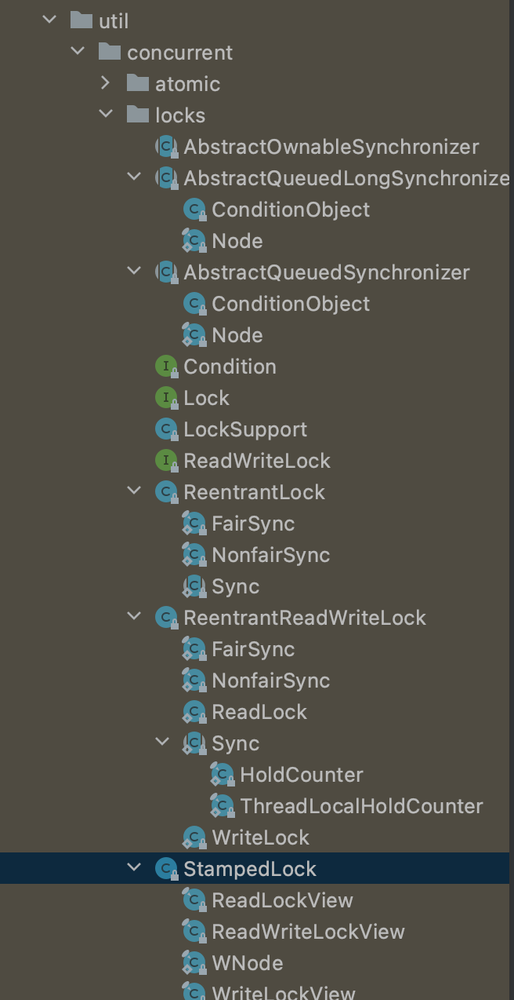
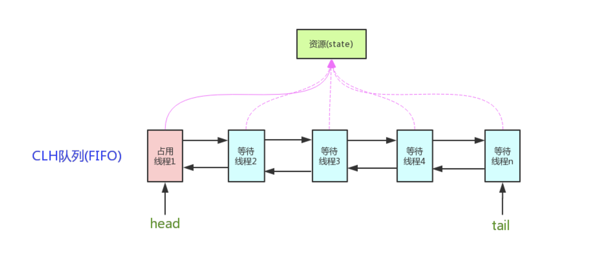

- AQS AbstractQueuedSynchronizer抽象队列同步器是一个用来构建锁和同步器的框架，使用 AQS 能简单且高效地构造出大量应用广泛的同步器
  例如ReentrantLock，Semaphore，ReentrantReadWriteLock,CountDownLatch等
  CycliBarrier是基于ReentrantLock,
  
  我们自己也能利用 AQS 非常轻松容易地构造出符合我们自己需求的同步器/同步组件。
- 基于AQS实现的常见线程类
  注意StampedLock jdk1.8不是基于AQS设计的
  
- 核心类:
- AQS设计模式-模板模式
  同步器的设计是基于模板方法模式的,
  1. AbstractQueuedSynchronizer以下5个方法必须被子类实现，默认抛出UnsupportedOperationException异常
  其他方法都是final方法,无法修改。
  这5个方法也叫钩子方法:模板设计模式通过钩子方法控制固定步骤的实现。
  2. 将 AQS 组合在自定义同步组件的实现中，并调用其模板方法，而这些模板方法会调用使用者重写的方法。
  ```java
  protected boolean tryAcquire(int)//独占方式。尝试获取资源，成功则返回true，失败则返回false。
  protected boolean tryRelease(int)//独占方式。尝试释放资源，成功则返回true，失败则返回false。
  protected int tryAcquireShared(int)//共享方式。尝试获取资源。负数表示失败；0表示成功，但没有剩余可用资源；正数表示成功，且有剩余资源。
  protected boolean tryReleaseShared(int)//共享方式。尝试释放资源，成功则返回true，失败则返回false。
  protected boolean isHeldExclusively()//该线程是否正在独占资源。只有用到condition才需要去实现它。
  ```
  自定义的同步器类继承AbstractQueuedSynchronizer，必须实现一下5个方法
- AQS核心思想
  如果被请求的共享资源空闲，则将当前请求资源的线程设置为有效的工作线程，并且将共享资源设置为锁定状态。
  如果被请求的共享资源被占用，那么就需要一套线程阻塞等待以及被唤醒时锁分配的机制，
  这个机制 AQS 是用 CLH 队列锁实现的，即将暂时获取不到锁的线程加入到队列中。
  
  请求释放锁的共享资源时，共享资源为为非锁定状态,则唤醒CLH队列锁的线程竞争共享资源
  ((62a005a5-bf25-40b9-a19d-41df701c9d49))
- AQS 对资源的两种共享方式
  1. Exclusive(独占方式）
  同一时刻只有一个线程能执行, 例如ReentrantLock
  锁又分为公平锁和非公平锁
  公平锁:保证先到先得,按照线程在队列中的排队顺序，先到者先拿到锁
  非公平锁:不保证先到先得，当线程要获取锁时，先通过CAS 操作去抢锁，如果没抢到，当前线程再加入到队列中等待唤醒。
  ((62a0110a-97d3-4970-822d-38900c515148)) 
  
  2. Share(共享方式)
  多个线程可同时执行，例如Semaphore,CountDownLatch,CyclicBarrier、ReadWriteLock
  
  一般锁和同步器都是一种共享方式，
  而ReentrantReadWriteLock可以看成是组合式，因为 ReentrantReadWriteLock 也就是读写锁允许多个线程同时对某一资源进行读。
-
- AQS原理
- AQS源码分析
  同步状态字段state
  使用volatitle int 成员变量来表示同步状态
  ```java
  private volatile int state;//共享变量，使用volatile修饰保证线程可见性
  /返回同步状态的当前值
  protected final int getState() {
          return state;
  }
   // 设置同步状态的值
  protected final void setState(int newState) {
          state = newState;
  }
  //原子地（CAS操作）将同步状态值设置为给定值update如果当前同步状态的值等于expect（期望值）
  protected final boolean compareAndSetState(int expect, int update) {
          return unsafe.compareAndSwapInt(this, stateOffset, expect, update);
  }
  ```
- CLH队列
  id:: 62a005a5-bf25-40b9-a19d-41df701c9d49
  定义:虚头节点的双链阻塞队列 ,FIFO,AQS 是将每条请求共享资源的线程封装成一个 CLH队列的一个结点（Node）来实现锁的分配。
  一般使用自旋锁spinLock
  相比普通的双链队列有什么特点?
  
- JDK实现AQS的类
  CountDownLauch的共享资源state数量由构造器指定,ReentrantLock的共享资源state数量为1
  AbstractQueuedSynchronizer.Sync
	- ReentrantLock
	  ReentrantLock对state同步变量的操作
	  ReentrantLock加锁，释放锁state的变化
	  state初始化为0状态,表示未锁定状态,当A线程调用lock方法时,会调用 tryAcquire() 独占该锁并将 state+1。其他线程再 tryAcquire() 时就会失败，直到 A 线程 unlock() 时,会调用release方法底层调用tryRelease钩子方法将state-1(因为锁重入所以不会设置为0)，一直到 state=0（即释放锁）为止，其它线程才有机会获取该锁。
	  ReentrantLock锁重入对state同步变量的影响
	  释放锁之前，A 线程自己是可以重复获取此锁的（state 会累加），这就是可重入的概念
	- CountDownLatch(共享锁)
	  ReentrantLock对state同步变量的操作
	  state 也初始化为 N(CountDownLatch构造器参数),N 个子线程是并行执行的，每个子线程执行完后 countDown() 一次，底层AQS会调用钩子方法tryReleaseShared将state 会 CAS(Compare and Swap) 减 1。等到所有子线程都执行完后(即 state=0 )，会 unpark()唤醒 主调用线程，然后主调用线程就会从 await() 函数返回，继续后余动作。
	  主线程调用await方法调用AQS的acquireSharedInterruptibly方法，底层会调用钩子方法tryAcquireShared判断state同步值是否0,为0则表示获取锁成功,主线程可以继续下去，否则则会进入队列锁等待被唤醒。
	  ```java
	  //CountDownLatch所有源码,简洁
	  public class CountDownLatch {
	      private final Sync sync;
	  
	      public CountDownLatch(int count) {
	          if (count < 0) {
	              throw new IllegalArgumentException("count < 0");
	          }
	  
	          this.sync = new Sync(count);
	      }
	  
	      public void await() throws InterruptedException {
	          sync.acquireSharedInterruptibly(1);
	      }
	  
	      public boolean await(long timeout, TimeUnit unit)
	          throws InterruptedException {
	          return sync.tryAcquireSharedNanos(1, unit.toNanos(timeout));
	      }
	  
	      public void countDown() {
	          sync.releaseShared(1);
	      }
	  
	      /**
	            * Returns the current count.
	              *
	            * <p>This method is typically used for debugging and testing purposes.
	              *
	            * @return the current count
	              */
	      public long getCount() {
	          return sync.getCount();
	      }
	  
	      private static final class Sync extends AbstractQueuedSynchronizer {
	          private static final long serialVersionUID = 4982264981922014374L;
	  
	          Sync(int count) {
	              setState(count);
	          }
	  
	          int getCount() {
	              return getState();
	          }
	  
	          protected int tryAcquireShared(int acquires) {
	              return (getState() == 0) ? 1 : (-1);
	          }
	  
	          protected boolean tryReleaseShared(int releases) {
	              // Decrement count; signal when transition to zero
	              for (;;) {
	                  int c = getState();
	  
	                  if (c == 0) {
	                      return false;
	                  }
	  
	                  int nextc = c - 1;
	  
	                  if (compareAndSetState(c, nextc)) {
	                      return nextc == 0;
	                  }
	              }
	          }
	      }
	  }
	  
	  //AbstractQueuedSynchronizer start
	  public final void acquireSharedInterruptibly(int arg)
	              throws InterruptedException {
	          if (Thread.interrupted())
	              throw new InterruptedException();
	          if (tryAcquireShared(arg) < 0)
	              doAcquireSharedInterruptibly(arg);
	      }
	  
	  public final boolean releaseShared(int arg) {
	          if (tryReleaseShared(arg)) {
	              doReleaseShared();
	              return true;
	          }
	          return false;
	      }
	  //AbstractQueuedSynchronizer end
	  
	  ```
	  CountDownLauch典型使用场景
	  1. 某一线程在开始运行前等待 n 个线程执行完毕。
	  2. 实现多个线程开始执行任务的最大并行性。(这个在业务开发中还不太常见)
	  CountDownLatch(1)，各个线程先await()，等待主线程的countDown()一声令下,多个线程在某一时刻同时开始执行。
	  CountDownLauch不足
	  CountDownLatch 是一次性的，计数器的值只能在构造方法中初始化一次，之后没有任何机制再次对其设置值，当 CountDownLatch 使用完毕后，它不能再次被使用。
	- CyclicBarrier(循环栅栏)
	  可循环使用（Cyclic）的屏障（Barrier）
	  让一组线程到达一个屏障（也可以叫同步点）时被阻塞，直到最后一个线程到达屏障时，屏障才会开门，所有被屏障拦截的线程才会继续干活。然后下一组线程再循环开始。
	  CyclicBarrier使用方法
	  CyclicBarrier(int parties)，其参数表示屏障拦截的线程数量
	  每个线程调用 await() 方法告诉 CyclicBarrier 我已经到达了屏障，然后当前线程被阻塞，等待屏障打开的时候再被唤醒执行
	  
	  CyclicBarrier实现原理
	  CycliBarrier 是基于 ReentrantLock和Condition
-
- #
- 子类实现AQS
  自定义同步器在实现时只需要实现共享资源 state 的获取与释放方式即可，至于具体线程等待队列的维护（如获取资源失败入队/唤醒出队等），AQS 已经在上层已经帮我们实现好了。
  要求:一般子类实现方法都需要操作共享状态变量state值
	- 利用AQS实现共享模式和独占模式
	  自定义同步器是独占模式时一般覆盖tryAcquire和tryRelease即可,
	  而是共享式模式时覆盖tryAcquireShared和tryReleaseShared方法即可
	  特别的ReentrantReadWriteLock
	- 利用AQS如何设计实现公平锁
	  id:: 62a01247-baa8-4152-b470-821a6ed112f5
	  AQS源码文档中提到一种实现公平锁的通常方式，再实现tryAcquire方法时,判断hasQueuedPredecessors方法如果返回true,则tryAcquire返回false。
	  ReentrantLock类就是这么实现公平锁的。
	  ```java
	  //ReentrantLock.FairSync
	  		protected final boolean tryAcquire(int acquires) {
	              final Thread current = Thread.currentThread();
	              int c = getState();
	              if (c == 0) {
	                  if (!hasQueuedPredecessors() &&
	                      compareAndSetState(0, acquires)) {
	                      setExclusiveOwnerThread(current);
	                      return true;
	                  }
	              }
	              else if (current == getExclusiveOwnerThread()) {
	                  int nextc = c + acquires;
	                  if (nextc < 0)
	                      throw new Error("Maximum lock count exceeded");
	                  setState(nextc);
	                  return true;
	              }
	              return false;
	          }
	  ```
- 自定义子类实现AQS实战
- 使用场景
  1. jdk源码例如ReentrantLock，Semaphore，ReentrantReadWriteLock,CountDownLatch等
  CycliBarrier, SynchronousQueue是基于ReentrantLock,
  2. 我们自己也能利用 AQS 非常轻松容易地构造出符合我们自己需求的同步器。
-
-