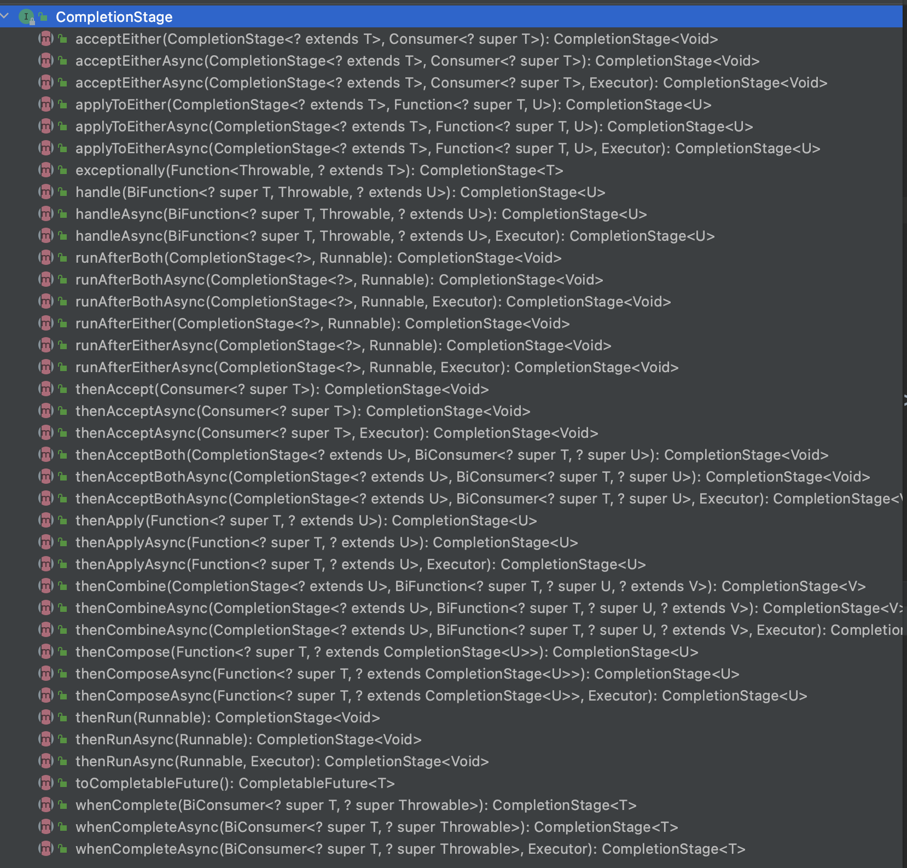

-
- 简单介绍:
  异步编程模式,可以很好的和stream函数式编程整合在一起。
  jdk8,CompletableFuture 同时实现了 Future 和 CompletionStage 接口。
  CompletionStage使得具有编排能力，CompletableFuture 的函数式能力就是这个接口赋予的
  
-
- 常见API用法
  常见用法
	-
	-
	- 2. 处理异步结算的结果
	   thenApply() Function入参，接收一个函数进行处理
	   thenAccept() Comsumer入参，接收一个输入对象进行消费
	   thenRun() Runnable入参，不能访问异步计算的结果
	   whenComplete() BiConsumer入参，可以接收两个输入对象进行消费
	  
	   使用不同的线程池方式,基本都是三种类型方法
	   thenXXX,thenXXXAsync,thenXXXAsync(Executor)
	   ```java
	  
	  		- // 沿用上一个任务的线程池
	   public <U> CompletableFuture<U> thenApply(
	   Function<? super T,? extends U> fn) {
	   return uniApplyStage(null, fn);
	   }
	  		- //使用默认的 ForkJoinPool 线程池（不推荐）
	   public <U> CompletableFuture<U> thenApplyAsync(
	   Function<? super T,? extends U> fn) {
	   return uniApplyStage(defaultExecutor(), fn);
	   }
	   // 使用自定义线程池(推荐)
	   public <U> CompletableFuture<U> thenApplyAsync(
	   Function<? super T,? extends U> fn, Executor executor) {
	   return uniApplyStage(screenExecutor(executor), fn);
	   }
	   ```
	- 3. 异常处理
	    a.使用handle方法处理异常 使用不同的线程池方式,基本都是三种类型方法 
	   ```
	   public <U> CompletableFuture<U> handle(
	   BiFunction<? super T, Throwable, ? extends U> fn) {
	   return uniHandleStage(null, fn);
	   }
	   public <U> CompletableFuture<U> handleAsync(
	   BiFunction<? super T, Throwable, ? extends U> fn) {
	   return uniHandleStage(defaultExecutor(), fn);
	   }
	   public <U> CompletableFuture<U> handleAsync(
	   BiFunction<? super T, Throwable, ? extends U> fn, Executor executor) {
	   return uniHandleStage(screenExecutor(executor), fn);
	   }
	   ```
	    b.使用exceptionally() 方法来处理异常情况。
	    c.如果你想让CompletableFuture 的结果就是异常的话，可以使用 completeExceptionally() 方法为其赋值。
	    举例使用
	   ```
	   @Test
	   public void testExceptionHandle() throws ExecutionException, InterruptedException {
	   //第一种异常处理方法handle()方法方式
	   CompletableFuture<String> future = CompletableFuture.supplyAsync(() -> {
	   if (true) {
	   throw new RuntimeException("Computation error!");
	   }
	   return "hello!";
	   }).handle((res, ex) -> {
	   // res 代表返回的结果
	   // ex 的类型为 Throwable ，代表抛出的异常
	   System.out.println(ex.toString());
	   return res != null ? res : "world!";
	   });
	   assertEquals("world!", future.get());
	  - //第二种处理异常方式exceptionally()方法
	   CompletableFuture<String> future2 = CompletableFuture.supplyAsync(() -> {
	   if (true) {
	   throw new RuntimeException("Computation error!");
	   }
	   return "hello!";
	   }).exceptionally(ex -> {
	   System.out.println(ex.toString());// CompletionException
	   return "world!";
	   });
	   assertEquals("world!", future2.get());
	  - //第三种处理异常方式completeExceptionally()方式
	   CompletableFuture<String> completableFuture = CompletableFuture.supplyAsync(() -> {
	   if (true) {
	   throw new IllegalArgumentException("Computation error:IllegalArgumentException");
	   }
	   return "hello!";
	   });
	   //抛出指定的异常，一般都是将捕获的异常吐出去
	   completableFuture.completeExceptionally(new RuntimeException("Calculation failed!"));
	   try {
	   completableFuture.get(); // ExecutionException
	   Assert.fail();
	   } catch (Exception e) {
	   System.out.println(e.toString());
	   Assert.assertEquals("java.lang.RuntimeException: Calculation failed!", e.getMessage());
	   }
	  - }
	   ```
	- 1. 创建CompletableFuture对象
	   a.通过 new 关键字。
	   b. 基于 CompletableFuture 自带的静态工厂方法：runAsync() 、supplyAsync() 。
	   c. 如果已经知道计算的结果的话，可以使用静态方法 completedFuture() 来创建 CompletableFuture。
	   ``` java
	   CompletableFuture<String> future = CompletableFuture.completedFuture("hello!");
	   assertEquals("hello!", future.get());
	   ```
	   ``` java
	   static <U> CompletableFuture<U> supplyAsync(Supplier<U> supplier);
	   // 使用自定义线程池(推荐)
	   static <U> CompletableFuture<U> supplyAsync(Supplier<U> supplier, Executor executor);
	   static CompletableFuture<Void> runAsync(Runnable runnable);
	   // 使用自定义线程池(推荐)
	   static CompletableFuture<Void> runAsync(Runnable runnable, Executor executor);
	   ```
	  
	  
	  
	  4. 组合CompletableFuture
	  thenCombine()
	  thenCompose()
	    
	  complete方法
	  complete() 方法只能调用一次，后续调用将被忽略。
	  resultFuture.complete(rpcResponse);
-
-
- 原理
- 设计模式
  观察者模式
- 使用场景
- 优点
- 缺点
- 问题
- 资料
  [CompletableFuture原理与实践-外卖商家端API的异步化-美团技术团队](https://mp.weixin.qq.com/s/GQGidprakfticYnbVYVYGQ)
-
-
	-
	-