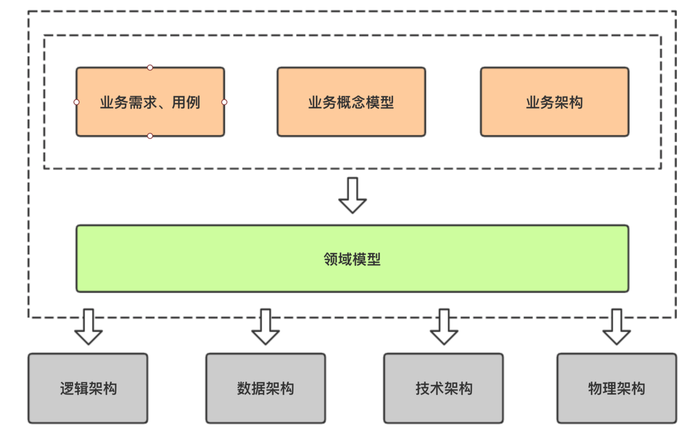

- 领域驱动设计的战略核心即是将问题域与应用架构相剥离，将业务语义显现化，把原先晦涩难懂的业务算法逻辑，通过领域对象（Domain Object），统一语言（Ubiquitous Language）转化为领域概念清晰的显性化表达出来。
  
- **统一语言**
  软件的开发人员/使用人员都使用同一套语言，即对某个概念，名词的认知是统一的，建立清晰的业务模型，形成统一的业务语义。将模型作为语言的支柱。确保团队在内部的所有交流中，代码中，画图，写东西，特别是讲话的时候都要使用这种语言。例如账号，转账，透支策略，这些都是非常重要的领域概念，如果这些命名都和我们日常讨论以及 PRD 中的描述保持一致，将会极大提升代码的可读性，减少认知成本。。比如不再会有人在会议中对“工单”、“审核单”、“表单”而反复确认含义了，DDD 的模型建立不会被 DB 所绑架。
- **面向领域**
  业务语义显性化，以领域去思考问题，而不是模块。将隐式的业务逻辑从一推 if-else 里面抽取出来，用通用语言去命名、去写代码、去扩展，让其变成显示概念；很多重要的业务概念，按照事务脚本的写法，其含义完全淹没在代码逻辑中没有突显出来。
- **职责划分**
  根据实际业务合理划分模型，模型之间依赖结构和边界更加清晰，避免了混乱的依赖关系，进而增加可读性、可维护性；单一职责，模型只关注自身的本职工作，避免“越权”而导致混乱的调用关系。通过建模，更好的表达现实世界中的复杂业务，随着时间的发展，不断增加系统对实际业务的沉淀，也将更好的通过清晰的代码描述业务逻辑，模型的内聚增加了系统的高度模块化，提升代码的可重用性，对比传统三层模式中，很有可能大量重复的功能散落在各个 Service 内部。
- 阿里巴巴开源DDD框架:COLA4