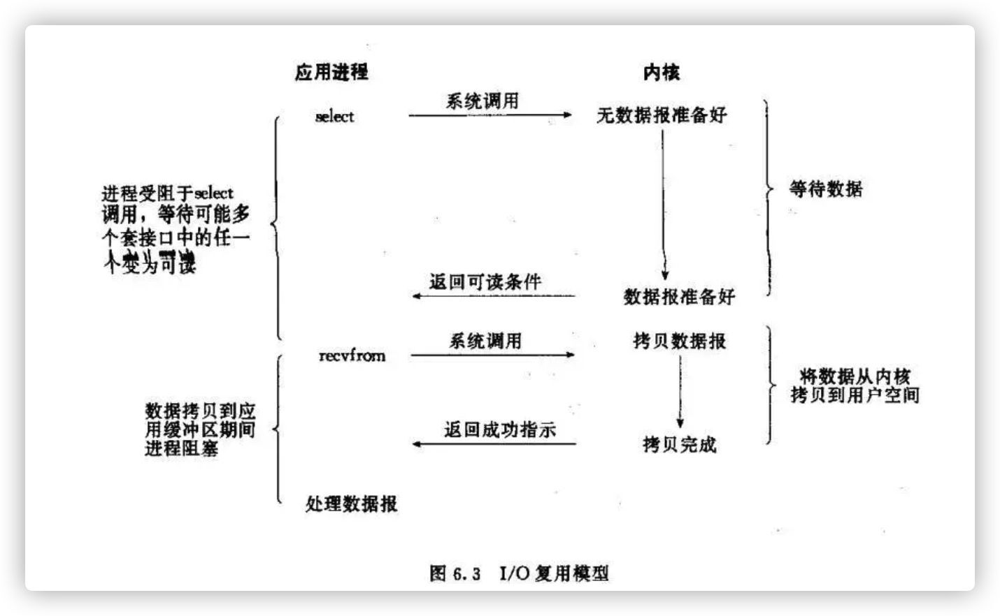
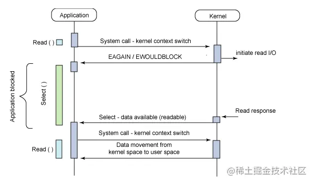
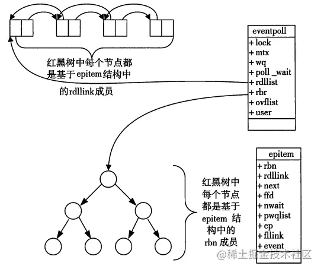

- 定义:也称事件驱动IO，在单个线程里同时监控多个套接字，通过 select/poll/epoll查看所负责的所有 socket，进程阻塞,当任意一个socket 有数据准备好，就通知用户进程。
  俗称:多路是指网络连接，复用指的是同一个线程
  
  系统调用:两次一次select/poll/epoll，一次recvform
  
  select函数工作过程:多个进程的 IO 可以注册到同一个管道上，关键是select函数，多个进程的 IO 可以注册到同一个select上，当用户进程调用该select，select会监听所有注册好的 IO，如果所有被监听的 IO 需要的数据都没有准备好时，调用进程会阻塞，等待有套接字变为可读。当任意一个 IO 需要的数据准备好后，即当有套接字可读以后，select调用就会返回，然后进程再通过recvfrom来把对应的数据拷贝到用户进程缓冲区。
  
  图片描述select实现方式，poll/epoll工作方式大致相同
  
  
  第一阶段和第二阶段都阻塞，是同步阻塞(三种实现方式都是)。
- 准备知识
  ((629317ef-ddcb-45f7-8e4b-44af198efc0a))
- 五种常见的IO模型
  ((62931088-07cf-4392-835b-8ab943e3351f))
- 与同步阻塞IO：
  ((629310c1-0a9c-42b2-a918-74796479c2df)) 
  优势:可以同时等待多个描述符就绪。
  劣势:需要两次系统调用，同步阻塞IO只需要一次系统调用。
  所以在并发量不高的情况下,同步阻塞IO+线程池的方式相比IO多路复用机制可能效率更高(具体需要测试)
- IO多路复用机制三种实现select/poll/epoll函数
  select/poll/epoll三种函数实现
	- 缩写
	  FD 是文件描述符的缩写 ((629436f6-7eb2-4324-9f58-24e6112dfc12))
	- 1. select 
	  select:有I/O事件发生了，通知用户进程，却并不知道具体是哪几个流(文件描述符)，只能无差别轮询所有流，找出有读写操作的流
	  select具有O(n)的无差别轮询复杂度，同时处理的流越多，无差别轮询时间就越长
		- select函数定义
		  ```
		  // API
		  // 返回值就绪描述符的数目,若超时则返回0，若出错则返回-1
		  int select(
		      int max_fd, 
		      fd_set *readset, 
		      fd_set *writeset, 
		      fd_set *exceptset, 
		      struct timeval *timeout
		  )                              
		  ```
		- select调用过程
		   
		  （1）使用copy_from_user从用户空间拷贝fd_set到内核空间
		  （2）注册回调函数__pollwait
		  （3）遍历所有fd，调用其对应的poll方法（对于socket，这个poll方法是sock_poll，sock_poll根据情况会调用到tcp_poll,udp_poll或者datagram_poll）
		  （4）以tcp_poll为例，其核心实现就是__pollwait，也就是上面注册的回调函数。
		  （5）__pollwait的主要工作就是把current（当前进程）挂到设备的等待队列中，不同的设备有不同的等待队列，对于tcp_poll来说，其等待队列是sk->sk_sleep（注意把进程挂到等待队列中并不代表进程已经睡眠了）。在设备收到一条消息（网络设备）或填写完文件数据（磁盘设备）后，会唤醒设备等待队列上睡眠的进程，这时current便被唤醒了。
		  （6）poll方法返回时会返回一个描述读写操作是否就绪的mask掩码，根据这个mask掩码给fd_set赋值。
		  （7）如果遍历完所有的fd，还没有返回一个可读写的mask掩码，则会调用schedule_timeout是调用select的进程（也就是current）进入睡眠。当设备驱动发生自身资源可读写后，会唤醒其等待队列上睡眠的进程。如果超过一定的超时时间（schedule_timeout指定），还是没人唤醒，则调用select的进程会重新被唤醒获得CPU，进而重新遍历fd，判断有没有就绪的fd。
		  （8）把fd_set从内核空间拷贝到用户空间
		- select函数详情
		  ```cpp
		  #include <sys/select.h>
		  #include <sys/time.h>
		  
		  #define FD_SETSIZE 1024
		  #define NFDBITS (8 * sizeof(unsigned long))
		  #define __FDSET_LONGS (FD_SETSIZE/NFDBITS)
		  
		  // 数据结构 (bitmap)
		  typedef struct {
		      unsigned long fds_bits[__FDSET_LONGS];
		  } fd_set;
		  
		  // API
		  // 返回值就绪描述符的数目,若超时则返回0，若出错则返回-1
		  int select(
		      int max_fd, 
		      fd_set *readset, 
		      fd_set *writeset, 
		      fd_set *exceptset, 
		      struct timeval *timeout
		  )                              
		  
		  FD_ZERO(int fd, fd_set* fds)   // 清空集合
		  FD_SET(int fd, fd_set* fds)    // 将给定的描述符加入集合
		  FD_ISSET(int fd, fd_set* fds)  // 判断指定描述符是否在集合中 
		  FD_CLR(int fd, fd_set* fds)    // 将给定的描述符从文件中删除  
		  
		  ```
		- select函数缺点
		  id:: 62944299-b96d-48d3-8c02-4a38a71a9711
		  FD ((629436f6-7eb2-4324-9f58-24e6112dfc12))
		  1. 单个进程所打开的FD是有限制的，通过 FD_SETSIZE 设置，默认1024 ;
		  --->高并发下很容易突破这个限制上限
		  2. 每次调用 select，都需要把 fd 集合从用户态拷贝到内核态，这个开销在 fd 很多时会很大；
		  3. 需要遍历整个fd集合，不管那个fd是活跃的,对 socket 扫描时是线性扫描，采用轮询的方法，效率较低（高并发）
	-
	- 2. poll
	  poll本质上和select没有区别，它将用户传入的数组拷贝到内核空间，然后查询每个fd对应的设备状态， 但是它没有最大连接数的限制，原因是它是基于链表来存储的.
		- poll函数定义:
		  ```cpp
		  #include <poll.h>
		  // 数据结构
		  struct pollfd {
		      int fd;                         // 需要监视的文件描述符
		      short events;                   // 需要内核监视的事件
		      short revents;                  // 实际发生的事件
		  };
		  
		  // API
		  int poll(struct pollfd fds[], nfds_t nfds, int timeout);
		  
		  ```
		- 与select函数相比较
		  ((62944299-b96d-48d3-8c02-4a38a71a9711)) 
		  改进了select的第一个缺点(它没有最大连接数的限制，原因是它是基于链表来存储的)，
		  但是后面两个缺点还是存在的。(CPU拷贝fd集合从用户空间到内核空间和线性遍历fd集合)
	- 3. epoll
	  epoll可以理解为event poll，不同于无差别轮询，epoll会把哪个流发生了怎样的I/O事件通知我们。后续处理fd集合时这样就不需要线性遍历fd集合了
		- epoll函数定义
		  ```cpp
		  #include <sys/epoll.h>
		  
		  // 数据结构
		  // 每一个epoll对象都有一个独立的eventpoll结构体
		  // 用于存放通过epoll_ctl方法向epoll对象中添加进来的事件
		  // epoll_wait检查是否有事件发生时，只需要检查eventpoll对象中的rdlist双链表中是否有epitem元素即可
		  struct eventpoll {
		      /*红黑树的根节点，这颗树中存储着所有添加到epoll中的需要监控的事件*/
		      struct rb_root  rbr;
		      /*双链表中则存放着将要通过epoll_wait返回给用户的满足条件的事件*/
		      struct list_head rdlist;
		  };
		  
		  // API
		  int epoll_create(int size); // 内核中间加一个 ep 对象，把所有需要监听的 socket 都放到 ep 对象中
		  int epoll_ctl(int epfd, int op, int fd, struct epoll_event *event); // epoll_ctl 负责把 socket 增加、删除到内核红黑树
		  int epoll_wait(int epfd, struct epoll_event * events, int maxevents, int timeout);// epoll_wait 负责检测可读队列，没有可读 socket 则阻塞进程
		  ```
		  epitem
		  ```cpp
		  struct epitem{
		      struct rb_node  rbn;//红黑树节点
		      struct list_head    rdllink;//双向链表节点
		      struct epoll_filefd  ffd;  //事件句柄信息
		      struct eventpoll *ep;    //指向其所属的eventpoll对象
		      struct epoll_event event; //期待发生的事件类型
		  }
		  ```
		  当调用epoll_wait检查是否有事件发生时，只需要检查eventpoll对象中的rdlist双链表中是否有epitem元素即可。如果rdlist不为空，则把发生的事件复制到用户态，同时将事件数量返回给用户。
		- epollo处理过程
		  
		  
		  第一步：epoll_create()系统调用。此调用返回一个句柄，之后所有的使用都依靠这个句柄来标识。
		  第二步：epoll_ctl()系统调用。通过此调用向epoll对象中添加、删除、修改感兴趣的事件，返回0标识成功，返回-1表示失败。
		  第三部：epoll_wait()系统调用。通过此调用收集在epoll监控中已经发生的事件。一旦任意一个fd就绪，内核就会采用类似callback的回调机制来激活该fd，epoll_wait便可以收到通知。
		- epoll函数使用伪代码
		  ```cpp
		  int main(int argc, char* argv[])
		  {
		     /*
		     * 在这里进行一些初始化的操作，
		     * 比如初始化数据和socket等。
		     */
		  
		      // 内核中创建ep对象
		      epfd=epoll_create(256);
		      // 需要监听的socket放到ep中
		      epoll_ctl(epfd,EPOLL_CTL_ADD,listenfd,&ev);
		   
		      while(1) {
		        // 阻塞获取
		        nfds = epoll_wait(epfd,events,20,0);
		        for(i=0;i<nfds;++i) {
		            if(events[i].data.fd==listenfd) {
		                // 这里处理accept事件
		                connfd = accept(listenfd);
		                // 接收新连接写到内核对象中
		                epoll_ctl(epfd,EPOLL_CTL_ADD,connfd,&ev);
		            } else if (events[i].events&EPOLLIN) {
		                // 这里处理read事件
		                read(sockfd, BUF, MAXLINE);
		                //读完后准备写
		                epoll_ctl(epfd,EPOLL_CTL_MOD,sockfd,&ev);
		            } else if(events[i].events&EPOLLOUT) {
		                // 这里处理write事件
		                write(sockfd, BUF, n);
		                //写完后准备读
		                epoll_ctl(epfd,EPOLL_CTL_MOD,sockfd,&ev);
		            }
		        }
		      }
		      return 0;
		  }
		  
		  ```
		- epoll数据结构:
		  双链表结构+红黑树(O(logN))
		  通过红黑树高效操作FD集合和双链表数据结构，并结合内核消息回调机制，造就了epoll的高效。
		- epoll优缺点
		  ((62944299-b96d-48d3-8c02-4a38a71a9711)) 
		  优点:
		  1. 没有最大并发连接的限制，能打开的FD的上限远大于1024（1G的内存上能监听约10万个端口）；
		  2. 效率提升，不是轮询的方式，不会随着FD数目的增加效率下降。只有活跃可用的FD才会调用callback函数；即Epoll最大的优点就在于它只管你“活跃”的连接，而跟连接总数无关，因此在实际的网络环境中，Epoll的效率就会远远高于select和poll；
		  3. 内存拷贝，利用mmap()文件映射内存加速与内核空间的消息传递；即epoll使用mmap减少复制开销。
		  
		  缺点:只能工作在linux上。
		-
		- epoll两种工作模式
		  EPOLLLT 和 EPOLLET 两种触发模式，LT 是默认的模式，ET 是 “高速” 模式。
		  LT 模式下，只要这个 fd 还有数据可读，每次 epoll_wait 都会返回它的事件，提醒用户程序去操作；
		  ET 模式下，它只会提示一次，直到下次再有数据流入之前都不会再提示了，无论 fd 中是否还有数据可读。所以在 ET 模式下，read 一个 fd 的时候一定要把它的 buffer 读完，或者遇到 EAGIN 错误。
		- epoll应用:例如nginx
		  epoll是Linux目前大规模网络并发程序开发的首选模型。在绝大多数情况下性能远超select和poll。
		  在并发连接不高的情况下，多线程+阻塞I/O方式可能性能更好。
	- select/poll/epoll汇总比较
- IO多路复用机制三种实现函数的比较
	- FD剧增后带来的IO效率问题
	  select：因为每次调用时都会对连接进行线性遍历，所以随着FD的增加会造成遍历速度慢的“线性下降性能问题”。
	  poll：同上
	  epoll：因为epoll内核中实现是根据每个fd上的callback函数来实现的，只有活跃的socket才会主动调用callback，所以在活跃socket较少的情况下，使用epoll没有前面两者的线性下降的性能问题，但是所有socket都很活跃的情况下，可能会有性能问题。
	- 消息传递方式
	  select：内核需要将消息传递到用户空间，需要内核拷贝动作
	  poll：同上
	  epoll：epoll通过内核和用户空间共享一块内存来实现的。(mmap内存映射)
	- 支持一个进程所能打开的最大连接数
	  select：单个进程所能打开的最大连接数有FD_SETSIZE宏定义，其大小是32个整数的大小（在32位的机器上，大小就是32_32，同理64位机器上FD_SETSIZE为32_64），当然我们可以对进行修改，然后重新编译内核，但是性能可能会受到影响，这需要进一步的测试。
	  poll：poll本质上和select没有区别，但是它没有最大连接数的限制，原因是它是基于链表来存储的。
	  epoll：虽然连接数有上限，但是很大，1G内存的机器上可以打开10万左右的连接，2G内存的机器可以打开20万左右的连接。
	- IO多路复用机制三种实现函数汇总比较图
	  
-
-
- IO多路复用机制的应用
  常用于处理高并发的网络请求,所有请求里同时发生读写操作的比例一般不会很高，绝大多数请求读写都是阻塞状态
  1. redis
  redis的io模型主要是基于epoll实现的，不过它也提供了 select和kqueue的实现，默认采用epoll。
  
  为什么 Redis 中要使用 I/O 多路复用这种技术呢？
  首先，Redis 是跑在单线程中的，所有的操作都是按照顺序线性执行的，但是由于读写操作等待用户输入或输出都是阻塞的，所以 I/O 操作在一般情况下往往不能直接返回，这会导致某一文件的 I/O 阻塞导致整个进程无法对其它客户提供服务，而  I/O 多路复用 就是为了解决这个问题而出现的。
  
  2. nginx
-
-
- 资料
  [彻底理解 IO 多路复用实现机制](https://juejin.cn/post/6882984260672847879)