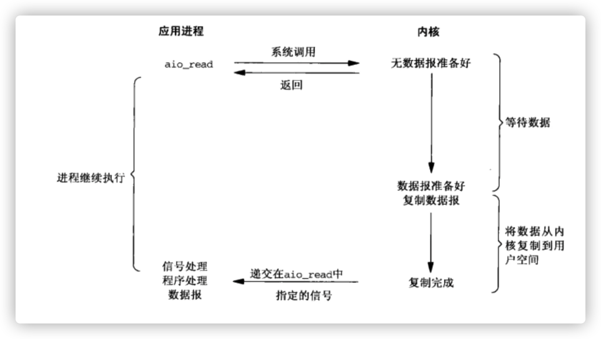
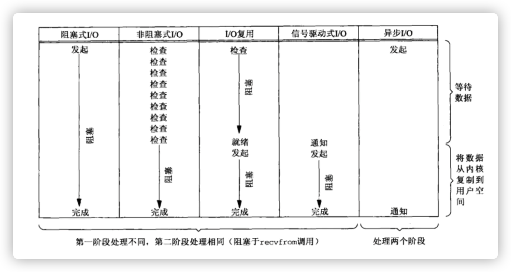
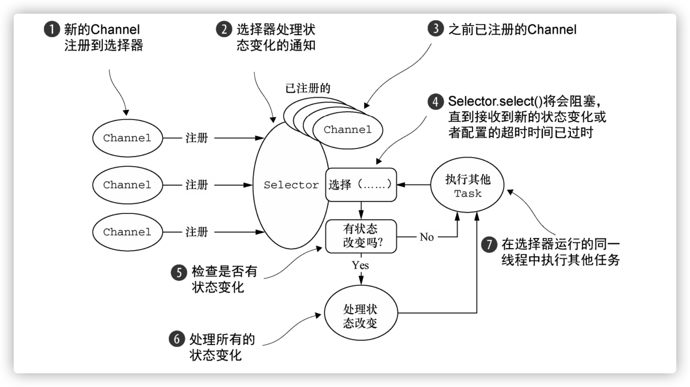

- I/O（Input/Outpu） 即输入／输出
- 从计算机结构体系角度认识IO
  根据冯.诺依曼结构，计算机结构分为 5 大部分：运算器、控制器、存储器、输入设备、输出设备.
   
  从计算机结构的视角来看的话， I/O 描述了计算机系统与外部设备之间通信的过程.
- 从应用程序角度认识IO
	- 用户空间和内核空间
	  操作系统:为了保证操作系统的稳定性和安全性，一个进程的地址空间划分为 用户空间（User space） 和 内核空间（Kernel space ）.
	  应用程序都是运行在用户空间。应用程序不能直接访问内核空间。
	  只有内核空间才能进行系统态级别的资源有关的操作，比如文件管理、进程通信、内存管理等等。
	- 应用程序想进行IO操作(例如磁盘IO，网络IO等),必须调用操作系统的*系统调用*api访问内核空间。
	  从应用程序的视角来看的话，我们的应用程序对操作系统的内核发起 IO 调用（系统调用），操作系统负责的内核执行具体的 IO 操作。我们的应用程序实际上只是发起了 IO 操作的调用而已，具体 IO 的执行是由操作系统的内核来完成的。
	- 应用程序发起 I/O 调用后，会经历两个步骤：(这个认知很重要)
	  1. 等待数据准备好（Waiting for the data to be ready）
	  2. 从内核向进程复制数据（Copying the data from the kernel to the process）
- 准备知识
  id:: 629317ef-ddcb-45f7-8e4b-44af198efc0a
  都是计算机系统的基础知识(TODO:cj 需要补课)
	- 1. 虚拟内存
	  虚拟内存为每个进程提供一个一致私有的地址空间，每个进程拥有一片连续完整的内存空间，让进程有种在独享主存的美好错觉。
	  实际上，虚拟内存通常被分隔成多个物理内存碎片，还有部分暂存在外部磁盘存储器，在需要时进行数据交换，加载到物理内存中来
	  当用户进程发出内存申请请求，系统会为进程分配虚拟地址，并创建内存映射放入页表中，如果对应的数据不在物理内存上就会发生缺页异常，需要把进程需要的数据从磁盘上拷贝到物理内存中。
	  
	- 2. 用户空间和内核空间
	  操作系统的核心是内核，独立于普通应用程序，可访问受保护的内存空间，也可访问底层硬件设备。 
	  应用程序只能访问用户空间,不能直接访问内核空间.需要通过操作系统内核的**系统调用**才能访问内核空间。而这个**系统调用**比较高.
	  
	- 3. 内核态和用户态
	  CPU内核态当进程经过系统调用而陷入内核代码中执行时，称进程处于内核运行态
	  用户态:运行在用户空间执行用户自己的代码时，处于用户态
	  
	  用户态转内核态的上下文切换
	  当用户进程想要执行 IO 操作时，由于没有执行这些操作的权限，只能发起系统调用请求操作系统帮忙完成。而系统调用会产生中断陷入到内核，也就是进行了一次上下文切换操作。
	  进程切换时，需保存、装载各种状态数据等资源， 代价就比较高。
	- 4.进程上下文切换
	  到了内核，为了控制进程执行，内核必须有能力挂起正在 CPU 上运行的进程，并恢复以前挂起的某个进程的执行。这种行为被称为进程切换。
	- 5.文件描述符（File descriptor，缩写FD）
	  id:: 629436f6-7eb2-4324-9f58-24e6112dfc12
	   文件这儿的是广义的文件，包括，文件，网络，缓冲区等
	  定义:是一个用于表述指向文件的引用的抽象化概念。 文件描述符在形式上是一个非负整数。实际上，它是一个索引值，指向内核为每一个进程所维护的该进程打开文件的记录表。
	  当程序打开一个现有文件或者创建一个新文件时，内核向进程返回一个文件描述符。
	- 6 缓存IO
	  id:: 62943773-36d6-4fcd-8bbc-7bc6a64dcd08
	  缓存I/O又称为标准I/O，大多数文件系统的默认I/O操作都是缓存I/O。
	  在Linux的缓存I/O机制中，操作系统会将I/O的数据缓存在文件系统的页缓存PageCache ((62937615-7832-4a74-ab15-10dcd930e816)) 中，即数据会先被拷贝到操作系统内核的缓冲区中，然后才会从操作系统内核的缓冲区拷贝到应用程序的地址空间。
	  直接I/O:绕开 PageCache的I/O
- I/O设备与CPU的通信方式
  id:: 629329e2-37c1-4eef-8a51-56fba1ed91e5
	- 1. I/O中断
	  在DMA技术出现前，应用程序与磁盘间的 I/O 操作都通过 CPU 中断完成。
	   
	  步骤:外部存储设备采用中断方式主动通知 CPU，CPU 负责拷贝数据到内核缓冲区，再拷贝到用户缓冲区
	  代价:每次都会有上下文切换开销和CPU拷贝开销.
	- id:: 62937793-b6da-4236-b21b-4a95343d54c6
	  2. DMA技术(直接存储器存储Direct Memory Access)
	  定义:一种允许外围设备直接访问系统主存的机制
	  
	  
	  步骤:CPU 通知 DMA 控制器拷贝外部存储设备数据到内核缓冲区，完成后再通知 CPU 拷贝到用户缓冲区。
	  
	  和I/O中断比较: I/O 中断方式相比，改由内存来执行外部存储器数据的 I/O 操作，减轻了CPU负担，且 CPU 读取内存比读取外部存储设备速度要快。省了一次CPU拷贝的开销。
	  
	  目前大多数硬件设备都支持DAM技术，例如包括磁盘、网卡、声卡等。
		-
- [[文件传输的零拷贝技术]]
- 大文件IO选择
- 五种常见的I/O模型
  id:: 62931088-07cf-4392-835b-8ab943e3351f
  阻塞非阻塞:应用程序发起系统调用后，是否需要阻塞住等待内核告知数据准备就绪。是的话就是阻塞，否的话就是非阻塞.(应用程序轮训方式也是非阻塞的,)
  同步异步:IO第二阶段从内核复制数据到用户空间这个过程期间用户进程是否需要阻塞等待。第一阶段和第二阶段全程不阻塞，就是异步的，否的话就是同步。
  简单口诀判断方法：阻塞非阻塞看IO第一个阶段，同步异步看IO全阶段(两个阶段都不阻塞）
  从上面定义角度分析,有同步阻塞，同步非阻塞和异步非阻塞三种组合,不可能出现异步阻塞
  
  UNIX 系统下， IO 模型一共有 5 种：
	- 同步阻塞 I/O
	  id:: 629310c1-0a9c-42b2-a918-74796479c2df
	  等待数据、拷贝数据两个阶段都是处于阻塞状态的。 这就是同步阻塞。
	  系统调用:一次
	  
	  
	  应用:一般并发量低的情况下:同步阻塞IO+线程池组合，效率可能反而比IO多路复用机制更高
	-
	- 同步非阻塞 I/O
	  在I/O执行的第一个阶段（等待数据）不会阻塞线程，但在第二阶段（复制数据）会阻塞。
	  第一个阶段其实就是轮询(polling)，以查询某个操作是否就绪。
	  当数据没准备好则返回 EWOULDBLOCK。
	  这就是同步非阻塞(轮训期间可能的话用户程序也是可以干点别的)。
	  
	  缺点：比较耗费CPU资源
	- [[IO多路复用机制]]
	- 信号驱动式I/O(signal-driven I/O)
	  定义:相比于同步非阻塞IO，我们可以让内核在数据准备好时发SIGIO信号通知用户进程，这种模型称为信号驱动式I/O.
	  主要过程:首先要开启 socket 的信号驱动式 IO 功能，应用进程通过 sigaction 系统调用注册 SIGIO 信号处理函数，该系统调用会立即返回。当数据准备好时，内核会为该进程产生一个 SIGIO 信号通知，之后再把数据拷贝到用户空间中。
	  系统调用：两次
	  
	  
	  在I/O执行的第一个阶段（等待数据）不会阻塞线程，但在第二阶段（复制数据）会阻塞。这是同步非阻塞。
	  说明：这种IO模型java当中并没有使用到。
	- 异步 I/O
	  系统调用：一次
	  主要工作步骤：用户进程在发起调用后，内核会立即返回。用户进程就干别的事去了。内核等待数据准备完毕，自动将数据拷贝到用户内存，接着给用户进程发了个信号，通知 IO 操作已完成。
	  
	  第一个阶段和第二个阶段都不阻塞，所以是异步非阻塞。
	- 各个IO模型比较图
	  
-
- java IO模型
  1. BIO(Blocking IO)同步阻塞IO模型,最传统的模型。
  该模型下常见优化的方案就是用线程池.
  在客户端连接数量不高的情况下，是没问题的。
  限制:当面对十万甚至百万级连接的时候，传统的 BIO 模型是无能为力的。
  2. NIO(Non Blocking IO) jdk4引入
  NIO 虽然用的是多路复用I/O模型，却属于同步非阻塞,
  工作原理:收到的请求会先注册到多路复用器 Selector 上，多路复用器轮询直到连接有 I/O 请求时才启动一个线程进行处理。也就是前文中的多路复用 I/O 模型，虽然说多路复用模型是阻塞的，但在 NIO 这里，因为有Selector，read 和 write 操作都是非阻塞的.
  常用类：Selector,Channel,Buffer,
  Channel（通道）相当于操作系统中的内核缓冲区。
  Buffer 就相当于操作系统中的用户空间缓冲区。
  Selector 其实就是 select/poll/epoll 的外包类。
   
  NIO实现了零拷贝技术，
  FileChannel.map() : 基于内存映射 mmap 方式一种实现，可以把一个文件从 position 位置开始的 size 大小的区域映射为内存映像文件。(不是完全的零拷贝技术)
  FileChannel.transferTo() : 通过调用 sendfile 方式实现的零拷贝。
  应用：[[Netty]] 基于NIO
  3. AIO(Aysnc IO)jdk7引入
  在 NIO 的基础上引入了新的异步通道的概念，并提供了异步文件通道和异步套接字通道的实现。
  目前的实践项目不多
-
-
- 资料
  [如何完成一次 IO](https://llc687.top/126.html)
  [原来 8 张图，就可以搞懂「零拷贝」了](https://www.cnblogs.com/xiaolincoding/p/13719610.html)
- 书籍
  《UNIX 网络编程 卷1:套接字联网 API 》6.2 节 IO 模型
  《现代操作系统》