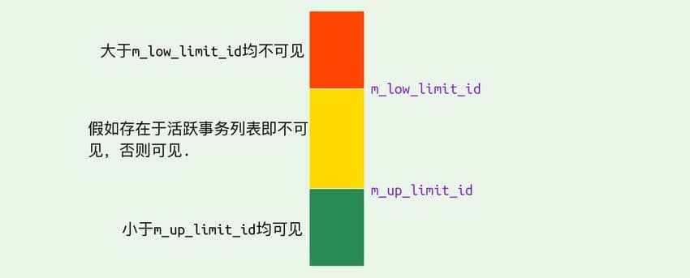
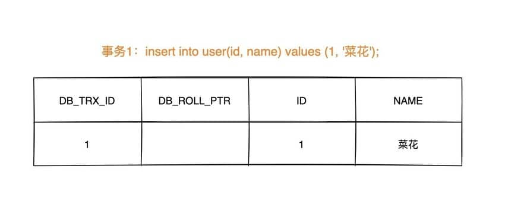
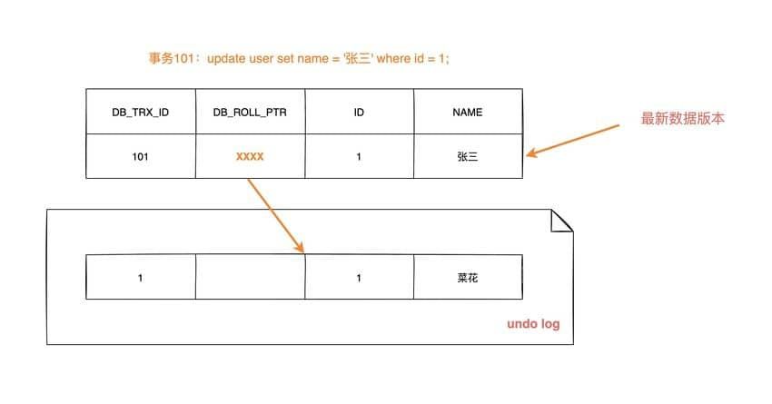
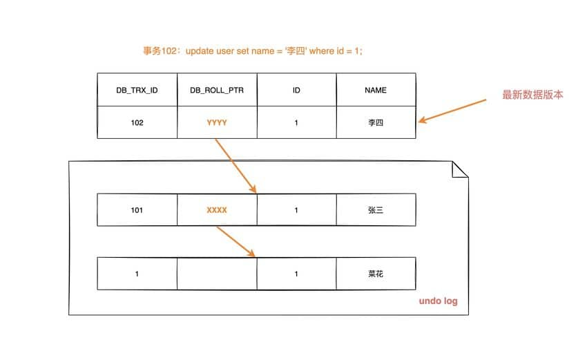
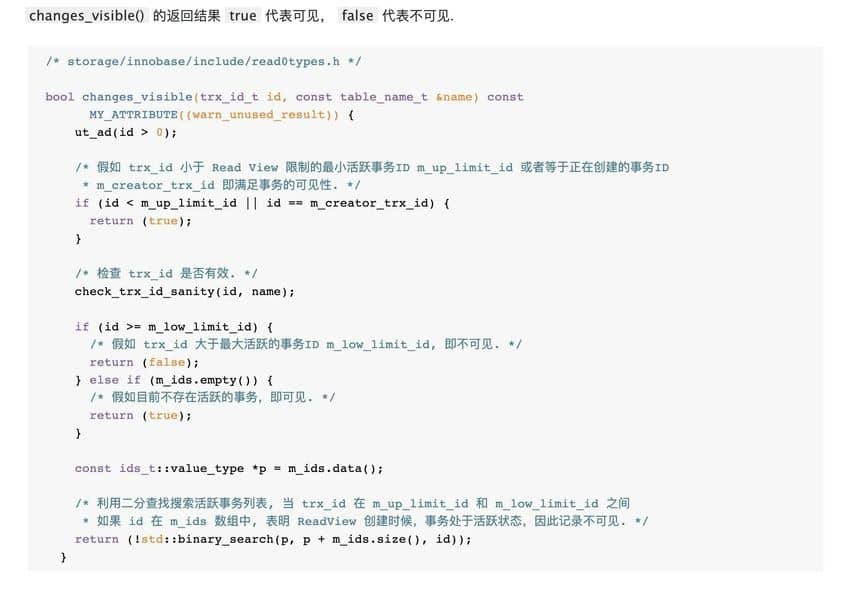

- MVCC(多版本并发控制，Multi-Version Concurrency Control)
- 快照读(snapshot read)也叫一致性非锁定读(Consistent Nonlocking Reads)
  id:: 62ae83ab-0d03-4ba3-83a5-65b55e03f2ae
  只能读取到第一次查询之前所插入的数据（根据 Read View 判断数据可见性，Read View 在第一次查询时生成）
  --->因为普通select没有加锁所以叫非锁定读
  sql操作
  ```
  普通的select语句
  ```
  常规实现思路
  记录版本:指的是表数据行记录的版本
  通常做法是加一个版本号或者时间戳字段，在更新数据的同时版本号 + 1 或者更新时间戳。查询时，将当前可见的版本号与对应记录的版本号进行比对，如果记录的版本小于可见版本，则表示该记录可见.
- 当前读(current read)也叫锁定读(Locking Reads)
  id:: 62adc7f8-ae50-4d50-b05d-faeeb20db459
  每次读取的都是最新数据，
  --->因为select for update加锁所以叫锁定读
  如下sql操作
  ```
  select ... lock in share mode
  select ... for update
  insert、update、delete 操作
  ```
  锁定读会对读取到的记录加锁：
  select ... lock in share mode：对记录加 S 锁，其它事务也可以加S锁，如果加 x 锁则会被阻塞。
  select ... for update、insert、update、delete：对记录加 X 锁，且其它事务不能加任何锁。
- InnoDB实现机制:MVCC
  如果读取的行正在执行 DELETE 或 UPDATE 操作(事务加了X锁)，这时读取操作不会去等待行上锁的释放。相反地，InnoDB 存储引擎会去读取行的一个快照数据。
- MVCC实现机制
  简单描述:MVCC 的实现依赖于：隐藏字段、Read View、undo log。
  1. 在内部实现中，InnoDB 通过数据行的 DB_TRX_ID 和 Read View 来判断数据的可见性，
  2. 如不可见，则通过数据行的 DB_ROLL_PTR 找到 undo log 中的历史版本。
  每个事务读到的数据版本可能是不一样的，在同一个事务中，用户只能看到该事务创建 Read View 之前已经提交的修改和该事务本身做的修改。
	- 隐藏字段
	  InnoDB 存储引擎为每行数据添加了三个 隐藏字段
	  DB_TRX_ID（6字节）：表示最后一次插入或更新该数据行的事务 id。
	  此外，delete 操作在内部被视为更新，只不过会在记录头 Record header 中的 deleted_flag 字段将其标记为已删除。
	  
	  DB_ROLL_PTR（7字节） 回滚指针，指向该数据行的 undo log 。如果该行未被更新，则为空。
	  注意:数据行首次插入时,DB_ROLL_PTR为空.后面每次更新该数据行时，DB_ROLL_PTR都更新
	  
	  DB_ROW_ID（6字节）：如果没有设置主键且该表没有唯一非空索引时，InnoDB 会使用该 id 来生成聚簇索引。
	- Read View
	  数据结构
	  ```
	  class ReadView {
	    /* ... */
	  private:
	    trx_id_t m_low_limit_id;      /* 大于等于这个 ID 的事务均不可见 */
	  
	    trx_id_t m_up_limit_id;       /* 小于这个 ID 的事务均可见 */
	  
	    trx_id_t m_creator_trx_id;    /* 创建该 Read View 的事务ID */
	  
	    trx_id_t m_low_limit_no;      /* 事务 Number, 小于该 Number 的 Undo Logs 均可以被 Purge */
	  
	    ids_t m_ids;                  /* 创建 Read View 时的活跃事务列表 */
	  
	    m_closed;                     /* 标记 Read View 是否 close */
	  }
	  ```
	  m_low_limit_id：目前出现过的最大的事务 ID+1，即下一个将被分配的事务 ID。大于等于这个 ID 的数据版本均不可见.
	  m_up_limit_id：活跃事务列表 m_ids 中最小的事务 ID，如果 m_ids 为空，则 m_up_limit_id 为 m_low_limit_id。小于这个 ID 的数据版本均可见.
	  m_ids：Read View 创建时其他未提交的活跃事务 ID 列表。创建 Read View时，将当前未提交事务 ID 记录下来，后续即使它们修改了记录行的值，对于当前事务也是不可见的。m_ids 不包括当前事务自己和已提交的事务（正在内存中）.
	  m_creator_trx_id：创建该 Read View 的事务 ID
	  
	  数据行DB_TRX_ID与m_low_limit_id,m_up_limit_id,m_ids关系理解如下图，
	  
	  
	  不同事务隔离级别下Read View生成时机
	  a. 快照读:
	  在 RC 隔离级别下的 每次select 查询前都生成一个Read View (m_ids 列表)
	  在 RR 隔离级别下只在事务开始后 第一次select 数据前生成一个Read View（m_ids 列表）
	  b. 当前读
	  TODO:cj
	- MVCC中的undo log
	  id:: 62ae8bd1-4ccb-4ef7-9ac8-d7026d687a1b
	  ((889ad45e-5c8d-45d5-8569-2da7a975e8a8))
	  undo log 主要有两个作用：
	  1. 当事务回滚时用于将数据恢复到修改前的样子
	  2. 另一个作用是 MVCC ，当读取记录时，若该记录被其他事务占用或当前版本对该事务不可见，则可以通过 undo log 读取之前的版本数据，以此实现快照读。
	  
	  undo log两种类型
	  在 InnoDB 存储引擎中 undo log 分为两种： insert undo log 和 update undo log：
	  1. insert undo log ：指在 insert 操作中产生的 undo log。因为 insert 操作的记录只对事务本身可见，对其他事务不可见，故该 undo log 可以在事务提交后直接删除。不需要进行 purge 操作.
	  insert 时的数据初始状态：
	  
	  
	  2. update undo log ：update 或 delete 操作中产生的 undo log。该 undo log可能需要提供 MVCC 机制，因此不能在事务提交时就进行删除。提交时放入 undo log 链表，等待 purge线程 进行最后的删除.
	  数据第一次被修改时：
	  
	  数据第二次被修改时：
	  
	  undo log链表数据结构
	  不同事务或者相同事务的对同一记录行的修改，会使该记录行的 undo log 成为一条链表，链首就是最新的记录，链尾就是最早的旧记录。
	-
- MVCC数据可见性算法
  在 InnoDB 存储引擎中，创建一个新事务后，执行每个 select 语句前，都会创建一个快照（Read View），快照中保存了当前数据库系统中正处于活跃（没有 commit）的事务的 ID 号列表(m_ids)。
  
  判断某个记录行是否满足可见性条件
  当用户在这个事务中要读取某个记录行的时候，InnoDB 会将该记录行的 DB_TRX_ID 与 Read View 中的一些变量及当前事务 ID 进行比较，判断是否满足可见性条件。
  具体算法源码分析如下
  函数入参中的trx_id id表示记录行的 DB_TRX_ID。
  
  
  MVCC记录行数据可见性步骤
  名词快照：指的是Read View
  1. 如果记录 DB_TRX_ID < m_up_limit_id，那么表明最新修改该行的事务（DB_TRX_ID）在当前事务创建快照之前就提交了，所以该记录行的值对当前事务是可见的。
  2. 如果 DB_TRX_ID >= m_low_limit_id，那么表明最新修改该行的事务（DB_TRX_ID）在当前事务创建快照之后才修改该行，所以该记录行的值对当前事务不可见。跳到步骤 5。
  3. m_ids 为空，则表明在当前事务(提交事务后）创建快照Read View之前，修改该行的事务就已经提交了，所以该记录行的值对当前事务是可见的。
  4. 如果 m_up_limit_id <= DB_TRX_ID < m_low_limit_id，表明最新修改该行的事务（DB_TRX_ID）在当前事务创建快照的时候可能处于“活动状态”或者“已提交状态”；所以就要对活跃事务列表 m_ids 进行查找（源码中是用的二分查找，因为是有序的）
  4.1 如果在活跃事务列表 m_ids 中能找到 DB_TRX_ID，表明：
  ① 在当前事务创建快照前，该记录行的值被事务 ID 为 DB_TRX_ID 的事务修改了，但没有提交；
  或者 ② 在当前事务创建快照后，该记录行的值被事务 ID 为 DB_TRX_ID 的事务修改了。
  这些情况下，这个记录行的值对当前事务都是不可见的。跳到步骤 5
  4.2 在活跃事务列表中找不到，则表明“id 为 trx_id 的事务”在修改“该记录行的值”后，在“当前事务”创建快照前就已经提交了，所以记录行对当前事务可见(步骤3一致)
  5. 在该记录行的 DB_ROLL_PTR 指针所指向的 undo log 取出快照记录，用快照记录的 DB_TRX_ID 跳到步骤 1 重新开始判断，直到找到满足的快照版本或返回空。(循环递归找到满足的快照版本)
-
- 事务隔离级别和快照读，当前读的关系
  在 Repeatable Read 和 Read Committed 两个隔离级别下，如果是执行普通的 select 语句（不包括 select ... lock in share mode ,select ... for update）则会使用 一致性非锁定读（MVCC）。
  并且在 Repeatable Read 下 MVCC 实现了可重复读和防止部分幻读.
- RC 这种隔离级别中，还支持"半一致读"
  在 RC 中，只会对索引增加Record Lock，不会添加Gap Lock和Next-Key Lock。
  在 RR 中，为了解决幻读的问题，在支持Record Lock的同时，还支持Gap Lock和Next-Key Lock；
  [MySQL 默认隔离级别是RR，为什么阿里等大厂会改成RC？](https://mp.weixin.qq.com/s/mIz0T0v68_dvUgCrj-qdug)