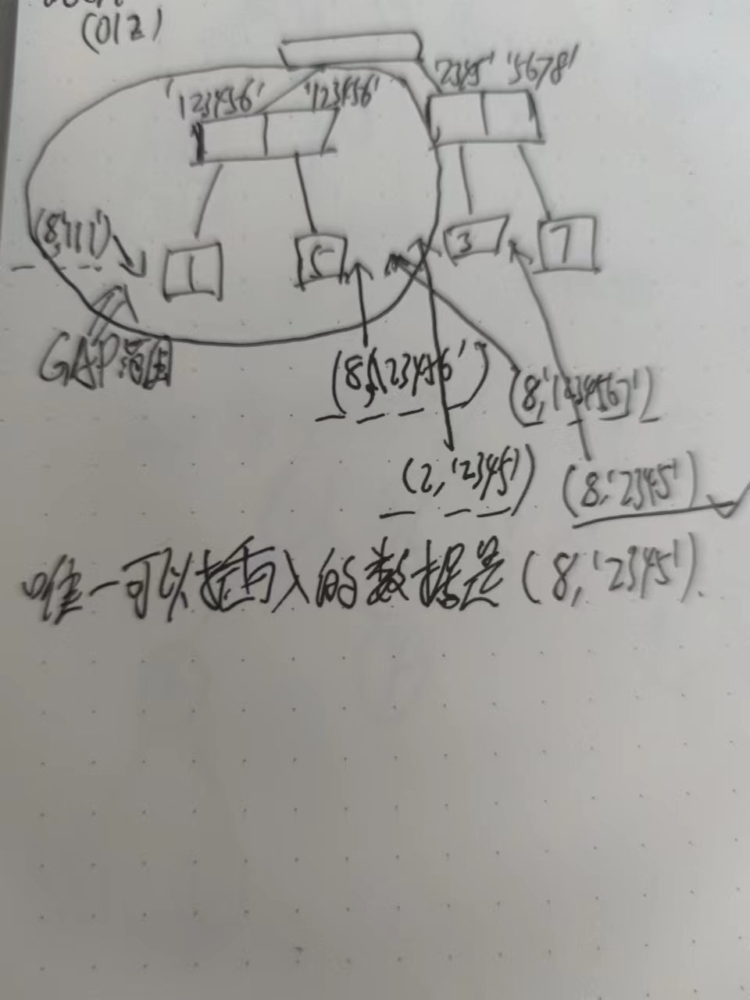

- 行锁触发条件是查询条件命中索引，MySQL默认使用临键锁
- 1. 记录锁（Record Lock） ：也被称为记录锁，属于单个行记录上的锁。
  记录锁触发条件:查询条件命中索引
- 2. 间隙锁（Gap Lock） ：又叫区间锁，锁定一个范围，不包括记录本身。
  当我们查询数据用范围查询而不是相等条件查询时，**查询条件命中索引，并且没有查询到符合条件的记录**，此时就会将查询条件中的范围数据进行锁定(即使是范围库中不存在的数据也会被锁定)
  间隙锁触发条件:查询条件命中索引，并且没有查询到符合条件的记录
  间隙锁特征
  1. 间隙锁锁定区间范围是左开右闭区间
  2. 间隙锁只会出现在可重复读的事务隔离级别中
  间隙锁作用示例:左开右闭区间
  我们打开两个窗口，在窗口A中我们根据id做一个范围更改操作，不提交事务，然后在范围B中插入一条记录，该记录的id值位于窗口A中的条件范围内
  
  查看运行结果:上述代码中，所锁定的区间就是 (1,3]这个区间,不包含1，但是包含3，并且不包含4，也就是说间隙锁这里是左开右闭区间
  间隙锁特征实验:只会出现在可重复读的事务隔离级别中
  首先将mysql数据库隔离级别修改为不可重复读
  ```
  //设置事务隔离级别为不可重复读
  set session transaction isolation level read committed;
  //my5.7查看当前事务级别
  SELECT @@tx_isolation
  ```
  打开两个窗口，在窗口A中我们根据id做一个范围更改操作，不提交事务，然后在范围B中插入一条记录，该记录的id值位于窗口A中的条件范围内
  {:height 214, :width 698}
  运行结果分析:修改了数据库隔离级别后，再次测试间隙锁，发现间隙锁没有生效。我们可以通过rollback回滚事务。
- 3. 临键锁（Next-key Lock） ：Record Lock+Gap Lock，锁定一个范围，包含记录本身。记录锁只能锁住已经存在的记录，为了避免插入新记录，需要依赖间隙锁。
  临键锁触发条件:查询条件命中索引,同时有匹配到数据库记录
  **临键锁是由记录锁和间隙锁共同实现的**
  特征:
  临键锁锁定区间范围也是左开右闭区间，和间隙锁一样
  临键锁锁定是当前记录的区间和下一个记录的区间.
- 临键锁实验
  
  
  从上图我们可以看到，数据库中只有三条数据1、5、7，当修改范围为1~8时，则锁定的区间为(1,+∞)，锁定区间不单是查询范围，并且还锁定了当前范围的下一个范围区间(假如还有数据10，那么下一个范围区间就变成(8,10],合起来锁定区间就是(1,10])，此时，查询的区间8，在数据库中是一个不存在的记录值，并且，如果此时的查询条件是小于或等于8，也是一样的锁定8到后面的区间。
  如果查询的结尾是一个存在的值，此时又会怎样呢？
  现在数据库有三条数据id分别是1、5、7，我们查询条件改为大于1小于7再看看。
  
  此时，我们可以看到，由于7在数据库中是已知的记录，所以此时的锁定后，只锁定了(1,7]，7之后的数据都没有被锁定。我们还是可以正常插入id为8的数据及其后面的数据。
  结论:临键锁锁定区间和查询范围后匹配值很重要，如果后匹配值存在，则只锁定查询区间，否则锁定查询区间和后匹配值与它的下一个值的区间。
  问题：为什么临键锁后匹配会这样呢
  innodb索引是基于B+树实现的,
- 临键锁实验A
  [InnoDB的next-key lock 为什么是左开右闭的？](https://www.zhihu.com/question/334081090/answer/1882156445)
	- 系统准备：mysql5.8
	- 脚本准备:初始化数据库和表，并插入实验数据
	  ```sql
	  # 建库
	  CREATE DATABASE IF NOT EXISTS lock_test DEFAULT CHARSET utf8mb4;
	  use lock_test;
	  drop table if exists test_gap;
	  # 建表
	  CREATE TABLE IF NOT EXISTS `test_gap`(
	  	`id` int(11) NOT NULL AUTO_INCREMENT, 
	  	`age` int(11) DEFAULT NULL, 
	  	`name` varchar(10) DEFAULT NULL, 
	  	PRIMARY KEY (`id`), 
	  	KEY `ix age` (`age`) 
	  )ENGINE=InnoDB AUTO_INCREMENT=97 DEFAULT CHARSET=utf8mb4;
	  # 插入数据
	  insert into test_gap(id,age)values
	  (10,10),(20,20),(30,30),(70,30),(80,31),(40,50);
	  
	  ```
	- 事务隔离级别是可重复读
	  ```
	  SELECT @@transaction_isolation;
	  +-------------------------+
	  | @@transaction_isolation |
	  +-------------------------+
	  | REPEATABLE-READ         |
	  +-------------------------+
	  ```
	- 查询数据
	  
	  ```
	  select * from test_gap order by age;
	  +----+-----+--------+
	  | id | age | name   |
	  +----+-----+--------+
	  | 10 | 10  | <null> |
	  | 20 | 20  | <null> |
	  | 30 | 30  | <null> |
	  | 70 | 30  | <null> |
	  | 80 | 31  | <null> |
	  | 40 | 50  | <null> |
	  +----+-----+--------+
	  6 rows in set
	  Time: 0.010s
	  ```
	  观察表上gap锁的区间如下：
	  (-无穷,10] . (10,20] . (20,30] . (30,31] . (31,50] . (50,无穷]
	-
	- 运行实验
	  开启两个session窗口
	  第一个窗口执行如下命令：
	  ```sql
	  begin;
	  select * from  test_gap where age=31 for update;
	  ```
	  查询所有事务
	  ```
	  select * from information_schema.innodb_trx;
	  +--------+-----------+---------------------+-----------------------+------------------+------------+---------------------+---------------------------------------------+---------------------+-------------------+-------------------+------------------+-----------------------+-----------------+-------------------+-------------------------+---------------------+-------------------+------------------------+----------------------------+---------------------------+---------------------------+------------------+----------------------------+---------------------+
	  | trx_id | trx_state | trx_started         | trx_requested_lock_id | trx_wait_started | trx_weight | trx_mysql_thread_id | trx_query                                   | trx_operation_state | trx_tables_in_use | trx_tables_locked | trx_lock_structs | trx_lock_memory_bytes | trx_rows_locked | trx_rows_modified | trx_concurrency_tickets | trx_isolation_level | trx_unique_checks | trx_foreign_key_checks | trx_last_foreign_key_error | trx_adaptive_hash_latched | trx_adaptive_hash_timeout | trx_is_read_only | trx_autocommit_non_locking | trx_schedule_weight |
	  +--------+-----------+---------------------+-----------------------+------------------+------------+---------------------+---------------------------------------------+---------------------+-------------------+-------------------+------------------+-----------------------+-----------------+-------------------+-------------------------+---------------------+-------------------+------------------------+----------------------------+---------------------------+---------------------------+------------------+----------------------------+---------------------+
	  | 66124  | RUNNING   | 2022-06-13 22:02:50 | <null>                | <null>           | 4          | 13                  | select * from information_schema.innodb_trx | <null>              | 0                 | 1                 | 4                | 1136                  | 3               | 0                 | 0                       | REPEATABLE READ     | 1                 | 1                      | <null>                     | 0                         | 0                         | 0                | 0                          | <null>              |
	  +--------+-----------+---------------------+-----------------------+------------------+------------+---------------------+---------------------------------------------+---------------------+-------------------+-------------------+------------------+-----------------------+-----------------+-------------------+-------------------------+---------------------+-------------------+------------------------+----------------------------+---------------------------+---------------------------+------------------+----------------------------+---------------------+
	  ```
	  查询指定事务的锁信息
	  select * from performance_schema.data_locks where ENGINE_TRANSACTION_ID=66124;
	  ```
	  
	  select * from performance_schema.data_locks;
	  +--------+-----------------------------------------+-----------------------+-----------+----------+---------------+-------------+----------------+-------------------+------------+-----------------------+-----------+---------------+-------------+-----------+
	  | ENGINE | ENGINE_LOCK_ID                          | ENGINE_TRANSACTION_ID | THREAD_ID | EVENT_ID | OBJECT_SCHEMA | OBJECT_NAME | PARTITION_NAME | SUBPARTITION_NAME | INDEX_NAME | OBJECT_INSTANCE_BEGIN | LOCK_TYPE | LOCK_MODE     | LOCK_STATUS | LOCK_DATA |
	  +--------+-----------------------------------------+-----------------------+-----------+----------+---------------+-------------+----------------+-------------------+------------+-----------------------+-----------+---------------+-------------+-----------+
	  | INNODB | 140233293675848:1606:140233557539392    | 66124                 | 54        | 66       | lock_test     | test_gap    | <null>         | <null>            | <null>     | 140233557539392       | TABLE     | IX            | GRANTED     | <null>    |
	  | INNODB | 140233293675848:349:5:6:140233568248352 | 66124                 | 54        | 66       | lock_test     | test_gap    | <null>         | <null>            | ix age     | 140233568248352       | RECORD    | X             | GRANTED     | 31, 80    |
	  | INNODB | 140233293675848:349:4:6:140233568248696 | 66124                 | 54        | 66       | lock_test     | test_gap    | <null>         | <null>            | PRIMARY    | 140233568248696       | RECORD    | X,REC_NOT_GAP | GRANTED     | 80        |
	  | INNODB | 140233293675848:349:5:7:140233568249040 | 66124                 | 54        | 66       | lock_test     | test_gap    | <null>         | <null>            | ix age     | 140233568249040       | RECORD    | X,GAP         | GRANTED     | 50, 40    |
	  +--------+-----------------------------------------+-----------------------+-----------+----------+---------------+-------------+----------------+-------------------+------------+-----------------------+-----------+---------------+-------------+-----------+
	  ```
	  REC_NOT_GAP，表示当前锁的算法仅为行记录锁，非间隙锁。
	  观察到该事务下有下面几种锁
	  1. 表级别的IX锁 排他意向锁
	  2. age=31的rec x锁 行记录排他锁(X)
	  3. 主键 id=80 的x锁 行记录锁 
	  4. age(30,50] 的gap锁 --注意这里没有显示30-31这一段
	  问题：为什么会有这4种锁
	- 先复习下innodb索引的B+tree树分析下gap锁
	  b+tree非聚簇索引的非叶子节点存储的是二级索引的 key 值,数据节点存的是PK值,在这个基础上,我们简略画出这颗树(绿色值为PK)
	  
	  然后我们观察gap锁的范围，其实就是rec x锁的上下边界，是这里画圈的部分
	  
	  
	  可以思考下（id,age）的值分别如下时插入的结果：
	  ```
	  (null,29)
	  (null,51)
	  (null,39)
	  
	  (69,30)
	  (41,50)
	  (71,30)
	  (39,50)
	  ```
	  
	  如图所示，很明显可以看出
	  前二个值是能插入的，第三个不行，原因很简单，29、51不在age范围内，39在范围内。
	  看上去都是二级索引的边界值，主键索引按顺序排序，在gap边界外的应该是可以插入的
	  (69,30),(41,50)在gap边界外可以插入，而(71,30),(39,50)在gap边界之内不可以插入
	- 继续实验1
	  再开第二个session窗口执行如下插入数据
	  ```
	  insert into test_gap(id,age)values(null,29);
	  insert into test_gap(id,age)values(null,51);
	  insert into test_gap(id,age)values(null,39);
	  
	  insert into test_gap(id,age)values(69,30);
	  insert into test_gap(id,age)values(41,50);
	  insert into test_gap(id,age)values(71,30);
	  insert into test_gap(id,age)values(39,50);
	  ```
	- 实验结果
	  第二个session窗口执行结果如下
	  ```
	  mysql root@localhost:lock_test> insert into test_gap(id,age)values(null,29);
	  Query OK, 1 row affected
	  Time: 0.043s
	  mysql root@localhost:lock_test> insert into test_gap(id,age)values(null,51);
	  Query OK, 1 row affected
	  Time: 0.003s
	  mysql root@localhost:lock_test> insert into test_gap(id,age)values(null,39);
	  - (1205, 'Lock wait timeout exceeded; try restarting transaction')
	  mysql root@localhost:lock_test>
	  mysql root@localhost:lock_test>
	  mysql root@localhost:lock_test> insert into test_gap(id,age)values(69,30);
	  Query OK, 1 row affected
	  Time: 0.008s
	  mysql root@localhost:lock_test> insert into test_gap(id,age)values(41,50);
	  Query OK, 1 row affected
	  Time: 0.009s
	  mysql root@localhost:lock_test> insert into test_gap(id,age)values(71,30);
	  (1205, 'Lock wait timeout exceeded; try restarting transaction')
	  mysql root@localhost:lock_test> insert into test_gap(id,age)values(39,50);
	  (1205, 'Lock wait timeout exceeded; try restarting transaction')
	  ```
	- 继续实验2
	  第二个窗口插入如下数据
	  ```
	  insert into test_gap(id,age)values(null,30);
	  insert into test_gap(id,age)values(null,31);
	  insert into test_gap(id,age)values(null,50);
	  ```
	  实验结果
	  ```
	  mysql root@localhost:lock_test> insert into test_gap(id,age)values(null,30);
	  (1205, 'Lock wait timeout exceeded; try restarting transaction')
	  mysql root@localhost:lock_test> insert into test_gap(id,age)values(null,31);
	  (1205, 'Lock wait timeout exceeded; try restarting transaction')
	  mysql root@localhost:lock_test> insert into test_gap(id,age)values(null,50);
	  Query OK, 1 row affected
	  Time: 0.002s
	  ```
	  实验结果分析,插入的数据没有设置主键，默认是递增的主键id,
	  (null,30)>(70,30)在gap边界之内,所以插入失败
	  (null,31)很明显在gap边界之内，所以插入失败
	  (null,50)>(40,50)在边界之外，所以插入成功
	- 继续试验3
	  第二个窗口也执行悲观锁
	  ```
	  begin;
	  select * from  test_gap where age=31 for update;
	  select * from  test_gap where age=30 for update;
	  select * from  test_gap where age=32 for update;
	  select * from  test_gap where age=50 for update;
	  ```
	  执行结果如下
	  ```
	  mysql root@localhost:lock_test> begin;
	                               -> select * from  test_gap where age=31 for update;
	  Query OK, 0 rows affected
	  Time: 0.001s
	  (1205, 'Lock wait timeout exceeded; try restarting transaction')
	  mysql root@localhost:lock_test> select * from  test_gap where age=30 for update;
	  +----+-----+--------+
	  | id | age | name   |
	  +----+-----+--------+
	  | 30 | 30  | <null> |
	  | 70 | 30  | <null> |
	  +----+-----+--------+
	  2 rows in set
	  Time: 0.008s
	  mysql root@localhost:lock_test> select * from  test_gap where age=32 for update;
	  +----+-----+------+
	  | id | age | name |
	  +----+-----+------+
	  0 rows in set
	  Time: 0.008s
	  mysql root@localhost:lock_test> select * from  test_gap where age=50 for update;
	  +----+-----+--------+
	  | id | age | name   |
	  +----+-----+--------+
	  | 40 | 50  | <null> |
	  +----+-----+--------+
	  1 row in set
	  Time: 0.010s
	  ```
	  TODO:cj 思考 为什么会有这样子的执行结果呢？
	  31:这个不能执行成功正常
	  30,50:两个gap边界竟然都可以执行？？？
	  32:没有满足条件的数据
	- 分析
	- 结论
- InnoDB锁实验
  [深入理解数据库行锁与表锁](https://zhuanlan.zhihu.com/p/52678870)
  系统准备：mac mysql8
  建库建表脚本
  ```shell
  # 建库
  CREATE DATABASE IF NOT EXISTS lock_test DEFAULT CHARSET utf8mb4;
  use lock_test;
  drop table if exists innodb_lock_test;
  # 建表
  CREATE TABLE IF NOT EXISTS `innodb_lock_test`(
  	`id` int(11) NOT NULL AUTO_INCREMENT, 
  	`user_id` int(11) NOT NULL, 
      `money` int(11) DEFAULT NULL, 
  	`user_name` varchar(30) NOT NULL, 
      `email` varchar(30) NOT NULL, 
  	PRIMARY KEY(`id`), 
  	KEY `idx_uid`(`user_id`),
      KEY `idx_email`(`email`)
  )ENGINE=InnoDB AUTO_INCREMENT=97 DEFAULT CHARSET=utf8mb4;
  # 插入数据
  insert into innodb_lock_test(id,user_id,money,user_name,email)values
  (1,2628,100,'zhangsan','123456@qq.com'),(3,2629,200,'lisi','2345@qq.com'),
  (5,2630,100,'wangwu','123456@qq.com'),(7,1,500,'zhaoliu','5678@qq.com');
  ```
  session隔离级别是可重复读
  ```
  SELECT @@transaction_isolation;
  +-------------------------+
  | @@transaction_isolation |
  +-------------------------+
  | REPEATABLE-READ         |
  +-------------------------+
  ```
  第一个实验:行锁实验
  第一个session窗口执行如下命令
  
  ```
  begin;
  update innodb_lock_test set money=500 where id=3;
  ```
  查看当前事务对应锁信息
  ```
  # 行锁信息
  select * from performance_schema.data_locks;
  +--------+-----------------------------------------+-----------------------+-----------+----------+---------------+------------------+----------------+-------------------+------------+-----------------------+-----------+---------------+-------------+-----------+
  | ENGINE | ENGINE_LOCK_ID                          | ENGINE_TRANSACTION_ID | THREAD_ID | EVENT_ID | OBJECT_SCHEMA | OBJECT_NAME      | PARTITION_NAME | SUBPARTITION_NAME | INDEX_NAME | OBJECT_INSTANCE_BEGIN | LOCK_TYPE | LOCK_MODE     | LOCK_STATUS | LOCK_DATA |
  +--------+-----------------------------------------+-----------------------+-----------+----------+---------------+------------------+----------------+-------------------+------------+-----------------------+-----------+---------------+-------------+-----------+
  | INNODB | 140233293675848:1610:140233557539392    | 66238                 | 71        | 38       | lock_test     | innodb_lock_test | <null>         | <null>            | <null>     | 140233557539392       | TABLE     | IX            | GRANTED     | <null>    |
  | INNODB | 140233293675848:353:4:3:140233568248352 | 66238                 | 71        | 38       | lock_test     | innodb_lock_test | <null>         | <null>            | PRIMARY    | 140233568248352       | RECORD    | X,REC_NOT_GAP | GRANTED     | 3         |
  +--------+-----------------------------------------+-----------------------+-----------+----------+---------------+------------------+----------------+-------------------+------------+-----------------------+-----------+---------------+-------------+-----------+
  ```
  从中可以看出存在一个意向排他锁和一个记录锁(非间隙排他锁，也就是记录锁)，只锁住了id为3的一行记录。
  此时打开第二个session窗口执行如下命令
  ```
  begin;
  update innodb_lock_test set money=500 where id=3;
  (1205, 'Lock wait timeout exceeded; try restarting transaction')
  update innodb_lock_test set money=500 where id=2;
  Query OK, 0 rows affected
  Time: 0.003s
  ```
  第二个实验:表锁实验
  第一个窗口session更新记录，条件是非索引字段，不提交事务。
  ```
  begin;
  update innodb_lock_test set money=500 where money =500;
  ```
  查询事务锁信息如下
  
  ```
  select * from performance_schema.data_locks;
  +--------+-----------------------------------------+-----------------------+-----------+----------+---------------+------------------+----------------+-------------------+------------+-----------------------+-----------+-----------+-------------+------------------------+
  | ENGINE | ENGINE_LOCK_ID                          | ENGINE_TRANSACTION_ID | THREAD_ID | EVENT_ID | OBJECT_SCHEMA | OBJECT_NAME      | PARTITION_NAME | SUBPARTITION_NAME | INDEX_NAME | OBJECT_INSTANCE_BEGIN | LOCK_TYPE | LOCK_MODE | LOCK_STATUS | LOCK_DATA              |
  +--------+-----------------------------------------+-----------------------+-----------+----------+---------------+------------------+----------------+-------------------+------------+-----------------------+-----------+-----------+-------------+------------------------+
  | INNODB | 140233293675848:1611:140233557539392    | 66271                 | 71        | 47       | lock_test     | innodb_lock_test | <null>         | <null>            | <null>     | 140233557539392       | TABLE     | IX        | GRANTED     | <null>                 |
  | INNODB | 140233293675848:354:4:1:140233568248352 | 66271                 | 71        | 47       | lock_test     | innodb_lock_test | <null>         | <null>            | PRIMARY    | 140233568248352       | RECORD    | X         | GRANTED     | supremum pseudo-record |
  | INNODB | 140233293675848:354:4:2:140233568248352 | 66271                 | 71        | 47       | lock_test     | innodb_lock_test | <null>         | <null>            | PRIMARY    | 140233568248352       | RECORD    | X         | GRANTED     | 1                      |
  | INNODB | 140233293675848:354:4:3:140233568248352 | 66271                 | 71        | 47       | lock_test     | innodb_lock_test | <null>         | <null>            | PRIMARY    | 140233568248352       | RECORD    | X         | GRANTED     | 3                      |
  | INNODB | 140233293675848:354:4:4:140233568248352 | 66271                 | 71        | 47       | lock_test     | innodb_lock_test | <null>         | <null>            | PRIMARY    | 140233568248352       | RECORD    | X         | GRANTED     | 5                      |
  | INNODB | 140233293675848:354:4:5:140233568248352 | 66271                 | 71        | 47       | lock_test     | innodb_lock_test | <null>         | <null>            | PRIMARY    | 140233568248352       | RECORD    | X         | GRANTED     | 7                      |
  +--------+-----------------------------------------+-----------------------+-----------+----------+---------------+------------------+----------------+-------------------+------------+-----------------------+-----------+-----------+-------------+------------------------+
  ```
  什么是LOCK DATA supremum pseudo-record？
  supremum pseudo-record :表示MySQL决定锁定最大间隙范围
  这儿的表锁相当于对所有记录加了记录锁和最大范围的间隙锁。
  
  第二个session窗口执行如下命令
  ```
  update innodb_lock_test set money=500 where id=1;
  (1205, 'Lock wait timeout exceeded; try restarting transaction')
  
  # 因为没有对应2的记录，不需要加锁，直接返回了
  update innodb_lock_test set money=500 where id=2;
  Query OK, 0 rows affected
  Time: 0.001s
  
  update innodb_lock_test set money=500 where id=3;
  (1205, 'Lock wait timeout exceeded; try restarting transaction')
  
  insert into innodb_lock_test values(8,2,100,'wangqi','545@qq.com');
  (1205, 'Lock wait timeout exceeded; try restarting transaction')
  
  insert into innodb_lock_test values(2,2,100,'wangqi','545@qq.com');
  (1205, 'Lock wait timeout exceeded; try restarting transaction')
  ```
  第三个实验:间隙锁
  
  第四个实验:临键锁
  临键锁=记录锁+间隙锁
  
  第一个session窗口执行如下命令,更新记录，条件是索引字段，命中记录1和5。
  
  ```
  begin;
  update innodb_lock_test set user_name='mdofy' where email='123456@qq.com';
  ```
  
  查看事务对应的锁信息
  ```
  select * from performance_schema.data_locks;
  +--------+-----------------------------------------+-----------------------+-----------+----------+---------------+------------------+----------------+-------------------+------------+-----------------------+-----------+---------------+-------------+--------------------+
  | ENGINE | ENGINE_LOCK_ID                          | ENGINE_TRANSACTION_ID | THREAD_ID | EVENT_ID | OBJECT_SCHEMA | OBJECT_NAME      | PARTITION_NAME | SUBPARTITION_NAME | INDEX_NAME | OBJECT_INSTANCE_BEGIN | LOCK_TYPE | LOCK_MODE     | LOCK_STATUS | LOCK_DATA          |
  +--------+-----------------------------------------+-----------------------+-----------+----------+---------------+------------------+----------------+-------------------+------------+-----------------------+-----------+---------------+-------------+--------------------+
  | INNODB | 140233293675848:1612:140233557539392    | 66320                 | 79        | 9        | lock_test     | innodb_lock_test | <null>         | <null>            | <null>     | 140233557539392       | TABLE     | IX            | GRANTED     | <null>             |
  | INNODB | 140233293675848:355:6:2:140233568248352 | 66320                 | 79        | 9        | lock_test     | innodb_lock_test | <null>         | <null>            | idx_email  | 140233568248352       | RECORD    | X             | GRANTED     | '123456@qq.com', 1 |
  | INNODB | 140233293675848:355:6:4:140233568248352 | 66320                 | 79        | 9        | lock_test     | innodb_lock_test | <null>         | <null>            | idx_email  | 140233568248352       | RECORD    | X             | GRANTED     | '123456@qq.com', 5 |
  | INNODB | 140233293675848:355:4:2:140233568248696 | 66320                 | 79        | 9        | lock_test     | innodb_lock_test | <null>         | <null>            | PRIMARY    | 140233568248696       | RECORD    | X,REC_NOT_GAP | GRANTED     | 1                  |
  | INNODB | 140233293675848:355:4:4:140233568248696 | 66320                 | 79        | 9        | lock_test     | innodb_lock_test | <null>         | <null>            | PRIMARY    | 140233568248696       | RECORD    | X,REC_NOT_GAP | GRANTED     | 5                  |
  | INNODB | 140233293675848:355:6:3:140233568249040 | 66320                 | 79        | 9        | lock_test     | innodb_lock_test | <null>         | <null>            | idx_email  | 140233568249040       | RECORD    | X,GAP         | GRANTED     | '2345@qq.com', 3   |
  +--------+-----------------------------------------+-----------------------+-----------+----------+---------------+------------------+----------------+-------------------+------------+-----------------------+-----------+---------------+-------------+--------------------+
  ```
  锁分析：
  1. 表锁,意向排他锁
  2. 两个记录锁,email='123456@qq.com'
  3. 两个记录锁，非间隙排他锁，id=1和5
  4. 间隙锁，锁定基于'2345@qq.com', 3'的间隙范围(包含前后)
  
  
  根据上图分析可知:另一个session窗口此时唯一可插入的数据是(8,'2345@qq.com'),可以更新id=3的记录(因为并没有id=3的记录锁)
  实际另一个窗口执行效果如下
  ```
  begin;
  insert into innodb_lock_test values(8,2,100,'wangqi','111@qq.com');
  (1205, 'Lock wait timeout exceeded; try restarting transaction')
  insert into innodb_lock_test values(8,2,100,'wangqi','123456@qq.com');
  (1205, 'Lock wait timeout exceeded; try restarting transaction')
  insert into innodb_lock_test values(8,2,100,'wangqi','123457@qq.com');
  (1205, 'Lock wait timeout exceeded; try restarting transaction')
  insert into innodb_lock_test values(2,2,100,'wangqi','2345@qq.com');
  (1205, 'Lock wait timeout exceeded; try restarting transaction')
  
  #我可以插入进去的记录
  insert into innodb_lock_test values(8,2,100,'wangqi','2345@qq.com');
  Query OK, 1 row affected
  Time: 45.290s
  #可以修改的记录
  update innodb_lock_test set user_name='modify' where id=3;
  Query OK, 1 row affected
  Time: 0.003s
  ```
  实验结果正如我们分析的一样
-
-
-