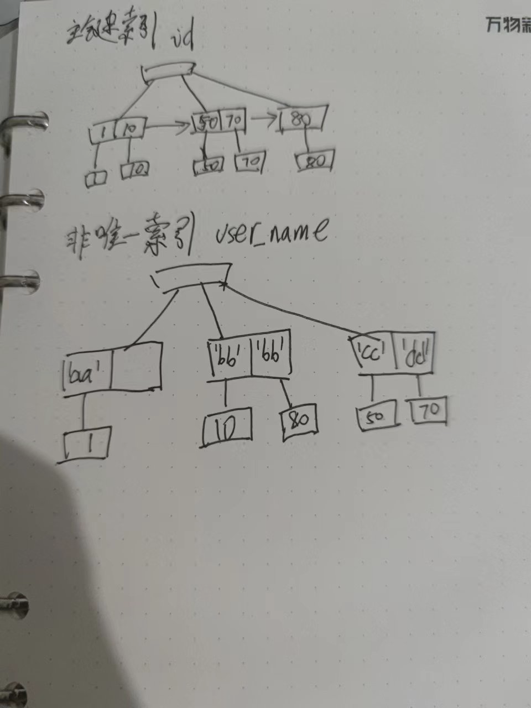

- 行锁触发条件是查询条件命中索引，MySQL默认使用临键锁
  需要说明的是上下文提到的”查询条件命中索引“，并不意味着有符合条件的记录。
- 记录锁(Record Lock)
  记录锁是锁在索引记录上的锁。
  锁定范围:单个记录
- 间隙锁
  间隙锁是锁在索引记录间隙上的锁，或者锁在第一个索引记录之前的间隙，最后一个索引记录之后的间隙。
  锁定范围:锁住一个范围（索引之间的空隙），但不包括记录本身，左开右开区间
  间隙区间:(negative infinity,第一个索引记录),(第一个索引记录，第二个索引记录)。。。。(最后一个索引记录，positive infinity)
  
  作用:禁止对这个区间进行插入操作。
  注意：也阻止对这个区间的记录进行更新操作，但是不阻塞对不存在的记录进行无效更新(不会因锁阻塞)。
  
  举例:
  SELECT c1 FROM t WHERE c1 BETWEEN 10 and 20 FOR UPDATE; 会锁住区间(10,20),会阻止c1=15的插入,无论列是否存在这个值
  
  
  为什么引入间隙锁？
  性能和并发之间的平衡
  阻止其他事务插入数据到这个间隙当中
  
  间隙锁适用的事务隔离级别:可重复读(已提交读不适用)
- 临键锁
  临键锁是记录锁和间隙锁的组合
  临键锁的锁定区间是左开右闭区间。
  锁定范围:锁住一个范围，同时锁定记录本身.
  
  临键锁的降级
  InnoDB基于临键锁进行加锁，某些特殊场景会降级成间隙锁,记录锁
  临键锁锁住记录和两遍的间隙，区间是左开右闭
  间隙锁只锁住两遍的间隙，不锁记录，区间是左开右开
  记录锁只锁住记录，不锁两遍间隙
- innodb加锁分析总结
  索引节点值分布+锁信息共同确定锁定区间(包含记录锁和间隙锁)
  
  主要需要考虑如下因素
  a.  字段类型：唯一索引字段，非唯一索引字段，普通字段
  b. 查询类型: 范围查询还是等值查询
  c. 是否存在满足条件的记录，唯一索引字段有些特殊场景下需要考虑该情况
  
  
  表信息(id为主键，user_name为非唯一索引,money为普通字段)和记录信息
  表和数据详见 [[InnoDB锁实验]] 
   
  
  
  1. 普通字段条件查询
  加表锁,相当于锁住所有记录锁和最大范围的间隙锁。
  2. 非唯一索引字段条件查询
  2.1 范围查询
  临键锁确定锁定范围左开右闭区间
  a. 首先分别找到左右两边第一个不满足条件的索引节点作为区间边界，如果没有找到则用正负无穷大替换
  区间内满足条件的的索引节点会加记录锁
  b. 确定左右节点包含关系:左开右闭
  例如
  ```
  
  ```
  2.2 等值查询
  临键锁降级成间隙锁，锁定范围左开右开区间
  a. 首先分别找到左右两边第一个不满足条件的索引节点作为区间边界，如果没有找到则用正负无穷大替换
  区间内满足条件的的索引节点会加记录锁
  b. 确定左右节点包含关系:左开右开
  
  
  3. 唯一索引字段条件查询
  对唯一索引字段条件查询做了充分的优化
  3.1 范围查询
  特殊规则:不像正常临键锁一样,
  描述:间隙范围能不扩展就不扩展，只做必要的扩展，边界节点要么是第一个不满足条件的节点,要么是第一个满足条件的节点(此时不会像临键锁一样继续扩大区间)
  例如
  ```
  id>11 and id<55 》》》锁定区间：(10,70)
  id>11 and id<=55 》》》锁定区间：(10,70)
  id>11 and id<=100 》》》锁定区间：(10,正无穷大)
  
  id>11 and id<45》》》锁定区间：(10,50)
  # 特别之处1:此种场景右边是开区间
  id>11 and id<70 》》》锁定区间：(10,70)
  # 特别之处2是这儿，此种场景并没有锁下一个区间间隙,假设id是非唯一索引,则 id>11 and id<=70 》》》锁定区间:(10,80]
  id>11 and id<=70 》》》锁定区间：(10,70]
  ```
  
  3.2 等值查询
  a. 存在满足条件的记录，临键锁降级成记录锁，不再锁两边的间隙了。
  例如 id =50》》》锁定区间:[50]
  b. 不存在满足条件的记录, 临键锁降级成间隙锁，锁间隙
  例如 id=60 》》》 锁定区间:(50,70)
- [[InnoDB锁实验]]
- 资料
  [官网文档mysql8锁](https://dev.mysql.com/doc/refman/8.0/en/innodb-locking.html#innodb-next-key-locks)