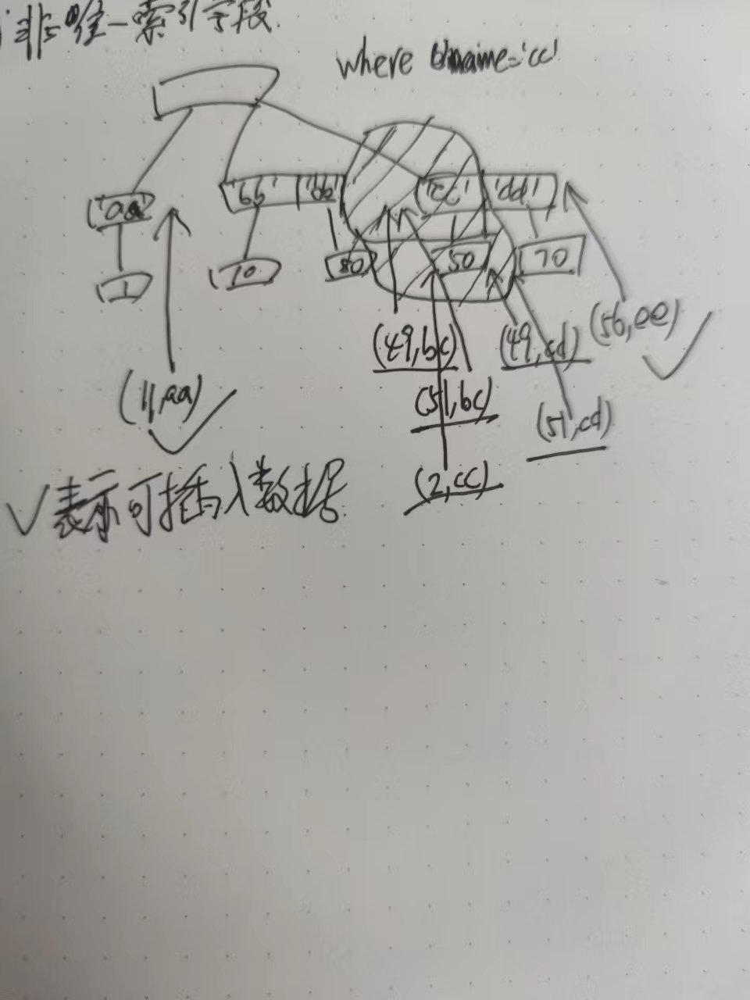
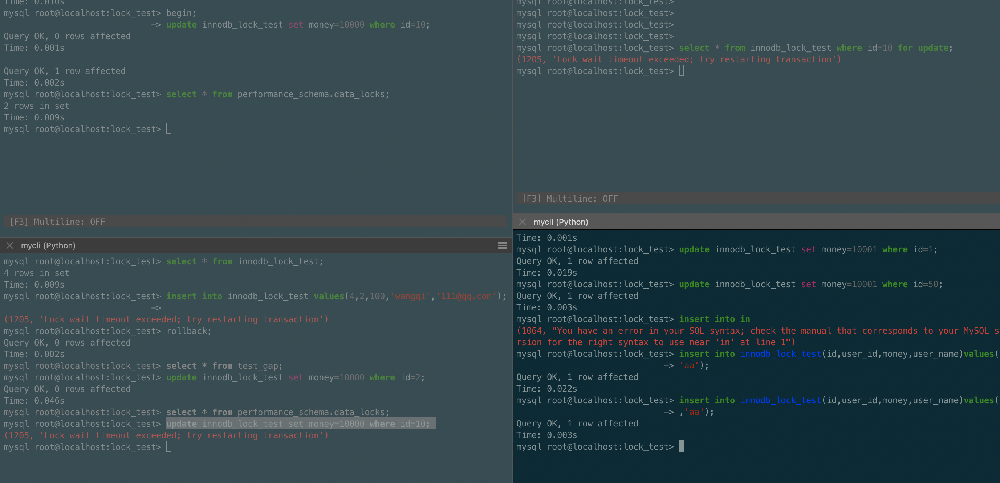
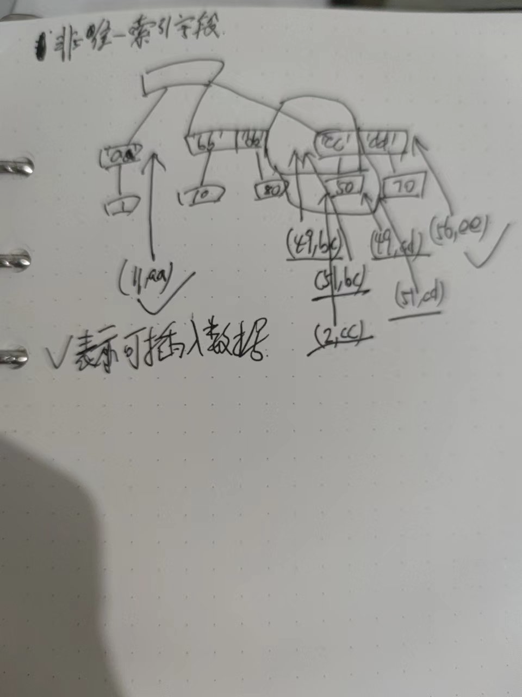
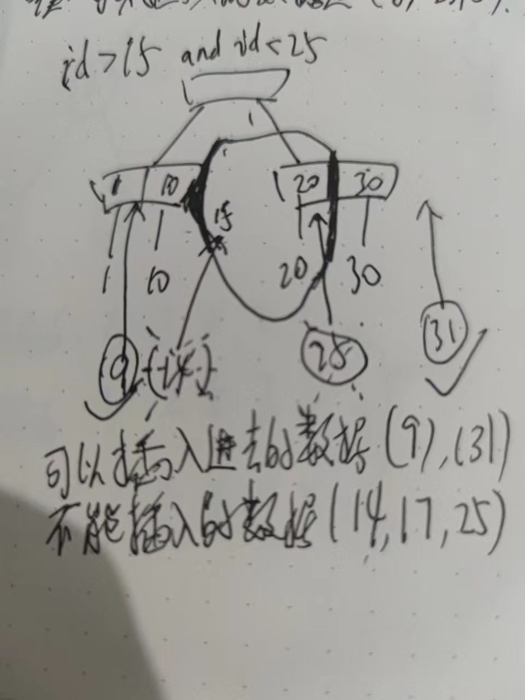

- InnoDB锁实验
  实验前置准备
- 环境
  mysql8，mac,
  使用mycli客户端实验
- 建库建表语句，初始化数据
  ```
  # 建库
  CREATE DATABASE IF NOT EXISTS lock_test DEFAULT CHARSET utf8mb4;
  use lock_test;
  drop table if exists innodb_lock_test;
  # 建表
  CREATE TABLE IF NOT EXISTS `innodb_lock_test`(
  	`id` int(11) NOT NULL AUTO_INCREMENT, 
  	`user_id` int(11) NOT NULL, 
      `money` int(11) DEFAULT NULL, 
  	`user_name` varchar(30) NOT NULL, 
  	PRIMARY KEY(`id`), 
  	KEY `idx_uid`(`user_id`),
      KEY `idx_user_name`(`user_name`)
  )ENGINE=InnoDB AUTO_INCREMENT=97 DEFAULT CHARSET=utf8mb4;
  # 插入数据
  insert into innodb_lock_test(id,user_id,money,user_name)values
  (1,5,100,'aa'),(10,15,200,'bb'),
  (50,55,200,'cc'),(70,70,500,'dd'),(80,85,150,'bb');
  ```
- 背景知识
  0. mysq B+tree索引存储结构
   
  1. 查看mysql session事务隔离级别命令
   ((62a704aa-f1a1-478d-a685-adc86f7be7d9))
  ```
  SELECT @@transaction_isolation;
  +-------------------------+
  | @@transaction_isolation |
  +-------------------------+
  | REPEATABLE-READ         |
  +-------------------------+
  ```
  2. 查询mysql事务对应锁信息命令
  ((62a743b4-a95b-4cde-ad09-cbe414c22306)) 
  ```
  select * from performance_schema.data_locks;
  ```
  3.select语句添加悲观锁
  select * from innodb_lock_test where id=1 for update;
  4.关闭自动提交事务
  ```
  #开始手动事务
  begin;
  sql语句;
  
  ```
  5.回滚事务和提交事务
  ```
  # 提交事务
  commit;
  # 回滚事务
  rollback;
  ```
  
  select * from innodb_lock_test where id=1 for update;
  update innodb_lock_test set money=10000 where id=1;
  insert into innodb_lock_test(id,user_id,money,user_name)values(1,5,100,'aa');
- 实验步骤说明
  0. 前置条件:所有实验均处在可重复读事务隔离级别下
  ```
  SELECT @@transaction_isolation;
  +-------------------------+
  | @@transaction_isolation |
  +-------------------------+
  | REPEATABLE-READ         |
  +-------------------------+
  ```
  1. 第一个session窗口关闭自动提交事务，
  begin;
  更新语句;
  2. 查看事务锁信息
  3. 分析sql语句锁
  10. 第二个session窗口进行实验
  sql语句;
  11. 实验结果
  12. 实验结果分析
  a结果一 
  (1205, 'Lock wait timeout exceeded; try restarting transaction') 
  表示锁资源已经被第一个session锁住，等待锁资源超时
  b.结果二
  ```
   update innodb_lock_test set money=500 where id=1;
  6 rows in set
  Time: 0.009s
  ```
  锁资源没有被第一个session锁住,sql语句可以正常执行
  13. 实验结论
- 唯一索引字段实验
  单个等值匹配不存在满足条件数据
  1. 第一个session窗口关闭自动提交事务，执行如下sql语句
  ```
  begin;
  update innodb_lock_test set money=10001 where id=30;
  ```
  2. 查看事务锁信息
  ```
  +--------+-----------------------------------------+-----------------------+-----------+----------+---------------+------------------+----------------+-------------------+------------+-----------------------+-----------+-----------+-------------+-----------+
  | ENGINE | ENGINE_LOCK_ID                          | ENGINE_TRANSACTION_ID | THREAD_ID | EVENT_ID | OBJECT_SCHEMA | OBJECT_NAME      | PARTITION_NAME | SUBPARTITION_NAME | INDEX_NAME | OBJECT_INSTANCE_BEGIN | LOCK_TYPE | LOCK_MODE | LOCK_STATUS | LOCK_DATA |
  +--------+-----------------------------------------+-----------------------+-----------+----------+---------------+------------------+----------------+-------------------+------------+-----------------------+-----------+-----------+-------------+-----------+
  | INNODB | 140233293675848:1626:140233557539392    | 66865                 | 79        | 127      | lock_test     | innodb_lock_test | <null>         | <null>            | <null>     | 140233557539392       | TABLE     | IX        | GRANTED     | <null>    |
  | INNODB | 140233293675848:369:4:4:140233568248352 | 66865                 | 79        | 127      | lock_test     | innodb_lock_test | <null>         | <null>            | PRIMARY    | 140233568248352       | RECORD    | X,GAP     | GRANTED     | 50        |
  +--------+-----------------------------------------+-----------------------+-----------+----------+---------------+------------------+----------------+-------------------+------------+-----------------------+-----------+-----------+-------------+-----------+
  ```
  3. 分析sql语句锁
  a. 表锁意向排他锁
  b. 行锁,间隙排他锁，间隙锁定范围(10,50)
  10. 第二个session窗口进行实验，执行如下sql语句
  ```
  #失败区
  insert into innodb_lock_test(id,user_id,money,user_name)values(11,5,100,'aa');
  insert into innodb_lock_test(id,user_id,money,user_name)values(45,5,100,'aa');
  #成功区
  update innodb_lock_test set money=10001 where id=10;
  update innodb_lock_test set money=10001 where id=50;
  insert into innodb_lock_test(id,user_id,money,user_name)values(2,5,100,'ee');
  insert into innodb_lock_test(id,user_id,money,user_name)values(56,5,100,'ee');
  ```
  11. 实验结果截图
  12. 实验结果分析
  13. 实验结论
  TODO:cj to be done 
  
  单个等值匹配
  1. 第一个session窗口关闭自动提交事务，执行如下sql语句
  ```
  begin;
  update innodb_lock_test set money=10000 where id=10;
  ```
  
  2.查看锁信息
  ```
  +--------+-----------------------------------------+-----------------------+-----------+----------+---------------+------------------+----------------+-------------------+------------+-----------------------+-----------+---------------+-------------+-----------+
  | ENGINE | ENGINE_LOCK_ID                          | ENGINE_TRANSACTION_ID | THREAD_ID | EVENT_ID | OBJECT_SCHEMA | OBJECT_NAME      | PARTITION_NAME | SUBPARTITION_NAME | INDEX_NAME | OBJECT_INSTANCE_BEGIN | LOCK_TYPE | LOCK_MODE     | LOCK_STATUS | LOCK_DATA |
  +--------+-----------------------------------------+-----------------------+-----------+----------+---------------+------------------+----------------+-------------------+------------+-----------------------+-----------+---------------+-------------+-----------+
  | INNODB | 140233293675848:1617:140233557539392    | 66502                 | 79        | 81       | lock_test     | innodb_lock_test | <null>         | <null>            | <null>     | 140233557539392       | TABLE     | IX            | GRANTED     | <null>    |
  | INNODB | 140233293675848:360:4:3:140233568248352 | 66502                 | 79        | 81       | lock_test     | innodb_lock_test | <null>         | <null>            | PRIMARY    | 140233568248352       | RECORD    | X,REC_NOT_GAP | GRANTED     | 10        |
  +--------+-----------------------------------------+-----------------------+-----------+----------+---------------+------------------+----------------+-------------------+------------+-----------------------+-----------+---------------+-------------+-----------+
  ```
  3.分析sql语句锁
  a.表锁IX意向排他锁
  b.行锁记录锁，排他非间隙锁,id=10
  10.第二个session窗口进行实验，执行如下sql语句
  ```
  # 失败区
  select * from innodb_lock_test where id=10 for update;
  update innodb_lock_test set money=10000 where id=10;
  
  # 成功区
  update innodb_lock_test set money=10001 where id=1;
  update innodb_lock_test set money=10001 where id=50;
  
  ```
  11. 实验结果
   
  
  12. 实验结果分析
  
  13. 实验结论
  
  
  多个等值匹配
  1. 第一个session窗口关闭自动提交事务，执行如下sql语句
  ```
  begin;
  update innodb_lock_test set money=10000 where id in(10,70);
  ```
  2. 查看事务锁信息
  ```
  +--------+-----------------------------------------+-----------------------+-----------+----------+---------------+------------------+----------------+-------------------+------------+-----------------------+-----------+---------------+-------------+-----------+
  | ENGINE | ENGINE_LOCK_ID                          | ENGINE_TRANSACTION_ID | THREAD_ID | EVENT_ID | OBJECT_SCHEMA | OBJECT_NAME      | PARTITION_NAME | SUBPARTITION_NAME | INDEX_NAME | OBJECT_INSTANCE_BEGIN | LOCK_TYPE | LOCK_MODE     | LOCK_STATUS | LOCK_DATA |
  +--------+-----------------------------------------+-----------------------+-----------+----------+---------------+------------------+----------------+-------------------+------------+-----------------------+-----------+---------------+-------------+-----------+
  | INNODB | 140233293675848:1618:140233557539392    | 66544                 | 79        | 88       | lock_test     | innodb_lock_test | <null>         | <null>            | <null>     | 140233557539392       | TABLE     | IX            | GRANTED     | <null>    |
  | INNODB | 140233293675848:361:4:3:140233568248352 | 66544                 | 79        | 88       | lock_test     | innodb_lock_test | <null>         | <null>            | PRIMARY    | 140233568248352       | RECORD    | X,REC_NOT_GAP | GRANTED     | 10        |
  | INNODB | 140233293675848:361:4:5:140233568248352 | 66544                 | 79        | 88       | lock_test     | innodb_lock_test | <null>         | <null>            | PRIMARY    | 140233568248352       | RECORD    | X,REC_NOT_GAP | GRANTED     | 70        |
  +--------+-----------------------------------------+-----------------------+-----------+----------+---------------+------------------+----------------+-------------------+------------+-----------------------+-----------+---------------+-------------+-----------+
  ```
  3. 分析sql语句锁
  
  
  10. 第二个session窗口进行实验，执行如下sql语句
  ```
  # 失败区
  update innodb_lock_test set money=10000 where id=10;
  update innodb_lock_test set money=10000 where id=70;
  
  # 成功区
  update innodb_lock_test set money=10001 where id=1;
  update innodb_lock_test set money=10001 where id=50;
  insert into innodb_lock_test(id,user_id,money,user_name)values(2,5,100,'aa');
  insert into innodb_lock_test(id,user_id,money,user_name)values(11,5,100,'aa');
  insert into innodb_lock_test(id,user_id,money,user_name)values(71,5,100,'aa');
  
  ```
  11. 实验结果
  截图
  12. 实验结果分析
  13. 实验结论
  
  范围匹配不存在满足条件数据
  1. 第一个session窗口关闭自动提交事务，执行如下sql语句
  ```
  begin;
  update innodb_lock_test set money=10000 where id>10 and id<50;
  ```
  2. 查看事务锁信息
  ```
  +--------+-----------------------------------------+-----------------------+-----------+----------+---------------+------------------+----------------+-------------------+------------+-----------------------+-----------+-----------+-------------+-----------+
  | ENGINE | ENGINE_LOCK_ID                          | ENGINE_TRANSACTION_ID | THREAD_ID | EVENT_ID | OBJECT_SCHEMA | OBJECT_NAME      | PARTITION_NAME | SUBPARTITION_NAME | INDEX_NAME | OBJECT_INSTANCE_BEGIN | LOCK_TYPE | LOCK_MODE | LOCK_STATUS | LOCK_DATA |
  +--------+-----------------------------------------+-----------------------+-----------+----------+---------------+------------------+----------------+-------------------+------------+-----------------------+-----------+-----------+-------------+-----------+
  | INNODB | 140233293675848:1619:140233557539392    | 66582                 | 79        | 95       | lock_test     | innodb_lock_test | <null>         | <null>            | <null>     | 140233557539392       | TABLE     | IX        | GRANTED     | <null>    |
  | INNODB | 140233293675848:362:4:4:140233568248352 | 66582                 | 79        | 95       | lock_test     | innodb_lock_test | <null>         | <null>            | PRIMARY    | 140233568248352       | RECORD    | X,GAP     | GRANTED     | 50        |
  +--------+-----------------------------------------+-----------------------+-----------+----------+---------------+------------------+----------------+-------------------+------------+-----------------------+-----------+-----------+-------------+-----------+
  ```
  3. 分析sql语句锁
  锁定区间范围: ((10) --- (50))
  10. 第二个session窗口进行实验，执行如下sql语句
  ```
  # 失败区
  insert into innodb_lock_test(id,user_id,money,user_name)values(11,5,100,'aa');
  
  
  # 成功区
  update innodb_lock_test set money=10001 where id=1;
  update innodb_lock_test set money=10000 where id=10;
  update innodb_lock_test set money=10001 where id=50;
  insert into innodb_lock_test(id,user_id,money,user_name)values(2,5,100,'aa');
  insert into innodb_lock_test(id,user_id,money,user_name)values(71,5,100,'aa');
  ```
  11. 实验结果
  截图
  12. 实验结果分析
  13. 实验结论
  
  范围匹配存在满足条件数据
  1. 第一个session窗口关闭自动提交事务，执行如下sql语句
  ```
  begin;
  update innodb_lock_test set money=10000 where id>5 and id<55;
  ```
  2. 查看事务锁信息
  ```
  +--------+-----------------------------------------+-----------------------+-----------+----------+---------------+------------------+----------------+-------------------+------------+-----------------------+-----------+-----------+-------------+-----------+
  | ENGINE | ENGINE_LOCK_ID                          | ENGINE_TRANSACTION_ID | THREAD_ID | EVENT_ID | OBJECT_SCHEMA | OBJECT_NAME      | PARTITION_NAME | SUBPARTITION_NAME | INDEX_NAME | OBJECT_INSTANCE_BEGIN | LOCK_TYPE | LOCK_MODE | LOCK_STATUS | LOCK_DATA |
  +--------+-----------------------------------------+-----------------------+-----------+----------+---------------+------------------+----------------+-------------------+------------+-----------------------+-----------+-----------+-------------+-----------+
  | INNODB | 140233293675848:1621:140233557539392    | 66653                 | 79        | 100      | lock_test     | innodb_lock_test | <null>         | <null>            | <null>     | 140233557539392       | TABLE     | IX        | GRANTED     | <null>    |
  | INNODB | 140233293675848:364:4:3:140233568248352 | 66653                 | 79        | 100      | lock_test     | innodb_lock_test | <null>         | <null>            | PRIMARY    | 140233568248352       | RECORD    | X         | GRANTED     | 10        |
  | INNODB | 140233293675848:364:4:4:140233568248352 | 66653                 | 79        | 100      | lock_test     | innodb_lock_test | <null>         | <null>            | PRIMARY    | 140233568248352       | RECORD    | X         | GRANTED     | 50        |
  | INNODB | 140233293675848:364:4:5:140233568248696 | 66653                 | 79        | 100      | lock_test     | innodb_lock_test | <null>         | <null>            | PRIMARY    | 140233568248696       | RECORD    | X,GAP     | GRANTED     | 70        |
  +--------+-----------------------------------------+-----------------------+-----------+----------+---------------+------------------+----------------+-------------------+------------+-----------------------+-----------+-----------+-------------+-----------+
  ```
  3. 分析sql语句锁
  锁定区间范围: ((1) --- (70))
  10. 第二个session窗口进行实验，执行如下sql语句
  ```
  # 失败区
  insert into innodb_lock_test(id,user_id,money,user_name)values(11,5,100,'aa');
  insert into innodb_lock_test(id,user_id,money,user_name)values(52,5,100,'aa');
  update innodb_lock_test set money=10001 where id=10;
  update innodb_lock_test set money=10001 where id=50;
  
  # 容易出错区
  insert into innodb_lock_test(id,user_id,money,user_name)values(2,5,100,'aa');
  insert into innodb_lock_test(id,user_id,money,user_name)values(65,5,100,'aa');
  
  # 成功区
  update innodb_lock_test set money=10001 where id=1;
  update innodb_lock_test set money=10001 where id=70;
  
  insert into innodb_lock_test(id,user_id,money,user_name)values(71,5,100,'aa');
  insert into innodb_lock_test(id,user_id,money,user_name)values(81,5,100,'aa');
  ```
  11. 实验结果截图
  12. 实验结果分析
  13. 实验结论
  ((62a9e108-9c7a-4e6f-8655-7310b0648d23)) 
  
  范围匹配存在满足条件数据包含左节点
  1. 第一个session窗口关闭自动提交事务，执行如下sql语句
  ```
  begin;
  update innodb_lock_test set money=10000 where id>=10 and id<55;
  ```
  2. 查看事务锁信息
  ```
  +--------+-----------------------------------------+-----------------------+-----------+----------+---------------+------------------+----------------+-------------------+------------+-----------------------+-----------+---------------+-------------+-----------+
  | ENGINE | ENGINE_LOCK_ID                          | ENGINE_TRANSACTION_ID | THREAD_ID | EVENT_ID | OBJECT_SCHEMA | OBJECT_NAME      | PARTITION_NAME | SUBPARTITION_NAME | INDEX_NAME | OBJECT_INSTANCE_BEGIN | LOCK_TYPE | LOCK_MODE     | LOCK_STATUS | LOCK_DATA |
  +--------+-----------------------------------------+-----------------------+-----------+----------+---------------+------------------+----------------+-------------------+------------+-----------------------+-----------+---------------+-------------+-----------+
  | INNODB | 140233293675848:1622:140233557539392    | 66692                 | 79        | 105      | lock_test     | innodb_lock_test | <null>         | <null>            | <null>     | 140233557539392       | TABLE     | IX            | GRANTED     | <null>    |
  | INNODB | 140233293675848:365:4:3:140233568248352 | 66692                 | 79        | 105      | lock_test     | innodb_lock_test | <null>         | <null>            | PRIMARY    | 140233568248352       | RECORD    | X,REC_NOT_GAP | GRANTED     | 10        |
  | INNODB | 140233293675848:365:4:4:140233568248696 | 66692                 | 79        | 105      | lock_test     | innodb_lock_test | <null>         | <null>            | PRIMARY    | 140233568248696       | RECORD    | X             | GRANTED     | 50        |
  | INNODB | 140233293675848:365:4:5:140233568249040 | 66692                 | 79        | 105      | lock_test     | innodb_lock_test | <null>         | <null>            | PRIMARY    | 140233568249040       | RECORD    | X,GAP         | GRANTED     | 70        |
  +--------+-----------------------------------------+-----------------------+-----------+----------+---------------+------------------+----------------+-------------------+------------+-----------------------+-----------+---------------+-------------+-----------+
  ```
  3. 分析sql语句锁
  锁定区间范围: [(10) --- (70))
  10. 第二个session窗口进行实验，执行如下sql语句
  ```
  # 失败区
  insert into innodb_lock_test(id,user_id,money,user_name)values(11,5,100,'aa');
  insert into innodb_lock_test(id,user_id,money,user_name)values(52,5,100,'aa');
  update innodb_lock_test set money=10001 where id=10;
  update innodb_lock_test set money=10001 where id=50;
  
  # 容易出错区
  insert into innodb_lock_test(id,user_id,money,user_name)values(65,5,100,'aa');
  
  # 成功区
  update innodb_lock_test set money=10001 where id=1;
  update innodb_lock_test set money=10001 where id=70;
  
  insert into innodb_lock_test(id,user_id,money,user_name)values(2,5,100,'aa');
  insert into innodb_lock_test(id,user_id,money,user_name)values(71,5,100,'aa');
  insert into innodb_lock_test(id,user_id,money,user_name)values(81,5,100,'aa');
  ```
  11. 实验结果截图
  12. 实验结果分析
  13. 实验结论
  
  范围匹配存在满足条件数据包含右节点
  1. 第一个session窗口关闭自动提交事务，执行如下sql语句
  ```
  begin;
  update innodb_lock_test set money=10000 where id>15 and id<=70;
  ```
  2. 查看事务锁信息
  ```
  +--------+-----------------------------------------+-----------------------+-----------+----------+---------------+------------------+----------------+-------------------+------------+-----------------------+-----------+-----------+-------------+-----------+
  | ENGINE | ENGINE_LOCK_ID                          | ENGINE_TRANSACTION_ID | THREAD_ID | EVENT_ID | OBJECT_SCHEMA | OBJECT_NAME      | PARTITION_NAME | SUBPARTITION_NAME | INDEX_NAME | OBJECT_INSTANCE_BEGIN | LOCK_TYPE | LOCK_MODE | LOCK_STATUS | LOCK_DATA |
  +--------+-----------------------------------------+-----------------------+-----------+----------+---------------+------------------+----------------+-------------------+------------+-----------------------+-----------+-----------+-------------+-----------+
  | INNODB | 140233293675848:1623:140233557539392    | 66739                 | 79        | 110      | lock_test     | innodb_lock_test | <null>         | <null>            | <null>     | 140233557539392       | TABLE     | IX        | GRANTED     | <null>    |
  | INNODB | 140233293675848:366:4:4:140233568248352 | 66739                 | 79        | 110      | lock_test     | innodb_lock_test | <null>         | <null>            | PRIMARY    | 140233568248352       | RECORD    | X         | GRANTED     | 50        |
  | INNODB | 140233293675848:366:4:5:140233568248352 | 66739                 | 79        | 110      | lock_test     | innodb_lock_test | <null>         | <null>            | PRIMARY    | 140233568248352       | RECORD    | X         | GRANTED     | 70        |
  +--------+-----------------------------------------+-----------------------+-----------+----------+---------------+------------------+----------------+-------------------+------------+-----------------------+-----------+-----------+-------------+-----------+
  ```
  3. 分析sql语句锁
  锁定区间范围: ((10) --- (70)]
  TODO疑问：这个锁信息就有点奇怪,实际执行结果有间隙锁，但是锁信息里面看不出来
  10. 第二个session窗口进行实验，执行如下sql语句
  ```
  # 失败区
  insert into innodb_lock_test(id,user_id,money,user_name)values(11,5,100,'aa');
  insert into innodb_lock_test(id,user_id,money,user_name)values(65,5,100,'aa');
  
  
  update innodb_lock_test set money=10001 where id=50;
  update innodb_lock_test set money=10001 where id=70;
  
  # 成功区
  
  update innodb_lock_test set money=10001 where id=1;
  update innodb_lock_test set money=10001 where id=10;
  
  
  insert into innodb_lock_test(id,user_id,money,user_name)values(2,5,100,'aa');
  insert into innodb_lock_test(id,user_id,money,user_name)values(71,5,100,'aa');
  ```
  11. 实验结果截图
  12. 实验结果分析
  13. 实验结论
  
  范围匹配存在满足条件数据右区间无限大
  1. 第一个session窗口关闭自动提交事务，执行如下sql语句
  ```
  begin;
  update innodb_lock_test set money=10000 where id>15 and id<=100;
  
  ```
  2. 查看事务锁信息
  ```
  +--------+-----------------------------------------+-----------------------+-----------+----------+---------------+------------------+----------------+-------------------+------------+-----------------------+-----------+-----------+-------------+------------------------+
  | ENGINE | ENGINE_LOCK_ID                          | ENGINE_TRANSACTION_ID | THREAD_ID | EVENT_ID | OBJECT_SCHEMA | OBJECT_NAME      | PARTITION_NAME | SUBPARTITION_NAME | INDEX_NAME | OBJECT_INSTANCE_BEGIN | LOCK_TYPE | LOCK_MODE | LOCK_STATUS | LOCK_DATA              |
  +--------+-----------------------------------------+-----------------------+-----------+----------+---------------+------------------+----------------+-------------------+------------+-----------------------+-----------+-----------+-------------+------------------------+
  | INNODB | 140233293675848:1624:140233557539392    | 66780                 | 79        | 115      | lock_test     | innodb_lock_test | <null>         | <null>            | <null>     | 140233557539392       | TABLE     | IX        | GRANTED     | <null>                 |
  | INNODB | 140233293675848:367:4:1:140233568248352 | 66780                 | 79        | 115      | lock_test     | innodb_lock_test | <null>         | <null>            | PRIMARY    | 140233568248352       | RECORD    | X         | GRANTED     | supremum pseudo-record |
  | INNODB | 140233293675848:367:4:4:140233568248352 | 66780                 | 79        | 115      | lock_test     | innodb_lock_test | <null>         | <null>            | PRIMARY    | 140233568248352       | RECORD    | X         | GRANTED     | 50                     |
  | INNODB | 140233293675848:367:4:5:140233568248352 | 66780                 | 79        | 115      | lock_test     | innodb_lock_test | <null>         | <null>            | PRIMARY    | 140233568248352       | RECORD    | X         | GRANTED     | 70                     |
  | INNODB | 140233293675848:367:4:6:140233568248352 | 66780                 | 79        | 115      | lock_test     | innodb_lock_test | <null>         | <null>            | PRIMARY    | 140233568248352       | RECORD    | X         | GRANTED     | 80                     |
  +--------+-----------------------------------------+-----------------------+-----------+----------+---------------+------------------+----------------+-------------------+------------+-----------------------+-----------+-----------+-------------+------------------------+
  ```
  3. 分析sql语句锁
  锁定区间范围: ((10) --- (正无穷大))
  10. 第二个session窗口进行实验，执行如下sql语句
  ```
  # 失败区
  insert into innodb_lock_test(id,user_id,money,user_name)values(11,5,100,'aa');
  insert into innodb_lock_test(id,user_id,money,user_name)values(95,5,100,'aa');
  insert into innodb_lock_test(id,user_id,money,user_name)values(105,5,100,'aa');
  
  
  update innodb_lock_test set money=10001 where id=50;
  
  
  # 成功区
  
  update innodb_lock_test set money=10001 where id=1;
  update innodb_lock_test set money=10001 where id=10;
  
  
  insert into innodb_lock_test(id,user_id,money,user_name)values(2,5,100,'aa');
  ```
  11. 实验结果截图
  12. 实验结果分析
  13. 实验结论
-
- 非唯一索引字段实验
  单个等值匹配不存在满足条件数据
  1. 第一个session窗口关闭自动提交事务，执行如下sql语句
  ```
  begin;
  update innodb_lock_test set money=10001 where user_name='bc';
  ```
  2. 查看事务锁信息
  ```
  +--------+-----------------------------------------+-----------------------+-----------+----------+---------------+------------------+----------------+-------------------+---------------+-----------------------+-----------+-----------+-------------+-----------+
  | ENGINE | ENGINE_LOCK_ID                          | ENGINE_TRANSACTION_ID | THREAD_ID | EVENT_ID | OBJECT_SCHEMA | OBJECT_NAME      | PARTITION_NAME | SUBPARTITION_NAME | INDEX_NAME    | OBJECT_INSTANCE_BEGIN | LOCK_TYPE | LOCK_MODE | LOCK_STATUS | LOCK_DATA |
  +--------+-----------------------------------------+-----------------------+-----------+----------+---------------+------------------+----------------+-------------------+---------------+-----------------------+-----------+-----------+-------------+-----------+
  | INNODB | 140233293675848:1627:140233557539392    | 66907                 | 79        | 133      | lock_test     | innodb_lock_test | <null>         | <null>            | <null>        | 140233557539392       | TABLE     | IX        | GRANTED     | <null>    |
  | INNODB | 140233293675848:370:6:4:140233568248352 | 66907                 | 79        | 133      | lock_test     | innodb_lock_test | <null>         | <null>            | idx_user_name | 140233568248352       | RECORD    | X,GAP     | GRANTED     | 'cc', 50  |
  +--------+-----------------------------------------+-----------------------+-----------+----------+---------------+------------------+----------------+-------------------+---------------+-----------------------+-----------+-----------+-------------+-----------+
  ```
  3. 分析sql语句锁
  等值查询，此时临键锁退化成间隙锁,左开右闭区间变成左开右开区间
  锁定区间范围: ((bb,80) --- (cc,50))
  10. 第二个session窗口进行实验，执行如下sql语句
  ```
  # 失败区
  insert into innodb_lock_test(id,user_id,money,user_name)values(48,5,100,'cc');
  insert into innodb_lock_test(id,user_id,money,user_name)values(85,5,100,'bb');
  insert into innodb_lock_test(id,user_id,money,user_name)values(47,5,100,'bc');
  insert into innodb_lock_test(id,user_id,money,user_name)values(51,5,100,'bc');
  insert into innodb_lock_test(id,user_id,money,user_name)values(55,5,100,'bcd');
  
  
  # 成功区
  # 间隙锁之间相互兼容
  update innodb_lock_test set money=10001 where user_name='bcd';
  
  update innodb_lock_test set money=10001 where id=10;
  update innodb_lock_test set money=10001 where id=50;
  update innodb_lock_test set money=10001 where id=70;
  update innodb_lock_test set money=10001 where user_name='bb';
  update innodb_lock_test set money=10001 where user_name='cc';
  
  
  insert into innodb_lock_test(id,user_id,money,user_name)values(75,5,100,'bb');
  insert into innodb_lock_test(id,user_id,money,user_name)values(49,5,100,'cd');
  ```
  11. 实验结果截图
  12. 实验结果分析
  13. 实验结论
  
  单个等值匹配
  1. 第一个session窗口关闭自动提交事务，执行如下sql语句
  ```
  begin;
  update innodb_lock_test set money=10000 where user_name='cc';
  ```
  2. 查看事务锁信息
  ```
  +--------+-----------------------------------------+-----------------------+-----------+----------+---------------+------------------+----------------+-------------------+---------------+-----------------------+-----------+---------------+-------------+-----------+
  | ENGINE | ENGINE_LOCK_ID                          | ENGINE_TRANSACTION_ID | THREAD_ID | EVENT_ID | OBJECT_SCHEMA | OBJECT_NAME      | PARTITION_NAME | SUBPARTITION_NAME | INDEX_NAME    | OBJECT_INSTANCE_BEGIN | LOCK_TYPE | LOCK_MODE     | LOCK_STATUS | LOCK_DATA |
  +--------+-----------------------------------------+-----------------------+-----------+----------+---------------+------------------+----------------+-------------------+---------------+-----------------------+-----------+---------------+-------------+-----------+
  | INNODB | 140233293675848:1625:140233557539392    | 66816                 | 79        | 121      | lock_test     | innodb_lock_test | <null>         | <null>            | <null>        | 140233557539392       | TABLE     | IX            | GRANTED     | <null>    |
  | INNODB | 140233293675848:368:6:4:140233568248352 | 66816                 | 79        | 121      | lock_test     | innodb_lock_test | <null>         | <null>            | idx_user_name | 140233568248352       | RECORD    | X             | GRANTED     | 'cc', 50  |
  | INNODB | 140233293675848:368:4:4:140233568248696 | 66816                 | 79        | 121      | lock_test     | innodb_lock_test | <null>         | <null>            | PRIMARY       | 140233568248696       | RECORD    | X,REC_NOT_GAP | GRANTED     | 50        |
  | INNODB | 140233293675848:368:6:5:140233568249040 | 66816                 | 79        | 121      | lock_test     | innodb_lock_test | <null>         | <null>            | idx_user_name | 140233568249040       | RECORD    | X,GAP         | GRANTED     | 'dd', 70  |
  +--------+-----------------------------------------+-----------------------+-----------+----------+---------------+------------------+----------------+-------------------+---------------+-----------------------+-----------+---------------+-------------+-----------+
  ```
  3. 分析sql语句锁
  等值查询，此时临键锁退化成间隙锁,左开右闭区间变成左开右开区间
  锁定区间范围: ((bb,80) --- (dd,70))
  10. 第二个session窗口进行实验，执行如下sql语句
  ```
  # 失败区
  update innodb_lock_test set money=10001 where id=50;
  
  update innodb_lock_test set money=10001 where user_name='cc';
  
  
  insert into innodb_lock_test(id,user_id,money,user_name)values(2,5,100,'cc');
  insert into innodb_lock_test(id,user_id,money,user_name)values(49,5,100,'cd');
  insert into innodb_lock_test(id,user_id,money,user_name)values(51,5,100,'cd');
  
  insert into innodb_lock_test(id,user_id,money,user_name)values(49,5,100,'bc');
  insert into innodb_lock_test(id,user_id,money,user_name)values(51,5,100,'bc');
  
  
  # 成功区
  update innodb_lock_test set money=10001 where id=10;
  update innodb_lock_test set money=10001 where id=70;
  update innodb_lock_test set money=10001 where user_name='bb';
  
  insert into innodb_lock_test(id,user_id,money,user_name)values(11,5,100,'aa');
  insert into innodb_lock_test(id,user_id,money,user_name)values(55,5,100,'aa');
  insert into innodb_lock_test(id,user_id,money,user_name)values(56,5,100,'ee');
  ```
  11. 实验结果截图
  12. 实验结果分析
   
  13. 实验结论
  
  多个等值匹配
  1. 第一个session窗口关闭自动提交事务，执行如下sql语句
  ```
  begin;
  update innodb_lock_test set money=10001 where user_name='bb';
  ```
  2. 查看事务锁信息
  ```
  +--------+-----------------------------------------+-----------------------+-----------+----------+---------------+------------------+----------------+-------------------+---------------+-----------------------+-----------+---------------+-------------+-----------+
  | ENGINE | ENGINE_LOCK_ID                          | ENGINE_TRANSACTION_ID | THREAD_ID | EVENT_ID | OBJECT_SCHEMA | OBJECT_NAME      | PARTITION_NAME | SUBPARTITION_NAME | INDEX_NAME    | OBJECT_INSTANCE_BEGIN | LOCK_TYPE | LOCK_MODE     | LOCK_STATUS | LOCK_DATA |
  +--------+-----------------------------------------+-----------------------+-----------+----------+---------------+------------------+----------------+-------------------+---------------+-----------------------+-----------+---------------+-------------+-----------+
  | INNODB | 140233293675848:1628:140233557539392    | 66958                 | 79        | 138      | lock_test     | innodb_lock_test | <null>         | <null>            | <null>        | 140233557539392       | TABLE     | IX            | GRANTED     | <null>    |
  | INNODB | 140233293675848:371:6:3:140233568248352 | 66958                 | 79        | 138      | lock_test     | innodb_lock_test | <null>         | <null>            | idx_user_name | 140233568248352       | RECORD    | X             | GRANTED     | 'bb', 10  |
  | INNODB | 140233293675848:371:6:6:140233568248352 | 66958                 | 79        | 138      | lock_test     | innodb_lock_test | <null>         | <null>            | idx_user_name | 140233568248352       | RECORD    | X             | GRANTED     | 'bb', 80  |
  | INNODB | 140233293675848:371:4:3:140233568248696 | 66958                 | 79        | 138      | lock_test     | innodb_lock_test | <null>         | <null>            | PRIMARY       | 140233568248696       | RECORD    | X,REC_NOT_GAP | GRANTED     | 10        |
  | INNODB | 140233293675848:371:4:6:140233568248696 | 66958                 | 79        | 138      | lock_test     | innodb_lock_test | <null>         | <null>            | PRIMARY       | 140233568248696       | RECORD    | X,REC_NOT_GAP | GRANTED     | 80        |
  | INNODB | 140233293675848:371:6:4:140233568249040 | 66958                 | 79        | 138      | lock_test     | innodb_lock_test | <null>         | <null>            | idx_user_name | 140233568249040       | RECORD    | X,GAP         | GRANTED     | 'cc', 50  |
  +--------+-----------------------------------------+-----------------------+-----------+----------+---------------+------------------+----------------+-------------------+---------------+-----------------------+-----------+---------------+-------------+-----------+
  ```
  3. 分析sql语句锁
  等值查询，此时临键锁退化成间隙锁,左开右闭区间变成左开右开区间
  锁定区间范围: ((aa,1) --- (cc,50))
  10. 第二个session窗口进行实验，执行如下sql语句
  ```
  # 失败区
  update innodb_lock_test set money=10001 where id=10;
  update innodb_lock_test set money=10001 where id=80;
  
  update innodb_lock_test set money=10001 where user_name='bb';
  
  
  insert into innodb_lock_test(id,user_id,money,user_name)values(5,5,100,'aa');
  insert into innodb_lock_test(id,user_id,money,user_name)values(12,5,100,'ab');
  insert into innodb_lock_test(id,user_id,money,user_name)values(47,5,100,'bb');
  insert into innodb_lock_test(id,user_id,money,user_name)values(49,5,100,'cc');
  
  
  # 成功区
  update innodb_lock_test set money=10001 where id=1;
  update innodb_lock_test set money=10001 where id=50;
  
  update innodb_lock_test set money=10001 where user_name='aa';
  update innodb_lock_test set money=10001 where user_name='cc';
  
  update innodb_lock_test set money=10001 where user_name='ab';
  update innodb_lock_test set money=10001 where user_name='bc';
  
  
  insert into innodb_lock_test(id,user_id,money,user_name)values(51,5,100,'cc');
  ```
  11. 实验结果截图
  12. 实验结果分析
  13. 实验结论
  
  范围匹配不存在满足条件数据
  1. 第一个session窗口关闭自动提交事务，执行如下sql语句
  ```
  begin;
  update innodb_lock_test set money=10001 where user_name>'bb' and user_name<'bd';
  ```
  2. 查看事务锁信息
  ```
  +--------+-----------------------------------------+-----------------------+-----------+----------+---------------+------------------+----------------+-------------------+---------------+-----------------------+-----------+---------------+-------------+-----------+
  | ENGINE | ENGINE_LOCK_ID                          | ENGINE_TRANSACTION_ID | THREAD_ID | EVENT_ID | OBJECT_SCHEMA | OBJECT_NAME      | PARTITION_NAME | SUBPARTITION_NAME | INDEX_NAME    | OBJECT_INSTANCE_BEGIN | LOCK_TYPE | LOCK_MODE     | LOCK_STATUS | LOCK_DATA |
  +--------+-----------------------------------------+-----------------------+-----------+----------+---------------+------------------+----------------+-------------------+---------------+-----------------------+-----------+---------------+-------------+-----------+
  | INNODB | 140233293675848:1629:140233557539392    | 67002                 | 79        | 143      | lock_test     | innodb_lock_test | <null>         | <null>            | <null>        | 140233557539392       | TABLE     | IX            | GRANTED     | <null>    |
  | INNODB | 140233293675848:372:6:4:140233568248352 | 67002                 | 79        | 143      | lock_test     | innodb_lock_test | <null>         | <null>            | idx_user_name | 140233568248352       | RECORD    | X             | GRANTED     | 'cc', 50  |
  | INNODB | 140233293675848:372:4:4:140233568248696 | 67002                 | 79        | 143      | lock_test     | innodb_lock_test | <null>         | <null>            | PRIMARY       | 140233568248696       | RECORD    | X,REC_NOT_GAP | GRANTED     | 50        |
  +--------+-----------------------------------------+-----------------------+-----------+----------+---------------+------------------+----------------+-------------------+---------------+-----------------------+-----------+---------------+-------------+-----------+
  ```
  3. 分析sql语句锁
  锁定区间范围: ((bb,80) --- (cc,50)]
  10. 第二个session窗口进行实验，执行如下sql语句
  ```
  # 失败区
  insert into innodb_lock_test(id,user_id,money,user_name)values(90,5,100,'bb');
  insert into innodb_lock_test(id,user_id,money,user_name)values(45,5,100,'cc');
  
  update innodb_lock_test set money=10001 where id=50;
  update innodb_lock_test set money=10001 where user_name='cc';
  
  # 成功区
  update innodb_lock_test set money=10001 where id=10;
  update innodb_lock_test set money=10001 where id=80;
  
  
  update innodb_lock_test set money=10001 where user_name='bb';
  update innodb_lock_test set money=10001 where user_name='bc';
  update innodb_lock_test set money=10001 where user_name='ca';
  
  insert into innodb_lock_test(id,user_id,money,user_name)values(75,5,100,'bb');
  insert into innodb_lock_test(id,user_id,money,user_name)values(51,5,100,'cc');
  ```
  11. 实验结果截图
  12. 实验结果分析
  13. 实验结论
  
  范围匹配存在满足条件数据
  1. 第一个session窗口关闭自动提交事务，执行如下sql语句
  ```
  begin;
  update innodb_lock_test set money=10001 where user_name>'b' and user_name<'c';
  ```
  2. 查看事务锁信息
  ```
  +--------+-----------------------------------------+-----------------------+-----------+----------+---------------+------------------+----------------+-------------------+---------------+-----------------------+-----------+---------------+-------------+-----------+
  | ENGINE | ENGINE_LOCK_ID                          | ENGINE_TRANSACTION_ID | THREAD_ID | EVENT_ID | OBJECT_SCHEMA | OBJECT_NAME      | PARTITION_NAME | SUBPARTITION_NAME | INDEX_NAME    | OBJECT_INSTANCE_BEGIN | LOCK_TYPE | LOCK_MODE     | LOCK_STATUS | LOCK_DATA |
  +--------+-----------------------------------------+-----------------------+-----------+----------+---------------+------------------+----------------+-------------------+---------------+-----------------------+-----------+---------------+-------------+-----------+
  | INNODB | 140233293675848:1635:140233557539392    | 67191                 | 79        | 170      | lock_test     | innodb_lock_test | <null>         | <null>            | <null>        | 140233557539392       | TABLE     | IX            | GRANTED     | <null>    |
  | INNODB | 140233293675848:378:6:3:140233568248352 | 67191                 | 79        | 170      | lock_test     | innodb_lock_test | <null>         | <null>            | idx_user_name | 140233568248352       | RECORD    | X             | GRANTED     | 'bb', 10  |
  | INNODB | 140233293675848:378:6:4:140233568248352 | 67191                 | 79        | 170      | lock_test     | innodb_lock_test | <null>         | <null>            | idx_user_name | 140233568248352       | RECORD    | X             | GRANTED     | 'cc', 50  |
  | INNODB | 140233293675848:378:6:6:140233568248352 | 67191                 | 79        | 170      | lock_test     | innodb_lock_test | <null>         | <null>            | idx_user_name | 140233568248352       | RECORD    | X             | GRANTED     | 'bb', 80  |
  | INNODB | 140233293675848:378:4:3:140233568248696 | 67191                 | 79        | 170      | lock_test     | innodb_lock_test | <null>         | <null>            | PRIMARY       | 140233568248696       | RECORD    | X,REC_NOT_GAP | GRANTED     | 10        |
  | INNODB | 140233293675848:378:4:4:140233568248696 | 67191                 | 79        | 170      | lock_test     | innodb_lock_test | <null>         | <null>            | PRIMARY       | 140233568248696       | RECORD    | X,REC_NOT_GAP | GRANTED     | 50        |
  | INNODB | 140233293675848:378:4:6:140233568248696 | 67191                 | 79        | 170      | lock_test     | innodb_lock_test | <null>         | <null>            | PRIMARY       | 140233568248696       | RECORD    | X,REC_NOT_GAP | GRANTED     | 80        |
  +--------+-----------------------------------------+-----------------------+-----------+----------+---------------+------------------+----------------+-------------------+---------------+-----------------------+-----------+---------------+-------------+-----------+
  ```
  3. 分析sql语句锁
  锁定区间范围: ((aa,1) --- (cc,50)]
  10. 第二个session窗口进行实验，执行如下sql语句
  ```
  # 失败区
  insert into innodb_lock_test(id,user_id,money,user_name)values(2,5,100,'aa');
  insert into innodb_lock_test(id,user_id,money,user_name)values(45,5,100,'cc');
  
  update innodb_lock_test set money=10001 where id=10;
  update innodb_lock_test set money=10001 where id=50;
  
  update innodb_lock_test set money=10001 where user_name='bb';
  
  update innodb_lock_test set money=10001 where user_name='cc';
  
  # 成功区
  update innodb_lock_test set money=10001 where id=70;
  
  # 不存在满足条件数据,间隙锁兼容
  update innodb_lock_test set money=10001 where user_name='bc';
  
  insert into innodb_lock_test(id,user_id,money,user_name)values(51,5,100,'cc');
  ```
  11. 实验结果截图
  12. 实验结果分析
  13. 实验结论
  
  范围匹配存在满足条件数据包含左节点
  1. 第一个session窗口关闭自动提交事务，执行如下sql语句
  ```
  begin;
  update innodb_lock_test set money=10001 where user_name>='cc' and user_name<'cz';
  ```
  2. 查看事务锁信息
  ```
  +--------+-----------------------------------------+-----------------------+-----------+----------+---------------+------------------+----------------+-------------------+---------------+-----------------------+-----------+---------------+-------------+-----------+
  | ENGINE | ENGINE_LOCK_ID                          | ENGINE_TRANSACTION_ID | THREAD_ID | EVENT_ID | OBJECT_SCHEMA | OBJECT_NAME      | PARTITION_NAME | SUBPARTITION_NAME | INDEX_NAME    | OBJECT_INSTANCE_BEGIN | LOCK_TYPE | LOCK_MODE     | LOCK_STATUS | LOCK_DATA |
  +--------+-----------------------------------------+-----------------------+-----------+----------+---------------+------------------+----------------+-------------------+---------------+-----------------------+-----------+---------------+-------------+-----------+
  | INNODB | 140233293675848:1636:140233557539392    | 67235                 | 79        | 176      | lock_test     | innodb_lock_test | <null>         | <null>            | <null>        | 140233557539392       | TABLE     | IX            | GRANTED     | <null>    |
  | INNODB | 140233293675848:379:6:4:140233568248352 | 67235                 | 79        | 176      | lock_test     | innodb_lock_test | <null>         | <null>            | idx_user_name | 140233568248352       | RECORD    | X             | GRANTED     | 'cc', 50  |
  | INNODB | 140233293675848:379:6:5:140233568248352 | 67235                 | 79        | 176      | lock_test     | innodb_lock_test | <null>         | <null>            | idx_user_name | 140233568248352       | RECORD    | X             | GRANTED     | 'dd', 70  |
  | INNODB | 140233293675848:379:4:4:140233568248696 | 67235                 | 79        | 176      | lock_test     | innodb_lock_test | <null>         | <null>            | PRIMARY       | 140233568248696       | RECORD    | X,REC_NOT_GAP | GRANTED     | 50        |
  | INNODB | 140233293675848:379:4:5:140233568248696 | 67235                 | 79        | 176      | lock_test     | innodb_lock_test | <null>         | <null>            | PRIMARY       | 140233568248696       | RECORD    | X,REC_NOT_GAP | GRANTED     | 70        |
  +--------+-----------------------------------------+-----------------------+-----------+----------+---------------+------------------+----------------+-------------------+---------------+-----------------------+-----------+---------------+-------------+-----------+
  ```
  3. 分析sql语句锁
  锁定区间范围: ((bb,80) --- (dd,70)]
  10. 第二个session窗口进行实验，执行如下sql语句
  ```
  # 失败区
  update innodb_lock_test set money=10001 where id=50;
  # 解释:临键锁锁定区间:左开右闭区间
  update innodb_lock_test set money=10001 where id=70;
  
  insert into innodb_lock_test(id,user_id,money,user_name)values(51,5,100,'cc');
  insert into innodb_lock_test(id,user_id,money,user_name)values(69,5,100,'dd');
  
  update innodb_lock_test set money=10001 where user_name='cc';
  update innodb_lock_test set money=10001 where user_name='dd';
  
  insert into innodb_lock_test(id,user_id,money,user_name)values(45,5,100,'cc');
  insert into innodb_lock_test(id,user_id,money,user_name)values(85,5,100,'bb');
  
  # 成功区
  update innodb_lock_test set money=10001 where id=80;
  
  update innodb_lock_test set money=10001 where user_name='bb';
  update innodb_lock_test set money=10001 where user_name='bc';
  
  insert into innodb_lock_test(id,user_id,money,user_name)values(75,5,100,'dd');
  insert into innodb_lock_test(id,user_id,money,user_name)values(101,5,100,'ee');
  ```
  11. 实验结果截图
  12. 实验结果分析
  13. 实验结论
  
  范围匹配存在满足条件数据包含右节点
  1. 第一个session窗口关闭自动提交事务，执行如下sql语句
  ```
  begin;
  update innodb_lock_test set money=10001 where user_name>'bc' and user_name<='cc';
  ```
  2. 查看事务锁信息
  ```
  +--------+-----------------------------------------+-----------------------+-----------+----------+---------------+------------------+----------------+-------------------+---------------+-----------------------+-----------+---------------+-------------+-----------+
  | ENGINE | ENGINE_LOCK_ID                          | ENGINE_TRANSACTION_ID | THREAD_ID | EVENT_ID | OBJECT_SCHEMA | OBJECT_NAME      | PARTITION_NAME | SUBPARTITION_NAME | INDEX_NAME    | OBJECT_INSTANCE_BEGIN | LOCK_TYPE | LOCK_MODE     | LOCK_STATUS | LOCK_DATA |
  +--------+-----------------------------------------+-----------------------+-----------+----------+---------------+------------------+----------------+-------------------+---------------+-----------------------+-----------+---------------+-------------+-----------+
  | INNODB | 140233293675848:1638:140233557539392    | 67310                 | 79        | 185      | lock_test     | innodb_lock_test | <null>         | <null>            | <null>        | 140233557539392       | TABLE     | IX            | GRANTED     | <null>    |
  | INNODB | 140233293675848:381:6:4:140233568248352 | 67310                 | 79        | 185      | lock_test     | innodb_lock_test | <null>         | <null>            | idx_user_name | 140233568248352       | RECORD    | X             | GRANTED     | 'cc', 50  |
  | INNODB | 140233293675848:381:6:5:140233568248352 | 67310                 | 79        | 185      | lock_test     | innodb_lock_test | <null>         | <null>            | idx_user_name | 140233568248352       | RECORD    | X             | GRANTED     | 'dd', 70  |
  | INNODB | 140233293675848:381:4:4:140233568248696 | 67310                 | 79        | 185      | lock_test     | innodb_lock_test | <null>         | <null>            | PRIMARY       | 140233568248696       | RECORD    | X,REC_NOT_GAP | GRANTED     | 50        |
  | INNODB | 140233293675848:381:4:5:140233568248696 | 67310                 | 79        | 185      | lock_test     | innodb_lock_test | <null>         | <null>            | PRIMARY       | 140233568248696       | RECORD    | X,REC_NOT_GAP | GRANTED     | 70        |
  +--------+-----------------------------------------+-----------------------+-----------+----------+---------------+------------------+----------------+-------------------+---------------+-----------------------+-----------+---------------+-------------+-----------+
  ```
  3. 分析sql语句锁
  锁定区间范围: ((bb,80) --- (dd,70)]
  10. 第二个session窗口进行实验，执行如下sql语句
  ```
  # 失败区
  update innodb_lock_test set money=10001 where id=50;
  # 解释:临键锁锁定区间:左开右闭区间
  update innodb_lock_test set money=10001 where id=70;
  
  update innodb_lock_test set money=10001 where user_name='cc';
  update innodb_lock_test set money=10001 where user_name='dd';
  
  
  insert into innodb_lock_test(id,user_id,money,user_name)values(85,5,100,'bb');
  insert into innodb_lock_test(id,user_id,money,user_name)values(69,5,100,'dd');
  
  # 成功区
  update innodb_lock_test set money=10001 where id=80;
  
  update innodb_lock_test set money=10001 where user_name='bb';
  update innodb_lock_test set money=10001 where user_name='bc';
  
  insert into innodb_lock_test(id,user_id,money,user_name)values(75,5,100,'bb');
  insert into innodb_lock_test(id,user_id,money,user_name)values(101,5,100,'dd');
  ```
  11. 实验结果截图
  12. 实验结果分析
  13. 实验结论
  
  范围匹配存在满足条件数据右区间无限大
  1. 第一个session窗口关闭自动提交事务，执行如下sql语句
  ```
  begin;
  update innodb_lock_test set money=10001 where user_name>'bc' and user_name<='ff';
  ```
  2. 查看事务锁信息
  ```
  +--------+-----------------------------------------+-----------------------+-----------+----------+---------------+------------------+----------------+-------------------+---------------+-----------------------+-----------+---------------+-------------+------------------------+
  | ENGINE | ENGINE_LOCK_ID                          | ENGINE_TRANSACTION_ID | THREAD_ID | EVENT_ID | OBJECT_SCHEMA | OBJECT_NAME      | PARTITION_NAME | SUBPARTITION_NAME | INDEX_NAME    | OBJECT_INSTANCE_BEGIN | LOCK_TYPE | LOCK_MODE     | LOCK_STATUS | LOCK_DATA              |
  +--------+-----------------------------------------+-----------------------+-----------+----------+---------------+------------------+----------------+-------------------+---------------+-----------------------+-----------+---------------+-------------+------------------------+
  | INNODB | 140233293675848:1641:140233557539392    | 67410                 | 79        | 191      | lock_test     | innodb_lock_test | <null>         | <null>            | <null>        | 140233557539392       | TABLE     | IX            | GRANTED     | <null>                 |
  | INNODB | 140233293675848:384:6:1:140233568248352 | 67410                 | 79        | 191      | lock_test     | innodb_lock_test | <null>         | <null>            | idx_user_name | 140233568248352       | RECORD    | X             | GRANTED     | supremum pseudo-record |
  | INNODB | 140233293675848:384:6:4:140233568248352 | 67410                 | 79        | 191      | lock_test     | innodb_lock_test | <null>         | <null>            | idx_user_name | 140233568248352       | RECORD    | X             | GRANTED     | 'cc', 50               |
  | INNODB | 140233293675848:384:6:5:140233568248352 | 67410                 | 79        | 191      | lock_test     | innodb_lock_test | <null>         | <null>            | idx_user_name | 140233568248352       | RECORD    | X             | GRANTED     | 'dd', 70               |
  | INNODB | 140233293675848:384:4:4:140233568248696 | 67410                 | 79        | 191      | lock_test     | innodb_lock_test | <null>         | <null>            | PRIMARY       | 140233568248696       | RECORD    | X,REC_NOT_GAP | GRANTED     | 50                     |
  | INNODB | 140233293675848:384:4:5:140233568248696 | 67410                 | 79        | 191      | lock_test     | innodb_lock_test | <null>         | <null>            | PRIMARY       | 140233568248696       | RECORD    | X,REC_NOT_GAP | GRANTED     | 70                     |
  +--------+-----------------------------------------+-----------------------+-----------+----------+---------------+------------------+----------------+-------------------+---------------+-----------------------+-----------+---------------+-------------+------------------------+
  ```
  3. 分析sql语句锁
  锁定区间范围,( (bb,80) --- (正无穷大))
  10. 第二个session窗口进行实验，执行如下sql语句
  ```
  # 失败区
  update innodb_lock_test set money=10001 where id=50;
  # 解释:临键锁锁定区间:左开右闭区间
  update innodb_lock_test set money=10001 where id=70;
  
  update innodb_lock_test set money=10001 where user_name='cc';
  update innodb_lock_test set money=10001 where user_name='dd';
  
  
  insert into innodb_lock_test(id,user_id,money,user_name)values(85,5,100,'bb');
  insert into innodb_lock_test(id,user_id,money,user_name)values(69,5,100,'zz');
  
  # 成功区
  update innodb_lock_test set money=10001 where id=80;
  
  update innodb_lock_test set money=10001 where user_name='bb';
  update innodb_lock_test set money=10001 where user_name='bc';
  
  insert into innodb_lock_test(id,user_id,money,user_name)values(75,5,100,'bb');
  ```
  11. 实验结果截图
  12. 实验结果分析
  13. 实验结论
- 非索引字段实验
  单个等值匹配
  1. 第一个session窗口关闭自动提交事务，执行如下sql语句
  ```
  begin;
  update innodb_lock_test set money=10001 where money=500;
  ```
  2. 查看事务锁信息
  ```
  +--------+-----------------------------------------+-----------------------+-----------+----------+---------------+------------------+----------------+-------------------+------------+-----------------------+-----------+-----------+-------------+------------------------+
  | ENGINE | ENGINE_LOCK_ID                          | ENGINE_TRANSACTION_ID | THREAD_ID | EVENT_ID | OBJECT_SCHEMA | OBJECT_NAME      | PARTITION_NAME | SUBPARTITION_NAME | INDEX_NAME | OBJECT_INSTANCE_BEGIN | LOCK_TYPE | LOCK_MODE | LOCK_STATUS | LOCK_DATA              |
  +--------+-----------------------------------------+-----------------------+-----------+----------+---------------+------------------+----------------+-------------------+------------+-----------------------+-----------+-----------+-------------+------------------------+
  | INNODB | 140233293675848:1642:140233557539392    | 67451                 | 79        | 196      | lock_test     | innodb_lock_test | <null>         | <null>            | <null>     | 140233557539392       | TABLE     | IX        | GRANTED     | <null>                 |
  | INNODB | 140233293675848:385:4:1:140233568248352 | 67451                 | 79        | 196      | lock_test     | innodb_lock_test | <null>         | <null>            | PRIMARY    | 140233568248352       | RECORD    | X         | GRANTED     | supremum pseudo-record |
  | INNODB | 140233293675848:385:4:2:140233568248352 | 67451                 | 79        | 196      | lock_test     | innodb_lock_test | <null>         | <null>            | PRIMARY    | 140233568248352       | RECORD    | X         | GRANTED     | 1                      |
  | INNODB | 140233293675848:385:4:3:140233568248352 | 67451                 | 79        | 196      | lock_test     | innodb_lock_test | <null>         | <null>            | PRIMARY    | 140233568248352       | RECORD    | X         | GRANTED     | 10                     |
  | INNODB | 140233293675848:385:4:4:140233568248352 | 67451                 | 79        | 196      | lock_test     | innodb_lock_test | <null>         | <null>            | PRIMARY    | 140233568248352       | RECORD    | X         | GRANTED     | 50                     |
  | INNODB | 140233293675848:385:4:5:140233568248352 | 67451                 | 79        | 196      | lock_test     | innodb_lock_test | <null>         | <null>            | PRIMARY    | 140233568248352       | RECORD    | X         | GRANTED     | 70                     |
  | INNODB | 140233293675848:385:4:6:140233568248352 | 67451                 | 79        | 196      | lock_test     | innodb_lock_test | <null>         | <null>            | PRIMARY    | 140233568248352       | RECORD    | X         | GRANTED     | 80                     |
  +--------+-----------------------------------------+-----------------------+-----------+----------+---------------+------------------+----------------+-------------------+------------+-----------------------+-----------+-----------+-------------+------------------------+
  ```
  3. 分析sql语句锁
  supremum pseudo-record:mysql锁定最大范围，相当于表锁作用
  
  10. 第二个session窗口进行实验，执行如下sql语句
  ```
  # 失败区
  update innodb_lock_test set money=10001 where id=50;
  update innodb_lock_test set money=10001 where id=70;
  
  update innodb_lock_test set money=10001 where user_name='cc';
  update innodb_lock_test set money=10001 where user_name='dd';
  
  
  insert into innodb_lock_test(id,user_id,money,user_name)values(85,5,100,'bb');
  insert into innodb_lock_test(id,user_id,money,user_name)values(69,5,100,'zz');
  
  # 成功区
  # 不存在满足条件数据,不需要加锁
  update innodb_lock_test set money=10001 where user_name='bc';
  ```
  11. 实验结果截图
  12. 实验结果分析
  13. 实验结论
  
  多个等值匹配
  
  范围匹配不存在满足条件数据
  
  范围匹配存在满足条件数据
  
  范围匹配存在满足条件数据包含左节点
  
  范围匹配存在满足条件数据包含右节点
  
  范围匹配存在满足条件数据右区间无限大
  总结其他实验效果都一样了，相当于加了表锁，全都互斥
- 实验结论
	- id:: 62a9e108-9c7a-4e6f-8655-7310b0648d23
	  1. 间隙锁锁住的GAP间隙范围不是索引值对应的范围,实际范围比这个大
	  
	  举例:表t有主键id1，10，20，30记录，update t where id>15 and id <25，则实际GAP范围不是(15,25),而是(10,20),(20,30)
	  基于基于B+tree树分析
	  
	- 2. 间隙锁的锁定范围和表索引的数据分布有关系,锁定范围是由索引数据决定
	- 3. 间隙锁和间隙锁之间是互相兼容的
	  实验示例：非唯一索引字段单个等值匹配不存在满足条件数据实验
	  ```
	  # 第一个session窗口
	  begin;
	  update innodb_lock_test set money=10001 where user_name='bc';
	  
	  # 第二个session窗口
	  # 成功区 ’bcd'没有满足条件的数据
	  update innodb_lock_test set money=10001 where user_name='bcd';
	  ```
	  第一个session sql语句的间隙锁范围是(bb,80)到(cc,50)
	  而第二个session sql语句的间隙锁范围同样是(bb,80)到(cc,50)
	- 4. 临键锁锁定区间左开右闭区间
- 实验存疑区
  TODO:后续再思考
	- id:: 62aa9995-9d52-4b9a-8a36-56d9c3431ae7
	  1. 唯一索引字段和非唯一索引字段在范围匹配不存在满足条件数据实验下呈现不同表现形式
	  非唯一索引字段锁定区间包含了右区间节点--->临键锁锁定区域左开右闭区间
	  唯一索引字段锁定区间不包含右区间节点，解释？临键锁降级成间隙锁？左开右开区间
	  实验结果如下
	  ```
	  # 非唯一索引字段实验
	  # 第一个窗口
	  begin;
	  update innodb_lock_test set money=10001 where user_name>'bb' and user_name<'bd';
	  
	  # 第二个窗口
	  # 失败区(右区间节点不能正常更新)
	  update innodb_lock_test set money=10001 where id=50;
	  update innodb_lock_test set money=10001 where user_name='cc';
	  
	  ```
	  
	  ```
	  # 非唯一索引字段实验
	  # 第一个窗口
	  begin;
	  update innodb_lock_test set money=10001 where user_name>'bb' and user_name<'bd';
	  
	  # 第二个窗口
	  # 失败区(右区间节点不能正常更新)
	  update innodb_lock_test set money=10001 where id=50;
	  update innodb_lock_test set money=10001 where user_name='cc';
	  
	  ```
- 资料
  对innodb锁的解释比较透彻
  [求你了，别再说数据库的锁，锁的只是索引了](https://z.itpub.net/article/detail/C7F237F542D0CDE8DF85E172ABED8BF6)