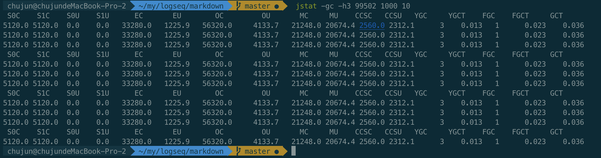

- 背景知识
  LVMID:进程的本地虚拟机唯一 ID（Local Virtual Machine Identifier,LVMID）
- 命令行工具
	- 1. jps(JVM Process Status）
	  jps (JVM Process Status）: 类似 UNIX 的 ps 命令。用于查看所有 Java 进程的启动类、传入参数和 Java 虚拟机参数等信息；
	  jps：显示虚拟机执行主类名称以及这些进程的本地虚拟机唯一 ID（Local Virtual Machine Identifier,LVMID）
	  jps -q ：只输出进程的本地虚拟机唯一 ID
	  jps -l:输出主类的全名，如果进程执行的是 Jar 包，输出 Jar 路径。
	  jps -v：输出虚拟机进程启动时 JVM 参数。
	  jps -m：输出传递给 Java 进程 main() 函数的参数。
	  ```shell
	  jps -lvm
	  21616  -Xms500m -Xmx3000m -XX:ReservedCodeCacheSize=240m -XX:+UseCompressedOops -Dfile.encoding=UTF-8 -XX:+UseConcMarkSweepGC -XX:SoftRefLRUPolicyMSPerMB=50 -ea -Dsun.io.useCanonCaches=false -Djava.net.preferIPv4Stack=true -Djdk.http.auth.tunneling.disabledSchemes="" -XX:+HeapDumpOnOutOfMemoryError -XX:-OmitStackTraceInFastThrow -XX:ErrorFile=/Users/chujun/java_error_in_idea_%p.log -XX:HeapDumpPath=/Users/chujun/java_error_in_idea.hprof -javaagent:/Users/chujun/my/project/gitBackupConfig/pycharm/jetbrains-agent.jar -Djb.vmOptionsFile=/Users/chujun/Library/Application Support/JetBrains/IntelliJIdea2020.3/idea.vmoptions -Didea.paths.selector=IntelliJIdea2020.3 -Didea.executable=idea -Didea.home.path=/Applications/IntelliJ IDEA.app/Contents -Didea.vendor.name=JetBrains
	  453  -Dfile.encoding=UTF-8 -XstartOnFirstThread
	  99502 org.jetbrains.jps.cmdline.Launcher /Applications/IntelliJ IDEA.app/Contents/lib/netty-common-4.1.52.Final.jar:/Applications/IntelliJ IDEA.app/Contents/lib/netty-resolver-4.1.52.Final.jar:/Applications/IntelliJ IDEA.app/Contents/plugins/java/lib/javac2.jar:/Applications/IntelliJ IDEA.app/Contents/lib/httpclient-4.5.12.jar:/Applications/IntelliJ IDEA.app/Contents/lib/plexus-component-annotations-1.7.1.jar:/Applications/IntelliJ IDEA.app/Contents/lib/maven-resolver-spi-1.3.3.jar:/Applications/IntelliJ IDEA.app/Contents/lib/util.jar:/Applications/IntelliJ IDEA.app/Contents/lib/platform-api.jar:/Applications/IntelliJ IDEA.app/Contents/lib/qdox-2.0-M10.jar:/Applications/IntelliJ IDEA.app/Contents/lib/asm-all-9.0.jar:/Applications/IntelliJ IDEA.app/Contents/lib/commons-lang3-3.10.jar:/Applications/IntelliJ IDEA.app/Contents/lib/jna.jar:/Applications/IntelliJ IDEA.app/Contents/lib/trove4j.jar:/Applications/IntelliJ IDEA.app/Contents/lib/nanoxml-2.2.3.jar:/Applications/IntelliJ IDEA.app/Contents/lib/maven-resolver-api -Xmx700m -Djava.awt.headless=true -Djava.endorsed.dirs="" -Djdt.compiler.useSingleThread=true -Dpreload.project.path=/Users/chujun/my/project/javaddu -Dpreload.config.path=/Users/chujun/Library/Application Support/JetBrains/IntelliJIdea2020.3/options -Dcompile.parallel=false -Drebuild.on.dependency.change=true -Djava.net.preferIPv4Stack=true -Dio.netty.initialSeedUniquifier=-4196536911600401421 -Dfile.encoding=UTF-8 -Duser.language=zh -Duser.country=CN -Didea.paths.selector=IntelliJIdea2020.3 -Didea.home.path=/Applications/IntelliJ IDEA.app/Contents -Didea.config.path=/Users/chujun/Library/Application Support/JetBrains/IntelliJIdea2020.3 -Didea.plugins.path=/Users/chujun/Library/Application Support/JetBrains/IntelliJIdea2020.3/plugins -Djps.log.dir=/Users/chujun/Library/Logs/JetBrains/IntelliJIdea2020.3/build-log -Djps.fallback.jdk.home=/Applications/IntelliJ IDEA.app/Contents/jbr/Contents/Home -Djps.fallback.jdk.version=11.0.9 -Dio.netty.noUnsafe=true -Djava.io.tmpdir=/Users/chujun/Library/Caches/JetBrains/I
	  239 sun.tools.jps.Jps -lvm -Dapplication.home=/Library/Java/JavaVirtualMachines/jdk1.8.0_211.jdk/Contents/Home -Xms8m
	  ```
	-
	- 2. jstat（JVM Statistics Monitoring Tool）
	  用于收集 HotSpot 虚拟机各方面的运行数据,类信息、内存、垃圾收集、JIT 编译等运行数据
	  ```
	  Usage: jstat -help|-options
	         jstat -<option> [-t] [-h<lines>] <vmid> [<interval> [<count>]]
	  ```
	  说明:
	  
	  interval:单位ms 1000表示间隔1000ms打印
	  count:打印次数
	  lines:间隔指定行数后打印指标头部
	  
	  ```shell
	  jstat -options
	  -class
	  -compiler
	  -gc
	  -gccapacity
	  -gccause
	  -gcmetacapacity
	  -gcnew
	  -gcnewcapacity
	  -gcold
	  -gcoldcapacity
	  -gcutil
	  -printcompilation
	  ```
	  说明
	  jstat -class vmid ：显示 ClassLoader 的相关信息；
	  jstat -compiler vmid ：显示 JIT 编译的相关信息；
	  jstat -gc vmid ：显示与 GC 相关的堆信息；
	  jstat -gccapacity vmid ：显示各个代的容量及使用情况；
	  jstat -gcnew vmid ：显示新生代信息；
	  jstat -gcnewcapacity vmid ：显示新生代大小与使用情况；
	  jstat -gcold vmid ：显示老年代和永久代的行为统计，从jdk1.8开始,该选项仅表示老年代，因为永久代被移除了；
	  jstat -gcoldcapacity vmid ：显示老年代的大小；
	  jstat -gcutil vmid ：显示垃圾收集信息；
	  
	  [jstat对各个options的输出列有说明含义](http://blog.itpub.net/31543790/viewspace-2657093/)
	  
	  
	  
	  
	  举例
	  1. 比如 jstat -gc -h3 31736 1000 10表示分析进程 id 为 31736 的 gc 情况，每隔 1000ms 打印一次记录，打印 10 次停止，每 3 行后打印指标头部。
	  
	- 3. jinfo(Configuration Info for Java)
	  Configuration Info for Java,显示虚拟机配置信息;
	- 4. jmap (Memory Map for Java)
	  生成堆转储快照;
	- 5. jhat (JVM Heap Dump Browser) 
	  用于分析 heapdump 文件，它会建立一个 HTTP/HTML 服务器，让用户可以在浏览器上查看分析结果;
	- 6. jstack (Stack Trace for Java)
	  生成虚拟机当前时刻的线程快照，线程快照就是当前虚拟机内每一条线程正在执行的方法堆栈的集合。
- JDK可视化分析工具
  JConsole
  Visual VM
  JProfile(强大，商业proflie分析工具)