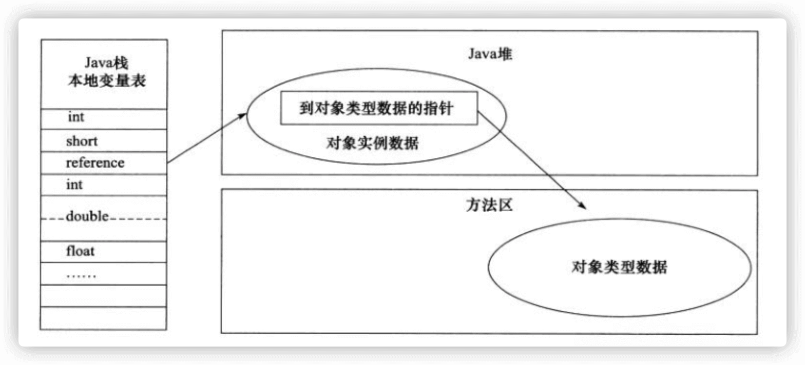
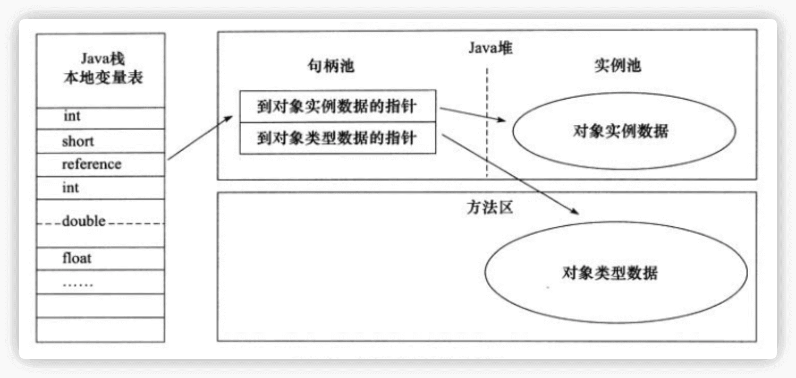
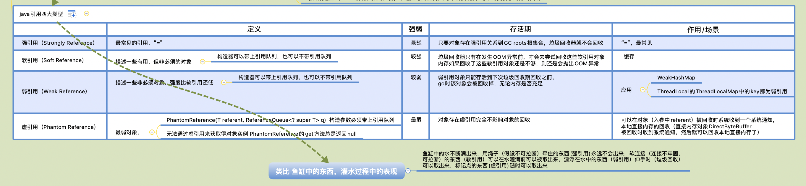

- [[java内存模型(JMM)]]
- [[java内存区域]]
- [[jvm对象堆内存布局]]
- 对象访问方式
  主要有两种对象访问方式
	- id:: 62a353c3-7cb7-44e5-9026-36dfd9084311
	  1. 直接指针方式
	  hotspot虚拟机采用直接指针方式
	  数据结构定义：对象引用直接指向对象地址，对象内存布局里需要额外存储对象类型指针
	  优点:对象访问速度快，相比句柄方式而言节省了一次指针定位过程
	  缺点:对象引用reference 中存储的是不稳定的指针地址，例如当垃圾回收期对象压缩时，指针地址需要变化。
	  {:height 485, :width 1049}
	- 2. 句柄访问方式
	  数据结构定义:对象引用指向句柄，对象直接指针和对象类型指针组合在一起，形成句柄数据结构
	  优点:对象引用reference 中存储的是稳定的句柄地址，在对象被移动时只会改变句柄中的实例数据指针，而 reference 本身不需要修改((垃圾回收器回收内存，例如压缩内存等)
	  缺点:需要两次指针定位
	  
- java对象创建
  限制:
  本次仅探究普通对象，而非Class对象，数组对象
  本机仅针对new对象，而非反序列化，复制，反射等其他机制创建对象方式
  对象分配内存主体步骤
  0. 类加载检查
  虚拟机遇到一条 new 指令时，首先将去检查这个指令的参数是否能在常量池中定位到这个类的符号引用，并且检查这个符号引用代表的类是否已被加载过、解析和初始化过。如果没有，那必须先执行相应的类加载过程。
  1. 类加载过程
  [[类加载机制]] 
  2. 确定类对象所需内存大小
  3. 多线程并发分配解决：TLAB , CAS同步无锁方案
  ((62a35ea5-3b73-4ab6-99c7-6e7c655d5d91)) 
  4. 内存分配方式：指针碰撞分配 ，空闲列表分配
  ((62a35a5c-cfb9-40f1-a2d8-2d2fdcaf7d18)) 
  5. 对象创建
  5.1 内存空间初始化零值
  5.2 对象头信息设置
  根据虚拟机当前运行状态的不同，如是否启用偏向锁等，对象头会有不同的设置方式。
  5.3 调用对应构造器<init>()初始化方法
-
- 内存分配方式
  id:: 62a35a5c-cfb9-40f1-a2d8-2d2fdcaf7d18
  业界目前主要有两种分配方式
  垃圾回收器是否具有空间压缩整理能力==> 决定java堆是否规整 ==>决定内存分配方式
  主要有三种垃圾回收算法,"标记-清除"，还是"标记-整理"（也称作"标记-压缩"），值得注意的是，“标记-复制”算法内存也是规整的。
	- 1. 指针碰撞分配
	  --->类比顺序排队分配
	  定义:
	  分配方式:分配内存和空闲内存，中间一个指针作为分割符，向空闲内存方向滑动对象所需内存大小偏移量分配给该对象
	  适合场景:内存规整:已分配内存在一起，空闲内在另一边--->中间需要一个小指针分割
	  优点:没有内存碎片
	  缺点:需要定期进行空间压缩整理
	  语言:Python，javascript等
	  垃圾回收器:Serial,ParNew
	- 2. 空闲列表分配
	  --->类比烧烤店的一群人排对等候安排桌位，桌位空闲，或者人多拼桌，分配桌位，这种分配方式生活中更加常见
	  定义:
	  分配方式:在空闲列表中找出满足对象所需内存大小的空间分配给对象，同时更新空闲列表
	  适合场景:内存不规整:已使用内存和空闲内存交错在一起--->需要维护空闲列表结构
	  缺点:需要维护空闲列表
	  语言:java，c#等
	  垃圾收集器:CMS
	- 内存分配并发解决方案
	  id:: 62a35ea5-3b73-4ab6-99c7-6e7c655d5d91
	  1. 同步无锁方案：CAS无锁更新+无限循环失败重试
	  2. 本地线程分配缓冲区，TLAB（Thread Local Allocation Buffer)
	  TLAB开启情况下（默认开启），如果TLAB分配完了，然后再采用同步CAS方式分配内存
	  ((62a1d414-b7ba-4c85-99c3-8a0f77190bc1))
- [[JVM垃圾回收]]
- [[类加载机制]]
- [[JVM参数]]
- 四大引用类型
  id:: 6299ed85-5fab-4abb-ad7e-d901f1d30469
  JDK1.2 之前，Java 中引用的定义很传统：如果 reference 类型的数据存储的数值代表的是另一块内存的起始地址，就称这块内存代表一个引用。
  JDK1.2 以后，Java 对引用的概念进行了扩充，将引用分为强引用、软引用、弱引用、虚引用四种
  
  强引用
  软引用(SoftReference)
  弱引用(WeakReference)
  虚引用(PhantomReference)
  
  引用队列(ReferenceQueue)
  Reference
  当引用类型Reference构造器传入的类型referent对象被gc垃圾回收器回收时，再调用Reference的get方法会返回null。
  ```java
  public abstract class Reference<T> {
  	private T referent;
  	volatile ReferenceQueue<? super T> queue;
  	Reference(T referent) {
          this(referent, null);
      }
  
      Reference(T referent, ReferenceQueue<? super T> queue) {
          this.referent = referent;
          this.queue = (queue == null) ? ReferenceQueue.NULL : queue;
      }
  	/**
       * Returns this reference object's referent.  If this reference object has
       * been cleared, either by the program or by the garbage collector, then
       * this method returns <code>null</code>.
       *
       * @return   The object to which this reference refers, or
       *           <code>null</code> if this reference object has been cleared
       */
      public T get() {
          return this.referent;
      }
  }
  ```
  应用:
  ThreadLocal的ThreadLocalMap的Entry就是继承了WeakReference，导致可能存在的潜在内存泄漏问题。
- [[类文件结构]]
- JVM调优
  GC 调优策略中很重要的一条经验总结
  >将新对象预留在新生代，由于 Full GC 的成本远高于 Minor GC，因此尽可能将对象分配在新生代是明智的做法，实际项目中根据 GC 日志分析新生代空间大小分配是否合理，适当通过“-Xmn”命令调节新生代大小，最大限度降低新对象直接进入老年代的情况。
- 优化
  逃逸分析技术
  应用 锁消除 ((6298a5bf-d69e-468c-816f-036e2d687654))
- 资料
  ((628ca746-598e-4db5-b964-7c4a80b26680))
- 书籍
  《深入理解 Java 虚拟机：JVM 高级特性与最佳实践 》第三版周志明