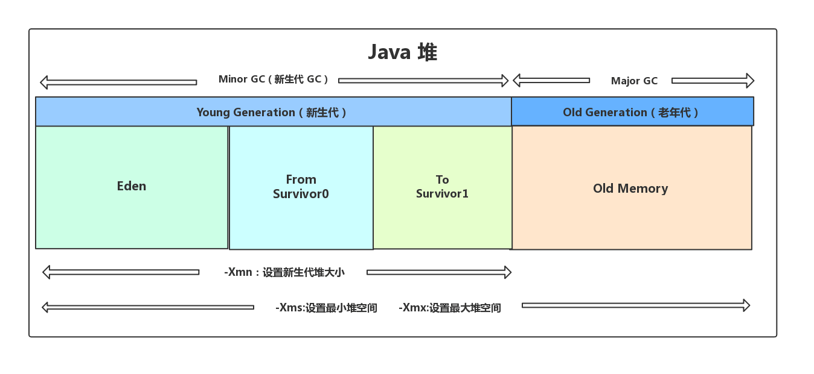

- 总体思路
  1. java对象内存是如何分配的？
  2. 如何判断一个对象是否该回收的“垃圾”？
  3. 什么时候进行垃圾回收？
  4. 如何进行垃圾回收？
  5. 垃圾回收效率:如何高效进行垃圾回收，同时尽可能小的影响应用程序？
  
  主要作用内存区域
  java堆是垃圾回收器主要作用区域
  
- 对象内存分配
  TODO
  大部分情况，对象都会首先在新生代Eden区域分配
- 判断对象是否”存活"
  两种方法判断对象是否存活
  1. 引用计数法(Reference Counting)
  定义:一个对象对应一个引用计数器，当对象引用+1，计数器+1，当对象引用-1，计数器-1；当对象引用计数器为零时，就可以进行回收
  问题：
  a. 循环引用问题(最典型问题)--->Python解决方法
  b. 多线程场景下的竞争问题
  应用:Python，javascript，FlashPlayer等脚本语言
  2. 可达性分析算法
- 现在收集器基本都采用分代垃圾收集算法