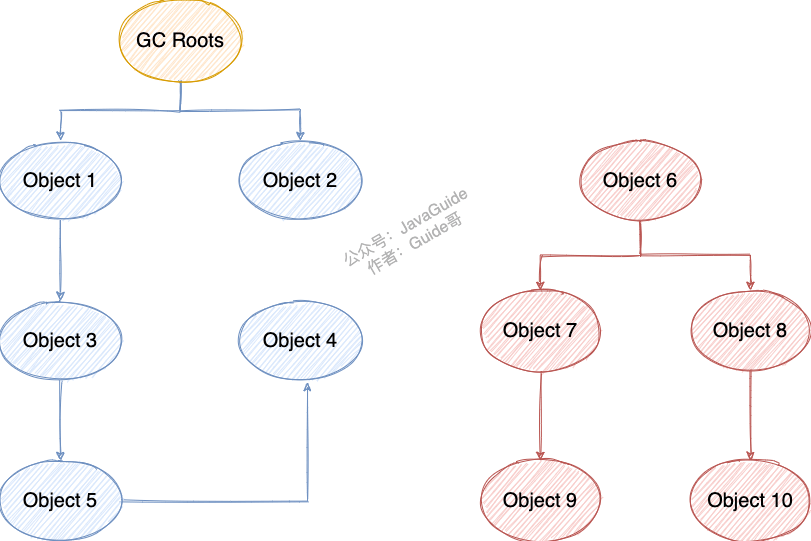

- 总体思路
  1. java对象内存是如何分配的？
  2. 如何判断一个对象是否该回收的“垃圾”？
  3. 什么时候进行垃圾回收？
  4. 如何进行垃圾回收？
  5. 垃圾回收效率:如何高效进行垃圾回收，同时尽可能小的影响应用程序？
  
  
  主要作用内存区域
  java堆是垃圾回收器主要作用区域
  现在收集器基本都采用分代垃圾收集算法
  Java 堆还可以细分为：新生代和老年代
  新生代再细致一点有：Eden 空间、From Survivor、To Survivor 空间等
  进一步划分的目的是更好地回收内存，或者更快地分配内存。
  
- 对象内存分配
  
  大部分情况，对象都会首先在新生代Eden区域分配
	- 大对象直接进入老年代
	  大对象就是需要大量连续内存空间的对象（比如：字符串、数组）。
	  为什么允许大对象直接进入老年代？
	  为了避免为大对象分配内存时由于分配担保机制带来的复制而降低效率。
	- 长期存活的对象将进入老年代
	  虚拟机采用了分代收集思想来管理内存，那么内存回收时需要识别哪些对象应放在新生代，哪些对象应放在老年代中。为了做到这一点，虚拟机给每个对象一个对象年龄（Age）计数器。
	  年龄Age增加
	  如果对象在 Eden 出生并经过第一次 Minor GC 后仍然能够存活，并且能被 Survivor 容纳的话，将被移动到 Survivor 空间中，并将对象年龄设为 1.对象在 Survivor 中每熬过一次 MinorGC,年龄就增加 1 岁，当它的年龄增加到一定程度（默认为 15 岁），就会被晋升到老年代中。
	- 当MinorGC发现Survivor区无法存储eden区的对象时,对象就直接放到老年代
	  JVM实验
	  ```java
	  /**
	   *
	   * <p>
	   * 当MinorGC发现Survivor区无法存储eden区的对象时,对象就直接放到老年代
	   *
	   * @author chujun
	   * @date 2022/6/11
	   */
	  public class JavaGcOldGenerationDemo {
	      /*
	      -verbose:gc
	  -Xmx200M
	  -Xms200M
	  -Xmn50M
	  -XX:+PrintGCDetails
	  -XX:TargetSurvivorRatio=60
	  -XX:+PrintTenuringDistribution
	  -XX:+PrintGCDateStamps
	  -XX:MaxTenuringThreshold=15
	       */
	      public static void main(String[] args) {
	          byte[] allocation1, allocation2, allocation3, allocation4, allocation5;
	  		//38912*0.92/1024=34.96M
	          allocation1 = new byte[34 * 1024 * 1024];
	          System.out.println("------start Allocation Failure------");
	          allocation2 = new byte[1024 * 1024];
	          System.out.println("------end Allocation Failure------");
	          allocation3 = new byte[1024 * 1024];
	          allocation4 = new byte[1024 * 1024];
	          allocation5 = new byte[1024 * 1024];
	      }
	  }
	  /*
	  空main方法执行如下
	  Heap
	   PSYoungGen      total 45056K, used 3113K [0x00000007bce00000, 0x00000007c0000000, 0x00000007c0000000)
	    eden space 38912K, 8% used [0x00000007bce00000,0x00000007bd10a638,0x00000007bf400000)
	    from space 6144K, 0% used [0x00000007bfa00000,0x00000007bfa00000,0x00000007c0000000)
	    to   space 6144K, 0% used [0x00000007bf400000,0x00000007bf400000,0x00000007bfa00000)
	   ParOldGen       total 153600K, used 0K [0x00000007b3800000, 0x00000007bce00000, 0x00000007bce00000)
	    object space 153600K, 0% used [0x00000007b3800000,0x00000007b3800000,0x00000007bce00000)
	   Metaspace       used 3080K, capacity 4496K, committed 4864K, reserved 1056768K
	    class space    used 339K, capacity 388K, committed 512K, reserved 1048576K
	   */
	  
	  /*
	  //执行方法
	  //start Allocation Failure)
	  2022-06-11T23:15:07.523-0800: [GC (Allocation Failure)
	  Desired survivor size 6291456 bytes, new threshold 7 (max 15)
	  [PSYoungGen: 37929K->624K(45056K)] 37929K->35448K(198656K), 0.0214842 secs] [Times: user=0.05 sys=0.01, real=0.02 secs]
	  Heap
	   PSYoungGen      total 45056K, used 5514K [0x00000007bce00000, 0x00000007c0000000, 0x00000007c0000000)
	    eden space 38912K, 12% used [0x00000007bce00000,0x00000007bd2c6a70,0x00000007bf400000)
	    from space 6144K, 10% used [0x00000007bf400000,0x00000007bf49c010,0x00000007bfa00000)
	    to   space 6144K, 0% used [0x00000007bfa00000,0x00000007bfa00000,0x00000007c0000000)
	   ParOldGen       total 153600K, used 34824K [0x00000007b3800000, 0x00000007bce00000, 0x00000007bce00000)
	    object space 153600K, 22% used [0x00000007b3800000,0x00000007b5a02010,0x00000007bce00000)
	   Metaspace       used 3082K, capacity 4496K, committed 4864K, reserved 1056768K
	    class space    used 339K, capacity 388K, committed 512K, reserved 1048576K
	   */
	  ```
	- 对象新生代晋升到老年代的动态年龄阈值
	  -XX:MaxTenuringThreshold 来设置晋升到老年代的年龄阈值默认值，默认15
	  -XX: TargetSurvivorRatio,Survivor使用率,默认50
	  这个年龄阈值会在虚拟机运行过程中进行动态调整
	  实时动态年龄阈值:Hotspot 遍历所有对象时，按照年龄从小到大对其所占用的大小进行累积，当累积的某个年龄大小超过了 survivor 区大小*TargetSurvivorRatio百分比(默认值50%)时，取这个年龄和 MaxTenuringThreshold 中更小的一个值，作为新的晋升年龄阈值
	  ```
	  uint ageTable::compute_tenuring_threshold(size_t survivor_capacity) {
	  //survivor_capacity是survivor空间的大小
	  size_t desired_survivor_size = (size_t)((((double)survivor_capacity)*TargetSurvivorRatio)/100);
	  size_t total = 0;
	  uint age = 1;
	  while (age < table_size) {
	    //JVM会将每个对象的年龄信息、各个年龄段对象的总大小记录在“age table”表中。
	    total += sizes[age];
	    if (total > desired_survivor_size) {
	        break;
	    }
	    age++;
	  }
	  uint result = age < MaxTenuringThreshold ? age : MaxTenuringThreshold;
	  ...
	  }
	  ```
	  可以通过-XX:+PrintTenuringDistribution来打印出当次 GC 后的年龄阈值Threshold。
	- JVM实验:新生代晋升老年代的实时动态年龄阈值实验
	  ```
	  -verbose:gc
	  -Xmx200M
	  -Xms200M
	  -Xmn50M
	  -XX:+PrintGCDetails
	  -XX:TargetSurvivorRatio=60
	  -XX:+PrintTenuringDistribution
	  -XX:+PrintGCDateStamps
	  -XX:MaxTenuringThreshold=3
	  -XX:+UseConcMarkSweepGC
	  -XX:+UseParNewGC
	  ```
	  ```java
	  /**
	   * 新生代晋升老年代的实时动态年龄阈值实验
	   * 本实例用于java GC以后，新生代survivor区域的变化，以及晋升到老年代的时间和方式的测试代码。需要自行分步注释不需要的代码进行反复测试对比
	   * <p>
	   * 由于java的main函数以及其他基础服务也会占用一些eden空间，所以要提前空跑一次main函数，来看看这部分占用。
	   * jdk8 mac系统 main函数空运行gc信息如下
	   * Heap
	   *  par new generation   total 46080K, used 3277K [0x00000007b3800000, 0x00000007b6a00000, 0x00000007b6a00000)
	   *   eden space 40960K,   8% used [0x00000007b3800000, 0x00000007b3b33610, 0x00000007b6000000)
	   *   from space 5120K,   0% used [0x00000007b6000000, 0x00000007b6000000, 0x00000007b6500000)
	   *   to   space 5120K,   0% used [0x00000007b6500000, 0x00000007b6500000, 0x00000007b6a00000)
	   *  concurrent mark-sweep generation total 153600K, used 0K [0x00000007b6a00000, 0x00000007c0000000, 0x00000007c0000000)
	   *  Metaspace       used 3078K, capacity 4496K, committed 4864K, reserved 1056768K
	   *   class space    used 339K, capacity 388K, committed 512K, reserved 1048576K
	   * <p>
	   * 自定义的代码中，我们使用堆内分配数组和栈内分配数组的方式来分别模拟不可被GC的和可被GC的资源。
	   */
	  public class JavaGcDynamicTenuringThresholdTest {
	    public static void main(String[] args) throws InterruptedException {
	          //空跑一次main函数来查看java服务本身占用的空间大小，我这里是占用了3M。eden区大小50*80%=40M,所以40-3=37，37M占满eden区大小,下面分配三个1M的数组和一个34M的垃圾数组。
	  
	          //8:1:1,Survivor区=50M*10%=5M
	          // 为了达到TargetSurvivorRatio（期望占用的Survivor区域的大小）这个比例指定的值, 即5M*60%=3M(Desired survivor size)，
	          // 这里用1M的数组的分配来达到Desired survivor size
	          //说明: 5M为S区的From或To的大小，60%为TargetSurvivorRatio参数指定,可以更改参数获取不同的效果。
	          byte[] byte1m_1 = new byte[1 * 1024 * 1024];
	          byte[] byte1m_2 = new byte[1 * 1024 * 1024];
	          byte[] byte1m_3 = new byte[1 * 1024 * 1024];
	  
	          //使用函数方式来申请空间，函数运行完毕以后，就会变成垃圾等待回收。此时应保证eden的区域占用达到100%。可以通过调整传入值来达到效果。
	          makeGarbage(34);
	  
	          //再次申请一个数组，eden会发生内存分配失败,ParNew "GC (Allocation Failure)"字样,因为eden已经满了，所以这里会触发Minor GC
	          byte[] byteArr = new byte[10 * 1024 * 1024];
	          // 这次Minor Gc时, 三个1M的数组因为尚有引用，所以进入From区域（因为是第一次GC）age为1
	          // 且由于From区已经占用达到了60%(-XX:TargetSurvivorRatio=60), 所以会重新计算对象晋升的age。
	          // 计算方法见上文，计算出age：min(age, MaxTenuringThreshold) = 1，输出中会有Desired survivor size 3145728 bytes, new threshold 1 (max 3)字样
	          //新的数组byteArr进入eden区域。
	  
	          //第二次发生内存分配失败,GC (Allocation Failure)
	          //再次触发垃圾回收，证明三个1M的数组会因为其第二次回收后age为2，大于上一次计算出的new threshold 1，所以进入老年代。
	          //而byteArr因为超过survivor的单个区域，直接进入了老年代。
	          makeGarbage(34);
	      }
	  
	      private static void makeGarbage(int size) {
	          byte[] byteArrTemp = new byte[size * 1024 * 1024];
	      }
	  }
	  ```
	  
	  //空main函数执行gc结果如下
	  ```
	  //空main函数执行gc结果如下
	  //jdk8 mac系统 main函数空运行gc信息如下 40960*8%=3276.8K=3.2M
	  Heap
	    par new generation   total 46080K, used 3277K [0x00000007b3800000, 0x00000007b6a00000, 0x00000007b6a00000)
	     eden space 40960K,   8% used [0x00000007b3800000, 0x00000007b3b33610, 0x00000007b6000000)
	     from space 5120K,   0% used [0x00000007b6000000, 0x00000007b6000000, 0x00000007b6500000)
	     to   space 5120K,   0% used [0x00000007b6500000, 0x00000007b6500000, 0x00000007b6a00000)
	    concurrent mark-sweep generation total 153600K, used 0K [0x00000007b6a00000, 0x00000007c0000000, 0x00000007c0000000)
	    Metaspace       used 3078K, capacity 4496K, committed 4864K, reserved 1056768K
	     class space    used 339K, capacity 388K, committed 512K, reserved 1048576K
	  ```
	  
	  正常代码执行如下
	  ```
	  2022-06-11T21:47:13.514-0800: [GC (Allocation Failure) 2022-06-11T21:47:13.514-0800: [ParNew
	  Desired survivor size 3145728 bytes, new threshold 1 (max 3)
	  - age   1:    3685184 bytes,    3685184 total
	  : 40346K->3619K(46080K), 0.0130135 secs] 40346K->3619K(199680K), 0.0130725 secs] [Times: user=0.00 sys=0.00, real=0.01 secs]
	  2022-06-11T21:47:13.529-0800: [GC (Allocation Failure) 2022-06-11T21:47:13.529-0800: [ParNew
	  Desired survivor size 3145728 bytes, new threshold 3 (max 3)
	  : 13859K->0K(46080K), 0.0123505 secs] 13859K->13777K(199680K), 0.0124057 secs] [Times: user=0.02 sys=0.01, real=0.02 secs]
	  Heap
	   par new generation   total 46080K, used 35225K [0x00000007b3800000, 0x00000007b6a00000, 0x00000007b6a00000)
	    eden space 40960K,  86% used [0x00000007b3800000, 0x00000007b5a667e8, 0x00000007b6000000)
	    from space 5120K,   0% used [0x00000007b6000000, 0x00000007b6000000, 0x00000007b6500000)
	    to   space 5120K,   0% used [0x00000007b6500000, 0x00000007b6500000, 0x00000007b6a00000)
	   concurrent mark-sweep generation total 153600K, used 13777K [0x00000007b6a00000, 0x00000007c0000000, 0x00000007c0000000)
	   Metaspace       used 3080K, capacity 4496K, committed 4864K, reserved 1056768K
	    class space    used 339K, capacity 388K, committed 512K, reserved 1048576K
	  ```
	- 老年代空间分配担保机制
	  空间担保指的是老年代进行空间分配担保
	  空间分配担保是为了确保在 Minor GC 之前老年代本身还有容纳新生代所有对象的剩余空间。
	  只要老年代的连续空间大于新生代对象总大小或者历次晋升的平均大小，就会进行 Minor GC，否则(考虑到空间不足问题)将直接进行 Full GC。
	-
	- #
	-
- 判断对象是否”存活"
  ((6299ed85-5fab-4abb-ad7e-d901f1d30469)) 
  两种方法判断对象是否存活
	- 1. 引用计数法(Reference Counting)
	  定义:一个对象对应一个引用计数器，当对象引用+1，计数器+1，当对象引用-1，计数器-1；当对象引用计数器为零时，就可以进行回收
	  问题：
	  a. 循环引用问题(最典型问题)--->Python解决方法
	  b. 多线程场景下的竞争问题
	  应用:Python，javascript，FlashPlayer等脚本语言
	- 2. 可达性分析算法
	  定义：通过可达性分析算法判断对象是否存活
	  算法思路:
	  1. jvm定义一系列GC roots根对象集合
	  2. 从GC roots根对象集合作为起点，根据对象引用关系进行图遍历，形成一条条“引用链”
	  3. 确认不可达对象：对象如果到GC roots集合之间没有任意引用链相连(图论)
	  --->实践：流浪在外，无家可回的可怜孩子 
	  --->图的遍历不可达
	  例如下图中的 Object 6 ~ Object 10 之间虽有引用关系，但它们到 GC Roots 不可达，因此为需要被回收的对象。
	   
	  应用:java，C#，go，Lisp
	- jvm定义的GC roots根集合
	  1. java方法栈
	  线程各个栈帧的本地变量表 临时变量，方法入参，方法返参引用的对象
	  2. 本地方法栈
	  本地方法栈JNI(俗称的native方法)引用的对象
	  3. 方法区
	  类的静态引用变量，常量池的常量引用
	  4. 本机直接内存
	  5. java虚拟机内部内存区域
	  基本类型对应的class对象
	  常驻的异常对象(NullPointException,OutOfMemoryError等）
	  系统加载类等等
	  6. 其他
	  所有被同步锁(synchronized关键字)引用的对象
	  反映虚拟机内部情况:JMXBean,JVMTI注册的回调,本地代码缓存等等
	- 判断类是否是无用的类
	  1. 该类所有的实例都已经被回收，也就是 Java 堆中不存在该类的任何实例。
	  2. 加载该类的 ClassLoader 已经被回收。
	  3. 该类对应的 java.lang.Class 对象没有在任何地方被引用，无法在任何地方通过反射访问该类的方法。
	  虚拟机可以对这类无用类回收
	- 判断字符串常量是否“死亡"
	  运行时常量池主要回收的是废弃的常量
	  和对象判断是否死亡类似如果当前没有任何 String 对象引用该字符串常量的话，就说明常量 "abc" 就是废弃常量
- 对象"死亡"过程
	- 主要步骤
	  1. 第一次标记对象为不可达后,暂时先不回收对象
	  2. 确定是否有必要执行finalize方法
	  一个对象finalize最多只能执行一次
	  2.1 如果有必要执行对象finalized方法
	  将对象移入F-Queue队列
	  --->Finalizer守护线程(虚拟机创建，优先级极低)顺序执行队列中对象的finalized方法
	  --->执行finalized方法后 垃圾收集器对F-Queue队列中的对象进行二次标记
	  如果对象此时可达了，逃脱一次回收，下次就没机会逃脱了(最多只有一次改过自新的机会)；
	  反之如果对象仍然不可达，则执行步骤3回收对象
	  2.2 没必要执行对象finalized方法
	  3. 下次垃圾回收时再回收该对象
	- 关于finalize方法
	  1. jdk9之后标记finalize为废弃方法了,是时候忘掉这个方法了
	  废弃原因:
	  a. 无法保证各个对象的调用顺序，不确定性大
	  b. 最开始适应C，C++析构函数的产物，不适应时代发展，关闭外部资源，可以用更优雅的方式实现
	  2. 一个对象至多只能执行一次
	  3. 必要执行条件：a对象类实现了finalize方法，b对象finalized方法没有执行过
	  [是时候忘掉finalize方法了](https://mp.weixin.qq.com/s/LW-paZAMD08DP_3-XCUxmg)
-