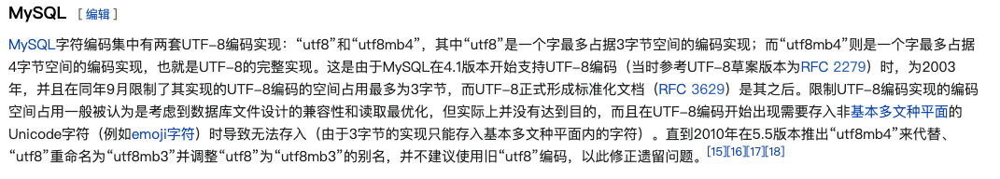

- 背景知识
  [[数据库]]
  [[字符集]]
- 数据库编码
  mysql的utf-8编码有两套实现
  
  utf8:(有点小坑)utf8编码只支持1-3个字节 。 在 utf8 编码中，中文是占 3 个字节，其他数字、英文、符号占一个字节。但 emoji 符号占 4 个字节，一些较复杂的文字、繁体字也是 4 个字节。
  utf8mb4:UTF-8 的完整实现，正版！最多支持使用 4 个字节表示字符，因此，可以用来存储 emoji 符号,一些复杂汉字，繁体字。
  更推荐使用这个字符集
  为什么有两套 UTF-8 编码实现呢？ 原因如下：
  
-
- 开发建议
  1.【强制】不得使用外键与级联，一切外键概念必须在应用层解决。
  说明: 以学生和成绩的关系为例，学生表中的 student_id 是主键，那么成绩表中的 student_id 则为外键。如果更新学生表中的 student_id，同时触发成绩表中的 student_id 更新，即为级联更新。外键与级联更新适用于单机低并发，不适合分布式、高并发集群; 级联更新是强阻塞，存在数据库更新风暴的风 险; 外键影响数据库的插入速度
  ---阿里巴巴开发手册
  对分库分表不友好 ：因为分库分表下外键是无法生效的。
  2. 【强制】禁止使用存储过程。
  存储过程难以调试和扩展，更没有可迁移性。
- [[MySQL命令]]