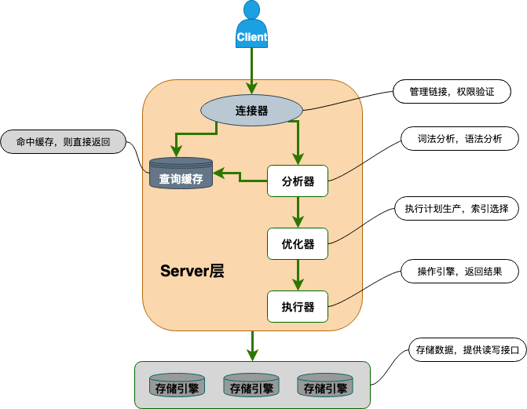

- 背景知识
  [[数据库]]
  [[字符集]]
- 数据库编码
  mysql的utf-8编码有两套实现
  
  utf8:(有点小坑)utf8编码只支持1-3个字节 。 在 utf8 编码中，中文是占 3 个字节，其他数字、英文、符号占一个字节。但 emoji 符号占 4 个字节，一些较复杂的文字、繁体字也是 4 个字节。
  utf8mb4:UTF-8 的完整实现，正版！最多支持使用 4 个字节表示字符，因此，可以用来存储 emoji 符号,一些复杂汉字，繁体字。
  更推荐使用这个字符集
  为什么有两套 UTF-8 编码实现呢？ 原因如下：
  
- MySQL 基础架构
  从下图你可以很清晰的看到客户端的一条 SQL 语句在 MySQL 内部是如何执行的。
  
	- MySQL主要由下面几部分构成
	  连接器： 身份认证和权限相关(登录 MySQL 的时候)。
	  查询缓存： 执行查询语句的时候，会先查询缓存（MySQL 8.0 版本后移除，因为这个功能不太实用）。
	  分析器： 没有命中缓存的话，SQL 语句就会经过分析器，分析器说白了就是要先看你的 SQL 语句要干嘛，再检查你的 SQL 语句语法是否正确。
	  优化器： 按照 MySQL 认为最优的方案去执行。
	  执行器： 执行语句，然后从存储引擎返回数据。 执行语句之前会先判断是否有权限，如果没有权限的话，就会报错。
	  插件式存储引擎 ： 主要负责数据的存储和读取，采用的是插件式架构，支持 InnoDB、MyISAM、Memory 等多种存储引擎。
	- MySQL 查询缓存
	  MySQL5.8废弃，
	  废弃原因:实际提升性能效果不明显
	  ```mysql.cnf
	  query_cache_type=1
	  query_cache_size=600000
	  ```
- MySQL 存储引擎
  MySQL 存储引擎采用的是插件式架构，支持多种存储引擎
  存储引擎是基于表的，而不是数据库。设置可以为表设置不同的存储引擎，当然实际业务开发中不可能这么使用。
  MySQL 当前默认的存储引擎是 InnoDB
	- MySQL主要存储引擎类型
	  [[InnoDB]]
	  MyISAM:MySQL 5.5.5 之前的默认存储引擎.
	  ```
	  +--------------------+---------+----------------------------------------------------------------+--------------+--------+------------+
	  | Engine             | Support | Comment                                                        | Transactions | XA     | Savepoints |
	  +--------------------+---------+----------------------------------------------------------------+--------------+--------+------------+
	  | ARCHIVE            | YES     | Archive storage engine                                         | NO           | NO     | NO         |
	  | BLACKHOLE          | YES     | /dev/null storage engine (anything you write to it disappears) | NO           | NO     | NO         |
	  | MRG_MYISAM         | YES     | Collection of identical MyISAM tables                          | NO           | NO     | NO         |
	  | FEDERATED          | NO      | Federated MySQL storage engine                                 | <null>       | <null> | <null>     |
	  | MyISAM             | YES     | MyISAM storage engine                                          | NO           | NO     | NO         |
	  | PERFORMANCE_SCHEMA | YES     | Performance Schema                                             | NO           | NO     | NO         |
	  | InnoDB             | DEFAULT | Supports transactions, row-level locking, and foreign keys     | YES          | YES    | YES        |
	  | MEMORY             | YES     | Hash based, stored in memory, useful for temporary tables      | NO           | NO     | NO         |
	  | CSV                | YES     | CSV storage engine                                             | NO           | NO     | NO         |
	  +--------------------+---------+----------------------------------------------------------------+--------------+--------+------------+
	  ```
	  
	  所有的存储引擎中只有 InnoDB 是事务性存储引擎，也就是说只有 InnoDB 支持事务。
	- MySQL查看存储引擎命令
	  1. 通过 show variables like '%storage_engine%' 命令直接查看 MySQL 当前默认的存储引擎。
	  2. 如果你只想查看数据库中某个表使用的存储引擎的话，可以使用 show table status from db_name where name='table_name'命令。
	- MyISAM与InnoDB区别
	  1. 是否支持事务: MyISAM不支持事务，InnoDB支持事务
	  2. 是否支持行级锁: MyISAM只有表级锁，InnoDB 支持行级锁(row-level locking)和表级锁,默认为行级锁。
	  3. 是否支持外键:MyISAM 不支持，而 InnoDB 支持。
	  4. 是否支持数据库异常崩溃后的安全恢复:MyISAM 不支持，而 InnoDB 支持。
	  使用 InnoDB 的数据库在异常崩溃后，数据库重新启动的时候会保证数据库恢复到崩溃前的状态。这个恢复的过程依赖于 redo log 。
	  5. 6.索引实现不一样。
	  MyISAM 引擎和 InnoDB 引擎都是使用 B+Tree 作为索引结构
	  InnoDB 引擎中，其数据文件本身就是索引文件。
	  MyISAM，索引文件和数据文件是分离的，其表数据文件本身就是按 B+Tree 组织的一个索引结构，树的叶节点 data 域保存了完整的数据记录。
- MySQL隔离级别
  MySQL InnoDB 存储引擎的默认支持的隔离级别是 REPEATABLE-READ（可重读）
  ((62a704aa-f1a1-478d-a685-adc86f7be7d9))
  
  MySQL隔离级别实现
  MySQL 的隔离级别基于锁和 MVCC 机制共同实现的。
  SERIALIZABLE 隔离级别，是通过锁来实现的。
  其他的隔离级别都是基于 MVCC 实现,不过也需要锁机制配合。
  比如 REPEATABLE-READ 在当前读情况下需要使用加锁读来保证不会出现幻读。
- MySQL锁
	- 表级锁和行级锁
	  表级锁：整张表加锁
	  行级锁:对一行或者多行记录加锁
		- 表级锁和行级锁对比
		  
		  |锁类型|粒度|锁目标|冲突|并发|加锁开销|加锁字段|
		  |---|---|---|---|---|---|---|
		  |表级锁|粒度大|整张表|冲突严重|低|小|非索引字段|
		  |行级锁|粒度小|一行或多行记录|冲突小|高|大|索引字段|
		- MySQL存储引擎对表级锁和行级锁的支持
		  MyISAM存储引擎
		  仅支持表级锁(table-level locking)
		  
		  InnoDB存储引擎
		  支持表级锁(table-level locking)，还支持行级锁(row-level locking)，默认为行级锁
		  行级锁是针对索引字段加的锁
		- InnoDB行级锁使用的注意事项
		  TODO:cj 迁移到Innodb行级锁
		  InnoDB 的行锁是针对索引字段加的锁，表级锁是针对非索引字段加的锁。
		  当我们执行 UPDATE、DELETE 语句时，如果 WHERE条件中字段没有命中索引或者索引失效的话，就会导致扫描全表对表中的所有记录进行加锁。
		  这个在我们日常工作开发中经常会遇到，一定要多多注意！！！
		  
		  不过，很多时候即使用了索引也有可能会走全表扫描，这是因为 MySQL 优化器的原因。
	- 共享锁和排他锁
	  共享锁（Share Lock，S 锁） ：又称读锁，事务在读取记录的时候获取共享锁，允许多个事务同时获取（锁兼容）。
	  排他锁（Exclusive Lock，X 锁）:
	- 意向锁
	-
- 开发建议
  1.【强制】不得使用外键与级联，一切外键概念必须在应用层解决。
  说明: 以学生和成绩的关系为例，学生表中的 student_id 是主键，那么成绩表中的 student_id 则为外键。如果更新学生表中的 student_id，同时触发成绩表中的 student_id 更新，即为级联更新。外键与级联更新适用于单机低并发，不适合分布式、高并发集群; 级联更新是强阻塞，存在数据库更新风暴的风 险; 外键影响数据库的插入速度
  ---阿里巴巴开发手册
  对分库分表不友好 ：因为分库分表下外键是无法生效的。
  2. 【强制】禁止使用存储过程。
  存储过程难以调试和扩展，更没有可迁移性。
  
  100. 【强制】使用utf8mb4编码方式
- [[MySQL命令]]
- 资料
  书籍
  《高性能 MySQL》
  《MySQL 技术内幕 InnoDB 存储引擎》