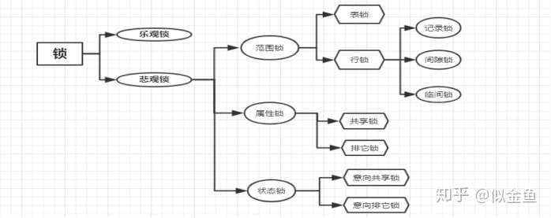
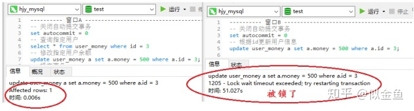
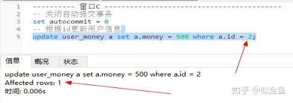
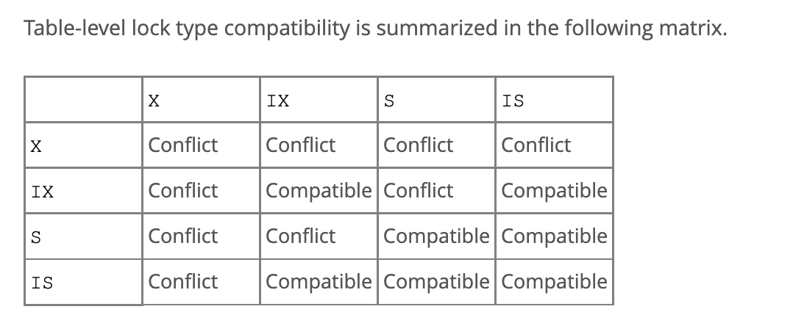

- 背景知识
  [[数据库]]
  [[字符集]]
- 数据库编码
  mysql的utf-8编码有两套实现
  
  utf8:(有点小坑)utf8编码只支持1-3个字节 。 在 utf8 编码中，中文是占 3 个字节，其他数字、英文、符号占一个字节。但 emoji 符号占 4 个字节，一些较复杂的文字、繁体字也是 4 个字节。
  utf8mb4:UTF-8 的完整实现，正版！最多支持使用 4 个字节表示字符，因此，可以用来存储 emoji 符号,一些复杂汉字，繁体字。
  更推荐使用这个字符集
  为什么有两套 UTF-8 编码实现呢？ 原因如下：
  
- MySQL 基础架构
  从下图你可以很清晰的看到客户端的一条 SQL 语句在 MySQL 内部是如何执行的。
  
	- MySQL主要由下面几部分构成
	  连接器： 身份认证和权限相关(登录 MySQL 的时候)。
	  查询缓存： 执行查询语句的时候，会先查询缓存（MySQL 8.0 版本后移除，因为这个功能不太实用）。
	  分析器： 没有命中缓存的话，SQL 语句就会经过分析器，分析器说白了就是要先看你的 SQL 语句要干嘛，再检查你的 SQL 语句语法是否正确。
	  优化器： 按照 MySQL 认为最优的方案去执行。
	  执行器： 执行语句，然后从存储引擎返回数据。 执行语句之前会先判断是否有权限，如果没有权限的话，就会报错。
	  插件式存储引擎 ： 主要负责数据的存储和读取，采用的是插件式架构，支持 InnoDB、MyISAM、Memory 等多种存储引擎。
	- MySQL 查询缓存
	  MySQL5.8废弃，
	  废弃原因:实际提升性能效果不明显
	  ```mysql.cnf
	  query_cache_type=1
	  query_cache_size=600000
	  ```
- MySQL 存储引擎
  MySQL 存储引擎采用的是插件式架构，支持多种存储引擎
  存储引擎是基于表的，而不是数据库。设置可以为表设置不同的存储引擎，当然实际业务开发中不可能这么使用。
  MySQL 当前默认的存储引擎是 InnoDB
	- MySQL主要存储引擎类型
	  [[InnoDB]]
	  MyISAM:MySQL 5.5.5 之前的默认存储引擎.
	  ```
	  +--------------------+---------+----------------------------------------------------------------+--------------+--------+------------+
	  | Engine             | Support | Comment                                                        | Transactions | XA     | Savepoints |
	  +--------------------+---------+----------------------------------------------------------------+--------------+--------+------------+
	  | ARCHIVE            | YES     | Archive storage engine                                         | NO           | NO     | NO         |
	  | BLACKHOLE          | YES     | /dev/null storage engine (anything you write to it disappears) | NO           | NO     | NO         |
	  | MRG_MYISAM         | YES     | Collection of identical MyISAM tables                          | NO           | NO     | NO         |
	  | FEDERATED          | NO      | Federated MySQL storage engine                                 | <null>       | <null> | <null>     |
	  | MyISAM             | YES     | MyISAM storage engine                                          | NO           | NO     | NO         |
	  | PERFORMANCE_SCHEMA | YES     | Performance Schema                                             | NO           | NO     | NO         |
	  | InnoDB             | DEFAULT | Supports transactions, row-level locking, and foreign keys     | YES          | YES    | YES        |
	  | MEMORY             | YES     | Hash based, stored in memory, useful for temporary tables      | NO           | NO     | NO         |
	  | CSV                | YES     | CSV storage engine                                             | NO           | NO     | NO         |
	  +--------------------+---------+----------------------------------------------------------------+--------------+--------+------------+
	  ```
	  
	  所有的存储引擎中只有 InnoDB 是事务性存储引擎，也就是说只有 InnoDB 支持事务。
	- MySQL查看存储引擎命令
	  1. 通过 show variables like '%storage_engine%' 命令直接查看 MySQL 当前默认的存储引擎。
	  2. 如果你只想查看数据库中某个表使用的存储引擎的话，可以使用 show table status from db_name where name='table_name'命令。
	- MyISAM与InnoDB区别
	  1. 是否支持事务: MyISAM不支持事务，InnoDB支持事务
	  2. 是否支持行级锁: MyISAM只有表级锁，InnoDB 支持行级锁(row-level locking)和表级锁,默认为行级锁。
	  3. 是否支持外键:MyISAM 不支持，而 InnoDB 支持。
	  4. 是否支持数据库异常崩溃后的安全恢复:MyISAM 不支持，而 InnoDB 支持。
	  使用 InnoDB 的数据库在异常崩溃后，数据库重新启动的时候会保证数据库恢复到崩溃前的状态。这个恢复的过程依赖于 redo log 。
	  5. 6.索引实现不一样。
	  MyISAM 引擎和 InnoDB 引擎都是使用 B+Tree 作为索引结构
	  InnoDB 引擎中，其数据文件本身就是索引文件。
	  MyISAM，索引文件和数据文件是分离的，其表数据文件本身就是按 B+Tree 组织的一个索引结构，树的叶节点 data 域保存了完整的数据记录。
- MySQL隔离级别
  MySQL InnoDB 存储引擎的默认支持的隔离级别是 REPEATABLE-READ（可重读）
  ((62a704aa-f1a1-478d-a685-adc86f7be7d9))
  
  MySQL隔离级别实现
  MySQL 的隔离级别基于锁和 MVCC 机制共同实现的。
  SERIALIZABLE 隔离级别，是通过锁来实现的。
  其他的隔离级别都是基于 MVCC 实现,不过也需要锁机制配合。
  比如 REPEATABLE-READ 在当前读情况下需要使用加锁读来保证不会出现幻读。
- MySQL锁
  
	-
	- 共享锁和排他锁
	  MySQL Innodb实现锁的两种层次
	  不论是表级锁还是行级锁，都存在共享锁和排他锁这两类。
	  共享锁（Share Lock，S 锁） ：又称读锁，事务在读取记录的时候获取共享锁，允许多个事务同时获取（锁兼容）。
	  排他锁（Exclusive Lock，X 锁）:又称写锁/独占锁，事务在修改记录的时候获取排他锁，不允许多个事务同时获取。如果一个记录已经被加了排他锁，那其他事务不能再对这条事务加任何类型的锁（锁不兼容）。
	  
	  排他锁与任何的锁都不兼容，共享锁仅和共享锁兼容。
	  | |	S 锁|	X 锁|
	  |---|---|
	  |S 锁|	不冲突|	冲突|
	  |X 锁|	冲突	|冲突|
	  
	  由于 MVCC 的存在，对于一般的 SELECT 语句，InnoDB 不会加任何锁。不过， 你可以通过以下语句显式加共享锁或排他锁。
	  ```
	  # 共享锁
	  SELECT ... LOCK IN SHARE MODE;
	  # 排他锁
	  SELECT ... FOR UPDATE;
	  ```
	- 乐观锁和悲观锁
	  id:: 62a71f54-d41b-4777-bdf7-3111e710015b
	  select语句添加悲观锁
	  ```
	  select * from innodb_lock_test where id=1 for update;
	  ```
	  {:height 285, :width 698}
	- 表级锁和行级锁
	  id:: 62a706f1-751d-47c8-821a-eba8ed64715c
	  表级锁：整张表加锁
	  表锁是非索引字段，即全表扫描
	  在表被锁定期间，其他事务不能对该表进行操作，必须等当前表的锁被释放后才能进行操作。
	  
	  行级锁:对一行或者多行记录加锁
	  行锁是对索引字段加锁，这点特别容易忽视
	  当其他事务访问数据库同一张表时，被锁定的记录不能被访问，其他的记录都可以访问到。
		- 表级锁锁定记录作用示例
		  id:: 62a7218c-86b8-41a7-8992-0d9d91746a71
		  打开两个窗口，在窗口A中更新一条记录，条件为非索引字段，不提交事务，然后在窗口B中任意再更新一条记录
		  
		  当更新数据库数据时，如果没有触发索引，则会锁表，锁表后再对表做任何变更操作都会导致锁冲突，所以表锁的锁冲突概率较高。
		  **这个示例充分说明行锁是针对索引字段加锁的**
		- 行级锁记录锁锁定记录作用示例
		  1. 窗口A先修改了id为3的用户信息后，还没有提交事务，此时窗口B再更新同一条记录，然后就提示Lock wait timeout exceeded; try restarting transaction ，由于窗口A迟迟没有提交事务，导致锁一直没有释放，就出现了锁冲突，而窗口B一直在等待锁，所以出现了超过锁定超时的警告了。
		  
		  2. 在窗口C中我们可以更新id为2的记录，这说明此时锁定了id为3的记录但是并没有锁定它旁边的记录。
		  
		- 表级锁和行级锁对比
		  
		  |锁类型|粒度|锁目标|冲突|并发|加锁开销|加锁字段|发生死锁|
		  |---|---|---|---|---|---|---|---|
		  |表级锁|粒度大|整张表|冲突严重|低|小|非索引字段|不会|
		  |行级锁|粒度小|一行或多行记录|冲突小|高|大|索引字段|会|
		- MySQL存储引擎对表级锁和行级锁的支持
		  MyISAM存储引擎
		  仅支持表级锁(table-level locking)
		  
		  InnoDB存储引擎
		  支持表级锁(table-level locking)，还支持行级锁(row-level locking)，默认为行级锁
		  行级锁是针对索引字段加的锁
		- InnoDB行级锁使用的注意事项
		  InnoDB 的行锁是针对索引字段加的锁，表级锁是针对非索引字段加的锁。
		  当我们执行 UPDATE、DELETE 语句时，如果 WHERE条件中字段没有命中索引或者索引失效的话，就会导致扫描全表对表中的所有记录进行加锁。
		  这个在我们日常工作开发中经常会遇到，一定要多多注意！！！
		  不过，很多时候即使用了索引也有可能会走全表扫描，这是因为 MySQL 优化器的原因。
		  ((62a7218c-86b8-41a7-8992-0d9d91746a71))
	- 意向锁
	  意向锁是表级锁
	  意向共享锁（Intention Shared Lock，IS 锁）：事务有意向对表中的某些记录加共享锁（S 锁），加共享锁前必须先取得该表的 IS 锁。
	  意向排他锁（Intention Exclusive Lock，IX 锁）：事务有意向对表中的某些记录加排他锁（X 锁），加排他锁之前必须先取得该表的 IX 锁。
	  
	  出现意向锁的缘由
	  如果需要用到表锁的话，如何判断表中的记录没有行锁呢？一行一行遍历肯定是不行，性能太差
	  意向锁的功能来了：快速判断是否可以对某个表使用表锁。
	  
	  意向锁协议如下
	  1. 如果一个事务需要在表的某一行上获取S锁，那么它先需要获取该表的IS锁或者更强的锁IX锁。
	  2. 如果一个事务需要在表的某一个行获取X锁，那么它先需要获取该表的IX锁。
	  
	  意向锁是有存储引擎自己维护的，用户无法手动操作意向锁，在为数据行加共享 / 排他锁之前，InooDB 会先获取该数据行所在在数据表的对应意向锁。
	  
	  意向锁之间是互相兼容的。
	  |	|IS 锁	|IX 锁|
	  |---|---|
	  |IS 锁|	兼容	|兼容|
	  |IX 锁|	兼容|兼容|
	  
	  表级别的锁类型兼容性如下图（这里指的是表级别的共享锁和排他锁，意向锁不会与行级的共享锁和排他锁互斥）。
	  兼容表示两个事务可以同时获取，不兼容表示两个事务没法同时获取。
	  
	  上图总结如下
	  1. X锁和任何其他锁都互斥(X锁,S锁，IS锁，IX锁)--->表做第一个行，第一个列
	  2. S锁和IS锁相互之间兼容--->表中右下角2X2的方格
	  3.  意向锁(IS和IX锁)之间相互兼容--->(2,2),(2,4),(4,2)
	  4. 排除法:S锁和IX锁互相不兼容--->此时只剩下两个小方格(2,3),(3,2)
	- 实现锁
	  记录锁，间隙锁，临键锁见InnoDB行级锁实现 [[InnoDB行级锁梳理]]
- 开发建议
  id:: 62a6d7db-9526-44ab-83a7-5bfeb0476eae
  TODO:cj 这块比较乱后续再统一梳理下
  开发设计规范
  1. 【强制】禁止使用存储过程。
  存储过程难以调试和扩展，更没有可迁移性。
  2. 【建议】避免数据类型的隐式转换
  隐式转换会导致索引失效如: select name,phone from customer where id = '111';
  [MySQL中的隐式转换造成的索引失效](https://javaguide.cn/database/mysql/index-invalidation-caused-by-implicit-conversion.html#%E5%89%8D%E8%A8%80)
  3.【强制】 建议使用预编译语句进行数据库操作
  预编译语句可以重复使用这些计划，减少 SQL 编译所需要的时间，还可以解决动态 SQL 所带来的 SQL 注入的问题。
  只传参数，比传递 SQL 语句更高效。
  相同语句可以一次解析，多次使用，提高处理效率。
  4. 【强制】禁止使用 SELECT * 必须使用 SELECT <字段列表> 查询
  a. 消耗更多的 CPU 和 IO 以网络带宽资源
  b. 无法使用覆盖索引
  c. 可减少表结构变更带来的影响
  5. 【推荐】避免使用子查询
  通常子查询在 in 子句中，且子查询中为简单 SQL(不包含 union、group by、order by、limit 从句) 时,才可以把子查询转化为关联查询进行优化。
  子查询性能差的原因：
  子查询的结果集无法使用索引，通常子查询的结果集会被存储到临时表中，不论是内存临时表还是磁盘临时表都不会存在索引，所以查询性能会受到一定的影响。特别是对于返回结果集比较大的子查询，其对查询性能的影响也就越大。
  由于子查询会产生大量的临时表也没有索引，所以会消耗过多的 CPU 和 IO 资源，产生大量的慢查询。
  
  
  
  
  索引设计规范
  100. 【建议】限制每张表上的索引数量,建议单张表索引不超过 5 个
  索引可以增加查询效率，但同样也会降低插入和更新的效率，甚至有些情况下会降低查询效率。
  因为 MySQL 优化器在选择如何优化查询时，会根据统一信息，对每一个可以用到的索引来进行评估，以生成出一个最好的执行计划，如果同时有很多个索引都可以用于查询，就会增加 MySQL 优化器生成执行计划的时间，同样会降低查询性能。
  101. 【推荐】常见索引列建议
  a. 出现在 SELECT、UPDATE、DELETE 语句的 WHERE 从句中的列
  b. 包含在 ORDER BY、GROUP BY、DISTINCT 中的字段
  c. 并不要将符合 1 和 2 中的字段的列都建立一个索引， 通常将 1、2 中的字段建立联合索引效果更好
  d. 多表 join 的关联列
  102. 【推荐】如何选择索引列的顺序
  a. 区分度最高的放在联合索引的最左侧（区分度=列中不同值的数量/列的总行数）
  b. 尽量把字段长度小的列放在联合索引的左侧（因为字段长度越小，一页能存储的数据量越大，IO 性能也就越好???）
  c. 使用最频繁的列放到联合索引的左侧（这样可以比较少的建立一些索引???）
  103. 【建议】频繁的查询优先考虑使用覆盖索引
  覆盖索引：就是包含了所有查询字段 (where,select,order by,group by 包含的字段) 的索引
  例如: select id from t where id>5 order by id desc;
  覆盖索引的好处：
  a. 避免 Innodb 表进行索引的二次查询: Innodb 是以聚集索引的顺序来存储的，对于 Innodb 来说，二级索引在叶子节点中所保存的是行的主键信息，如果是用二级索引查询数据的话，在查找到相应的键值后，还要通过主键进行二次查询才能获取我们真实所需要的数据。而在覆盖索引中，二级索引的键值中可以获取所有的数据，避免了对主键的二次查询 ，减少了 IO 操作，提升了查询效率。
  b. 可以把随机 IO 变成顺序 IO 加快查询效率: 由于覆盖索引是按键值的顺序存储的，对于 IO 密集型的范围查找来说，对比随机从磁盘读取每一行的数据 IO 要少的多，因此利用覆盖索引在访问时也可以把磁盘的随机读取的 IO 转变成索引查找的顺序 IO。
  
  数据库设计设计规范
  200. 【强制】所有表必须使用 Innodb 存储引擎
  
  表设计规范
  300. 【推荐】使用utf8mb4编码方式
  301.【强制】不得使用外键与级联，一切外键概念必须在应用层解决。
  说明: 以学生和成绩的关系为例，学生表中的 student_id 是主键，那么成绩表中的 student_id 则为外键。如果更新学生表中的 student_id，同时触发成绩表中的 student_id 更新，即为级联更新。外键与级联更新适用于单机低并发，不适合分布式、高并发集群; 级联更新是强阻塞，存在数据库更新风暴的风 险; 外键影响数据库的插入速度
  ---阿里巴巴开发手册
  对分库分表不友好 ：因为分库分表下外键是无法生效的。
  
  
  列设计规范
  400. 【推荐】优先选择符合存储需要的最小的数据类型
  列的字段越大，建立索引时所需要的空间也就越大，这样同样一页大小中所能存储的索引节点的数量也就越少，在遍历时所需要的 IO 次数也就越多，索引的性能也就越差。
  402. 【推荐】避免使用 TEXT,BLOB 数据类型，最常见的 TEXT 类型可以存储 64k 的数据
  a. 建议把 BLOB 或是 TEXT 列分离到单独的扩展表中
  MySQL 内存临时表不支持 TEXT、BLOB 这样的大数据类型，如果查询中包含这样的数据，在排序等操作时，就不能使用内存临时表，必须使用磁盘临时表进行。而且对于这种数据，MySQL 还是要进行二次查询，会使 sql 性能变得很差，但是不是说一定不能使用这样的数据类型。
  如果一定要使用，建议把 BLOB 或是 TEXT 列分离到单独的扩展表中，查询时一定不要使用 select * 而只需要取出必要的列，不需要 TEXT 列的数据时不要对该列进行查询。
  
  
  数据库操作行为规范
  500
-
-
-
-
- 事务
- 数据类型
  对VARCHAR长度的认知
  VARCHAR(N) 中的 N 代表的是字符数，而不是字节数，使用 UTF8 存储 255 个汉字 Varchar(255)=765 个字节。
- [[MySQL常见操作命令]]
- [[MySQL命令]]
- 资料
  [深入理解数据库行锁与表锁](https://zhuanlan.zhihu.com/p/52678870)
  书籍
  《高性能 MySQL》
  《MySQL 技术内幕 InnoDB 存储引擎》