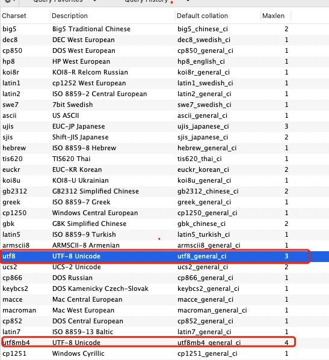

- 查看变量
  show variables
  支持通配符查询
  主要例子
  查询存储引擎
  show variables like '%storage_engine%'
- select version() 命令查看你的 MySQL 版本
  ```
  +-----------+
  | version() |
  +-----------+
  | 8.0.22    |
  +-----------+
  ```
- 查看字符集
  SHOW CHARSET
  
- 查看支持的存储引擎
  show engines
  ```
  +--------------------+---------+----------------------------------------------------------------+--------------+--------+------------+
  | Engine             | Support | Comment                                                        | Transactions | XA     | Savepoints |
  +--------------------+---------+----------------------------------------------------------------+--------------+--------+------------+
  | ARCHIVE            | YES     | Archive storage engine                                         | NO           | NO     | NO         |
  | BLACKHOLE          | YES     | /dev/null storage engine (anything you write to it disappears) | NO           | NO     | NO         |
  | MRG_MYISAM         | YES     | Collection of identical MyISAM tables                          | NO           | NO     | NO         |
  | FEDERATED          | NO      | Federated MySQL storage engine                                 | <null>       | <null> | <null>     |
  | MyISAM             | YES     | MyISAM storage engine                                          | NO           | NO     | NO         |
  | PERFORMANCE_SCHEMA | YES     | Performance Schema                                             | NO           | NO     | NO         |
  | InnoDB             | DEFAULT | Supports transactions, row-level locking, and foreign keys     | YES          | YES    | YES        |
  | MEMORY             | YES     | Hash based, stored in memory, useful for temporary tables      | NO           | NO     | NO         |
  | CSV                | YES     | CSV storage engine                                             | NO           | NO     | NO         |
  +--------------------+---------+----------------------------------------------------------------+--------------+--------+------------+
  ```
- 查询MySQL隔离级别命令
  id:: 62a704aa-f1a1-478d-a685-adc86f7be7d9
  MySQL8之前：SELECT @@tx_isolation;
  MySQL 8.0 该命令改为SELECT @@transaction_isolation;
  ```shell
  mysql root@localhost:(none)> SELECT @@transaction_isolation;
  +-------------------------+
  | @@transaction_isolation |
  +-------------------------+
  | REPEATABLE-READ         |
  +-------------------------+
  ```
-