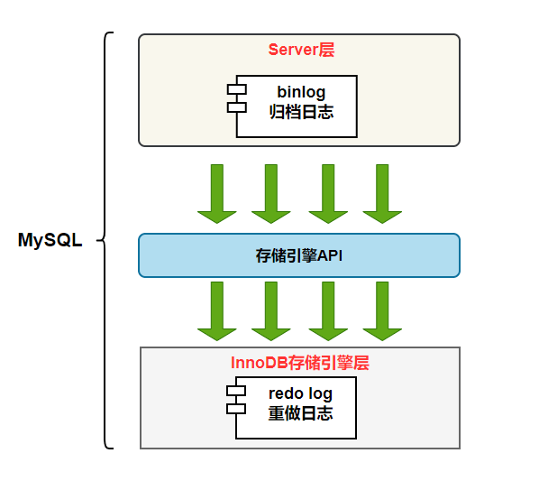
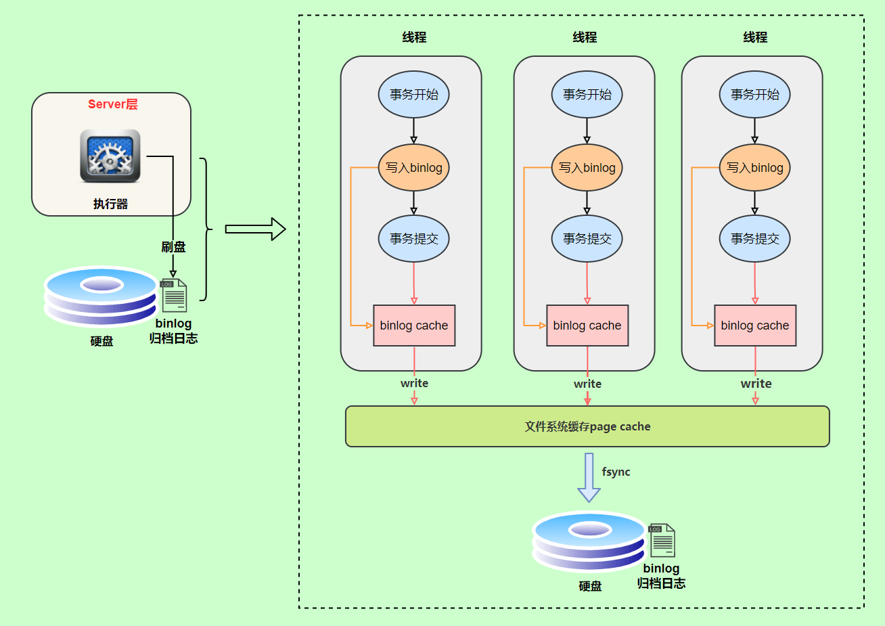
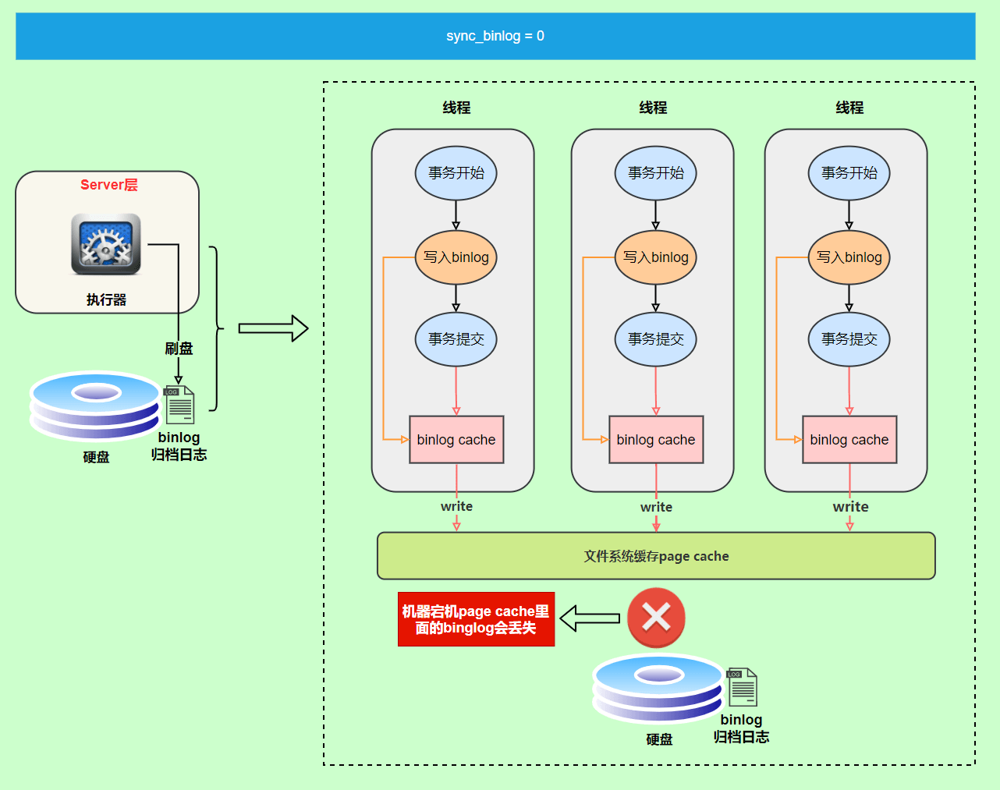
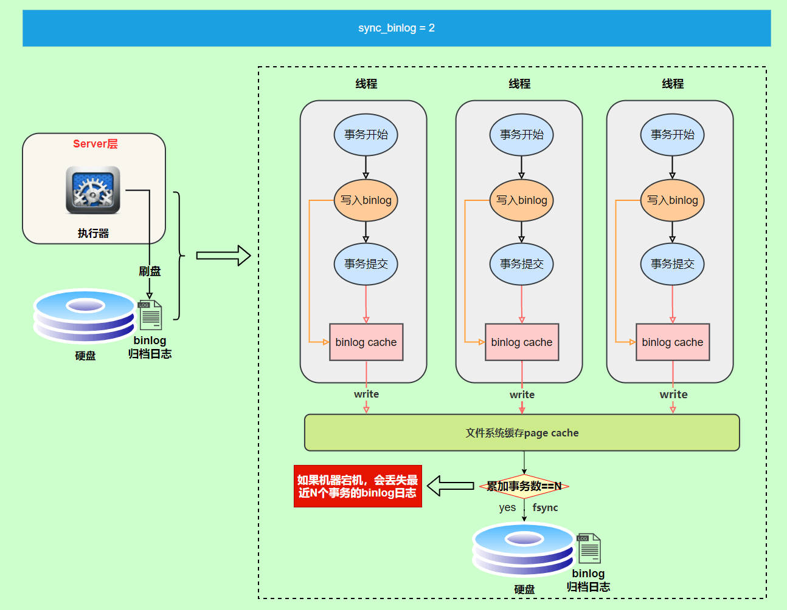
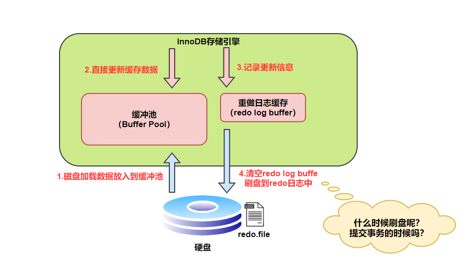

- MySQL日志主要包括错误日志、查询日志、慢查询日志、事务日志、二进制日志几大类。
  其中，比较重要的还要属二进制日志 binlog（归档日志）和事务日志 redo log（重做日志）和 undo log（回滚日志）。
  
- MySQL逻辑日志和物理日志
  逻辑日志： 可以简单理解为记录的就是sql语句 。
  物理日志： mysql 数据最终是保存在数据页中的，物理日志记录的就是数据页变更 。
- binlog二进制日志
  binlog会记录所有涉及更新数据的逻辑操作，并且是顺序写。
	- binlog作用
	  MySQL数据库的数据备份、主备、主主、主从都离不开binlog，需要依靠binlog来同步数据，保证数据一致性。
	  
	- binlog记录格式
	  binlog 日志有三种格式，可以通过binlog_format参数指定。statement，row，mixed
	  ```
	  show variables like 'binlog_format';
	  +---------------+-------+
	  | Variable_name | Value |
	  +---------------+-------+
	  | binlog_format | ROW   |
	  +---------------+-------+
	  ```
	  statement格式
	  记录的内容是SQL语句原文,比如执行一条update T set update_time=now() where id=1，记录的内容如下。
	   
	  statement格式缺点:数据库同步时可能导致数据不一致性，例如now()
	  
	  row格式
	  记录的内容不再是简单的SQL语句了，还包含操作的具体数据
	   
	  row格式记录的内容看不到详细信息，要通过mysqlbinlog工具解析出来。
	  row格式优点:解决了statement格式数据不一致性的问题，为数据库的恢复与同步带来更好的可靠性。
	  举例:update_time=now()变成了具体的时间update_time=1627112756247，条件后面的@1、@2、@3 都是该行数据第 1 个~3 个字段的原始值（假设这张表只有 3 个字段）。
	  row格式优点缺点:需要更大的容量来记录，比较占用空间;恢复与同步时会更消耗IO资源，影响执行速度。
	  一条sql也可能产生大量日志
	  例如 update T set show=1 where id<1000000,id小于1000000的记录都记录下来了。
	  mixed格式
	  记录的内容是前两者的混合
	  MySQL会判断这条SQL语句是否可能引起数据不一致，如果是，就用row格式，否则就用statement格式。
	- binlog写入机制
	  事务执行过程中，先把日志写到binlog cache，事务提交的时候，再把binlog cache写到binlog文件中。
	  因为一个事务的binlog不能被拆开，无论这个事务多大，也要确保一次性写入，所以系统会给每个线程分配一个块内存作为binlog cache。
	  我们可以通过binlog_cache_size参数控制单个线程 binlog cache 大小，如果存储内容超过了这个参数，就要暂存到磁盘（Swap）。
	  ```
	  mysql root@localhost:lock_test> show variables like 'binlog_cache_size';
	  +-------------------+-------+
	  | Variable_name     | Value |
	  +-------------------+-------+
	  | binlog_cache_size | 32768 |
	  +-------------------+-------+
	  1 row in set
	  Time: 0.024s
	  ```
	- binlog日志刷盘流程如下
	   
	  上图的 write，是指把日志写入到文件系统的 page cache，并没有把数据持久化到磁盘，所以速度比较快
	  上图的 fsync，才是将数据持久化到磁盘的操作
	- binlog刷盘sync同步时机
	  write和fsync的时机，可以由参数sync_binlog控制，0,1,N,mysq8默认是1。
	  ```
	  mysql root@localhost:lock_test> show variables like 'sync_binlog';
	  +---------------+-------+
	  | Variable_name | Value |
	  +---------------+-------+
	  | sync_binlog   | 1     |
	  +---------------+-------+
	  1 row in set
	  Time: 0.067s
	  ```
	  a. 为0的时候，表示每次提交事务都只write，由系统自行判断什么时候执行fsync。
	  
	  虽然性能得到提升，但是机器宕机，page cache里面的 binlog 会丢失。
	  b. 安全起见，可以设置为1，表示每次提交事务都会执行fsync，就如同 redo log 日志刷盘流程 一样。
	  c. 第三种折中方案，可以设置为N(N>1)，表示每次提交事务都write，但累积N个事务后才fsync。
	  
	  如果机器宕机，会丢失最近N个事务的binlog日志。
	-
	-
	- binlog和redolog比较
	  redolog是物理日志，记录内容是“在某个数据页上做了什么修改”，属于 InnoDB 存储引擎。
	   binlog 是逻辑日志，记录内容是语句的原始逻辑，类似于“给 ID=2 这一行的 c 字段加 1”，属于MySQL Server 层。不管用什么存储引擎，只要发生了表数据更新，都会产生 binlog 日志。
-
-
-
-
- redolog重做日志
  物理日志：记录“在某个数据页上做了什么修改“
  redo log（重做日志）是InnoDB存储引擎独有的，它让MySQL拥有了崩溃恢复能力。
	- 作用:保证数据的持久性与完整性。
	  比如 MySQL 实例挂了或宕机了，重启时，InnoDB存储引擎会使用redo log恢复数据。
	  
	- 和Buffer Pool的交互
	  MySQL 中数据是以页为单位，你查询一条记录，会从硬盘把一页的数据加载出来，加载出来的数据叫数据页，会放入到 Buffer Pool 中。
	  后续的查询都是先从 Buffer Pool 中找，没有命中再去硬盘加载，减少硬盘 IO 开销，提升性能。
	  更新表数据的时候，也是如此，发现 Buffer Pool 里存在要更新的数据，就直接在 Buffer Pool 里更新。
	  然后会把“在某个数据页上做了什么修改”记录到重做日志缓存（redo log buffer）里，接着刷盘到 redo log 文件里。
	  
	  >图片笔误提示：第 4 步 “清空 redo log buffe 刷盘到 redo 日志中”这句话中的 buffe 应该是 buffer。
	- redolog刷盘时机
	  InnoDB 存储引擎为 redo log 的刷盘策略提供了 innodb_flush_log_at_trx_commit 参数，它支持三种策略：0,1,2
	  0 ：设置为 0 的时候，表示每次事务提交时不进行刷盘操作
	  1 ：设置为 1 的时候，表示每次事务提交时都将进行刷盘操作（默认值）
	  2 ：设置为 2 的时候，表示每次事务提交时都只把 redo log buffer 内容写入 page cache
	  ```
	  mysql root@localhost:lock_test> show variables like 'innodb_flush_log_at_trx_commit';
	  +--------------------------------+-------+
	  | Variable_name                  | Value |
	  +--------------------------------+-------+
	  | innodb_flush_log_at_trx_commit | 1     |
	  +--------------------------------+-------+
	  1 row in set
	  Time: 0.133s
	  ```
	-
	-
	-
	-
-
-
- MySQL两阶段提交
  没有两阶段提交前的问题
- undolog回滚日志
- 慢查询日志
-