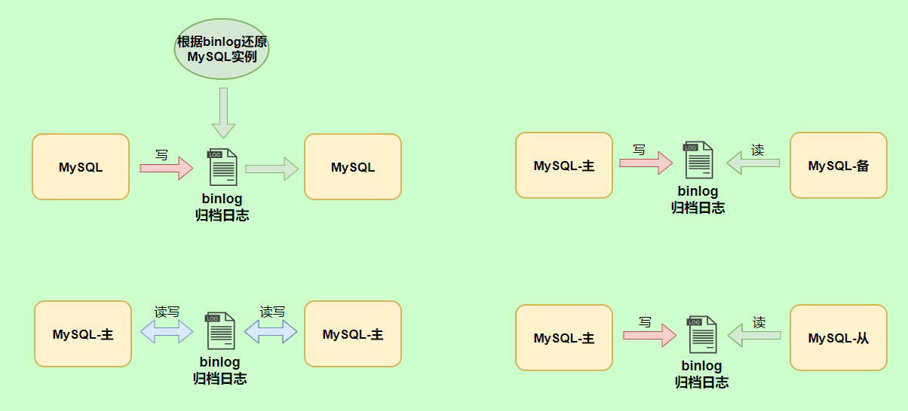
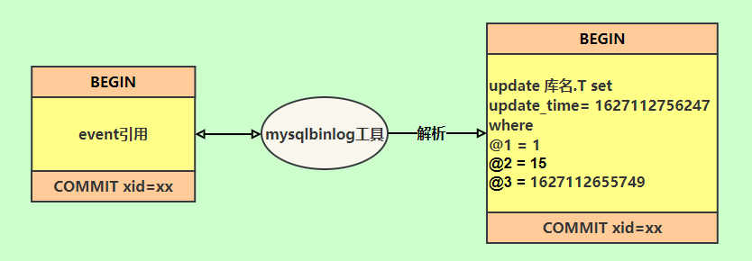

- MySQL日志主要包括错误日志、查询日志、慢查询日志、事务日志、二进制日志几大类。
  其中，比较重要的还要属二进制日志 binlog（归档日志）和事务日志 redo log（重做日志）和 undo log（回滚日志）。
  
- binlog二进制日志
  binlog会记录所有涉及更新数据的逻辑操作，并且是顺序写。
  
  binlog作用
  MySQL数据库的数据备份、主备、主主、主从都离不开binlog，需要依靠binlog来同步数据，保证数据一致性。
   
  binlog记录格式
  binlog 日志有三种格式，可以通过binlog_format参数指定。statement，row，mixed
  ```
  show variables like 'binlog_format';
  +---------------+-------+
  | Variable_name | Value |
  +---------------+-------+
  | binlog_format | ROW   |
  +---------------+-------+
  ```
  statement格式
  记录的内容是SQL语句原文,比如执行一条update T set update_time=now() where id=1，记录的内容如下。
   
  statement格式缺点:数据库同步时可能导致数据不一致性，例如now()
  
  row格式
  记录的内容不再是简单的SQL语句了，还包含操作的具体数据
   
  row格式记录的内容看不到详细信息，要通过mysqlbinlog工具解析出来。
  row格式优点:解决了statement格式数据不一致性的问题，为数据库的恢复与同步带来更好的可靠性。
  举例:update_time=now()变成了具体的时间update_time=1627112756247，条件后面的@1、@2、@3 都是该行数据第 1 个~3 个字段的原始值（假设这张表只有 3 个字段）。
  row格式优点缺点:需要更大的容量来记录，比较占用空间;恢复与同步时会更消耗IO资源，影响执行速度。
  一条sql也可能产生大量日志
  例如 update T set show=1 where id<1000000,id小于1000000的记录都记录下来了。
  mixed格式
  记录的内容是前两者的混合
  MySQL会判断这条SQL语句是否可能引起数据不一致，如果是，就用row格式，否则就用statement格式。
  
  
  binlog和redolog比较
  redolog是物理日志，记录内容是“在某个数据页上做了什么修改”，属于 InnoDB 存储引擎。
   binlog 是逻辑日志，记录内容是语句的原始逻辑，类似于“给 ID=2 这一行的 c 字段加 1”，属于MySQL Server 层。不管用什么存储引擎，只要发生了表数据更新，都会产生 binlog 日志。
-
-
- redolog重做日志
- MySQL两阶段提交
- undolog回滚日志
- 慢查询日志
-