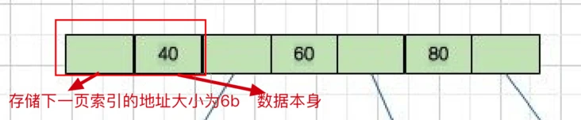

- 基础知识
  索引
  索引是一种用于快速查询和检索数据的数据结构。常见的索引结构有: B 树， B+树和 Hash。
  --->类比书的目录
  索引优点:
  a. 使用索引可以大大加快 数据的检索速度（大大减少检索的数据量）, 这也是创建索引的最主要的原因。
  b. 通过创建唯一性索引，可以保证数据库表中每一行数据的唯一性。
  索引缺点:
  创建索引和维护索引需要耗费许多时间。当对表中的数据进行增删改的时候，如果数据有索引，那么索引也需要动态的修改，会降低 SQL 执行效率。
  索引需要使用物理文件存储，也会耗费一定空间。
  
  但是，使用索引一定能提高查询性能吗?
  大多数情况下，索引查询都是比全表扫描要快的。但是如果数据库的数据量不大，那么使用索引也不一定能够带来很大提升。
- 背景知识
  B树和B+树数据结构区别
  ((62ac3744-38c3-4b55-8676-4dedff504ccd))
- MySQL索引的底层数据结构:B+树
  为什么不选择其他类型数据结构，例如hash，B树，红黑树
  不选hash原因
  1.Hash 冲突问题 ：我们上面也提到过Hash 冲突了，不过对于数据库来说这还不算最大的缺点。
  2.Hash 索引不支持顺序和范围查询(最大的缺点)： 假如我们要对表中的数据进行排序或者进行范围查询，那 Hash 索引可就不行了。
  
  不选B树原因
  1. B 树不管叶子节点还是非叶子节点，都会保存数据，这样导致在非叶子节点中能保存的指针数量变少,
  指针少的情况下要保存大量数据，只能增加树的高度，导致 IO 操作变多，查询性能变低。
  
  不选红黑树原因
  红黑树是二叉平衡搜索树,树的高度很大,IO操作相比B树都更多，查询性能更差.
  
  
  在 MySQL 中，MyISAM 引擎和 InnoDB 引擎都是使用 B+Tree 作为索引结构，但是，两者的实现方式差别？
  MyISAM 引擎中，B+Tree 叶节点的 data 域存放的是数据记录的地址。在索引检索的时候，首先按照 B+Tree 搜索算法搜索索引，如果指定的 Key 存在，则取出其 data 域的值，然后以 data 域的值为地址读取相应的数据记录。这被称为“非聚簇索引”。
  
  InnoDB 引擎中，其数据文件本身就是索引文件。相比 MyISAM，索引文件和数据文件是分离的，其表数据文件本身就是按 B+Tree 组织的一个索引结构，树的叶节点 data 域保存了完整的数据记录。这个索引的 key 是数据表的主键，因此 InnoDB 表数据文件本身就是主索引。这被称为“聚簇索引（或聚集索引）”，而其余的索引都作为辅助索引，辅助索引的 data 域存储相应记录主键的值而不是地址，这也是和 MyISAM 不同的地方。在根据主索引搜索时，直接找到 key 所在的节点即可取出数据；在根据辅助索引查找时，则需要先取出主键的值，再走一遍主索引。 因此，在设计表的时候，不建议使用过长的字段作为主键，也不建议使用非单调的字段作为主键，这样会造成主索引频繁分裂。
-
- 主键索引(Primary Key)
  数据表的主键列使用的就是主键索引。
  一张数据表有只能有一个主键，并且主键不能为 null，不能重复。
  叶子节点存储的是记录行数据
  
  InnoDB一定会有主键
  在 MySQL 的 InnoDB 的表中，当没有显示的指定表的主键时，
  InnoDB 会自动先检查表中是否有唯一索引且不允许存在null值的字段，如果有，则选择该字段为默认的主键，
  否则 InnoDB 将会自动创建一个 6Byte 的自增主键。
- 二级索引(辅助索引)
  叶子节点存储的是记录行的主键.
  唯一索引(没有作为主键的唯一索引)，普通索引，前缀索引等索引属于二级索引。
	- 唯一索引(Unique Key) ：唯一索引也是一种约束。唯一索引的属性列不能出现重复的数据，但是允许数据为 NULL，一张表允许创建多个唯一索引。 
	  建立唯一索引的目的大部分时候都是为了该属性列的数据的唯一性，而不是为了查询效率。
	- 普通索引(Index) ：普通索引的唯一作用就是为了快速查询数据，一张表允许创建多个普通索引，并允许数据重复和 NULL。
	- 前缀索引(Prefix) ：前缀索引只适用于字符串类型的数据。前缀索引是对文本的前几个字符创建索引，相比普通索引建立的数据更小， 因为只取前几个字符。
	- 全文索引(Full Text) ：全文索引主要是为了检索大文本数据中的关键字的信息，是目前搜索引擎数据库使用的一种技术。Mysql5.6 之前只有 MYISAM 引擎支持全文索引，5.6 之后 InnoDB 也支持了全文索引。
- 二级索引和主键索引区别
  主键索引叶子节点存储的是记录行数据
  二级索引叶子节点存储的是记录行的主键
  
  主键索引如下图
  
  二级索引如下图
  
- 聚簇索引与非聚簇索引
  聚簇索引:索引结构和数据一起存放的索引。主键索引属于聚簇索引。
  非聚簇索引:索引结构和数据分开存放的索引
- innodb文件
  .ibd文件就包含了表的索引和数据
- mysql一张表到底能存多少数据行？
  1. 查看innodb数据页有多大，2^14=16K=16384字节
  ```
  mysql> SHOW GLOBAL STATUS LIKE 'innodb_page_size';
  +------------------+-------+
  | Variable_name    | Value |
  +------------------+-------+
  | Innodb_page_size | 16384 |
  +------------------+-------+
  1 row in set (0.00 sec)
  ```
  2. 计算非叶子节点大小
  
  
  注意这张图是简化分析(实际数据页数据结构比这个复杂一些)
   
  实际数据页数据结构
   
  
  主键大小如果是bigint的话，占有8字节
  指向下一页索引的地址大小，占有6字节，这个寻址能力已经很高了
  4字节--->2的32次是4G,
  5字节--->4G*256=1T,
  6字节--->1T*256=256T,
  现有商用超大内存也就几个T，十几个T,寻址空间完全满足需求了
  节点大小=主键大小+指向下一页索引的地址大小=8+6=14bytes
  3. 根节点结算数据存储个数
  一个根节点存储数据个数:16K/14bytes=16384/14=1170
  4. 其余层节点计算
  第二层每个节点存储个数和根节点存储个数一样，也是1170
  第二层总数据存储个数=1170*1170=1368900(百万级别)
  
  5.叶子节点层计算
  聚簇索引叶子节点是存储记录数据的,如果记录字段很多的话,会占用不少空间，
  我们这儿假设平均一行记录1KB,那么
  一个叶子节点存储数据个数为：16K/1KB=16
  一般innodb就是三层存储数据结构，三层存储数据个数：1170*1170*16=21902400(2千万级别)
  总结
  
-
- 资料
  [mysql一张表到底能存多少数据行？](https://segmentfault.com/a/1190000039239998)