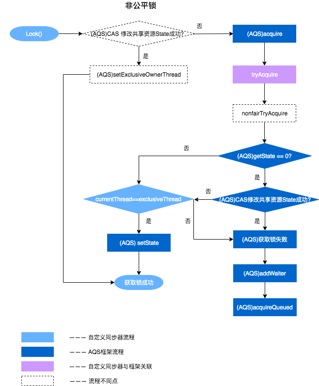
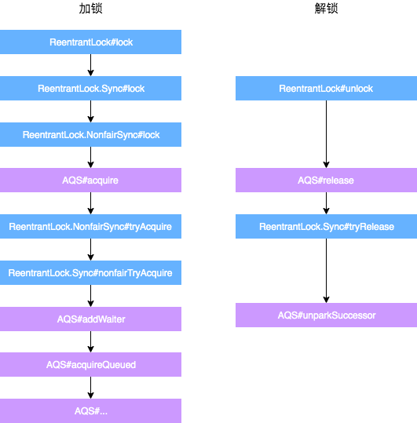

- 可重入锁,基于AQS抽象队列同步器框架设计实现
  [[AQS AbstractQueuedSynchronizer]]
- ReentrantLock公平锁和非公平锁
  id:: 62a0110a-97d3-4970-822d-38900c515148
  ((62a01030-1752-4dfb-a54c-606c810eb3b3)) 
  默认为非公平锁，效率高
  ```java
  /** Synchronizer providing all implementation mechanics */
  private final Sync sync;
  public ReentrantLock() {
      // 默认非公平锁
      sync = new NonfairSync();
  }
  public ReentrantLock(boolean fair) {
      sync = fair ? new FairSync() : new NonfairSync();
  }
  ```
  ReentrantLock源码实现公平锁和非公平锁
  基于AQS实现公平锁的
  ((62a01247-baa8-4152-b470-821a6ed112f5)) 
  公平锁的实现
  ```java
  //ReentrantLock.FairSync
  static final class FairSync extends Sync {
      final void lock() {
          acquire(1);
      }
      //来自AbstractQueuedSynchronizer.acquire(int arg)
      public final void acquire(int arg) {
          if (!tryAcquire(arg) &&
              acquireQueued(addWaiter(Node.EXCLUSIVE), arg))
              selfInterrupt();
      }
      protected final boolean tryAcquire(int acquires) {
          final Thread current = Thread.currentThread();
          int c = getState();
          if (c == 0) {
              // 1. 和非公平锁相比，这里多了一个判断：是否有线程在等待
              if (!hasQueuedPredecessors() &&
                  compareAndSetState(0, acquires)) {
                  setExclusiveOwnerThread(current);
                  return true;
              }
          }
          else if (current == getExclusiveOwnerThread()) {
              int nextc = c + acquires;
              if (nextc < 0)
                  throw new Error("Maximum lock count exceeded");
              setState(nextc);
              return true;
          }
          return false;
      }
  }
  ```
  非公平锁的实现
  ```java
  //ReentrantLock.NonfairSync
  static final class NonfairSync extends Sync {
      final void lock() {
          // 2. 和公平锁相比，这里会直接先进行一次CAS，成功就返回了,提高非公平锁在无锁竞争情况下的效率
          if (compareAndSetState(0, 1))
              setExclusiveOwnerThread(Thread.currentThread());
          else
              acquire(1);
      }
      // AbstractQueuedSynchronizer.acquire(int arg)
      public final void acquire(int arg) {
          if (!tryAcquire(arg) &&
              acquireQueued(addWaiter(Node.EXCLUSIVE), arg))
              selfInterrupt();
      }
      protected final boolean tryAcquire(int acquires) {
          return nonfairTryAcquire(acquires);
      }
  }
  /**
   * Performs non-fair tryLock.  tryAcquire is implemented in
   * subclasses, but both need nonfair try for trylock method.
   */
  final boolean nonfairTryAcquire(int acquires) {
      final Thread current = Thread.currentThread();
      int c = getState();
      if (c == 0) {
          // 这里没有对阻塞队列进行判断
          if (compareAndSetState(0, acquires)) {
              setExclusiveOwnerThread(current);
              return true;
          }
      }
      else if (current == getExclusiveOwnerThread()) {
          int nextc = c + acquires;
          if (nextc < 0) // overflow
              throw new Error("Maximum lock count exceeded");
          setState(nextc);
          return true;
      }
      return false;
  }
  ```
  
  
  公平锁和非公平锁实现区别
  1. 提高非公平锁在无锁竞争情况下的效率:非公平锁在调用 lock 后，首先就会调用 CAS 尝试进行一次抢锁动作，如果这个时候恰巧锁没有被占用，那么直接就获取到锁返回了。
  2. 非公平锁在 CAS 失败后，和公平锁一样都会进入到 tryAcquire 方法，在 tryAcquire 方法中，如果发现锁这个时候被释放了（state == 0），非公平锁会直接 CAS 抢锁，但是公平锁会判断等待队列是否有线程处于等待状态(通过调用AQS的hasQueuedPredecessors方法判断)，如果有则不去抢锁，乖乖排到后面。
- ReentrantLock非公平锁加锁解锁过程分析
  非公平锁上锁大体流程图
  
  
  加锁过程描述:(按图说话)
  1. 通过 ReentrantLock 的加锁方法 Lock 进行加锁操作。
  2. 会调用到内部类 Sync 的 Lock 方法，由于 Sync#lock 是抽象方法，根据 ReentrantLock 初始化选择的公平锁和非公平锁，执行相关内部类的 Lock 方法，本质上都会执行 AQS 的 Acquire 方法。
  3. AQS 的 Acquire 方法会执行 tryAcquire 方法，但是由于 tryAcquire是钩子方法 需要自定义同步器实现，因此执行了 ReentrantLock 中的 tryAcquire 方法，由于 ReentrantLock 是通过公平锁和非公平锁内部类实现的 tryAcquire 方法，因此会根据锁类型不同，执行不同的 tryAcquire。
  4. tryAcquire 是获取锁逻辑，获取失败后，会执行框架 AQS 的后续逻辑(将线程放到FIFO队列锁等待锁资源的释放来唤醒队列)跟 ReentrantLock 自定义同步器无关。
  解锁过程描述:(按图说话)
  1. 通过 ReentrantLock 的解锁方法 Unlock 进行解锁。
  2. Unlock 会调用内部类 Sync 的 Release 方法，该方法继承于 AQS。
  3. Release 中会调用 tryRelease 方法，tryRelease 是钩子方法需要自定义同步器实现，tryRelease 只在 ReentrantLock 中的 Sync 实现，因此可以看出，释放锁的过程，并不区分是否为公平锁。
  4. 释放成功后，所有后续处理由 AQS 框架完成(唤醒FIFO队列锁的线程来竞争锁资源)，与自定义同步器无关。
- 资料
  [从ReentrantLock的实现看AQS的原理及应用-转自美团技术团队](https://javaguide.cn/java/concurrent/reentrantlock.html#%E5%89%8D%E8%A8%80)
-