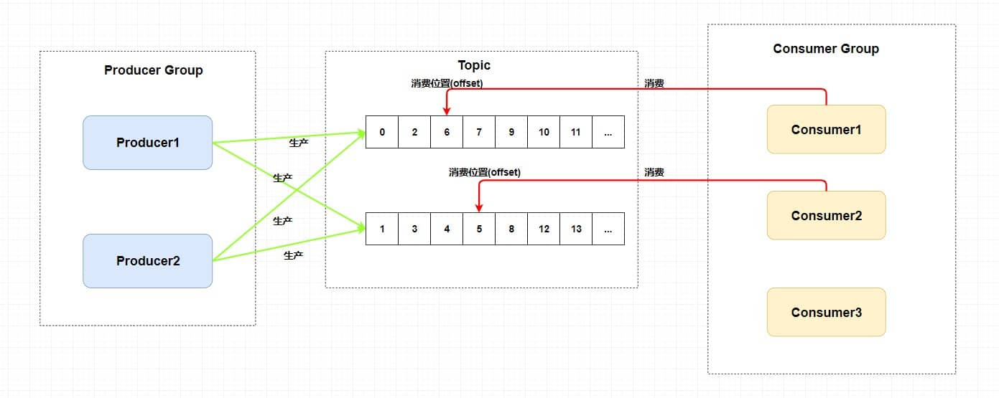
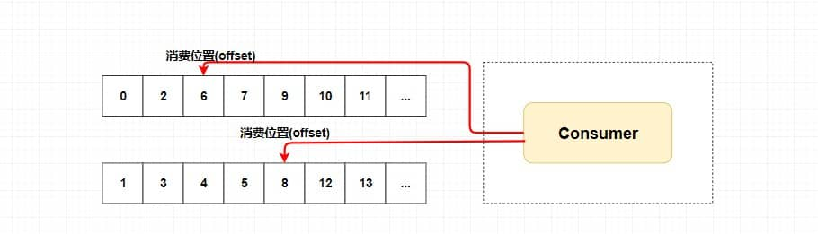
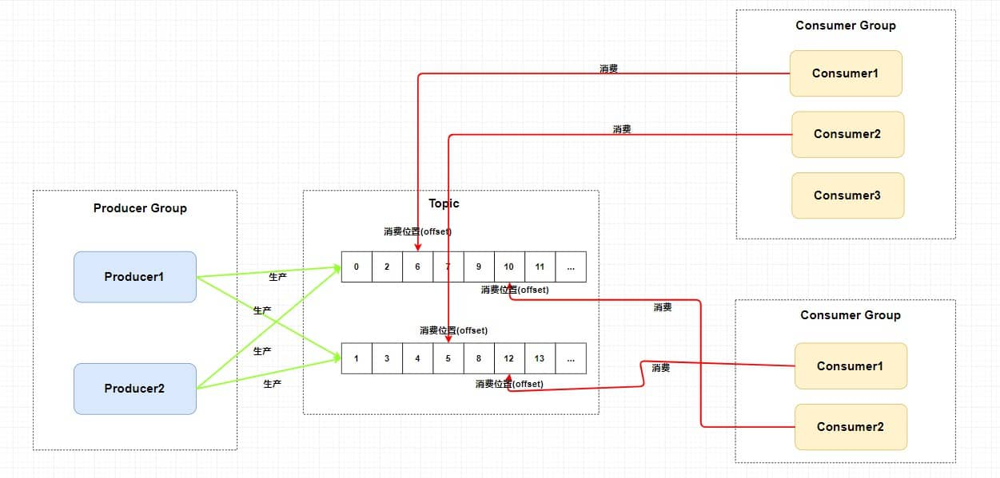
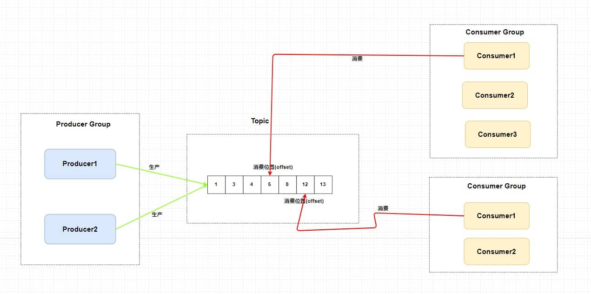
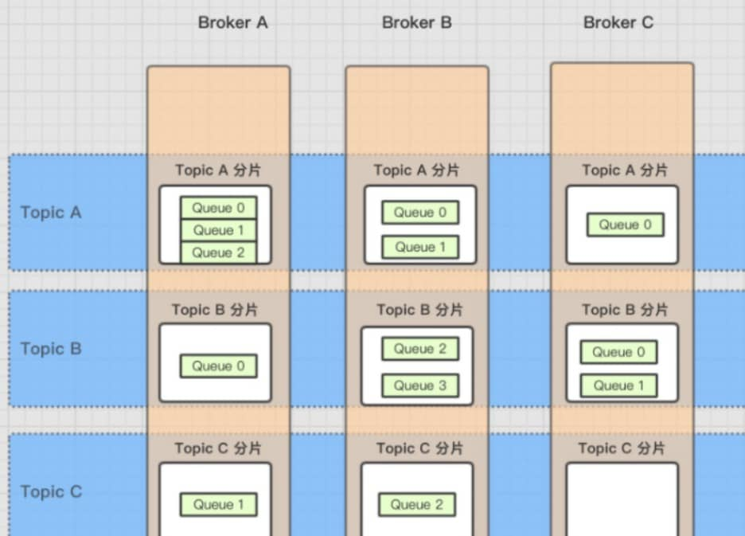
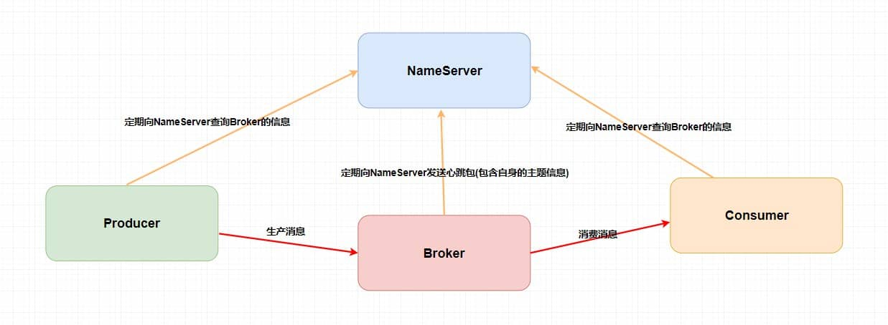
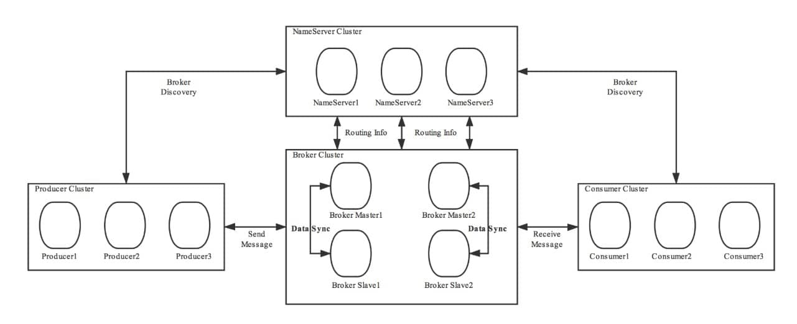

- `RocketMQ` 是一个**队列模型**的消息中间件，具有**高性能、高可靠、高实时、分布式**的特点。
  它是一个采用 `Java` 语言开发的分布式的消息系统，由阿里巴巴团队开发，在2016年底贡献给 `Apache` ，成为了 `Apache` 的一个顶级项目。 
  在阿里内部， `RocketMQ` 很好地服务了集团大大小小上千个应用，在每年的双十一当天，更有不可思议的万亿级消息通过 `RocketMQ` 流转。
- RocketMQ的消息模型
  `RocketMQ` 中的消息模型就是按照**主题模型**所实现的。 ((62b99489-5b99-41ed-9798-bcdb3a1587e6))
  
  整个图中有 `Producer Group` 、 `Topic` 、 `Consumer Group` 三个角色`
  1. Producer Group` 生产者组： 代表某一类的生产者，比如我们有多个秒杀系统作为生产者，这多个合在一起就是一个 `Producer Group` 生产者组，它们一般生产相同的消息。`
  2. Consumer Group` 消费者组： 代表某一类的消费者，比如我们有多个短信系统作为消费者，这多个合在一起就是一个 `Consumer Group` 消费者组，它们一般消费相同的消息。`
  3. Topic` 主题： 代表一类消息，比如订单消息，物流消息等等。
  
  生产者组中的生产者会向主题发送消息，而**主题中存在多个队列**，生产者每次生产消息之后是指定主题中的某个队列发送消息的。
  
  每个主题中都有多个队列(分布在不同的 `Broker` 中，如果是集群的话， `Broker` 又分布在不同的服务器中)，集群消费模式下，一个消费者集群多台机器共同消费一个 `topic` 的多个队列，**一个队列只会被一个消费者消费**。如果某个消费者挂掉，分组内其它消费者会接替挂掉的消费者继续消费。就像上图中 `Consumer1` 和 `Consumer2` 分别对应着两个队列，而 `Consumer3` 是没有队列对应的，所以一般来讲要控制**消费者组中的消费者个数和主题中队列个数相同**。
  当然也可以消费者个数小于队列个数，只不过不太建议。如下图。
  
	- **每个消费组在每个队列上维护一个消费位置**，为什么呢？
	  因为我们刚刚画的仅仅是一个消费者组，我们知道在发布订阅模式中一般会涉及到多个消费者组，而每个消费者组在每个队列中的消费位置都是不同的。如果此时有多个消费者组，那么消息被一个消费者组消费完之后是不会删除的(因为其它消费者组也需要呀)，它仅仅是为每个消费者组维护一个**消费位移(offset)**，每次消费者组消费完会返回一个成功的响应，然后队列再把维护的消费位移加一，这样就不会出现刚刚消费过的消息再一次被消费了。
	  
	- **为什么一个主题中需要维护多个队列**？
	  答案是**提高并发能力**。的确，每个主题中只存在一个队列也是可行的。你想一下，如果每个主题中只存在一个队列，这个队列中也维护着每个消费者组的消费位置，这样也可以做到**发布订阅模式**。如下图。
	   
	  但是，这样我生产者是不是只能向一个队列发送消息？又因为需要维护消费位置所以一个队列只能对应一个消费者组中的消费者，这样是不是其他的 `Consumer` 就没有用武之地了？从这两个角度来讲，并发度一下子就小了很多。
	- 所以总结来说， `RocketMQ` 通过**使用在一个 `Topic` 中配置多个队列并且每个队列维护每个消费者组的消费位置**实现了**主题模式/发布订阅模式**。
- 消费者组消费特点
  `RocketMQ` 通过**使用在一个 `Topic` 中配置多个队列并且每个队列维护每个消费者组的消费位置**实现了**主题模式/发布订阅模式**。
  
  1. 集群消费模式下，一个消费者集群多台机器共同消费一个 `topic` 的多个队列，**一个队列只会被一个消费者消费**。
  2. 如果某个消费者挂掉，分组内其它消费者会接替挂掉的消费者继续消费
  3. **每个消费组在topic每个队列上维护一个消费位置**
- RocketMQ的架构图
  id:: 62bac242-973f-4555-8de9-69347418ebc4
  `RocketMQ` 技术架构中有四大角色 `NameServer` 、 `Broker` 、 `Producer` 、 `Consumer`.
	- 1. `Broker` ： 主要负责消息的存储、投递和查询以及服务高可用保证。说白了就是消息队列服务器嘛，生产者生产消息到 `Broker` ，消费者从 `Broker` 拉取消息并消费.
	  这里，我还得普及一下关于 `Broker` 、 `Topic` 和 队列的关系。上面我讲解了 `Topic` 和队列的关系——一个 `Topic` 中存在多个队列，那么这个 `Topic` 和队列存放在哪呢？**
	  一个 `Topic` 分布在多个 `Broker` 上，一个 `Broker` 可以配置多个 `Topic` ，它们是多对多的关系**。
	  如果某个 `Topic` 消息量很大，应该给它多配置几个队列(上文中提到了提高并发能力)，并且**尽量多分布在不同 `Broker` 上，以减轻某个 `Broker` 的压力**。`
	  Topic` 消息量都比较均匀的情况下，如果某个 `broker` 上的队列越多，则该 `broker` 压力越大。
	  
	- 2. `NameServer` ：它其实也是一个**注册中心**，主要提供两个功能：**Broker管理**和**路由信息管理**。说白了就是 `Broker` 会将自己的信息注册到 `NameServer` 中，此时 `NameServer` 就存放了很多 `Broker` 的信息(Broker的路由表)，消费者和生产者就从 `NameServer` 中获取路由表然后照着路由表的信息和对应的 `Broker` 进行通信(生产者和消费者定期会向 `NameServer` 去查询相关的 `Broker` 的信息)。
	  --->类似`ZooKeeper` 和 `Spring Cloud` 中的 `Eureka`
	- 3. `Producer` ： 消息发布的角色，支持分布式集群方式部署。说白了就是生产者。
	- 4. `Consumer` ： 消息消费的角色，支持分布式集群方式部署。支持以push推，pull拉两种模式对消息进行消费(不过RocketMQ的push模式本质上还是pull模式)。同时也支持集群方式和广播方式的消费，它提供实时消息订阅机制。说白了就是消费者。
	  听完了上面的解释你可能会觉得，这玩意好简单。不就是这样的么？
	  
	- 问题：RocketMQ为什么要引入NameServer角色
	  直接 `Producer` 、 `Consumer` 和 `Broker` 直接进行生产消息，消费消息不就好了么？
	  我们上文提到过 `Broker` 是需要保证高可用的，如果整个系统仅仅靠着一个 `Broker` 来维持的话，那么这个 `Broker` 的压力会不会很大？所以我们需要使用多个 `Broker`集群 来保证**负载均衡**。
	  如果说，我们的消费者和生产者直接和多个 `Broker` 相连，那么当 `Broker` 修改的时候必定会牵连着每个生产者和消费者，这样就会产生耦合问题，而 `NameServer` 注册中心就是用来解决这个问题的。
- RocketMQ集群模式
  当然， `RocketMQ` 中的技术架构肯定不止前面那么简单，因为上面图中的四个角色都是需要做集群的。 ((62bac242-973f-4555-8de9-69347418ebc4)) 
  给出一张官网的架构图，大家尝试理解一下。
  
  其实和我们最开始画的那张乞丐版的架构图也没什么区别，主要是一些细节上的差别。听我细细道来🤨。
  1. 第一、broker集群：我们的 `Broker` **做了集群并且还进行了主从部署**，由于消息分布在各个 `Broker` 上，一旦某个 `Broker` 宕机，则该 `Broker` 上的消息读写都会受到影响。所以 `Rocketmq` 提供了 `master/slave` 的结构， `[:span {} " "]` 定时从 `master` 同步数据(同步刷盘或者异步刷盘)，如果 `master` 宕机，**则 `slave` 提供消费服务，但是不能写入消息**(后面我还会提到哦)。
  2. 第二、NameServer集群:为了保证 `HA` ，我们的 `NameServer` 也做了集群部署，但是请注意它是**去中心化**的。也就意味着它没有主节点，你可以很明显地看出 `NameServer` 的所有节点是没有进行 `Info Replicate` 的，在 `RocketMQ` 中是通过**单个Broker和所有NameServer保持长连接**，并且在每隔30秒 `Broker` 会向所有 `Nameserver` 发送心跳，心跳包含了自身的 `Topic` 配置信息，这个步骤就对应这上面的 `Routing Info` 。
  --->每个节点存储状态完全一致,NameServer集群保证CAP中的AP
  3. 第三、发消息集群:在生产者需要向 `Broker` 发送消息的时候，**需要先从 `NameServer` 获取关于 `Broker` 的路由信息**，然后通过**轮询**的方法去向每个队列中生产数据以达到**负载均衡**的效果。
  4. 第四、消费消息集群:消费者通过 `NameServer` 获取所有 `Broker` 的路由信息后，向 `Broker` 发送 `Pull` 请求来获取消息数据。 
  `Consumer` 可以以两种模式启动——**广播（Broadcast）和集群（Cluster）**。
  广播模式下，一条消息会发送给**同一个消费组中的所有消费者**，
  集群模式下消息只会发送给一个消费者。
- 如何解决顺序消费
  在上面的技术架构介绍中，我们已经知道了** `RocketMQ` 在主题上是无序的、它只有在队列层面才是保证有序**的。
  这又扯到两个概念——**普通顺序**和**严格顺序**。
  1. 普通顺序是指 消费者通过**同一个消费队列收到的消息是有顺序的**，不同消息队列收到的消息则可能是无顺序的。普通顺序消息在 `Broker` **重启情况下不会保证消息顺序性**(短暂时间) 。
  2. 严格顺序是指 消费者收到的**所有消息**均是有顺序的。严格顺序消息**即使在异常情况下也会保证消息的顺序性**。
  但是，严格顺序看起来虽好，实现它可会付出巨大的代价。如果你使用严格顺序模式， `Broker` 集群中只要有一台机器不可用，则整个集群都不可用。你还用啥？现在主要场景也就在 `binlog` 同步。--->binlog需要保证严格的顺序性
  一般而言，我们的 `MQ` 都是能容忍短暂的乱序，所以推荐使用普通顺序模式。
- 如何解决重复消费
- 如何解决消息丢失
- 消息堆积问题
- RocketMQ推拉模式
- 资料