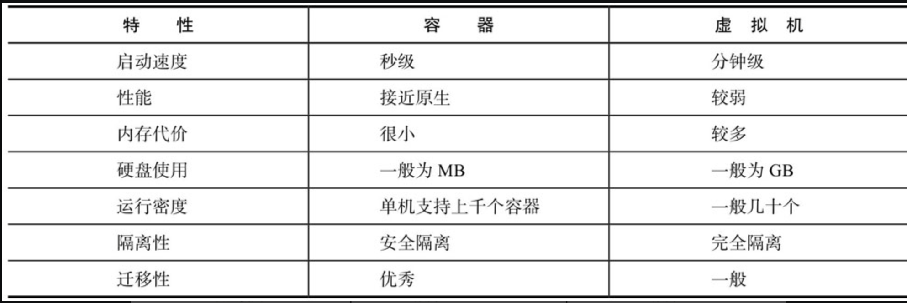
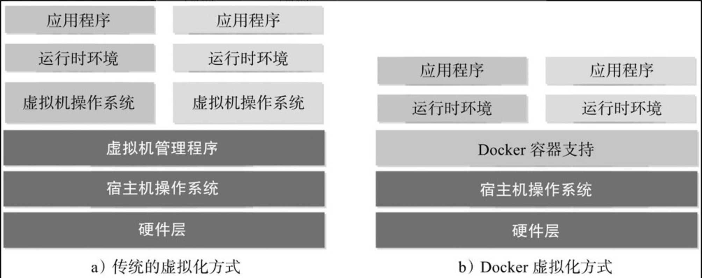

- 虚拟化--->docker的容器化(轻量级容器化)
  
  >IBM DeveloperWorks网站关于容器技术的描述十分准确：“容器有效地将由单个操作系统管理的资源划分到孤立的组中，以更好地在孤立的组之间平衡有冲突的资源使用需求。与虚拟化相比，这样既不需要指令级模拟，也不需要即时编译。容器可以在核心CPU本地运行指令，而不需要任何专门的解释机制。此外，也避免了准虚拟化（para-virtualization）和系统调用替换中的复杂性。”
- 什么是docker
  基于go语法开发的开源容器项目。
  
  Docker的构想是要实现“Build, Ship and Run Any App, Anywhere”，即通过对应用的封装（Packaging）、分发（Distribution）、部署（Deployment）、运行（Runtime）生命周期进行管理，达到应用组件级别的“一次封装，到处运行”。
  这里的应用组件，既可以是一个Web应用、一个编译环境，也可以是一套数据库平台服务，甚至是一个操作系统或集群。
  
  Linux容器技术——巨人的肩膀
  最重要的就是Linux容器（Linux Containers, LXC）技术。
  
  从Linux容器到Docker
	- 为什么使用docker
		- docker容器的好处
		  
		  在云时代，开发者创建的应用必须要能很方便地在网络上传播，也就是说应用必须脱离底层物理硬件的限制；同时必须是“任何时间任何地点”可获取的。因此，开发者们需要一种新型的创建分布式应用程序的方式，快速分发和部署，而这正是Docker所能够提供的最大优势。
		  
		  举个简单的例子，假设用户试图基于最常见的LAMP（Linux+Apache+MySQL+PHP）组合来构建网站。按照传统的做法，首先需要安装Apache、MySQL和PHP以及它们各自运行所依赖的环境；之后分别对它们进行配置（包括创建合适的用户、配置参数等）；经过大量的操作后，还需要进行功能测试，看是否工作正常；如果不正常，则进行调试追踪，意味着更多的时间代价和不可控的风险。可以想象，如果应用数目变多，事情会变得更加难以处理。
		  
		  更为可怕的是，一旦需要服务器迁移（例如从亚马逊云迁移到其他云），往往需要对每个应用都进行重新部署和调试。这些琐碎而无趣的“体力活”，极大地降低了用户的工作效率。究其根源，是这些应用直接运行在底层操作系统上，无法保证同一份应用在不同的环境中行为一致。
		  
		  docker对此的解决办法
		  而Docker提供了一种更为聪明的方式，通过容器来打包应用、解耦应用和运行平台。这意味着迁移的时候，只需要在新的服务器上启动需要的容器就可以了，无论新旧服务器是否是同一类型的平台。这无疑将帮助我们节约大量的宝贵时间，并降低部署过程出现问题的风险。
		- docker在开发和运维的好处
		  对开发和运维（DevOps）人员来说，最梦寐以求的效果可能就是一次创建或配置，之后可以在任意地方、任意时间让应用正常运行，而Docker恰恰是可以实现这一终极目标的“瑞士军刀”。
		  在开发和运维过程中，Docker具有如下几个方面的优势：
			- 更快速的交付和部署。
			  使用Docker，开发人员可以使用镜像来快速构建一套标准的开发环境；开发完成之后，测试和运维人员可以直接使用完全相同的环境来部署代码。只要是开发测试过的代码，就可以确保在生产环境无缝运行。
			  Docker可以快速创建和删除容器，实现快速迭代，节约开发、测试、部署的大量时间。并且，整个过程全程可见，使团队更容易理解应用的创建和工作过程。
			- 更高效的资源利用。(这是与传统虚拟化技术相比)
			  运行Docker容器不需要额外的虚拟化管理程序（Virtual Machine Manager, VMM，以及Hypervisor）的支持，Docker是内核级的虚拟化，可以实现更高的性能，同时对资源的额外需求很低。与传统虚拟机方式相比，Docker的性能要提高1～2个数量级。
			- 更轻松的迁移和扩展
			  Docker容器几乎可以在任意的平台上运行，包括物理机、虚拟机、公有云、私有云、个人电脑、服务器等，同时支持主流的操作系统发行版本。这种兼容性让用户可以在不同平台之间轻松地迁移应用。
			- 更简单的更新管理
			  使用Dockerfile，只需要小小的配置修改，就可以替代以往大量的更新工作。所有修改都以增量的方式被分发和更新，从而实现自动化并且高效的容器管理。
			  例如jdk8升级到jdk9
		- docker容器技术与传统虚拟化技术比较
		  
		  --->CPU,磁盘，内存
		  Docker通过类似Git设计理念的操作来方便用户获取、分发和更新应用镜像，存储复用，增量更新；
		  Docker通过Dockerfile支持灵活的自动化创建和部署机制，以提高工作效率，并标准化流程。
	- docker与虚拟化
	  >在[计算机技术](https://zh.m.wikipedia.org/wiki/%E8%AE%A1%E7%AE%97%E6%9C%BA%E6%8A%80%E6%9C%AF)中，**虚拟化（技术）**或**虚拟技术**（英语：Virtualization）是一种资源管理技术，是将计算机的各种[实体资源](https://zh.m.wikipedia.org/wiki/%E8%B3%87%E6%BA%90_(%E8%A8%88%E7%AE%97%E6%A9%9F%E7%A7%91%E5%AD%B8))（[CPU](https://zh.m.wikipedia.org/wiki/CPU)、[内存](https://zh.m.wikipedia.org/wiki/%E5%86%85%E5%AD%98)、[磁盘空间](https://zh.m.wikipedia.org/wiki/%E7%A3%81%E7%9B%98%E7%A9%BA%E9%97%B4)、[网路适配器](https://zh.m.wikipedia.org/wiki/%E7%B6%B2%E8%B7%AF%E9%81%A9%E9%85%8D%E5%99%A8)等），予以抽象、转换后呈现出来并可供分割、组合为一个或多个电脑组态环境。由此，打破实体结构间的不可切割的障碍，使用户可以比原本的组态更好的方式来应用这些电脑硬体资源。这些资源的新虚拟部份是不受现有资源的架设方式，地域或物理组态所限制。一般所指的虚拟化资源包括计算能力和资料储存---维基百科
	  
	  可见，虚拟化的核心是对资源的抽象，目标往往是为了在同一个主机上同时运行多个系统或应用，从而提高系统资源的利用率，并且带来降低成本、方便管理和容错容灾等好处。
		- 虚拟化技术分类
		  从大类上分，虚拟化技术可分为基于硬件的虚拟化和基于软件的虚拟化。
		  真正意义上的基于硬件的虚拟化技术不多见，少数如网卡中的单根多IO虚拟化（Single Root I/O Virtualization and Sharing Specification, SR-IOV）等技术，也超出了本书的讨论范畴。
		  基于软件的虚拟化从对象所在的层次，又可以分为应用虚拟化和平台虚拟化（通常说的虚拟机技术即属于这个范畴）。前者一般指的是一些模拟设备或诸如Wine这样的软件，后者又可以细分为几个子类：
		  ❑ 完全虚拟化。虚拟机模拟完整的底层硬件环境和特权指令的执行过程，客户操作系统无须进行修改。例如IBM p和z系列的虚拟化、VMware Workstation、VirtualBox、QEMU等；
		  ❑ 硬件辅助虚拟化。利用硬件（主要是CPU）辅助支持（目前x86体系结构上可用的硬件辅助虚拟化技术包括Intel-VT和AMD-V）处理敏感指令来实现完全虚拟化的功能，客户操作系统无须修改，例如VMware Workstation, Xen,KVM；
		  ❑ 部分虚拟化。只针对部分硬件资源进行虚拟化，客户操作系统需要进行修改。现在有些虚拟化技术的早期版本仅支持部分虚拟化；
		  ❑ 超虚拟化（paravirtualization）。部分硬件接口以软件的形式提供给客户机操作系统，客户操作系统需要进行修改，例如早期的Xen；
		  ❑ 操作系统级虚拟化。内核通过创建多个虚拟的操作系统实例（内核和库）来隔离不同的进程。容器相关技术即在这个范畴。
		  Docker以及其他容器技术都属于操作系统虚拟化这个范畴，操作系统虚拟化最大的特点就是不需要额外的supervisor支持
		  Docker和常见的虚拟机方式的不同之处。
		  
		  
		  传统方式是在硬件层面实现虚拟化，需要有额外的虚拟机管理应用和虚拟机操作系统层。Docker容器是在操作系统层面上实现虚拟化，直接复用本地主机的操作系统，因此更加轻量级。
- docker三大核心概念
  [[docker镜像(image)]]
  [[docker容器(container)]]
  [[docker仓库(repository)]]
  docker的生命周期
- 安装
  mac的brew的cask已经支持 Docker Desktop for Mac，因此可以很方便的使用 Homebrew Cask 来进行安装：
  ```
  brew install --cask docker
  docker --version
  ```
  下面启动一个Nginx容器，检查能正确获取镜像并运行：
  ```
  docker run -d -p 80:80 --name webserver nginx
  ```
- 资料
  [docker官网](https://www.docker.com/)
  [github源码地址](https://github.com/docker)