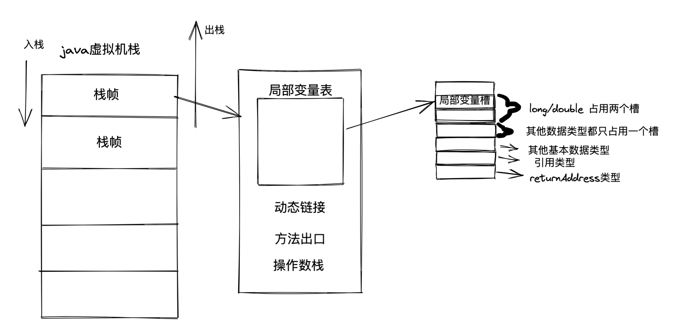
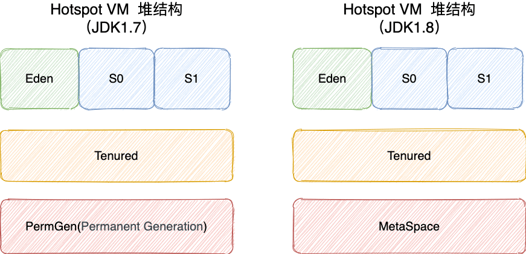
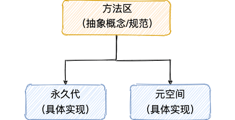

- 由JVM虚拟机规范制定
- 内存区域图
  JDK 1.8 之前:
  
  JDK8之后:
  方法区移除，用元空间替代
  
- java内存区域划分
	- 程序计数器
	  定义:标识线程执行的字节码指令位置,读取程序计数器获取下一条执行指令位置
	  --->类似于cpu的寄存器计数器
	  作用:
	  1. 进行程序流程控制：顺序执行，分支，循环，跳转（break,continue,case标签等），方法，异常等都需要依赖它
	  2. 线程上下文切换需要标识线程当前执行指令位置
	- 虚拟机栈
	  定义：java方法执行的内存模型
	  运行：java方法开始执行，创建栈帧，入栈，方法执行完毕，出栈，无论方法正常完成还是异常完成都算作方法结束。
	  内存结构:
	  栈帧:
	  局部变量表:
	  局部变量表占用内存空间在编译期就能确认大小，运行期间不会变更(而对象实例大小只能在运行期才能确认)
	  局部变量槽:数据类型大小=数据类型占用数量*每个局部变量槽大小（64位虚拟机一个局部变量槽64字节）
	  动态链接:动态链接的作用就是为了将符号引用转换为调用方法的直接引用。
	  方法出口:
	  操作数栈:
	   
	  内存错误异常:
	  OutOfMemoryError:
	  1. 线程申请内存空间不足时
	  2. 当栈支持动态扩展情况下（其他虚拟机实现,hotspot虚拟机实现不支持），扩展栈空间内存空间不足时
	  StackOverFlowError:
	  当栈不支持动态扩展（hopspot虚拟机）线程栈空间无法容纳新栈帧时候
	  而不是之前理解的：线程超过栈深度上限就抛出该错误异常，因为hotspot虚拟机没有直接设置栈深度的参数，而是通过设置栈空间大小(Stock Size) -Xss128k间接控制栈深度
	- 本地方法栈
	  定义:native本地方法执行的内存模型
	  基本和虚拟机栈差不多
	- java堆(也叫GC堆 Garbage Collected Heap)
	  定义:java所有对象实例和数组对象绝大部分都在堆上分配
	  这句话不绝对了，是因为一系列编译优化技术（逃逸分析技术等）的出现，例如对象栈上分配，标量替换等。
	  内存结构:
	  1. 普通堆:
	   
	  2. 线程私有分配缓冲区 TLAB（Thread Local Allocation Buffer）:
	  提高多线程下内存分配效率--->减少并发 分配锁竞争
	  内存错误异常:
	  OutOfMemoryError:当对象实例内存空间不够分配，且堆无法扩展时
	- 方法区
	  内存结构
	  方法区和永久代和元空间的关系--->类似接口与实现类的关系
	  
	  永久代: JDK 1.8 之前的方法区实现，
	  元空间:JDK 1.8 及以后方法区实现,直接在本地内存中实现元空间
	  与永久代很大的不同就是，如果不指定大小的话，随着更多类的创建，虚拟机会耗尽所有可用的系统内存。
	  为什么要把永久代替换成元空间
	  hotspot永久代实现（已废弃，自己都承认永久代是一个不合理的设计），其他虚拟机例如BEA jrocket，IBM J9没有永久代概念
	  1.许多框架，机制存在动态类加载,可能会导致OutOfMemoryError内存异常（有上限 -XX：MaxPermSize）
	  2.极少数方法（例如String.intern）因为会因为永久代的原因导致不同虚拟机下有不同的表现
	  
	  运行时常量池（Runtime Constant Pool）
	  存储数据类型:
	  1. Class类文件结构中的常量池表
	  存放编译期生成的各种字面量与符号引用,存入时机：类加载后存入运行时常量池
	  2. 运行时也可以将常量存放入运行时常量池
	  最典型场景：String.intern方法
	  
	  JVM参数
	  -XX：MaxMetaspaceSize 标志设置最大元空间大小，默认值为 unlimited，这意味着它只受系统内存的限制。
	  -XX：MetaspaceSize 调整标志定义元空间的初始大小如果未指定此标志，则 Metaspace 将根据运行时的应用程序需求动态地重新调整大小。
	  jdk8之前的永久代设置大小
	  -XX:PermSize=N //方法区 (永久代) 初始大小
	  -XX:MaxPermSize=N //方法区 (永久代) 最大大小
	- 直接内存
	- java内存区域比较汇总表
	  
	  |内存区域|生命周期|内存错误异常|内存大小|存储数据类型|内存分配大小|内存回收|
	  |---|---|---|---|---|---|---|
	  |程序计数器|线程私有|虚拟机规范唯一没有规定抛出内存异常|一般很小||确定性|确定性|
	  |虚拟机栈|线程私有|OutOfMemoryError,StackOverFlowError| -Xss128k指定栈空间大小|局部变量,方法出口|编译器可知|确定性|
	  |本地方法栈|线程私有|OutOfMemoryError,StackOverFlowError||局部变量,方法出口|编译器可知|确定性|
	  |堆|线程共有|OutOfMemoryError|-Xmx最大值,-Xms 最小值|对象实例|动态分配|垃圾回收器|
	  |方法区(逻辑概念上)|线程共享|OutOfMemoryError|-XX:MaxMetaspaceSize最大值,-XX:MetaspaceSize，(jdk8之前:-XX:PermSize永久代大小，-XX:MaxPermSize永久代最大大小）|类信息、字段信息、方法信息、常量、静态变量、即时编译器编译后的代码缓存等数据|动态分配|垃圾回收器|
	  |直接内存|线程共享|OutOfMemoryError|||动态分配|垃圾回收器|
	- 典型特征异常报错及其解决方案
		- java堆典型错误
		  1. java.lang.OutOfMemoryError: Java heap space 
		  假如在创建新的对象时, 堆内存中的空间不足以存放新创建的对象, 就会引发此错误。
		  解决方案
		  2. java.lang.OutOfMemoryError: GC Overhead Limit Exceeded 
		  当 JVM 花太多时间执行垃圾回收并且只能回收很少的堆空间时，就会发生此错误。
		  解决方案
		- java方法栈和本地方法典型错误
		  1. java.lang.StackOverflowError:
		  当栈不支持动态扩展（hopspot虚拟机）线程栈空间无法容纳新栈帧时候
		  解决方案
		  2. java.lang.OutOfMemoryError:unable to create native thread:possiblyout of memory or process/resource limits reached
		  线程申请内存空间不足时,可能需要在32位虚拟机上才可复现
		  解决方案
		- 方法区典型错误
		  1. java.lang.OutOfMemoryError: PermGen space
		  jdk6
		  解决方案
		  2. java.lang.OutOfMemoryError: Metaspace
		  jdk8
		  解决方案
		- 本机直接内存异常
		  1. java.lang.OutOfMemoryError
		  解决方案
- java堆
-