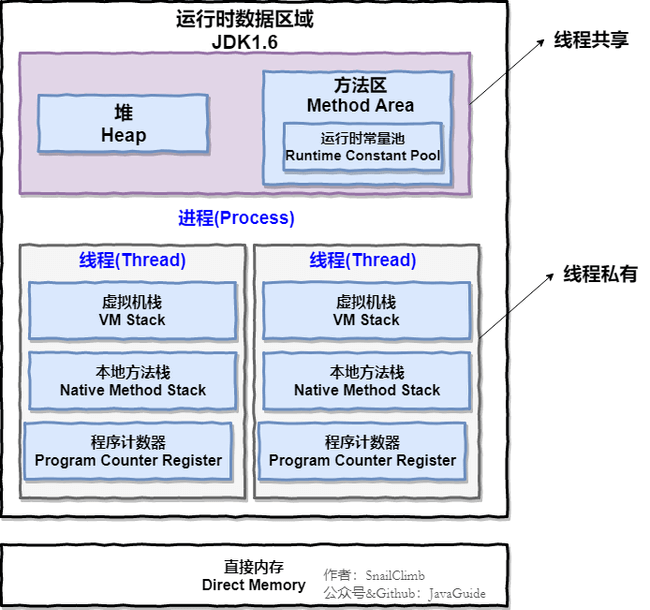
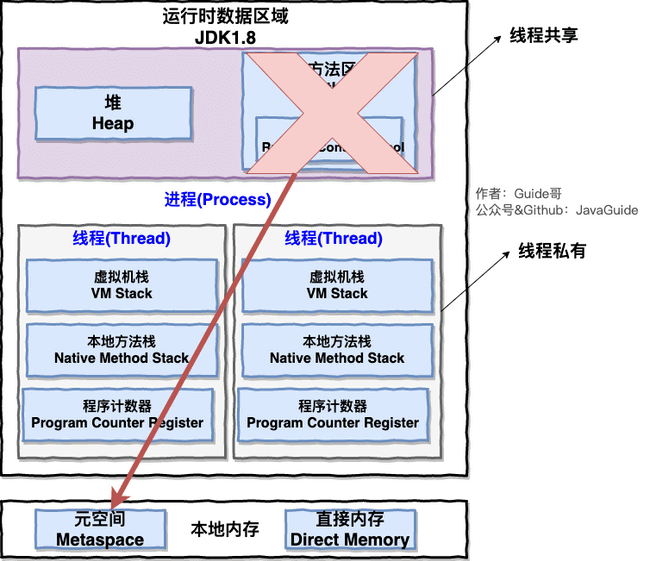
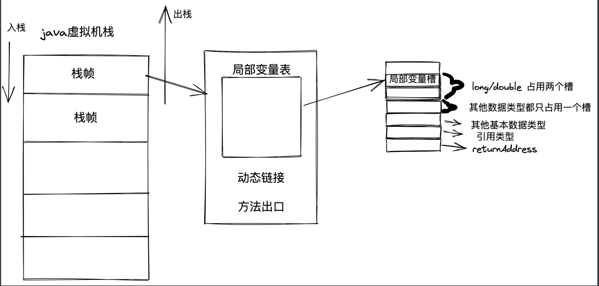

- 由JVM虚拟机规范制定
- 内存区域图
  JDK 1.8 之前:
  
  JDK8之后:
  方法区移除，用元空间替代
  
- java内存区域划分
	- 程序计数器
	  定义:标识线程执行的字节码指令位置,读取程序计数器获取下一条执行指令位置
	  --->类似于cpu的寄存器计数器
	  作用:
	  1. 进行程序流程控制：顺序执行，分支，循环，跳转（break,continue,case标签等），方法，异常等都需要依赖它
	  2. 线程上下文切换需要标识线程当前执行指令位置
	- 虚拟机栈
	  定义：java方法执行的内存模型
	  运行：java方法开始执行，创建栈帧，入栈，方法执行完毕，出栈，无论方法正常完成还是异常完成都算作方法结束。
	  内存结构:
	  栈帧:
	  局部变量表
	  动态链接
	  方法出口
	  {:height 521, :width 1072}
	  内存错误异常:
	- 本地方法栈
	- 堆
	- 方法区
	- 直接内存
	- java内存区域比较汇总表
	  
	  |内存区域|生命周期|内存错误异常|内存大小|
	  |---|---|---|---|
	  |程序计数器|线程私有|虚拟机规范唯一没有规定抛出内存异常|一般很小|
	  |虚拟机栈|线程私有|OutOfMemoryError,StackOverFlowError||
	  |本地方法栈|线程私有|OutOfMemoryError,StackOverFlowError||
	  |堆|线程共有|OutOfMemoryError||
	  |方法区(逻辑概念上)|线程共享|OutOfMemoryError||
	  |直接内存|线程共享|OutOfMemoryError||
-