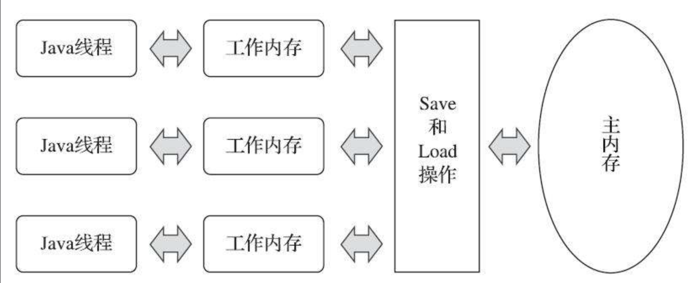
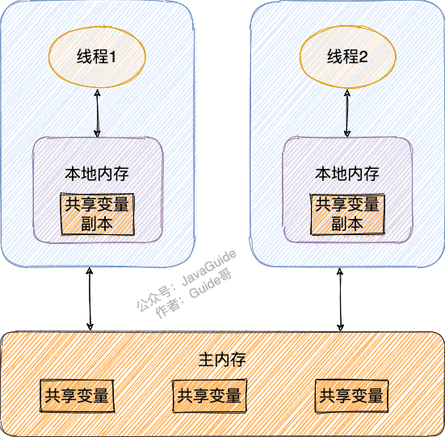
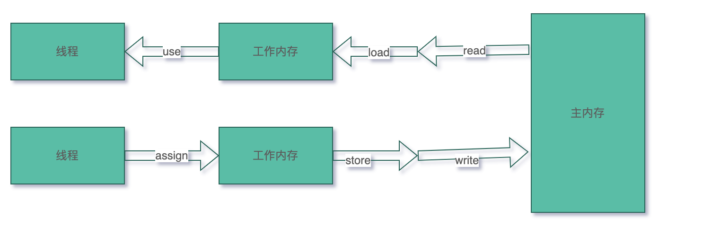
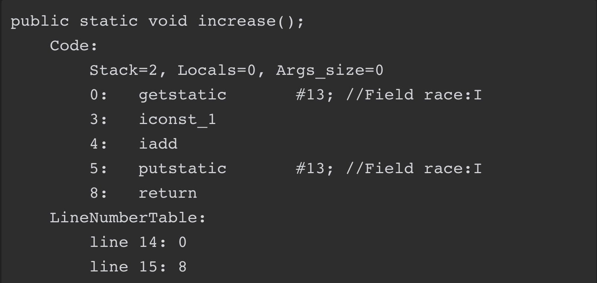
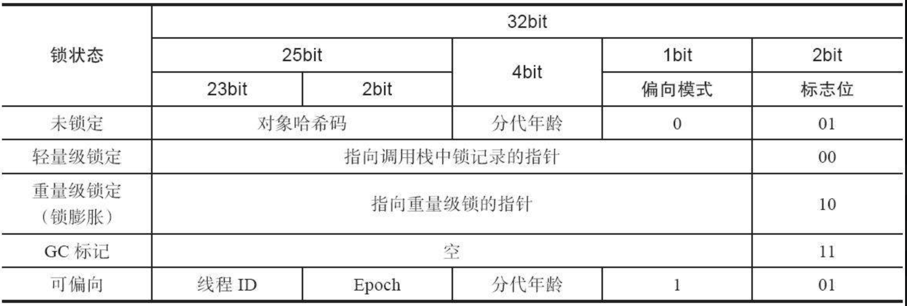

- 基本要求
  1. 跨平台.屏蔽各种硬件和操作系统内存访问差异，让java程序在各个平台和硬件上达到一直的访问效果。
  2. 足够灵活:这样可以让jvm有足够的发挥空间利用底层硬件的各种特性(寄存器,高速缓存和指令集中的某些特有指令)提高执行性能。
- Java内存模型主要内容
  Java内存模型的主要目的是定义程序中各种变量的访问规则，即关注在虚拟机中把变量值存储到内存和从内存中取出变量值这样的底层细节。
- 主内存和工作内存
  
  主内存:所有的变量都存储在主内存（Main Memory）中（与物理硬件内存类比）
  工作内存:每条线程还有自己的工作内存（Working Memory，可处理器高速缓存类比）,线程的工作内存中保存了被该线程使用的变量的主内存副本。
  
  线程与工作内存，主内存的关系
  1. 每个线程只能访问自己的工作内存，无法访问其他线程的工作内存，也不能直接读取主内存数据。
  2. 线程间变量值的传递均需要通过主内存来完成
  
  主内存和工作内存提到的变量理解
  此处的变量（Variables）与Java编程中所说的变量有所区别，它包括了实例字段、静态字段和构成数组对象的元素，但是不包括局部变量与方法参数，因为后者是线程私有的，不会被共享，自然就不会存在竞争问题。
  
  
  
- 主内存和工作内存交互协议
  id:: 6299c26b-666a-4ac1-9ec4-0ddf6b9b2033
	- 定义:主内存与工作内存之间具体的交互协议，即一个变量如何从主内存拷贝到工作内存、如何从工作内存同步回主内存这一类的实现细节。
	- 说明:
	  这个协议比较复杂,不过也无须过分担忧，除了进行虚拟机开发的团队外，大概没有其他开发人员会以这种方式来思考并发问题，只需要理解Java内存模型的定义即可
	  --->会有一个等效判断原则——先行发生原则，用来确定一个操作在并发环境下是否安全的。
	- 虚拟机保证如下8种操作必定是原子性的。
	  原子性操作
	  （对于double和long类型的变量来说，load、store、read和write操作在某些平台上允许有例外）
	  
	  ·lock（锁定）：作用于主内存的变量，它把一个变量标识为一条线程独占的状态。
	  ·unlock（解锁）：作用于主内存的变量，它把一个处于锁定状态的变量释放出来，释放后的变量才可以被其他线程锁定。
	  ·read（读取）：作用于主内存的变量，它把一个变量的值从主内存传输到线程的工作内存中，以便随后的load动作使用。
	  ·load（载入）：作用于工作内存的变量，它把read操作从主内存中得到的变量值放入工作内存的变量副本中。
	  ·use（使用）：作用于工作内存的变量，它把工作内存中一个变量的值传递给执行引擎，每当虚拟机遇到一个需要使用变量的值的字节码指令时将会执行这个操作。
	  ·assign（赋值）：作用于工作内存的变量，它把一个从执行引擎接收的值赋给工作内存的变量，每当虚拟机遇到一个给变量赋值的字节码指令时执行这个操作。
	  ·store（存储）：作用于工作内存的变量，它把工作内存中一个变量的值传送到主内存中，以便随后的write操作使用。
	  ·write（写入）：作用于主内存的变量，它把store操作从工作内存中得到的变量的值放入主内存的变量中。
	- 变量操作顺序
	  如果要把一个变量从主内存拷贝到工作内存，那就要按顺序执行read和load操作，
	  如果要把变量从工作内存同步回主内存，就要按顺序执行store和write操作。
	   
	  
	  注意:顺序执行而非连续执行
	  也就是说read与load之间、store与write之间是可插入其他指令的，如对主内存中的变量a、b进行访问时，一种可能出现的顺序是read a、read b、load b、load a。
	- Java内存模型还规定了在执行上述8种基本操作时必须满足如下规则:
	  ·不允许read和load、store和write操作之一单独出现，即不允许一个变量从主内存读取了但工作内存不接受，或者工作内存发起回写了但主内存不接受的情况出现。
	  ·不允许一个线程丢弃它最近的assign操作，即变量在工作内存中改变了之后必须把该变化同步回主内存。
	  ·不允许一个线程无原因地（没有发生过任何assign操作）把数据从线程的工作内存同步回主内存中。
	  ·一个新的变量只能在主内存中“诞生”，不允许在工作内存中直接使用一个未被初始化（load或assign）的变量，换句话说就是对一个变量实施use、store操作之前，必须先执行assign和load操作。
	  ·一个变量在同一个时刻只允许一条线程对其进行lock操作，但lock操作可以被同一条线程重复执行多次，多次执行lock后，只有执行相同次数的unlock操作，变量才会被解锁。
	  ·如果对一个变量执行lock操作，那将会清空工作内存中此变量的值，在执行引擎使用这个变量前，需要重新执行load或assign操作以初始化变量的值。
	  ·如果一个变量事先没有被lock操作锁定，那就不允许对它执行unlock操作，也不允许去unlock一个被其他线程锁定的变量。
	  ·对一个变量执行unlock操作之前，必须先把此变量同步回主内存中（执行store、write操作）。
	  专门针对volatile字段的一些特殊规定
	  ((629c2156-6c97-400d-865b-80a8f71be9b0)) 
	  
	  后来Java设计团队将Java内存模型的操作描述简化为read、write、lock和unlock四种，但这只是语言描述上的等价化简，Java内存模型的基础设计并未改变.
- jvm对于volatile型变量的特殊规则
  id:: 629c2156-6c97-400d-865b-80a8f71be9b0
  volatile型变量 jvm保证两个特性:内存可见性和指令禁止重排序性
	- 内存可见性
	  定义:当一条线程修改了这个volatile变量的值，新值对于其他线程来说是可以立即得知的.
	  普通变量并不能做到这一点，普通变量的值在线程间传递时均需要通过主内存来完成。
	  
	  比如，线程A修改一个普通变量的值，然后向主内存进行回写，另外一条线程B在线程A回写完成了之后再对主内存进行读取操作，新变量值才会对线程B可见。
	- 指令禁止重排序性
	- 错误认知:基于volatile变量的运算在并发下是线程安全的
	  锁的原子性要求并没有满足 ((6299c682-4f78-4d5f-9d9c-2e032d7d8e8f)) 
	  因为Java里面的运算操作符存在非原子操作的运算(例如a++自增运算)，这导致volatile变量的运算在并发下一样是不安全的，
	  举例:
	  ```java
	  public class VolatileTest {
	      private static volatile int count = 0;
	      private static final int THREAD_COUNT = 20;
	  
	      private static void increase() {
	          count++;
	      }
	  
	      @Test
	      public void test() throws InterruptedException {
	          Thread[] threads = new Thread[THREAD_COUNT];
	          for (int i = 0; i < threads.length; i++) {
	              threads[i] = new Thread(() -> {
	                  for (int j = 0; j < 10000; j++) {
	                      increase();
	                  }
	              });
	              threads[i].start();
	          }
	          for (int i = 0; i < threads.length; i++) {
	              threads[i].join();
	          }
	          //每次输出结果都不一样，小于10000*20=200000
	          System.out.println(count);
	      }
	  }
	  ```
	  运行结果:
	  最后输出的结果应该是200000。然而运行完这段代码之后，并不会获得期望的结果，而且会发现每次运行程序，输出的结果都不一样，都是一个小于200000的数字
	  
	  javap反编译后jvm字节码
	  
	  
	  并发更新失败原因:
	  当getstatic指令把race的值取到操作栈顶时，volatile关键字保证了race的值在此时是正确的，但是在执行iconst_1、iadd这些指令的时候，其他线程可能已经把race的值改变了，而操作栈顶的值就变成了过期的数据，所以putstatic指令执行后就可能把较小的race值同步回主内存之中。
	  
	  需要说明的一点:哪怕是一条jvm指令码也不意味着一定就是原子性操作.
	  一条字节码指令在解释执行时，解释器要运行许多行代码才能实现它的语义。
	  如果是编译执行，一条字节码指令也可能转化成若干条本地机器码指令.
	  此处使用-XX：+PrintAssembly参数输出反汇编来分析才会更加严谨一些，但是考虑到读者阅读的方便性，并且字节码已经能很好地说明问题，所以此处使用字节码来解释。
	- 单独使用volatile字段变量线程安全的使用场景
	  1. 运算结果并不依赖变量的当前值，或者能够确保只有单一的线程修改变量的值。
	  2. 变量不需要与其他的状态变量共同参与不变约束。
	-
	-
- 先行发生原则
  作用:可以用来确定一个操作在并发环境下是否安全的。
- 对象堆内存布局(暂时先放在这儿，没有更合适的地方)
  collapsed:: true
  HotSpot虚拟机中主要分为三部分
	- 1. 对象头(Header)
	  对象头主要有两部分,数组对象有第三部分
		- a.MarkWord
		  id:: 6298b8fd-0098-4554-84ec-5b5150f560a5
		  用于存储对象自身的运行时数据，如一致性哈希码（Identity HashCode）、GC分代年龄、锁状态标志、线程持有的锁、偏向线程ID、偏向时间戳等。
		  
		  一致性哈希码说明:这儿指的是对象的一致性哈希码(Identity HashCode),
		  System.identityHashCode(obj)返回的值。而非对象的hashcode方法返回的值。
		  特性:这个值是能强制保证不变的，它通过在对象头中存储计算结果来保证第一次计算之后，再次调用该方法取到的哈希码值永远不会再发生改变。
		  
		  设计目的：定义动态的数据结构，尽可能多的复用相同位数,就是为了减小对象所需的内存空间
		  32位和64位不同
		  
		  问题:如何处理MarkWord比特位复用问题？
		  例如当对象进入偏向状态的时候，MarkWord大部分的空间（23个比特）都用于存储持有锁的线程ID了，这部分空间占用了原有存储对象一致性哈希码的位置，那原来对象的一致性哈希码怎么储存呢?
		  1. 当一个对象计算过一致性哈希码后，它就不能进入偏向锁状态了。 ((6298791f-12c9-4fb8-b68a-60855d19aefa)) 
		  2. 当一个对象处于偏向锁状态时，收到计算其一致性哈希码需求时，它的排向锁状态解除，并且会升级为重量级锁。
		  3. 当一个对象处于轻量级锁状态时,怎么存储对象的一致性哈希码呢?
		  指向调用栈中锁记录(Lock Record)的指针指向的是加轻量级锁时MarkWord的拷贝，所以这儿自然可以存储一致性哈希码 ((6298b2ff-7bc1-4d9f-aa5d-2f72933bc324)) 
		  
		  4. 当一个对象处于重量级锁状态时，对象头指向了重量级锁的位置，代表重量级锁的ObjectMonitor类里有字段可以记录非加锁状态（标志位为“01”）下的Mark Word，其中自然可以存储原来的一致性哈希码
		- b.类型指针：对象指向它的类型元数据的指针
		- c.记录数组长度的数据(数组对象才有的部分)
	- 2 .实例数据(Instance Data)
	  存储对象真正存储的有效信息
	  无论是从父类继承下来的，还是在子类中定义的字段都必须记录起来。
	  存储顺序
	- 3. 对齐填充(Padding)
	  占位符的作用
	  HotSpot虚拟机要求对象起始地址必须是8字节的整数倍
- 资料
  《深入理解java虚拟机：JVM高级特性与最佳实践》第三版 12.3java内存模型与线程-Java内存模型