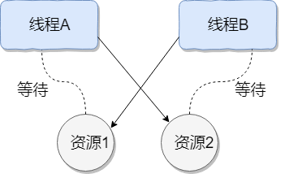

- 背景知识
  id:: 6298181c-7741-4944-ab3c-e0b6e63b53c4
	- 1. [[java内存模型]]
	- 2. 线程调度方式
	  抢占式调度：
	  协同式调度：
	  java 使用的线程调使用抢占式调度, Java 中线程会按优先级分配 CPU 时间片运行， 且优先级越高越优先执行，但优先级高并不代表能独自占用执行时间片，可能是优先级高得到越多的执行时间片，反之，优先级低的分到的执行时间少但不会分配不到执行时间。
	- 3.死锁
	  **哲学家进餐问题**
	  死锁产生的4个条件：
	  互斥条件：该资源任意一个时刻只由一个线程占用。
	  请求与保持条件：一个线程因请求资源而阻塞时，对已获得的资源保持不放。
	  不剥夺条件:线程已获得的资源在未使用完之前不能被其他线程强行剥夺，只有自己使用完毕后才释放资源。
	  循环等待条件:若干线程之间形成一种头尾相接的循环等待资源关系。
	  
	  如何预防死锁?破坏死锁的产生的必要条件即可：
	  破坏请求与保持条件 ：一次性申请所有的资源。
	  破坏不剥夺条件 ：占用部分资源的线程进一步申请其他资源时，如果申请不到，可以主动释放它占有的资源。--->应用：分布式锁的超时释放机制
	  破坏循环等待条件 ：靠按序申请资源来预防。按某一顺序申请资源，释放资源则反序释放。破坏循环等待条件。
	  
	  
	  在资源分配时，借助于算法（比如银行家算法）对资源分配进行计算评估，使其进入安全状态。
	  
	  >安全状态 指的是系统能够按照某种线程推进顺序（P1、P2、P3.....Pn）来为每个线程分配所需资源，直到满足每个线程对资源的最大需求，使每个线程都可顺利完成。称<P1、P2、P3.....Pn>序列为安全序列。
	  死锁的检测和解除：
- 基础知识点
  线程上下文切换
- 进程和线程
  程序执行的基本单元,一个进程可以有多个线程，
  线程是更小的CPU执行单位
  线程间的切换和调度的成本远远小于进程。
  外加协程
	- 两者之间区别，联系？
	  JVM角度分析
	  多个线程共享进程的堆和方法区(jdk8元空间)，每个线程有自己的虚拟机栈和本地方法栈，程序计数器(java内存区域)
- 多线程
  1. 为什么使用多线程
  硬件角度：CPU单核CPU->多核CPU,充分利用CPU资源
  操作系统角度：线程是CPU执行的基本单元，线程间的上下文切换的成本远远小于进程
  互联网发展角度:满足系统设计高并发的需求
  2. 使用多线程会碰到哪些问题？
  死锁:多个线程同时被阻塞，它们中的一个或者全部都在等待某一个资源被释放。线程被无限期地阻塞。
   
  内存泄漏(ThreadLocal内存泄漏)
  线程不安全，
  线程间通信(线程同步，线程之间消息传递)
  
  对应用程序开发来说，并发编程更复杂,更容易出错
  2. 使用多线程的好处和坏处
  好处:
  坏处:
- 线程的生命周期和状态
  1. 线程状态
  
  注意点:在操作系统中层面线程有 READY 和 RUNNING 状态，而在 JVM 层面只能看到 RUNNABLE 状态
  
  2. 线程生命周期图
  图就是最好的说明
  
  原图中 wait 到 runnable 状态的转换中，join实际上是Thread类的方法，但这里写成了Object。
  
  线程上下文切换: 需要保存当前线程的上下文，留待线程下次占用 CPU 的时候恢复现场。并加载下一个将要占用 CPU 的线程上下文。
  线程让出CPU资源情况：
  1. 时间片用完(线程调度机制决定的)  
  2. 主动让出 CPU，比如调用了 sleep(), wait() , 获取不到锁等(线程生命周期图里的几种情况)
  3. 调用了阻塞类型的系统中断，比如请求 BIO，线程被阻塞。
  5. 被终止或结束运行
- 说说 sleep() 方法和 wait() 方法区别和共同点?
  两者都释放CPU资源，但sleep不释放锁资源，而wait释放锁资源(必须在sync)
  两者最主要的区别在于：sleep() 方法没有释放锁，而 wait() 方法释放了锁 。
  两者都可以暂停线程的执行。
  wait() 通常被用于线程间交互/通信，sleep() 通常被用于暂停执行。
  wait() 方法被调用后，线程不会自动苏醒，需要别的线程调用同一个对象上的 notify() 或者 notifyAll() 方法。sleep() 方法执行完成后，线程会自动苏醒。或者可以使用 wait(long timeout) 超时后线程会自动苏醒。
- 为什么我们调用 start() 方法时会执行 run() 方法，为什么我们不能直接调用 run() 方法？