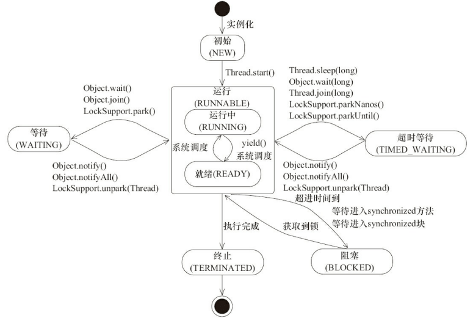

- 背景知识
  1. [[java内存模型]]
  2. 线程调度方式
  抢占式调度：
  协同式调度：
  java 使用的线程调使用抢占式调度, Java 中线程会按优先级分配 CPU 时间片运行， 且优先级越高越优先执行，但优先级高并不代表能独自占用执行时间片，可能是优先级高得到越多的执行时间片，反之，优先级低的分到的执行时间少但不会分配不到执行时间。
- 基础知识点
  线程上下文切换
- 进程和线程
  程序执行的基本单元,一个进程可以有多个线程，
  线程是更小的CPU执行单位
  线程间的切换和调度的成本远远小于进程。
  外加协程
	- 两者之间区别，联系？
	  JVM角度分析
	  多个线程共享进程的堆和方法区(jdk8元空间)，每个线程有自己的虚拟机栈和本地方法栈，程序计数器(java内存区域)
- 多线程
  1. 为什么使用多线程
  硬件角度：CPU单核CPU->多核CPU,充分利用CPU资源
  操作系统角度：线程是CPU执行的基本单元，线程间的上下文切换的成本远远小于进程
  互联网发展角度:满足系统设计高并发的需求
  2. 使用多线程会碰到哪些问题？
  死锁,
  内存泄漏(ThreadLocal内存泄漏)
  线程不安全，
  线程间通信(线程同步，线程之间消息传递)
  
  对应用程序开发来说，并发编程更复杂,更容易出错
  2. 使用多线程的好处和坏处
  好处:
  坏处:
- 线程的生命周期和状态
  1. 线程状态
  
  注意点:在操作系统中层面线程有 READY 和 RUNNING 状态，而在 JVM 层面只能看到 RUNNABLE 状态
  
  2. 线程生命周期图
  图就是最好的说明
  
  原图中 wait 到 runnable 状态的转换中，join实际上是Thread类的方法，但这里写成了Object。
  
  线程上下文切换:
  线程让出CPU资源情况：
  1. 时间片用完()
  2. 主动让出 CPU，比如调用了 sleep(), wait() , 获取不到锁等(线程生命周期图里的几种情况)
  3. 调用了阻塞类型的系统中断，比如请求 BIO，线程被阻塞。
  5. 被终止或结束运行
-