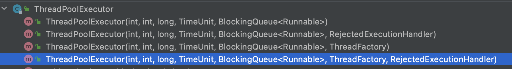
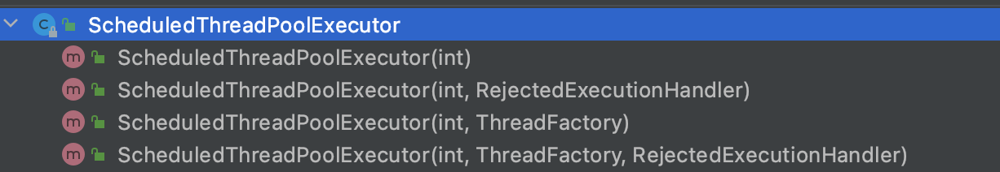

- 里面提供一系列并发开发的工具类,并发包 java.util.concurrent
- Callable,Future
	- Callable:
	- Future:
	  id:: 629b51bd-72dd-460f-a97e-806b99d0e708
	  Future 对象可以判断线程任务是否执行成功，
	  并且可以通过 Future 的 get()方法来获取返回值，get()方法会阻塞当前线程直到任务完成，
	  而使用 get(long timeout，TimeUnit unit)方法则会阻塞当前线程一段时间后立即返回，这时候有可能任务没有执行完。
- Lock,Condition
  LockSupport
  AbstractQueuedSynchronizer(AQS)
  ReentrantLock
  StampedLock(jdk1.8)
- 原子类
  id:: 629985ca-1cb9-447c-9919-e0adac191863
  基于CAS+volatile机制实现同步加锁功能
- 线程安全容器
  ArrayBlockingQueue
  ConcurrentHashMap
  ConcurrentSkipListMap
  ConcurrentSkipListSet
- java线程池
  id:: 629986de-7a5f-4d94-9345-35be7b205ca6
	- 核心类
	  Executor
	  Executors
	  ExecutorService
	  ThreadPoolExecutor
	  ScheduledExecutorService
	- 线程池执行execute()方法和 submit()方法区别
	  1. execute()方法用于提交不需要返回值的任务，所以无法判断任务是否被线程池执行成功与否；
	  2. submit()方法用于提交需要返回值的任务。线程池会返回一个 Future 类型的对象 
	  ((629b51bd-72dd-460f-a97e-806b99d0e708))
	- 如何创建线程池
	  《阿里巴巴 Java 开发手册》中强制线程池不允许使用 Executors 去创建，(底层也是调用ThreadPoolExecutor构造器创建线程池)
	  而是通过 ThreadPoolExecutor方式自定义线程池各个参数，这样的处理方式让写的同学更加明确线程池的运行规则，规避资源耗尽的风险
	  方式一:通过Executors类创建(xxx强烈不推荐方式)
	  Executors.newCachedThreadPool:
	  ```
	  public static ExecutorService newCachedThreadPool() {
	          return new ThreadPoolExecutor(0, Integer.MAX_VALUE,
	                                        60L, TimeUnit.SECONDS,
	                                        new SynchronousQueue<Runnable>());
	      }
	  ```
	  问题:线程池线程数量可以无限增加。
	  
	  方式二:通过ThreadPoolExecutor构造方法
	  
	  通过ScheduledThreadPoolExecutor构造器创建定时任务线程池
	  ```java
	  public ScheduledThreadPoolExecutor(int corePoolSize,
	                                         ThreadFactory threadFactory,
	                                         RejectedExecutionHandler handler) {
	          super(corePoolSize, Integer.MAX_VALUE, 0, NANOSECONDS,
	                new DelayedWorkQueue(), threadFactory, handler);
	      }
	  ```
	  
	- 线程池原理
	  线程池各个参数及其含义
	- 线程池监控
	- 定时任务线程池ScheduledExecutorService
	-
- ForkJoin框架
- CompletableFuture
  [CompletableFuture原理与实践-外卖商家端API的异步化-美团技术团队](https://mp.weixin.qq.com/s/GQGidprakfticYnbVYVYGQ)
- CountDownLaunch,CyclicBarrier,Semaphore
-
-