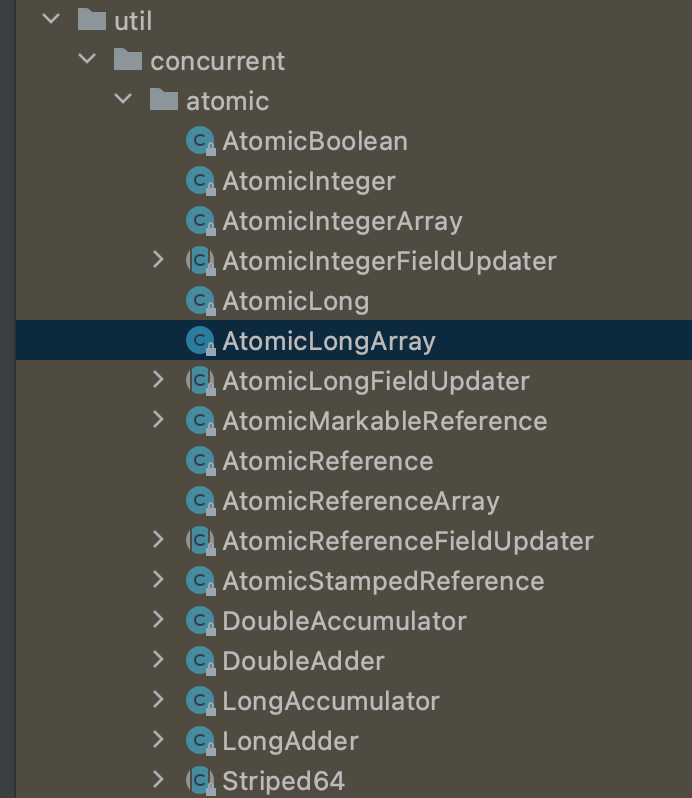
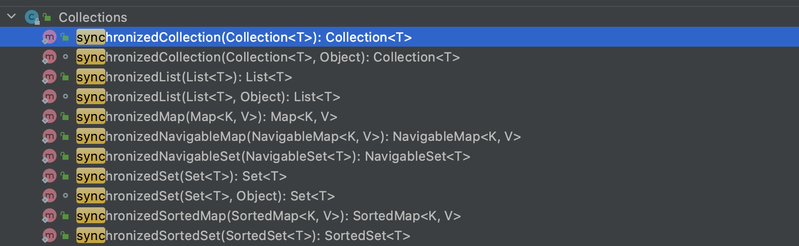

- 里面提供一系列并发开发的工具类,并发包 java.util.concurrent
- Callable,Future
	- Callable:
	- Future:
	  id:: 629b51bd-72dd-460f-a97e-806b99d0e708
	  Future 对象可以判断线程任务是否执行成功，
	  并且可以通过 Future 的 get()方法来获取返回值，get()方法会阻塞当前线程直到任务完成，
	  而使用 get(long timeout，TimeUnit unit)方法则会阻塞当前线程一段时间后立即返回，这时候有可能任务没有执行完。
- Lock,Condition
  LockSupport
  AbstractQueuedSynchronizer(AQS)
  [[AQS AbstractQueuedSynchronizer]]
  ReentrantLock
  ReentrantReadWriteLock:读写锁的思想非常类似，也就是读读共享、写写互斥、读写互斥、写读互斥。
  StampedLock(jdk1.8)
- 原子类
  id:: 629985ca-1cb9-447c-9919-e0adac191863
	- 定义:原子类说简单点就是具有原子/原子操作特征的类。
	  例如:AtomicInteger,AtomicBoolean，AtomicLong，AtomicLongArray等等
	- 原理
	  基于循环CAS+volatile机制实现同步加锁功能
	- 类型
	  基本类型
	  AtomicInteger，AtomicLong，AtomicBoolean
	  数组类型
	  AtomicIntegerArray，AtomicLongArray，AtomicReferenceArray
	  引用类型
	  AtomicReference：引用类型原子类
	  AtomicStampedReference:原子更新带有版本号的引用类型。该类将整数值与引用关联起来，可用于解决原子的更新数据和数据的版本号，可以解决使用 CAS 进行原子更新时可能出现的 ABA 问题。
	  TODO:cj 待总结CAS机制
	  AtomicMarkableReference:原子更新带有标记位的引用类型
	  对象的属性修改类型
	  AtomicIntegerFieldUpdater:原子更新整型字段的更新器
	  AtomicLongFieldUpdater:原子更新长整型字段的更新器
	  AtomicReferenceFieldUpdater:原子更新引用类型字段的更新器
	- 
	-
- 线程安全并发容器
  从并发包中的容器类好像都不支持插入 null 值，因为 null 值往往用作其他用途，比如用于方法的返回值代表操作失败
  Map
	- ConcurrentHashMap
	- ConcurrentSkipListMap：基于跳表数据结构实现
	  
	  Queue
	- 线程安全的 Queue 可以分为阻塞队列和非阻塞队列
	  阻塞队列的典型例子是 BlockingQueue,阻塞队列可以通过加锁来实现，
	  广泛使用在“生产者-消费者”场景中
	  其原因是 BlockingQueue 提供了可阻塞的插入和移除的方法。当队列容器已满，生产者线程会被阻塞，直到队列未满；当队列容器为空时，消费者线程会被阻塞，直至队列非空时为止。
	  
	  非阻塞队列的典型例子是 ConcurrentLinkedQueue,非阻塞队列可以通过 CAS 操作实现
	- BlockingQueue:接口,阻塞队列
	- ArrayBlockingQueue:基于数组，有界阻塞队列
	  ArrayBlockingQueue实现原理:
	  ArrayBlockingQueue 一旦创建，容量不能改变。其并发控制采用可重入锁 ReentrantLock ，不管是插入操作还是读取操作，都需要获取到锁才能进行操作。
	  默认为非公平锁
	  ```java
	  //公平锁，boolean标志位传给ReentrantLock
	  private static ArrayBlockingQueue<Integer> blockingQueue = new ArrayBlockingQueue<Integer>(10,true);
	  ```
	- LinkedBlockingQueue:基于单向链表，阻塞队列
	  可以当做无界队列也可以当做有界队列来使用
	  ```java
	    /**
	       *某种意义上的无界队列
	       * Creates a {@code LinkedBlockingQueue} with a capacity of
	       * {@link Integer#MAX_VALUE}.
	       */
	      public LinkedBlockingQueue() {
	          this(Integer.MAX_VALUE);
	      }
	  
	      /**
	       *有界队列
	       * Creates a {@code LinkedBlockingQueue} with the given (fixed) capacity.
	       *
	       * @param capacity the capacity of this queue
	       * @throws IllegalArgumentException if {@code capacity} is not greater
	       *         than zero
	       */
	      public LinkedBlockingQueue(int capacity) {
	          if (capacity <= 0) throw new IllegalArgumentException();
	          this.capacity = capacity;
	          last = head = new Node<E>(null);
	      }
	  ```
	- PriorityBlockingQueue:基于二叉堆,优先级无界阻塞队列
	  PriorityBlockingQueue使用说明
	  0. 排序:默认情况下元素采用自然顺序进行排序，也可以通过自定义类实现 compareTo() 方法来指定元素排序规则，或者初始化时通过构造器参数 Comparator 来指定排序规则。
	  1. 插入:不可以插入 null 值，同时，插入队列的对象必须是可比较大小的（comparable），否则报 ClassCastException 异常。
	  2. 它的插入操作 put 方法不会 block，因为它是无界队列（take 方法在队列为空的时候会阻塞）。
	  
	  PriorityBlockingQueue实现原理:
	  并发控制采用的是可重入锁 ReentrantLock
	  二叉堆：完全二叉树 ((629db27e-5618-4467-b25a-616234b6d727))
	- ConcurrentLinkedQueue:基于链表，非阻塞队列,jdk中高并发环境中性能最好的队列，基于CAS无锁队列,不过比之Disruptor还是差一点的
	  适合在对性能要求相对较高，同时对队列的读写存在多个线程同时进行的场景，即如果对队列加锁的成本较高则适合使用无锁的 ConcurrentLinkedQueue 来替代。
	-
	-
	- ConcurrentSkipListSet
	  
	  List
	- CopyOnWriteArrayList:适合读多写少场景
	  CopyOnWriteArrayList 读取是完全不用加锁的，并且写入也不会阻塞读取操作。只有写入和写入之间需要进行同步等待。(读读，读写，写读不阻塞，写写阻塞)
	  CopyOnWriteArrayList实现原理:COW写时复制机制
	  
	  CopyOnWrite写时复制机制：在计算机，如果你想要对一块内存进行修改时，我们不在原有内存块中进行写操作，而是将内存拷贝一份，在新的内存中进行写操作，写完之后呢，就将指向原来内存指针指向新的内存，原来的内存就可以被回收掉了。
	  
	  CopyOnWriteArrayList 读取操作的实现
	  读取操作没有任何同步控制和锁操作，理由就是内部数组 array 不会发生修改，只会被另外一个 array 替换，因此可以保证数据安全。
	  ```java
	   /** The array, accessed only via getArray/setArray. */
	      private transient volatile Object[] array;
	      public E get(int index) {
	          return get(getArray(), index);
	      }
	      @SuppressWarnings("unchecked")
	      private E get(Object[] a, int index) {
	          return (E) a[index];
	      }
	      final Object[] getArray() {
	          return array;
	      }
	  ```
	  CopyOnWriteArrayList 写操作的实现
	  CopyOnWriteArrayList 写入操作 add()方法在添加集合的时候加了锁，保证了同步，避免了多线程写的时候会 copy 出多个副本出来。
	  ```java
	  /**
	       * Appends the specified element to the end of this list.
	       *
	       * @param e element to be appended to this list
	       * @return {@code true} (as specified by {@link Collection#add})
	       */
	      public boolean add(E e) {
	          final ReentrantLock lock = this.lock;
	          lock.lock();//加锁
	          try {
	              Object[] elements = getArray();
	              int len = elements.length;
	              Object[] newElements = Arrays.copyOf(elements, len + 1);//拷贝新数组
	              newElements[len] = e;
	              setArray(newElements);
	              return true;
	          } finally {
	              lock.unlock();//释放锁
	          }
	      }
	  ```
	- Collections.synchronizedXXX() 系列方法，使用synchronized关键字实现同步，效率低
	  
- [[java线程池]]
  id:: 629986de-7a5f-4d94-9345-35be7b205ca6
	-
- ForkJoin框架
- CompletableFuture
  [CompletableFuture原理与实践-外卖商家端API的异步化-美团技术团队](https://mp.weixin.qq.com/s/GQGidprakfticYnbVYVYGQ)
- CountDownLaunch,CyclicBarrier,Semaphore
  类比理解
  CountDownLatch:F4赛车停下来等换好了4个轮胎后再跑，一直跑下去(countdown降为0后，永远不会reset回去)
  CyclicBarrier:王者5排发车，一波发车完，下一波继续等5排再发车
  Semaphore信号量就是限流，一个餐馆20个座位，最多20人同时吃饭
-
-