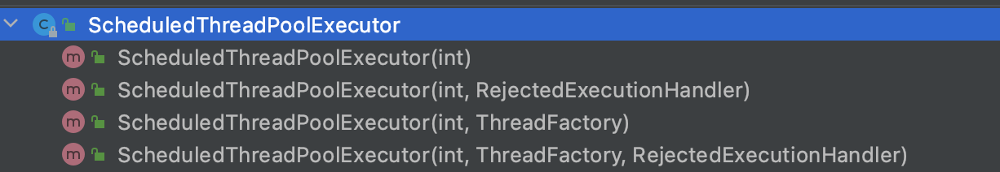

- 核心类
  Executor
  Executors
  ExecutorService
  ThreadPoolExecutor
  ScheduledExecutorService
- 线程池执行execute()方法和 submit()方法区别
  	1. execute()方法用于提交不需要返回值的任务，所以无法判断任务是否被线程池执行成功与否；
  	2. submit()方法用于提交需要返回值的任务。线程池会返回一个 Future 类型的对象
   Future:
   Future 对象可以判断线程任务是否执行成功，
   并且可以通过 Future 的 get()方法来获取返回值，get()方法会阻塞当前线程直到任务完成，
   而使用 get(long timeout，TimeUnit unit)方法则会阻塞当前线程一段时间后立即返回，这时候有可能任务没有执行完。
- 如何创建线程池
  **《阿里巴巴 Java 开发手册》中强制线程池不允许使用 Executors 去创建，(底层也是调用ThreadPoolExecutor构造器创建线程池)
  而是通过 ThreadPoolExecutor方式自定义线程池各个参数，这样的处理方式让写的同学更加明确线程池的运行规则，规避资源耗尽的风险**
  方式一:通过Executors类创建(xxx强烈不推荐方式)
  Executors.newCachedThreadPool:
  含义:返回一个可根据实际情况调整线程数量的线程池.
  问题:最大线程池数为Integer.MAX_VALUE,线程池线程数量可以无限增加，可能导致OOM。
  ```
  public static ExecutorService newCachedThreadPool() {
          return new ThreadPoolExecutor(0, Integer.MAX_VALUE,
                                        60L, TimeUnit.SECONDS,
                                        new SynchronousQueue<Runnable>());
      }
  ```
    
  Executors.newSingleThreadExecutor
  含义:返回一个只有一个线程的线程池.
  问题:任务队列为无限大的阻塞队列，可能导致OOM。
  ``` java
  public static ExecutorService newSingleThreadExecutor() {
          return new FinalizableDelegatedExecutorService
              (new ThreadPoolExecutor(1, 1,
                                      0L, TimeUnit.MILLISECONDS,
                                      new LinkedBlockingQueue<Runnable>()));
      }
  ```
  Executors.newFixedThreadPool
  含义:返回一个固定线程数量的线程池。该线程池中的线程数量始终不变.
  问题:任务队列为无限大的阻塞队列，可能导致OOM。
  ``` java
  public static ExecutorService newFixedThreadPool(int nThreads) {
          return new ThreadPoolExecutor(nThreads, nThreads,
                                        0L, TimeUnit.MILLISECONDS,
                                        new LinkedBlockingQueue<Runnable>());
      }
  ```
  Executors.newScheduledThreadPool
  问题:最大线程池数为Integer.MAX_VALUE,线程池线程数量可以无限增加，可能导致OOM。
  ``` java
  public static ScheduledExecutorService newScheduledThreadPool(int corePoolSize) {
          return new ScheduledThreadPoolExecutor(corePoolSize);
      }
  ```
  ``` java
  public ScheduledThreadPoolExecutor(int corePoolSize) {
          super(corePoolSize, Integer.MAX_VALUE, 0, NANOSECONDS,
                new DelayedWorkQueue());
      }
  ```
    
  方式二:通过ThreadPoolExecutor构造方法
  
  通过ScheduledThreadPoolExecutor构造器创建定时任务线程池
  ``` java
  public ScheduledThreadPoolExecutor(int corePoolSize,
                                         ThreadFactory threadFactory,
                                         RejectedExecutionHandler handler) {
          super(corePoolSize, Integer.MAX_VALUE, 0, NANOSECONDS,
                new DelayedWorkQueue(), threadFactory, handler);
      }
  ```
  
- 线程池原理
	- 线程池各个参数及其含义
	  corePoolSize:最小可以同时运行的线程数
	  maximumPoolSize:最大线程数,当队列中存放的任务达到队列容量的时候，当前可以同时运行的线程数量变为最大线程数。(非必要不增加线程数，线程是个重量级资源)
	  long keepAliveTime,TimeUnit unit:线程最大存活时长
	  当线程池中的线程数量大于 corePoolSize 的时候，如果这时没有新的任务提交，核心线程外的线程不会立即销毁，而是会等待，直到等待的时间超过了 keepAliveTime才会被回收销毁；
	  BlockingQueue<Runnable> workQueue:任务等待阻塞列队,当新任务来的时候会先判断当前运行的线程数量是否达到核心线程数，如果达到的话，新任务就会被存放在队列中。
	  ThreadFactory threadFactory:线程工厂类
	  RejectedExecutionHandler handler:拒绝策略
	  
	- 拒绝策略类型
	  ThreadPoolExecutor.AbortPolicy： 抛出 RejectedExecutionException来拒绝新任务的处理。(默认情况下都采用这个，抛出异常)
	  ThreadPoolExecutor.CallerRunsPolicy： 调用执行自己的线程运行任务，也就是直接在调用execute方法的线程中运行(run)被拒绝的任务，如果执行程序已关闭，则会丢弃该任务。因此这种策略会降低对于新任务提交速度，影响程序的整体性能。如果您的应用程序可以承受此延迟并且你要求任何一个任务请求都要被执行的话，你可以选择这个策略。
	  ThreadPoolExecutor.DiscardPolicy： 不处理新任务，直接丢弃掉。
	  ThreadPoolExecutor.DiscardOldestPolicy： 此策略将丢弃最早的未处理的任务请求。
	- 线程池针对不断增加请求的处理流程
	  (非必要不增加线程数，线程是个重量级资源),所以请求先存在等待队列中，队列满了的话，再扩大线程数
	  corePoolSize--->workQueue--->maximumPoolSize--->RejectedExecutionHandler
	  
- 线程池监控
- 定时任务线程池ScheduledExecutorService