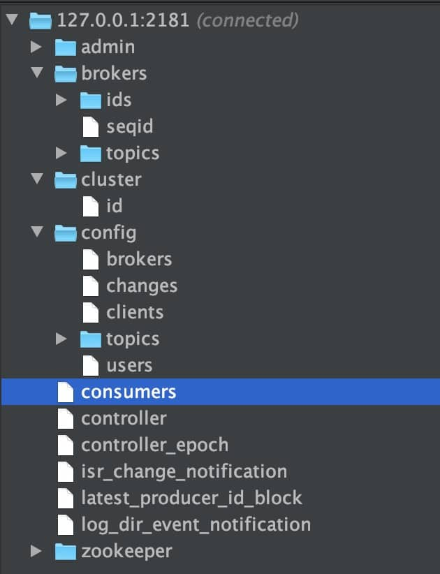
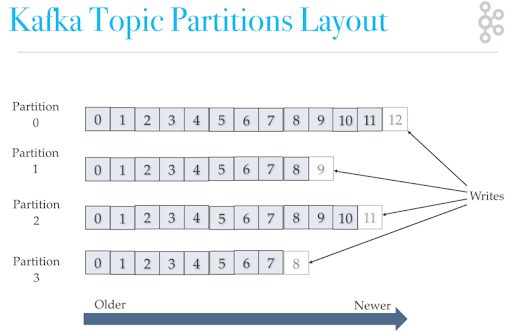

- Kafka 是什么？主要应用场景有哪些？
  Kafka 是一个分布式流式处理平台。这到底是什么意思呢？
  流平台具有三个关键功能：
  1. **消息队列**：发布和订阅消息流，这个功能类似于消息队列，这也是 Kafka 也被归类为消息队列的原因。
  2. **容错的持久方式存储记录消息流**： Kafka 会把消息持久化到磁盘，有效避免了消息丢失的风险。
  3. **流式处理平台：**在消息发布的时候进行处理，Kafka 提供了一个完整的流式处理类库。
  
  **Kafka 采用的是发布 - 订阅模型。**
  **RocketMQ 的消息模型和 Kafka 基本是完全一样的。唯一的区别是 Kafka 中没有队列这个概念，与之对应的是 Partition（分区）。**
- 主要应用场景
  Kafka 主要有两大应用场景：
  1. **消息队列**：建立实时流数据管道，以可靠地在系统或应用程序之间获取数据。
  2. **数据处理：**构建实时的流数据处理程序来转换或处理数据流。
- 和其他消息队列相比,Kafka的优势在哪里？
  我们现在经常提到 Kafka 的时候就已经默认它是一个非常优秀的消息队列了，我们也会经常拿它跟 RocketMQ、RabbitMQ 对比。我觉得 Kafka 相比其他消息队列主要的优势如下：
  1. **极致的性能**：基于 Scala 和 Java 语言开发，设计中大量使用了批量处理和异步的思想，最高可以每秒处理千万级别的消息。
  2. **生态系统兼容性无可匹敌**：Kafka 与周边生态系统的兼容性是最好的没有之一，尤其在大数据和流计算领域。
- kafka架构
  Kafka 比较重要的几个概念：
  1. **Producer（生产者）**: 产生消息的一方。
  2. **Consumer（消费者）**: 消费消息的一方。
  3.  **Broker（代理）**: 可以看作是一个独立的 Kafka 实例。多个 Kafka Broker 组成一个 Kafka Cluster。
  你一定也注意到每个 Broker 中又包含了 Topic 以及 Partition 这两个重要的概念：
  4. **Topic（主题）**: Producer 将消息发送到特定的主题，Consumer 通过订阅特定的 Topic(主题) 来消费消息。
  5. **Partition（分区）**: Partition 属于 Topic 的一部分。一个 Topic 可以有多个 Partition ，并且同一 Topic 下的 Partition 可以分布在不同的 Broker 上，这也就表明一个 Topic 可以横跨多个 Broker 。这正如我上面所画的图一样。
  Kafka 将生产者发布的消息发送到**Topic（主题）**中，需要这些消息的消费者可以订阅这些**Topic（主题）**，如下图所示
  
  --->划重点：**Kafka 中的 Partition（分区） 实际上可以对应成为消息队列中的队列。这样是不是更好理解一点？**
- Kafka 的多副本机制(高可用)
  Kafka 为分区（Partition）引入了多副本（Replica）机制。分区（Partition）中的多个副本之间会有一个叫做 leader 的家伙，其他副本称为 follower。我们发送的消息会被发送到 leader 副本，然后 follower 副本才能从 leader 副本中拉取消息进行同步。
  
  >生产者和消费者只与 leader 副本交互。你可以理解为其他副本只是 leader 副本的拷贝，它们的存在只是为了保证消息存储的安全性。当 leader 副本发生故障时会从 follower 中选举出一个 leader,但是 follower 中如果有和 leader 同步程度达不到要求的参加不了 leader 的竞选。
  
  **Kafka 的多分区（Partition）以及多副本（Replica）机制有什么好处呢？**
  1. Kafka 通过给特定 Topic 指定多个 Partition, 而各个 Partition 可以分布在不同的 Broker 上, 这样便能提供比较好的并发能力（负载均衡）。
  2. Partition 可以指定对应的 Replica 数, 这也极大地提高了消息存储的安全性, 提高了容灾能力，不过也相应的增加了所需要的存储空间。
- Zookeeper 在 Kafka 中的作用
  >**要想搞懂 zookeeper 在 Kafka 中的作用 一定要自己搭建一个 Kafka 环境然后自己进 zookeeper 去看一下有哪些文件夹和 Kafka 有关，每个节点又保存了什么信息。**一定不要光看不实践，这样学来的也终会忘记！[这部分内容参考和借鉴了这篇文章](https://www.jianshu.com/p/a036405f989c) 。
  
  下图就是我的本地 Zookeeper ，它成功和我本地的 Kafka 关联上（以下文件夹结构借助 idea 插件 Zookeeper tool 实现）。
  
  ZooKeeper 主要为 Kafka 提供元数据的管理的功能。
  从图中我们可以看出，Zookeeper 主要为 Kafka 做了下面这些事情：
  1. **Broker 注册**：在 Zookeeper 上会有一个专门**用来进行 Broker 服务器列表记录**的节点。每个 Broker 在启动时，都会到 Zookeeper 上进行注册，即到 `/brokers/ids` 下创建属于自己的节点。每个 Broker 就会将自己的 IP 地址和端口等信息记录到该节点中去**
  2. Topic 注册**： 在 Kafka 中，同一个**Topic 的消息会被分成多个分区**并将其分布在多个 Broker 上，**这些分区信息及与 Broker 的对应关系**也都是由 Zookeeper 在维护。比如我创建了一个名字为 my-topic 的主题并且它有两个分区，对应到 zookeeper 中会创建这些文件夹： `/brokers/topics/my-topic/Partitions/0` 、 `/brokers/topics/my-topic/Partitions/1`**
  3. **负载均衡**：上面也说过了 Kafka 通过给特定 Topic 指定多个 Partition, 而各个 Partition 可以分布在不同的 Broker 上, 这样便能提供比较好的并发能力。 对于同一个 Topic 的不同 Partition，Kafka 会尽力将这些 Partition 分布到不同的 Broker 服务器上。当生产者产生消息后也会尽量投递到不同 Broker 的 Partition 里面。当 Consumer 消费的时候，Zookeeper 可以根据当前的 Partition 数量以及 Consumer 数量来实现动态负载均衡。
  4. ......
- Kafka 如何保证消息的消费顺序？
  举例业务场景:
  我们在使用消息队列的过程中经常有业务场景需要严格保证消息的消费顺序，比如我们同时发了 2 个消息，这 2 个消息对应的操作分别对应的数据库操作是：
  1. 更改用户会员等级。
  2. 根据会员等级计算订单价格。
  假如这两条消息的消费顺序不一样造成的最终结果就会截然不同。
  
  我们知道 Kafka 中 Partition(分区)是真正保存消息的地方，我们发送的消息都被放在了这里。而我们的 Partition(分区) 又存在于 Topic(主题) 这个概念中，并且我们可以给特定 Topic 指定多个 Partition。
  
- Kafka 如何保证消息不丢失
- Kafka 如何保证消息不重复消费
- 配置:无消息丢失配置怎么实现