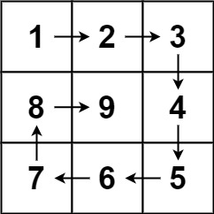

- 数组相关
	- [leetcode59螺旋矩阵 II](https://leetcode.cn/problems/spiral-matrix-ii/)
	  题目:给你一个正整数  `n` ，生成一个包含 `1` 到  `n`  所有元素，且元素按顺时针顺序螺旋排列的  `n x n` 正方形矩阵 `matrix` 。
	  **示例 1：**
	  
	  ```
	  **输入：**n = 3
	  **输出：**[[1,2,3],[8,9,4],[7,6,5]]
	  ```
	  **示例 2：**
	  ```
	  **输入：**n = 1
	  **输出：**[[1]]
	  ```
	  解题思路:
	-
-