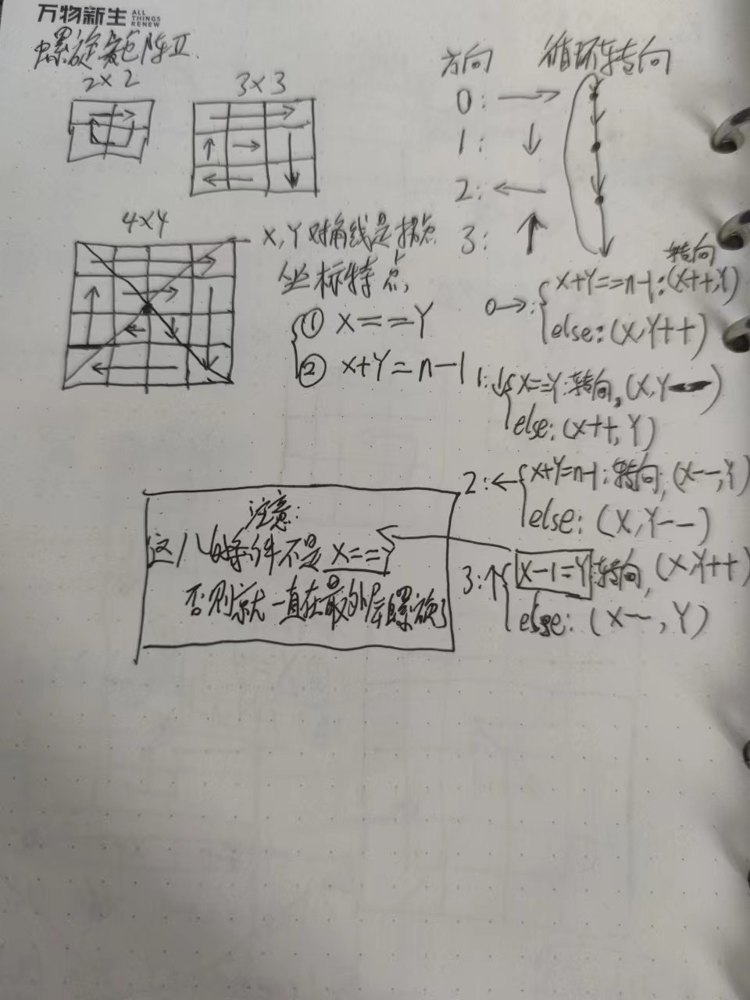

- [leetcode59螺旋矩阵 II](https://leetcode.cn/problems/spiral-matrix-ii/)
- 题目:给你一个正整数  `n` ，生成一个包含 `1` 到  `n`  所有元素，且元素按顺时针顺序螺旋排列的  `n x n` 正方形矩阵 `matrix` 。
  **示例 1：**
  
  ```
  **输入：**n = 3
  **输出：**[[1,2,3],[8,9,4],[7,6,5]]
  ```
  **示例 2：**
  ```
  **输入：**n = 1
  **输出：**[[1]]
  ```
- 解题思路:
  
  ```
  /**
       * 核心算法思想
       */
      public int[][] generateMatrix(int n) {
          //0:表示方向向右,1:表示方向向下,2:表示方向向左,3:表示方向向上
          //初始状态为方向向右
          int direction = 0;
          int[][] result = new int[n][n];
          //二位数组x:表示横坐标,y:表示纵坐标
          int x = 0, y = 0;
          for (int i = 1; i <= n * n; i++) {
              if (0 == direction) {
                  //方向向右
                  if (x + y == n - 1) {
                      //转向
                      direction = (direction + 1) % 4;
                      result[x][y] = i;
                      x++;
                  } else {
                      result[x][y++] = i;
                  }
              } else if (1 == direction) {
                  //方向向下
                  if (x == y) {
                      //转向
                      direction = (direction + 1) % 4;
                      result[x][y] = i;
                      y--;
                  } else {
                      result[x++][y] = i;
                  }
              } else if (2 == direction) {
                  //方向向左
                  if (x + y == n - 1) {
                      //转向
                      direction = (direction + 1) % 4;
                      result[x][y] = i;
                      x--;
                  } else {
                      result[x][y--] = i;
                  }
              } else {
                  //方向向上
                  //注意这儿的条件不能是x==y,不然就一直在外圈螺旋
                  if (x - 1 == y) {
                      //转向
                      direction = (direction + 1) % 4;
                      result[x][y] = i;
                      y++;
                  } else {
                      result[x--][y] = i;
                  }
              }
          }
          return result;
      }
  ```
-