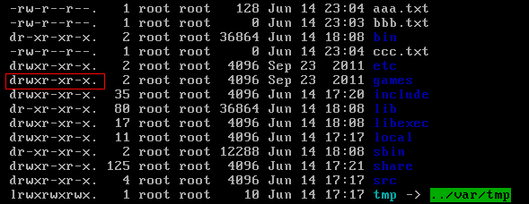
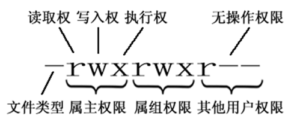

- 打包和解压文件命令tar
  **1）打包并压缩文件：**
  Linux 中的打包文件一般是以.tar 结尾的，压缩的命令一般是以.gz 结尾的。而一般情况下打包和压缩是一起进行的，打包并压缩后的文件的后缀名一般.tar.gz。 命令： `tar -zcvf 打包压缩后的文件名 要打包压缩的文件` ，其中：
  z：调用 gzip 压缩命令进行压缩
  c：打包文件
  v：显示运行过程
  f：指定文件名
  比如：假如 test 目录下有三个文件分别是：aaa.txt bbb.txt ccc.txt，如果我们要打包 test 目录并指定压缩后的压缩包名称为 test.tar.gz 可以使用命令：** `tar -zcvf test.tar.gz aaa.txt bbb.txt ccc.txt` 或 `tar -zcvf test.tar.gz /test/` **
  
  **2）解压压缩包：**
  命令： `tar [-xvf] 压缩文件`
  其中：x：代表解压
  示例：
  a。将 /test 下的 test.tar.gz 解压到当前目录下可以使用命令：** `tar -xvf test.tar.gz` **
  b。将 /test 下的 test.tar.gz 解压到根目录/usr 下:** `tar -xvf test.tar.gz -C /usr` **（- C 代表指定解压的位置）
- 权限命令
  操作系统中每个文件都拥有特定的权限、所属用户和所属组。权限是操作系统用来限制资源访问的机制，在 Linux 中权限一般分为读(readable)、写(writable)和执行(excutable)，分为三组。分别对应文件的属主(owner)，属组(group)和其他用户(other)，通过这样的机制来限制哪些用户、哪些组可以对特定的文件进行什么样的操作。
  
  通过** `ls -l` **命令我们可以 查看某个目录下的文件或目录的权限
   
  第一列的内容的信息解释如下：
  
  **文件的类型**
  d： 代表目录
  -： 代表文件
  l： 代表软链接（可以认为是 window 中的快捷方式）
  **Linux 中权限分为以下几种：**
  r：代表权限是可读，r 也可以用数字 4 表示
  w：代表权限是可写，w 也可以用数字 2 表示
  x：代表权限是可执行，x 也可以用数字 1 表示**
  文件和目录权限的区别：**
  对文件和目录而言，读写执行表示不同的意义。
  对于文件：
  | 权限名称 | 可执行操作 |
  | ---- | ---- | ---- |
  | r | 可以使用 cat 查看文件的内容 |
  | w | 可以修改文件的内容 |
  | x | 可以将其运行为二进制文件 |
  对于目录：
  | 权限名称 | 可执行操作 |
  | ---- | ---- | ---- |
  | r | 可以查看目录下列表 |
  | w | 可以创建和删除目录下文件 |
  | x | 可以使用 cd 进入目录 |
  需要注意的是：**超级用户可以无视普通用户的权限，即使文件目录权限是 000，依旧可以访问。**
- 修改文件/目录的权限的命令： 
  `chmod`
  例如
  修改/test 下的 aaa.txt 的权限为文件所有者有全部权限，文件所有者所在的组有读写权限，其他用户只有读的权限。
  ** `chmod u=rwx,g=rw,o=r aaa.txt` **或者** `chmod 764 aaa.txt` **
  
  使用场景
  补充一个比较常用的东西:**
  假如我们装了一个 zookeeper，我们每次开机到要求其自动启动该怎么办？
  1. 新建一个脚本 zookeeper
  2. 为新建的脚本 zookeeper 添加可执行权限，命令是: `chmod +x zookeeper`
  3. 把 zookeeper 这个脚本添加到开机启动项里面，命令是： `chkconfig --add zookeeper`
  4. 如果想看看是否添加成功，命令是： `chkconfig --list`