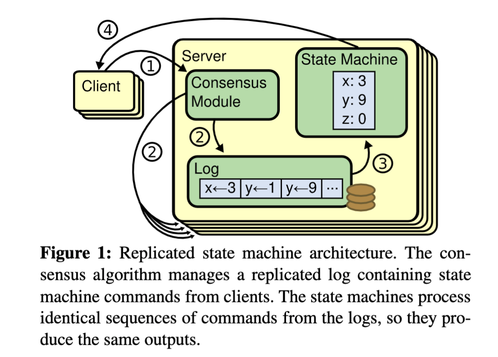
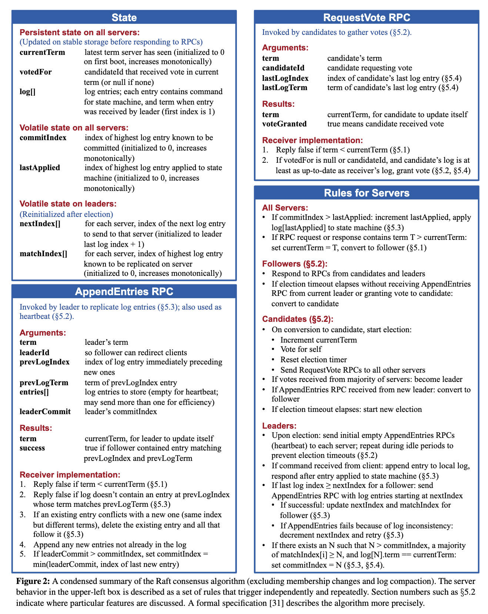
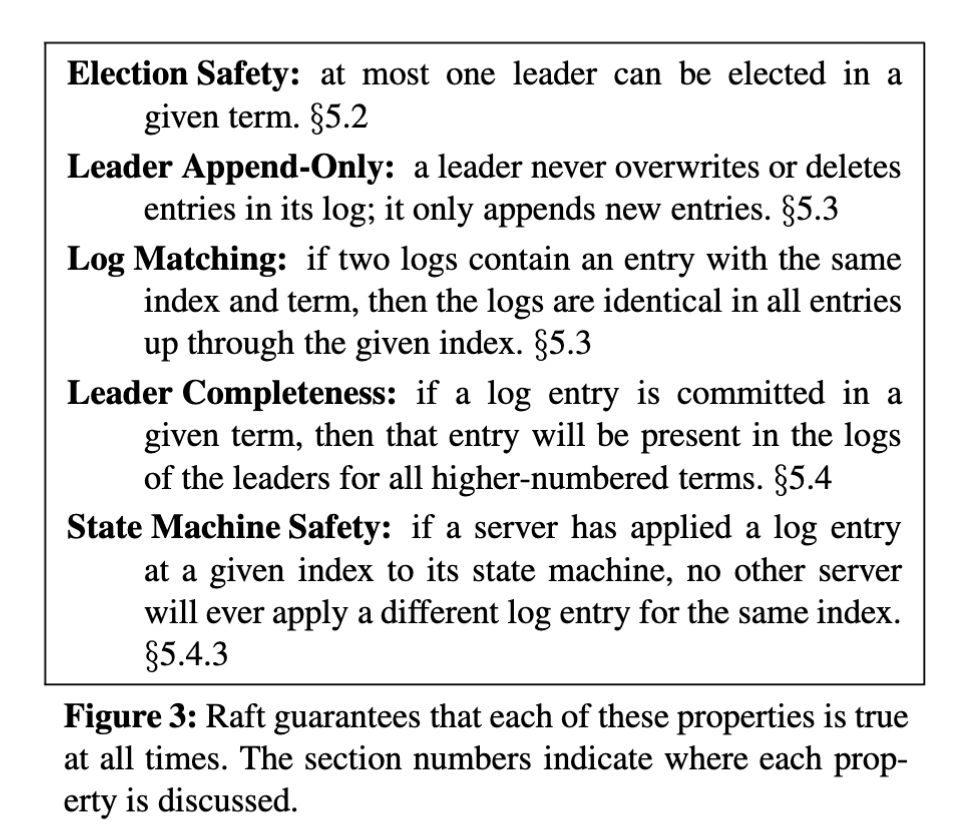
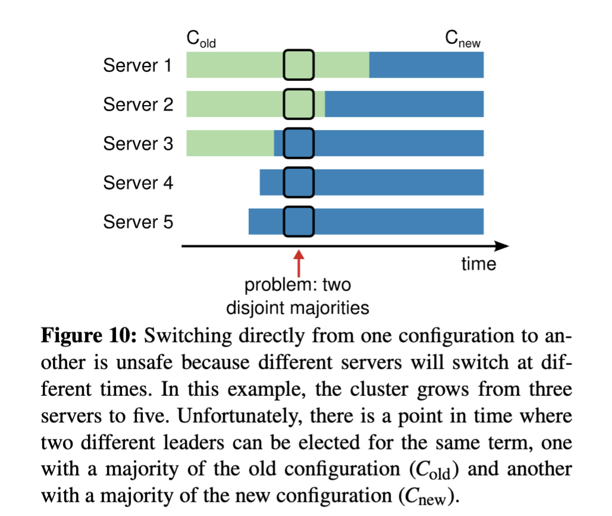
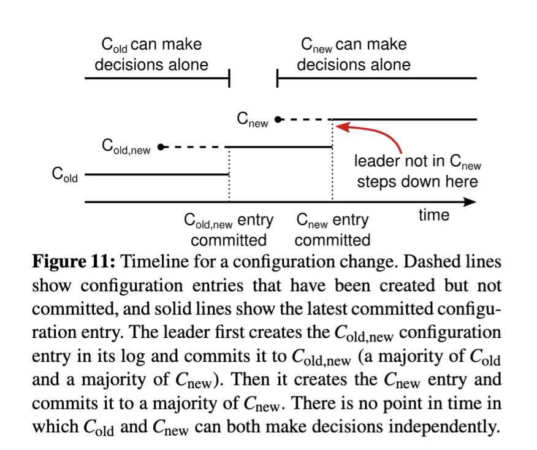
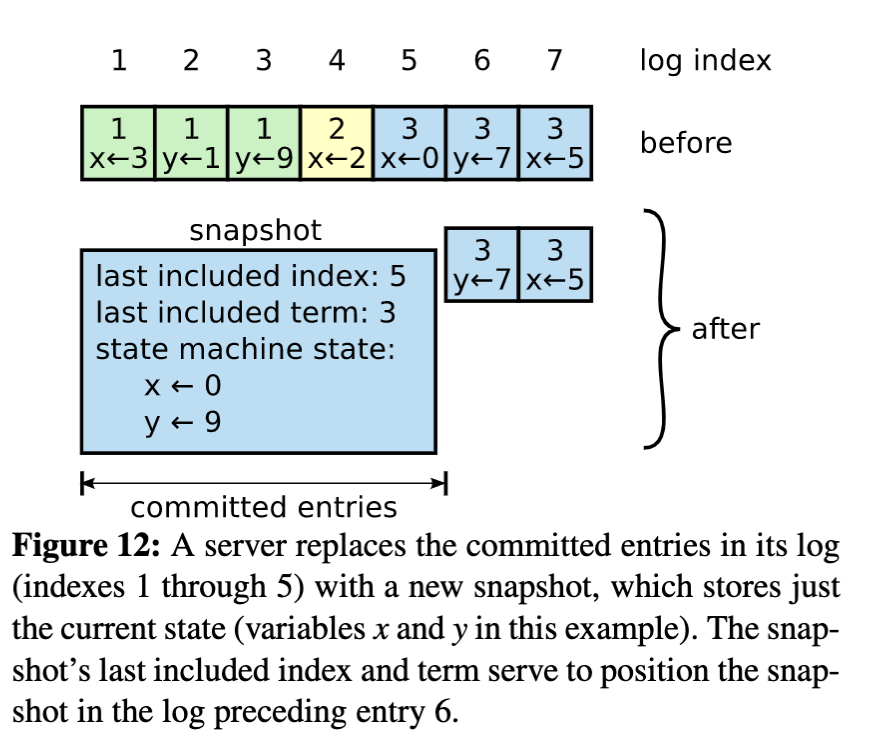
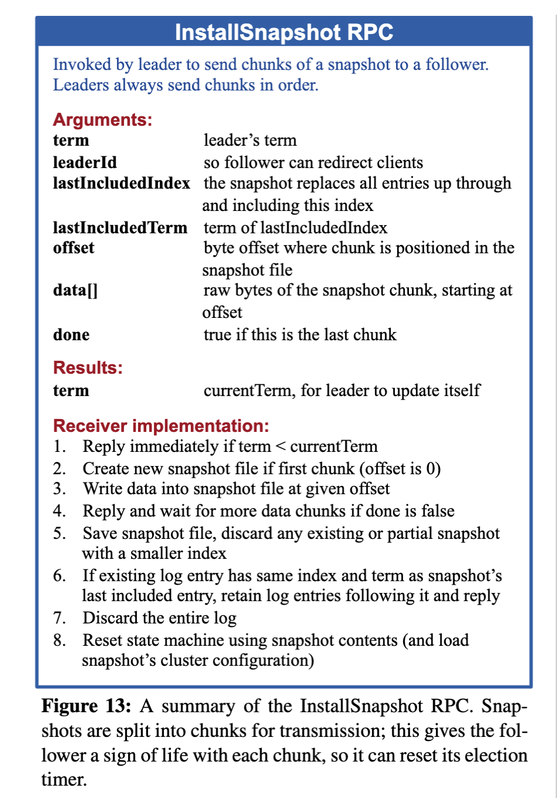

- 分布式共识算法
- 摘要
  与Multi-Paxos共识算法相比，更加便于理解和学习.
  Raft 是用来管理复制日志（replicated log）的一致性协议。它跟 multi-Paxos 作用相同，效率也相当，但是它的组织结构跟 Paxos 不同。这使得 Raft 比 Paxos 更容易理解并且更容易在工程实践中实现。为了使 Raft 协议更易懂，Raft将一致性的关键元素分开，如 leader 选举、日志复制和安全性，并且它实施更强的一致性以减少必须考虑的状态的数量.用户研究的结果表明，Raft 比 Paxos 更容易学习。 Raft 还包括一个用于变更集群成员的新机制，它使用重叠的大多数（overlapping majorities）来保证安全性。
- 一.介绍
  ((62bc018e-975a-4bc4-a91a-d5a97824cc91))
  一致性算法允许多台机器作为一个集群协同工作，并且在其中的某几台机器出故障时集群仍然能正常工作。 正因为如此，一致性算法在建立可靠的大规模软件系统方面发挥了关键作用。
  在过去十年中，Paxos [15,16] 主导了关于一致性算法的讨论：大多数一致性的实现都是基于 Paxos 或受其影响，Paxos 已成为用于教授学生一致性相关知识的主要工具。
  Paxos缺点：实在是太难以理解--->所以设计了Raft便于学习和理解的一致性算法--->便于业界实现
  在设计 Raft 时，我们使用了特定的技术来提高可理解性，包括分解（Raft 分离 leader 选举，日志复制和安全）和状态空间减少（相对于 Paxos ，Raft 减少了不确定性程度和服务器之间彼此不一致的方式 ）
  Raft 在许多方面类似于现有的一致性算法（尤其是[Oki 和 Liskov 的 Viewstamped Replication [29,22]](http://www.pmg.csail.mit.edu/papers/vr.pdf)），但它有几个新特性：
  1. Strong leader：在 Raft 中，日志条目（log entries）只从 leader 流向其他服务器。 这简化了复制日志的管理，使得 raft 更容易理解。
  2.Leader 选举：Raft 使用随机计时器进行 leader 选举。这只需在任何一致性算法都需要的心跳（heartbeats）上增加少量机制，同时能够简单快速地解决冲突。
  3. 成员变更：Raft 使用了一种新的联合一致性方法，其中两个不同配置的大多数在过渡期间重叠。 这允许集群在配置更改期间继续正常运行。
  我们认为，Raft 优于 Paxos 和其他一致性算法，不仅在教学方面，在工程实现方面也是。 它比其他算法更简单且更易于理解; 它被描述得十分详细足以满足实际系统的需要; 它有多个开源实现，并被多家公司使用; 它的安全性已被正式规定和验证; 它的效率与其他算法相当。
  
  本文的剩余部分介绍了复制状态机问题（第 2 节），讨论了 Paxos 的优点和缺点（第3节），描述了我们实现易理解性的方法（第 4 节），提出了Raft一致性算法（第 5-8 节），评估Raft（第 9 节），并讨论了相关工作（第 10 节）。
- 二.复制状态机（Replicated state machines）
  一致性算法是在[复制状态机[37]](https://www.cs.cornell.edu/fbs/publications/SMSurvey.pdf)的背景下产生的。 在这种方法中，一组服务器上的状态机计算相同状态的相同副本，并且即使某些服务器宕机，也可以继续运行。
  复制状态机用于解决分布式系统中的各种容错问题。 例如，具有单个 leader 的大规模系统，如 GFS [8]，HDFS [38] 和 RAMCloud [33] ，通常使用单独的复制状态机来进行 leader 选举和存储 leader 崩溃后重新选举需要的配置信息。Chubby [2] 和 ZooKeeper [11] 都是复制状态机。
  
  复制状态机通常使用复制日志实现，如图1所示。每个服务器存储一个包含一系列命令的日志，其状态机按顺序执行日志中的命令。 每个日志中命令都相同并且顺序也一样，因此每个状态机处理相同的命令序列。 这样就能得到相同的状态和相同的输出序列。
   
  图1复制状态机架构.共识算法管理来自客户端的状态机命令的复制日志
  一致性算法的工作就是保证复制日志的一致性。 每台服务器上的一致性模块接收来自客户端的命令，并将它们添加到其日志中。 它与其他服务器上的一致性模块通信，以确保每个日志最终以相同的顺序包含相同的命令，即使有一些服务器失败。 一旦命令被正确复制，每个服务器上的状态机按日志顺序处理它们，并将输出返回给客户端。 这样就形成了高可用的复制状态机。
	- 实际系统中的一致性算法通常具有以下属性：
	  1. 它们确保在所有非拜占庭条件下（包括网络延迟，分区和数据包丢失，重复和乱序）的安全性（不会返回不正确的结果）。
	  2. 只要任何大多数（过半）服务器都可以运行，并且可以相互通信和与客户通信，一致性算法就可用。 因此，五台服务器的典型集群可以容忍任何两台服务器的故障。 假设服务器突然宕机; 它们可以稍后从状态恢复并重新加入集群。
	  3. 它们不依赖于时序来确保日志的一致性：错误的时钟和极端消息延迟可能在最坏的情况下导致可用性问题。
	  4. 在通常情况下，只要集群的大部分（过半服务器）已经响应了单轮远程过程调用，命令就可以完成; 少数（一半以下）慢服务器不需要影响整个系统性能。
- 三.Paxos 存在的问题(可跳过)
  Paxos可跳过：1.核心非常难以理解 2.不能为构建实际的实现提供良好的基础。
  在过去十年里，Leslie Lamport 的 Paxos 协议[15]几乎成为一致性的同义词：它是课堂上教授最多的一致性协议，并且大多数一致性的实现也以它为起点。 Paxos 首先定义了能够在单个决策（例如单个复制日志条目）上达成一致的协议。 我们将这个子集称为 single-decree Paxos。 然后 Paxos 组合该协议的多个实例以促进一系列决策，例如日志（multi-Paxos）。 Paxos能够确保安全性和活性，并且支持集群成员的变更。它的正确性已被证明，并且在正常情况下是高效的。
  
  不幸的是，Paxos 有两个显著的缺点。 第一个缺点是 Paxos 非常难以理解。 Paxos 的描述晦涩难懂，臭名昭著（译者注：《The Part-time Parliament》比较晦涩难懂，但是《Paxos Made Simple》就比较容易理解）; 很少有人成功地理解它，即使能理解也必须付出巨大的努力。 因此，已有几个尝试以更简单的方式来描述 Paxos [16,20,21] 。 这些描述集中在 single-degree Paxos ，但它们仍然具有挑战性。 在对 NSDI 2012 参会者的非正式调查中，我们发现很少有人喜欢 Paxos ，即使是经验丰富的研究人员。 我们自己也跟 Paxos 进行了艰苦的斗争; 我们也无法完全理解整个协议，直到阅读了几个更简单的描述和自己设计替代 Paxos 的协议，整个过程花了将近一年。
  
  Paxos 晦涩难懂的原因是作者选择了single-degree Paxos作为基础。Single-decree Paxos 分成两个阶段，这两个阶段没有简单直观的说明，并且不能被单独理解。因此，很难理解为什么该算法能起作用。Multi-Paxos 的合成规则又增加了许多复杂性。我们相信，对多个决定（日志而不是单个日志条目）达成一致的总体问题可以用其他更直接和更明显的方式进行分解。
  
  Paxos的第二个问题是它不能为构建实际的实现提供良好的基础。 一个原因是没有针对 multi-Paxos 的广泛同意的算法。 Lamport的描述主要是关于 single-decree Paxos; 他描述了 multi-Paxos 的可能方法，但缺少许多细节。 已经有几个尝试来具体化和优化 Paxos ，例如[26]，[39]和[13]，但这些彼此各不相同并且跟 Lamport 描述的也不同。 像Chubby [4] 这样的系统已经实现了类 Paxos（Paxos-like）算法，但大多数情况下，它们的细节并没有公布。
  
  此外，Paxos 的架构对于构建实际系统来说是一个糟糕的设计，这是 single-decree 分解的另一个结果。 例如，独立地选择日志条目集合，然后再将它们合并到顺序日志中几乎没有任何好处，这只会增加复杂性。 围绕日志设计系统是更简单和有效的方法，新日志条目按照约束顺序地添加到日志中。 Paxos 的做法适用于只需要做一次决策的情况，如果需要做一系列决策，更简单和快速的方法是先选择一个 leader ，然后让该 leader 协调这些决策。
  
  因此，实际的系统跟 Paxos 相差很大。几乎所有的实现都是从 Paxos 开始，然后发现很多实现上的难题，接着就开发了一种和 Paxos 完全不一样的架构。这样既费时又容易出错，而且 Paxos 本身晦涩难懂使得该问题更加严重。Paxos 的公式可能可以很好地证明它的正确性，但是现实的系统和 Paxos 差别是如此之大，以至于这些证明并没有什么太大的价值。下面来自 Chubby 作者的评论非常典型：
  
  >在Paxos算法描述和实现现实系统中间有着巨大的鸿沟。最终的系统往往建立在一个还未被证明的协议之上。
  
  由于以上问题，我们得出的结论是 Paxos 算法没有为系统实践和教学提供一个良好的基础。考虑到一致性问题在大规模软件系统中的重要性，我们决定尝试设计一个能够替代 Paxos 并且具有更好特性的一致性算法。Raft算法就是这次实验的结果。
- 四.为可理解性而设计
  在设计 Raft 算法过程中我们有几个目标：它必须提供一个完整的实际的系统实现基础，这样才能大大减少开发者的工作；它必须在任何情况下都是安全的并且在典型的应用条件下是可用的；并且在正常情况下是高效的。但是我们最重要的目标也是最大的挑战是可理解性。它必须保证能够被大多数人容易地理解。另外，它必须能够让人形成直观的认识，这样系统的构建者才能够在现实中进行扩展。
  
  在设计 Raft 算法的时候，很多情况下我们需要在多个备选方案中进行选择。在这种情况下，我们基于可理解性来评估备选方案：解释各个备选方案的难道有多大（例如，Raft 的状态空间有多复杂，是否有微妙的含义）？对于一个读者而言，完全理解这个方案和含义是否容易？
  
  我们意识到这样的分析具有高度的主观性；但是我们使用了两种通用的技术来解决这个问题。第一个技术就是众所周知的问题分解：只要有可能，我们就将问题分解成几个相对独立的，可被解决的、可解释的和可理解的子问题。例如，Raft 算法被我们分成**leader 选举，日志复制，安全性和成员变更**几个部分。
  
  我们使用的第二个方法是通过减少状态的数量来简化状态空间，使得系统更加连贯并且尽可能消除不确定性。特别的，所有的日志是不允许有空洞的，并且 Raft 限制了使日志之间不一致的方式。尽管在大多数情况下我们都试图去消除不确定性，但是在某些情况下不确定性可以提高可理解性。特别是，随机化方法虽然引入了不确定性，但是他们往往能够通过使用相近的方法处理可能的选择来减少状态空间。我们使用随机化来简化 Raft 中的 leader 选举算法。
- 五.Raft共识算法
  Raft 是一种用来管理第 2 节中描述的复制日志的算法。图 2 是该算法的浓缩，可用作参考，图 3 列举了该算法的一些关键特性。图中的这些内容将在剩下的章节中逐一介绍。
   
  图2
  {:height 610, :width 708} 
  图3
  **状态**：
  在所有服务器上持久存在的：（在响应远程过程调用 RPC 之前稳定存储的）
  | 名称 | 描述 |
  | ---- | ---- | ---- |
  | currentTerm | 服务器最后知道的任期号（从0开始递增） |
  | votedFor | 在当前任期内收到选票的 Candidate id（如果没有就为 null） |
  | log[] | 日志条目；每个条目包含状态机的要执行命令和从 Leader 处收到时的任期号 |
  在所有服务器上不稳定存在的：
  | 名称 | 描述 |
  | ---- | ---- | ---- |
  | commitIndex | 已知的被提交的最大日志条目的索引值（从0开始递增） |
  | lastApplied | 被状态机执行的最大日志条目的索引值（从0开始递增） |
  在 Leader 服务器上不稳定存在的：（在选举之后初始化的）
  | 名称 | 描述 |
  | ---- | ---- | ---- |
  | nextIndex[] | 对于每一个服务器，记录需要发给它的下一个日志条目的索引（初始化为 Leader 上一条日志的索引值+1） |
  | matchIndex[] | 对于每一个服务器，记录已经复制到该服务器的日志的最高索引值（从0开始递增） |
  
  表-2-i
  **附加日志远程过程调用 （AppendEntries RPC）**
  由 Leader 来调用复制日志（5.3节）；也会用作heartbeat。
  | 名称 | 描述 |
  | ---- | ---- | ---- |
  | term | Leader 的任期号 |
  | leaderId | Leader 的 id，为了其他服务器能重定向到客户端 |
  | prevLogIndex | 最新日志之前的日志的索引值 |
  | prevLogTerm | 最新日志之前的日志的 Leader 任期号 |
  | entries[] | 将要存储的日志条目（表示 heartbeat 时为空，有时会为了效率发送超过一条） |
  | leaderCommit | Leader 提交的日志条目索引值 |
  | 返回值 | 描述 |
  | ---- | ---- | ---- |
  | term | 当前的任期号，用于 Leader 更新自己的任期号 |
  | success | 如果其它服务器包含能够匹配上 prevLogIndex 和 prevLogTerm 的日志时为真 |
  **接受者需要实现：**
  1. 如果 term < currentTerm返回 false（5.1节）
  2. 如果在prevLogIndex处的日志的任期号与prevLogTerm不匹配时，返回 false（5.3节）
  3. 如果一条已经存在的日志与新的冲突（index 相同但是任期号 term 不同），则删除已经存在的日志和它之后所有的日志（5.3节）
  4. 添加任何在已有的日志中不存在的条目
  5. 如果leaderCommit > commitIndex，将commitIndex设置为leaderCommit和最新日志条目索引号中较小的一个
  
  表-2-ii
  **投票请求 RPC（RequestVote RPC**）
  由 Candidate 发起收集选票（5.2节）
  | 参数 | 描述 |
  | ---- | ---- | ---- |
  | term | Candidate 的任期号 |
  | candidateId | 请求投票的 Candidate id |
  | lastLogIndex | Candidate 最新日志条目的索引值 |
  | lastLogTerm | Candidate 最新日志条目对应的任期号 |
  
  | 返回值 | 描述 |
  | ---- | ---- | ---- |
  | term | 当前的任期号，用于 Candidate 更新自己的任期号 |
  | voteGranted | 如果 Candidate 收到选票为 true |
  
  **接受者需要实现：**
  1. 如果term < currentTerm返回 false（5.1节）
  2. 如果votedFor为空或者与candidateId相同，并且 Candidate 的日志和自己的日志一样新，则给该 Candidate 投票（5.2节 和 5.4节）
  
  表-2-iii
  **服务器需要遵守的规则：**
  a。**All Server：**
  1. 如果commitIndex > lastApplied，lastApplied自增，将log[lastApplied]应用到状态机（5.3节）
  2. 如果 RPC 的请求或者响应中包含一个 term T 大于 currentTerm，则currentTerm赋值为 T，并切换状态为 Follower （Follower）（5.1节）
  b。**Followers: 5.2节**
  1. 响应来自 Candidate 和 Leader 的 RPC
  2. 如果在超过选取 Leader 时间之前没有收到来自当前 Leader 的AppendEntries RPC或者没有收到 Candidate 的投票请求，则自己转换状态为 Candidate
  c。**Candidate：5.2节**
  1.转变为选举人之后开始选举：
  1.1 currentTerm自增
  1.2 给自己投票
  1.3 重置选举计时器
  1.4 向其他服务器发送RequestVote RPC
  2. 如果收到了来自大多数服务器的投票：成为 Leader
  3. 如果收到了来自新 Leader 的AppendEntries RPC（heartbeat）：转换状态为 Follower
  4. 如果选举超时：开始新一轮的选举
  d。**Leader：**
  1. 一旦成为 Leader ：向其他所有服务器发送空的AppendEntries RPC（heartbeat）;在空闲时间重复发送以防止选举超时（5.2节）
  2. 如果收到来自客户端的请求：向本地日志增加条目，在该条目应用到状态机后响应客户端（5.3节）
  3. 对于一个 Follower 来说，如果上一次收到的日志索引大于将要收到的日志索引（nextIndex）：通过AppendEntries RPC将 nextIndex 之后的所有日志条目发送出去
  4. 如果发送成功：将该 Follower 的 nextIndex和matchIndex更新
  5. 如果由于日志不一致导致AppendEntries RPC失败：nextIndex递减并且重新发送（5.3节）
  6. 如果存在一个满足N > commitIndex和matchIndex[i] >= N并且log[N].term == currentTerm的 N，则将commitIndex赋值为 N
  
  表-2-iv
  表-2： ((62bc1041-1006-4ba6-a274-a3e3f620f066)) 
  
  Raft 通过首先选举一个 distinguished leader，然后让它全权负责管理复制日志来实现一致性。Leader 从客户端接收日志条目，把日志条目复制到其他服务器上，并且在保证安全性的时候通知其他服务器将日志条目应用到他们的状态机中。拥有一个 leader 大大简化了对复制日志的管理。例如， Leader 可以决定新的日志条目需要放在日志中的什么位置而不需要和其他服务器商议，并且数据都是从 leader 流向其他服务器。leader 可能宕机，也可能和其他服务器断开连接，这时一个新的 leader 会被选举出来。
  
  通过选举一个 leader 的方式，Raft 将一致性问题分解成了三个相对独立的子问题，这些问题将会在接下来的子章节中进行讨论：
  1. Leader 选举：当前的 leader 宕机时，一个新的 leader 必须被选举出来。（章节 5.2）
  2. 日志复制：Leader 必须从客户端接收日志条目然后复制到集群中的其他节点，并且强制要求其他节点的日志和自己的保持一致。
  3. 安全性：Raft 中安全性的关键是图 3 中状态机的安全性：如果有任何的服务器节点已经应用了一个特定的日志条目到它的状态机中，那么其他服务器节点不能在同一个日志索引位置应用一条不同的指令。章节 5.4 阐述了 Raft 算法是如何保证这个特性的；该解决方案在选举机制（5.2 节）上增加了额外的限制。
  
  在展示一致性算法之后，本章节将讨论可用性的一些问题以及时序在系统中的作用。
- [[raft白皮书算法细节描述]]
- raft一致性算法的基本原则
  id:: 62bc1041-1006-4ba6-a274-a3e3f620f066
  关于日志索引位置:是全局唯一的
  Raft 一致性算法的总结（不包括成员变化 membership changes 和日志压缩 log compaction）
  | 性质 | 描述 |
  | ---- | ---- | ---- |
  | 选举安全原则（Election Safety） | 一个任期（term）内最多允许有一个 Leader 被选上（5.2节） |
  | Leader 只增加原则（Leader Append-Only） | Leader 永远不会覆盖或者删除自己的日志，它只会增加条目 |
  | 日志匹配原则（Log Matching） | 如果两个日志在相同的索引位置上的日志条目的任期号相同，那么我们就认为这个日志从头到这个索引位置之间的条目完全相同（5.3 节） |
  | Leader 完全原则（Leader Completeness) | 如果一个日志条目在一个给定任期内被提交，那么这个条目一定会出现在所有任期号更大的 Leader 中 |
  | 状态机安全原则（State Machine Safety） | 如果一个服务器已经将给定索引位置的日志条目应用到状态机中，则所有其他服务器不会在该索引位置应用不同的条目（5.4.3节） |
  | 表-3：Raft 算法保证这些特性任何时刻都成立 |  |
  
  {:height 590, :width 685} 
  图3
- 六.集群成员变更
  --->成员变更是一致性系统实现绕不开的难题，对于提升运维能力以及服务可用性都有很大的帮助。
  
  到目前为止，我们都假设集群的配置（参与一致性算法的服务器集合）是固定不变的。但是在实践中，偶尔会改变集群的配置的，例如替换那些宕机的机器或者改变复制程度。尽管可以通过使整个集群下线，更新所有配置，然后重启整个集群的方式来实现，但是在更改期间集群会不可用。另外，如果存在手工操作步骤，那么就会有操作失误的风险。为了避免这样的问题，我们决定将配置变更自动化并将其纳入到 Raft 一致性算法中来。
  
  **为了使配置变更机制能够安全，在转换的过程中不能够存在任何时间点使得同一个任期里可能选出两个 leader **。不幸的是，任何服务器直接从旧的配置转换到新的配置的方案都是不安全的。一次性自动地转换所有服务器是不可能的，所以在转换期间整个集群可能划分成两个独立的大多数（见图 10）。
  
  
  图10
  >图 10：直接从一种配置转到另一种配置是不安全的，因为各个机器会在不同的时候进行转换。在这个例子中，集群从 3 台机器变成了 5 台。不幸的是，存在这样的一个时间点，同一个任期里两个不同的 leader 会被选出。一个获得旧配置里过半机器的投票，一个获得新配置里过半机器的投票。
  
  为了保证安全性，配置变更必须采用一种两阶段方法。目前有很多种两阶段的实现。例如，有些系统（比如，[22]）在第一阶段停掉旧的配置所以不能处理客户端请求；然后在第二阶段在启用新的配置。在 Raft 中，集群先切换到一个过渡的配置，我们称之为联合一致（joint consensus）；一旦联合一致已经被提交了，那么系统就切换到新的配置上。联合一致结合了老配置和新配置：
  
  1. 日志条目被复制给集群中新、老配置的所有服务器。
  2. 新、旧配置的服务器都可以成为 leader 。
  3. 达成一致（针对选举和提交）需要分别在两种配置上获得过半的支持。
  
  联合一致允许独立的服务器在不妥协安全性的前提下，在不同的时刻进行配置转换过程。此外，联合一致允许集群在配置变更期间依然响应客户端请求。
  
  图11
  
  集群配置在复制日志中以特殊的日志条目来存储和通信；图 11 展示了配置变更过程。当一个 leader 接收到一个改变配置从 C-old 到 C-new 的请求，它就为联合一致将该配置（图中的 C-old,new）存储为一个日志条目，并以前面描述的方式复制该条目。一旦某个服务器将该新配置日志条目增加到自己的日志中，它就会用该配置来做出未来所有的决策（服务器总是使用它日志中最新的配置，无论该配置日志是否已经被提交）。这就意味着 leader 会使用 C-old,new 的规则来决定 C-old,new 的日志条目是什么时候被提交的。如果 leader 崩溃了，新 leader 可能是在 C-old 配置也可能是在 C-old,new 配置下选出来的，这取决于赢得选举的 candidate 是否已经接收到了 C-old,new 配置。在任何情况下， C-new 在这一时期都不能做出单方面决定。
  
  一旦 C-old,new 被提交，那么 C-old 和 C-new 都不能在没有得到对方认可的情况下做出决定，并且 leader 完整性特性保证了只有拥有 C-old,new 日志条目的服务器才能被选举为 leader 。现在 leader 创建一个描述 C-new 配置的日志条目并复制到集群其他节点就是安全的了。此外，新的配置被服务器收到后就会立即生效。当新的配置在 C-new 的规则下被提交，旧的配置就变得无关紧要，同时不使用新配置的服务器就可以被关闭了。如图 11 所示，任何时刻 C-old 和 C-new 都不能单方面做出决定；这保证了安全性。
  
  在关于配置变更还有三个问题需要解决。
  1. 第一个问题是，新的服务器开始时可能没有存储任何的日志条目。当这些服务器以这种状态加入到集群中，它们需要一段时间来更新来赶上其他服务器，这段它们无法提交新的日志条目。为了避免因此而造成的系统短时间的不可用，Raft 在配置变更前引入了一个额外的阶段，在该阶段，新的服务器以没有投票权身份加入到集群中来（leader 也复制日志给它们，但是考虑过半的时候不用考虑它们）。一旦该新的服务器追赶上了集群中的其他机器，配置变更就可以按上面描述的方式进行。
  
  2. 第二个问题是，集群的 leader 可能不是新配置中的一员。在这种情况下，leader 一旦提交了 C-new 日志条目就会退位（回到 follower 状态）。这意味着有这样的一段时间（leader 提交 C-new 期间），leader 管理着一个不包括自己的集群；它复制着日志但不把自己算在过半里面。Leader 转换发生在 C-new 被提交的时候，因为这是新配置可以独立运转的最早时刻（将总是能够在 C-new 配置下选出新的 Leader ）。在此之前，可能只能从 C-old 中选出 Leader 。
  
  3. 第三个问题是，那些被移除的服务器（不在 C-new 中）可能会扰乱集群。这些服务器将不会再接收到心跳，所以当选举超时，它们就会进行新的选举过程。它们会发送带有新任期号的 RequestVote RPCs ，这样会导致当前的 leader 回到 follower 状态。新的 leader 最终会被选出来，但是被移除的服务器将会再次超时，然后这个过程会再次重复，导致系统可用性很差。
  
  为了防止这种问题，当服务器认为当前 leader 存在时，服务器会忽略RequestVote RPCs 。特别的，当服务器在最小选举超时时间内收到一个 RequestVote RPC，它不会更新任期号或者投票。这不会影响正常的选举，每个服务器在开始一次选举之前，至少等待最小选举超时时间。相反，这有利于避免被移除的服务器的扰乱：如果 leader 能够发送心跳给集群，那它就不会被更大的任期号废黜。
- 七.日志压缩
  Raft 的日志在正常操作中随着包含更多的客户端请求不断地增长，但是在实际的系统中，日志不能无限制地增长。随着日志越来越长，它会占用越来越多的空间，并且需要花更多的时间来回放。如果没有一定的机制来清除日志中积累的过期的信息，最终就会带来可用性问题。
  
  快照技术是日志压缩最简单的方法。在快照技术中，整个当前系统的状态都以快照的形式持久化到稳定的存储中，该时间点之前的日志全部丢弃。快照技术被使用在 Chubby 和 ZooKeeper 中，接下来的章节会介绍 Raft 中的快照技术。
  
  增量压缩方法，例如日志清理或者日志结构合并树（log-structured merge trees，LSM 树），都是可行的。这些方法每次只对一小部分数据进行操作，这样就分散了压缩的负载压力。首先，它们先选择一个积累了大量已经被删除或者被覆盖的对象的数据区域，然后重写该区域还活着的对象，之后释放该区域。和快照技术相比，它们需要大量额外的机制和复杂性，快照技术通过操作整个数据集来简化该问题。状态机可以用和快照技术相同的接口来实现 LSM 树，但是日志清除方法就需要修改 Raft 了。
  
  图12
  
  >一台服务器用一个新快照替代了它日志中已经提交了的条目（索引 1 到 5），该快照只存储了当前的状态（变量 x 和 y 的值）。快照的 last included index 和 last included term 被保存来定位日志中条目 6 之前的快照
  
  图 12 展示了 Raft 中快照的基本思想。每个服务器独立地创建快照，快照只包括自己日志中已经被提交的条目。主要的工作是状态机将自己的状态写入快照中。Raft 快照中也包含了少量的元数据：the last included index 指的是最后一个被快照取代的日志条目的索引值（状态机最后应用的日志条目），the last included term 是该条目的任期号。保留这些元数据是为了支持快照后第一个条目的 AppendEntries 一致性检查，因为该条目需要之前的索引值和任期号。为了支持集群成员变更（第 6 节），快照中也包括日志中最新的配置作为 last included index 。一旦服务器完成写快照，他就可以删除 last included index 之前的所有日志条目，包括之前的快照。
  
  尽管通常服务器都是独立地创建快照，但是 leader 必须偶尔发送快照给一些落后的 Follower 。这通常发生在 leader 已经丢弃了需要发送给 follower 的下一条日志条目的时候。幸运的是这种情况在常规操作中是不可能的：一个与 leader 保持同步的 follower 通常都会有该日志条目。然而一个例外的运行缓慢的 follower 或者新加入集群的服务器（第 6 节）将不会有这个条目。这时让该 follower 更新到最新的状态的方式就是通过网络把快照发送给它。
  
  Leader 使用 InstallSnapshot RPC 来发送快照给太落后的 follower ；见图 13。当 follower 收到带有这种 RPC 的快照时，它必须决定如何处理已经存在的日志条目。通常该快照会包含接收者日志中没有的信息。在这种情况下，follower 丢弃它所有的日志；这些会被该快照所取代，并且可能一些没有提交的条目会和该快照产生冲突。如果接收到的快照是自己日志的前面部分（由于网络重传或者错误），那么被快照包含的条目将会被全部删除，但是快照之后的条目仍然有用并保留。
  
  
  图13
  
  | 参数 | 描述 |
  | ---- | ---- | ---- |
  | term | Leader 的任期 |
  | leaderId | 为了 Follower 能重定向到客户端 |
  | lastIncludedIndex | 快照中包含的最后日志条目的索引值 |
  | lastIncludedTerm | 快照中包含的最后日志条目的任期号 |
  | offset | 分块在快照中的偏移量 |
  | data[] | 快照块的原始数据 |
  | done | 如果是最后一块数据则为 true |
  | 返回值 | 描述 |
  | ---- | ---- | ---- |
  | term | currentTerm，用于 Leader 更新自己的任期 |
  
  接受者需要实现：
  1. 如果term < currentTerm立刻回复
  2. 如果是第一个分块（offset 为 0）则创建新的快照
  3. 在指定的偏移量写入数据
  4. 如果 done为 false，则回复并继续等待之后的数据
  5. 保存快照文件，丢弃所有存在的或者部分有着更小索引号的快照
  6. 如果现存的日志拥有相同的最后任期号和索引值，则后面的数据继续保留并且回复
  7. 丢弃全部日志
  8. 能够使用快照来恢复状态机（并且装载快照中的集群配置）
  
  表-13：InstallSnapshot RPC 的总结。为了便于传输，快照都是被分成分块的；每个分块都给了 Follower 生存的信号，所以 Follower 可以重置选举超时计时
  
  这种快照的方式违反了 Raft 的 strong leader 原则，因为 follower 可以在不知道 leader 状态的情况下创建快照。但是我们认为这种违背是合乎情理的。Leader 的存在，是为了防止在达成一致性的时候的冲突，但是在创建快照的时候，一致性已经达成，因此没有决策会冲突。数据依然只能从 leader 流到 follower ，只是 follower 可以重新组织它们的数据了。
  
  我们考虑过一种可替代的基于 leader 的快照方案，在该方案中，只有leader 会创建快照，然后 leader 会发送它的快照给所有的 follower 。但是这样做有两个缺点。第一，发送快照会浪费网络带宽并且延缓了快照过程。每个 follower 都已经拥有了创建自己的快照所需要的信息，而且很显然，follower 从本地的状态中创建快照远比通过网络接收别人发来的要来得经济。第二，leader 的实现会更加复杂。例如，leader 发送快照给 follower 的同时也要并行地将新的日志条目发送给它们，这样才不会阻塞新的客户端请求。
  
  还有两个问题会影响快照的性能。首先，服务器必须决定什么时候创建快照。如果快照创建过于频繁，那么就会浪费大量的磁盘带宽和其他资源；如果创建快照频率太低，就要承担耗尽存储容量的风险，同时也增加了重启时日志回放的时间。一个简单的策略就是当日志大小达到一个固定大小的时候就创建一次快照。如果这个阈值设置得显著大于期望的快照的大小，那么快照的磁盘带宽负载就会很小。
  
  第二个性能问题就是写入快照需要花费一段时间，并且我们不希望它影响到正常的操作。解决方案是通过写时复制的技术，这样新的更新就可以在不影响正在写的快照的情况下被接收。例如，具有泛函数据结构的状态机天然支持这样的功能。另外，操作系统对写时复制技术的支持（如 Linux 上的 fork）可以被用来创建整个状态机的内存快照（我们的实现用的就是这种方法）。
- 八.客户端和交互
  本节介绍客户端如何和 Raft 进行交互，包括客户端如何找到 leader 和 Raft 是如何支持线性化语义的。这些问题对于所有基于一致性的系统都存在，并且 Raft 的解决方案和其他的也差不多。
  
  Raft 的客户端发送所有的请求给 leader 。当客户端第一次启动的时候，它会随机挑选一个服务器进行通信。如果客户端第一次挑选的服务器不是 leader ，那么该服务器会拒绝客户端的请求并且提供关于它最近接收到的 Leader 的信息（AppendEntries 请求包含了 leader 的网络地址）。如果 leader 已经崩溃了，客户端请求就会超时；客户端之后会再次随机挑选服务器进行重试。
  
  我们 Raft 的目标是要实现线性化语义（每一次操作立即执行，只执行一次，在它的调用和回复之间）。但是，如上述，Raft 可能执行同一条命令多次：例如，如果 leader 在提交了该日志条目之后，响应客户端之前崩溃了，那么客户端会和新的 leader 重试这条指令，导致这条命令被再次执行。解决方案就是客户端对于每一条指令都赋予一个唯一的序列号。然后，状态机跟踪每个客户端已经处理的最新的序列号以及相关联的回复。如果接收到一条指令，该指令的序列号已经被执行过了，就立即返回结果，而不重新执行该请求。
  
  只读的操作可以直接处理而不需要记录日志。但是，如果不采取任何其他措施，这么做可能会有返回过时数据（stale data）的风险，因为 leader 响应客户端请求时可能已经被新的 leader 替代了，但是它还不知道自己已经不是最新的 leader 了。线性化的读操作肯定不会返回过时数据，Raft 需要使用两个额外的预防措施来在不使用日志的情况下保证这一点。首先，leader 必须有关于哪些日志条目被提交了的最新信息。Leader 完整性特性保证了 leader 一定拥有所有已经被提交的日志条目，但是在它任期开始的时候，它可能不知道哪些是已经被提交的。为了知道这些信息，它需要在它的任期里提交一个日志条目。Raft 通过让 leader 在任期开始的时候提交一个空的没有任何操作的日志条目到日志中来处理该问题。第二，leader 在处理只读请求之前必须检查自己是否已经被替代了（如果一个更新的 leader 被选举出来了，它的信息就是过时的了）。Raft 通过让 leader 在响应只读请求之前，先和集群中的过半节点交换一次心跳信息来处理该问题。另一种可选的方案，leader 可以依赖心跳机制来实现一种租约的形式，但是这种方法依赖 timing 来保证安全性（假设时间误差是有界的）。
- 九.实现和评价
  我们已经为 RAMCloud 实现了 Raft 算法作为存储配置信息的复制状态机的一部分，并且帮助 RAMCloud 协调故障转移。这个 Raft 实现包含大约 2000 行 C++ 代码，其中不包括测试、注释和空行。这些代码是开源的。同时也有大约 25 个其他独立的第三方的基于这篇论文草稿的开源实现，针对不同的开发场景。同时，很多公司已经部署了基于 Raft 的系统。
  
  这一章会从三个方面来评估 Raft 算法：可理解性、正确性和性能。
	- 9.1 可理解性
	  为了比较 Paxos 和 Raft 算法的可理解性，我们针对高层次的本科生和研究生，在斯坦福大学的高级操作系统课程和加州大学伯克利分校的分布式计算课程上，进行了一次学习的实验。我们分别拍了针对 Raft 和 Paxos 的视频课程，并准备了相应的小测验。Raft 的视频讲课覆盖了这篇论文除了日志压缩之外的所有内容；Paxos 课程包含了足够的资料来创建一个等价的复制状态机，包括单决策 Paxos，多决策 Paxos，重新配置和一些实际系统需要的性能优化（例如 Leader 选举）。小测验测试一些对算法的基本理解和解释一些示例。每个学生都是看完第一个视频，回答相应的测试，再看第二个视频，回答相应的测试。大约有一半的学生先进行 Paxos 部分，然后另一半先进行 Raft 部分，这是为了说明两者独立的区别从第一个算法处学来的经验。我们计算参加人员的每一个小测验的得分来看参与者是否对 Raft 的理解更好。
	  
	  | 因素 | 消除偏见的手段 | 复习材料 |
	  | ---- | ---- | ---- |
	  | 相同的讲课质量 | 使用相同的讲师。Paxos 的讲义是基于之前在几所大学中使用的材料的并且做了改进。Paxos 的讲义要长 14% | 视频 |
	  | 相同的测试难度 | 用难度给问题分组，在测试中成对出现 | 测验 |
	  | 标准的打分 | 使用红字标题。随机顺序打分，两个测验交替进行 | 红字标题 |
	  表-1：考虑到的可能造成偏见的因素，以及解决方案和对应的复习材料
	- 9.2 正确性
	- 9.3 性能
-
- 资料
  reft白皮书论文
  [Raft论文翻译](https://willzhuang.github.io/2018/03/04/Raft%E8%AE%BA%E6%96%87%E7%BF%BB%E8%AF%91/)
  
  
  关于集群成员变更的博客
  [知乎-Raft成员变更的工程实践](https://zhuanlan.zhihu.com/p/359206808)
  [TiDB 在 Raft 成员变更上踩的坑](https://blog.openacid.com/distributed/raft-bug/)
-
-