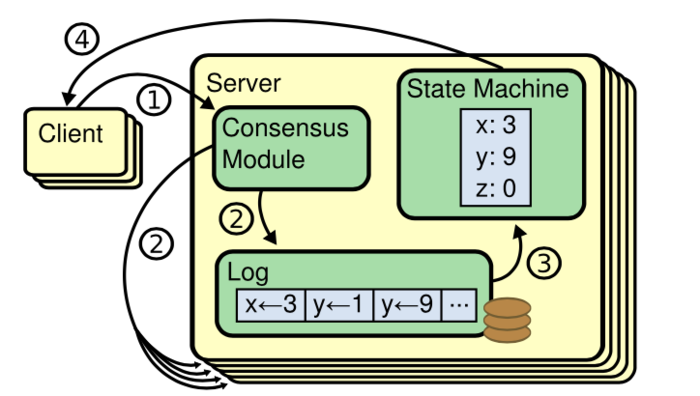
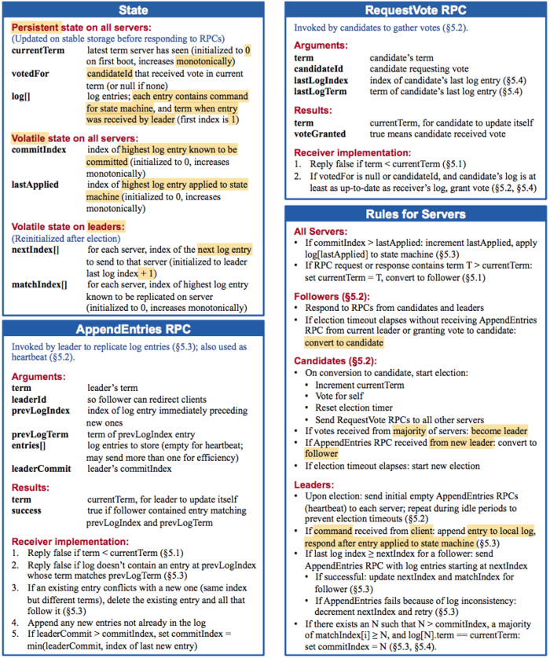
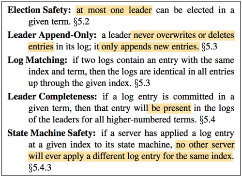

- 分布式共识算法
- 摘要
  与Multi-Paxos共识算法相比，更加便于理解和学习.
  Raft 是用来管理复制日志（replicated log）的一致性协议。它跟 multi-Paxos 作用相同，效率也相当，但是它的组织结构跟 Paxos 不同。这使得 Raft 比 Paxos 更容易理解并且更容易在工程实践中实现。为了使 Raft 协议更易懂，Raft将一致性的关键元素分开，如 leader 选举、日志复制和安全性，并且它实施更强的一致性以减少必须考虑的状态的数量.用户研究的结果表明，Raft 比 Paxos 更容易学习。 Raft 还包括一个用于变更集群成员的新机制，它使用重叠的大多数（overlapping majorities）来保证安全性。
- 一.介绍
  ((62bc018e-975a-4bc4-a91a-d5a97824cc91))
  一致性算法允许多台机器作为一个集群协同工作，并且在其中的某几台机器出故障时集群仍然能正常工作。 正因为如此，一致性算法在建立可靠的大规模软件系统方面发挥了关键作用。
  在过去十年中，Paxos [15,16] 主导了关于一致性算法的讨论：大多数一致性的实现都是基于 Paxos 或受其影响，Paxos 已成为用于教授学生一致性相关知识的主要工具。
  Paxos缺点：实在是太难以理解--->所以设计了Raft便于学习和理解的一致性算法--->便于业界实现
  在设计 Raft 时，我们使用了特定的技术来提高可理解性，包括分解（Raft 分离 leader 选举，日志复制和安全）和状态空间减少（相对于 Paxos ，Raft 减少了不确定性程度和服务器之间彼此不一致的方式 ）
  Raft 在许多方面类似于现有的一致性算法（尤其是[Oki 和 Liskov 的 Viewstamped Replication [29,22]](http://www.pmg.csail.mit.edu/papers/vr.pdf)），但它有几个新特性：
  1. Strong leader：在 Raft 中，日志条目（log entries）只从 leader 流向其他服务器。 这简化了复制日志的管理，使得 raft 更容易理解。
  2.Leader 选举：Raft 使用随机计时器进行 leader 选举。这只需在任何一致性算法都需要的心跳（heartbeats）上增加少量机制，同时能够简单快速地解决冲突。
  3. 成员变更：Raft 使用了一种新的联合一致性方法，其中两个不同配置的大多数在过渡期间重叠。 这允许集群在配置更改期间继续正常运行。
  我们认为，Raft 优于 Paxos 和其他一致性算法，不仅在教学方面，在工程实现方面也是。 它比其他算法更简单且更易于理解; 它被描述得十分详细足以满足实际系统的需要; 它有多个开源实现，并被多家公司使用; 它的安全性已被正式规定和验证; 它的效率与其他算法相当。
  
  本文的剩余部分介绍了复制状态机问题（第 2 节），讨论了 Paxos 的优点和缺点（第3节），描述了我们实现易理解性的方法（第 4 节），提出了Raft一致性算法（第 5-8 节），评估Raft（第 9 节），并讨论了相关工作（第 10 节）。
- 二.复制状态机（Replicated state machines）
  一致性算法是在[复制状态机[37]](https://www.cs.cornell.edu/fbs/publications/SMSurvey.pdf)的背景下产生的。 在这种方法中，一组服务器上的状态机计算相同状态的相同副本，并且即使某些服务器宕机，也可以继续运行。
  复制状态机用于解决分布式系统中的各种容错问题。 例如，具有单个 leader 的大规模系统，如 GFS [8]，HDFS [38] 和 RAMCloud [33] ，通常使用单独的复制状态机来进行 leader 选举和存储 leader 崩溃后重新选举需要的配置信息。Chubby [2] 和 ZooKeeper [11] 都是复制状态机。
  
  复制状态机通常使用复制日志实现，如图1所示。每个服务器存储一个包含一系列命令的日志，其状态机按顺序执行日志中的命令。 每个日志中命令都相同并且顺序也一样，因此每个状态机处理相同的命令序列。 这样就能得到相同的状态和相同的输出序列。
  
  图1复制状态机架构.共识算法管理来自客户端的状态机命令的复制日志
  一致性算法的工作就是保证复制日志的一致性。 每台服务器上的一致性模块接收来自客户端的命令，并将它们添加到其日志中。 它与其他服务器上的一致性模块通信，以确保每个日志最终以相同的顺序包含相同的命令，即使有一些服务器失败。 一旦命令被正确复制，每个服务器上的状态机按日志顺序处理它们，并将输出返回给客户端。 这样就形成了高可用的复制状态机。
	- 实际系统中的一致性算法通常具有以下属性：
	  1. 它们确保在所有非拜占庭条件下（包括网络延迟，分区和数据包丢失，重复和乱序）的安全性（不会返回不正确的结果）。
	  2. 只要任何大多数（过半）服务器都可以运行，并且可以相互通信和与客户通信，一致性算法就可用。 因此，五台服务器的典型集群可以容忍任何两台服务器的故障。 假设服务器突然宕机; 它们可以稍后从状态恢复并重新加入集群。
	  3. 它们不依赖于时序来确保日志的一致性：错误的时钟和极端消息延迟可能在最坏的情况下导致可用性问题。
	  4. 在通常情况下，只要集群的大部分（过半服务器）已经响应了单轮远程过程调用，命令就可以完成; 少数（一半以下）慢服务器不需要影响整个系统性能。
- 三.Paxos 存在的问题(可跳过)
  Paxos可跳过：1.核心非常难以理解 2.不能为构建实际的实现提供良好的基础。
  在过去十年里，Leslie Lamport 的 Paxos 协议[15]几乎成为一致性的同义词：它是课堂上教授最多的一致性协议，并且大多数一致性的实现也以它为起点。 Paxos 首先定义了能够在单个决策（例如单个复制日志条目）上达成一致的协议。 我们将这个子集称为 single-decree Paxos。 然后 Paxos 组合该协议的多个实例以促进一系列决策，例如日志（multi-Paxos）。 Paxos能够确保安全性和活性，并且支持集群成员的变更。它的正确性已被证明，并且在正常情况下是高效的。
  
  不幸的是，Paxos 有两个显著的缺点。 第一个缺点是 Paxos 非常难以理解。 Paxos 的描述晦涩难懂，臭名昭著（译者注：《The Part-time Parliament》比较晦涩难懂，但是《Paxos Made Simple》就比较容易理解）; 很少有人成功地理解它，即使能理解也必须付出巨大的努力。 因此，已有几个尝试以更简单的方式来描述 Paxos [16,20,21] 。 这些描述集中在 single-degree Paxos ，但它们仍然具有挑战性。 在对 NSDI 2012 参会者的非正式调查中，我们发现很少有人喜欢 Paxos ，即使是经验丰富的研究人员。 我们自己也跟 Paxos 进行了艰苦的斗争; 我们也无法完全理解整个协议，直到阅读了几个更简单的描述和自己设计替代 Paxos 的协议，整个过程花了将近一年。
  
  Paxos 晦涩难懂的原因是作者选择了single-degree Paxos作为基础。Single-decree Paxos 分成两个阶段，这两个阶段没有简单直观的说明，并且不能被单独理解。因此，很难理解为什么该算法能起作用。Multi-Paxos 的合成规则又增加了许多复杂性。我们相信，对多个决定（日志而不是单个日志条目）达成一致的总体问题可以用其他更直接和更明显的方式进行分解。
  
  Paxos的第二个问题是它不能为构建实际的实现提供良好的基础。 一个原因是没有针对 multi-Paxos 的广泛同意的算法。 Lamport的描述主要是关于 single-decree Paxos; 他描述了 multi-Paxos 的可能方法，但缺少许多细节。 已经有几个尝试来具体化和优化 Paxos ，例如[26]，[39]和[13]，但这些彼此各不相同并且跟 Lamport 描述的也不同。 像Chubby [4] 这样的系统已经实现了类 Paxos（Paxos-like）算法，但大多数情况下，它们的细节并没有公布。
  
  此外，Paxos 的架构对于构建实际系统来说是一个糟糕的设计，这是 single-decree 分解的另一个结果。 例如，独立地选择日志条目集合，然后再将它们合并到顺序日志中几乎没有任何好处，这只会增加复杂性。 围绕日志设计系统是更简单和有效的方法，新日志条目按照约束顺序地添加到日志中。 Paxos 的做法适用于只需要做一次决策的情况，如果需要做一系列决策，更简单和快速的方法是先选择一个 leader ，然后让该 leader 协调这些决策。
  
  因此，实际的系统跟 Paxos 相差很大。几乎所有的实现都是从 Paxos 开始，然后发现很多实现上的难题，接着就开发了一种和 Paxos 完全不一样的架构。这样既费时又容易出错，而且 Paxos 本身晦涩难懂使得该问题更加严重。Paxos 的公式可能可以很好地证明它的正确性，但是现实的系统和 Paxos 差别是如此之大，以至于这些证明并没有什么太大的价值。下面来自 Chubby 作者的评论非常典型：
  
  >在Paxos算法描述和实现现实系统中间有着巨大的鸿沟。最终的系统往往建立在一个还未被证明的协议之上。
  
  由于以上问题，我们得出的结论是 Paxos 算法没有为系统实践和教学提供一个良好的基础。考虑到一致性问题在大规模软件系统中的重要性，我们决定尝试设计一个能够替代 Paxos 并且具有更好特性的一致性算法。Raft算法就是这次实验的结果。
- 四.为可理解性而设计
  在设计 Raft 算法过程中我们有几个目标：它必须提供一个完整的实际的系统实现基础，这样才能大大减少开发者的工作；它必须在任何情况下都是安全的并且在典型的应用条件下是可用的；并且在正常情况下是高效的。但是我们最重要的目标也是最大的挑战是可理解性。它必须保证能够被大多数人容易地理解。另外，它必须能够让人形成直观的认识，这样系统的构建者才能够在现实中进行扩展。
  
  在设计 Raft 算法的时候，很多情况下我们需要在多个备选方案中进行选择。在这种情况下，我们基于可理解性来评估备选方案：解释各个备选方案的难道有多大（例如，Raft 的状态空间有多复杂，是否有微妙的含义）？对于一个读者而言，完全理解这个方案和含义是否容易？
  
  我们意识到这样的分析具有高度的主观性；但是我们使用了两种通用的技术来解决这个问题。第一个技术就是众所周知的问题分解：只要有可能，我们就将问题分解成几个相对独立的，可被解决的、可解释的和可理解的子问题。例如，Raft 算法被我们分成**leader 选举，日志复制，安全性和成员变更**几个部分。
  
  我们使用的第二个方法是通过减少状态的数量来简化状态空间，使得系统更加连贯并且尽可能消除不确定性。特别的，所有的日志是不允许有空洞的，并且 Raft 限制了使日志之间不一致的方式。尽管在大多数情况下我们都试图去消除不确定性，但是在某些情况下不确定性可以提高可理解性。特别是，随机化方法虽然引入了不确定性，但是他们往往能够通过使用相近的方法处理可能的选择来减少状态空间。我们使用随机化来简化 Raft 中的 leader 选举算法。
- 五.Raft共识算法
  Raft 是一种用来管理第 2 节中描述的复制日志的算法。图 2 是该算法的浓缩，可用作参考，图 3 列举了该算法的一些关键特性。图中的这些内容将在剩下的章节中逐一介绍。
  
  图2
  
  图3
-
- 资料
  reft白皮书论文
  [Raft论文翻译](https://willzhuang.github.io/2018/03/04/Raft%E8%AE%BA%E6%96%87%E7%BF%BB%E8%AF%91/)
  
-
-