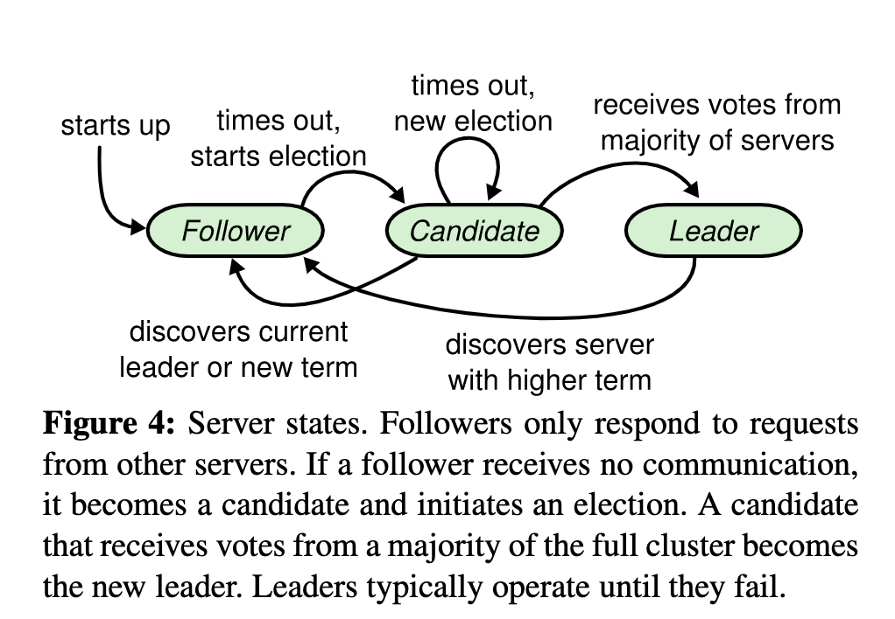
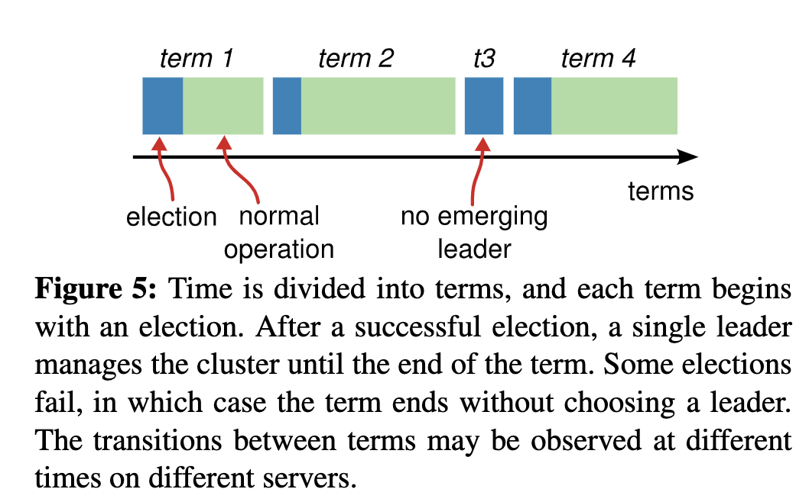
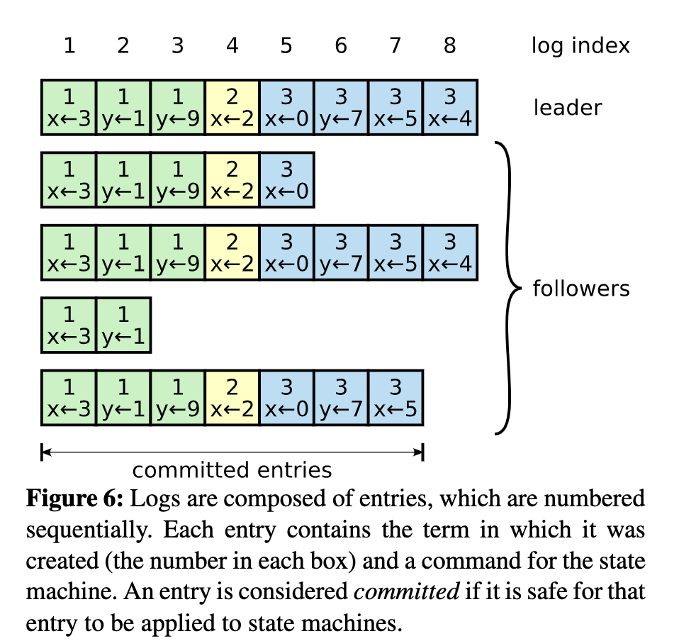
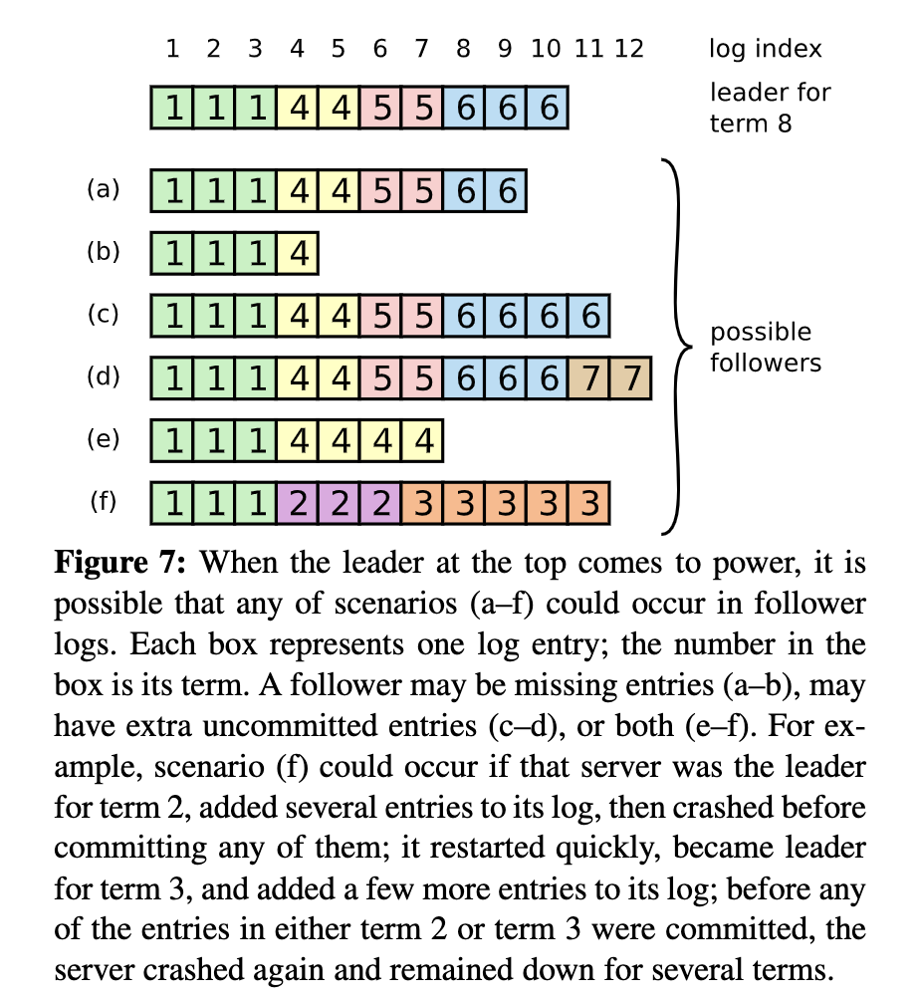
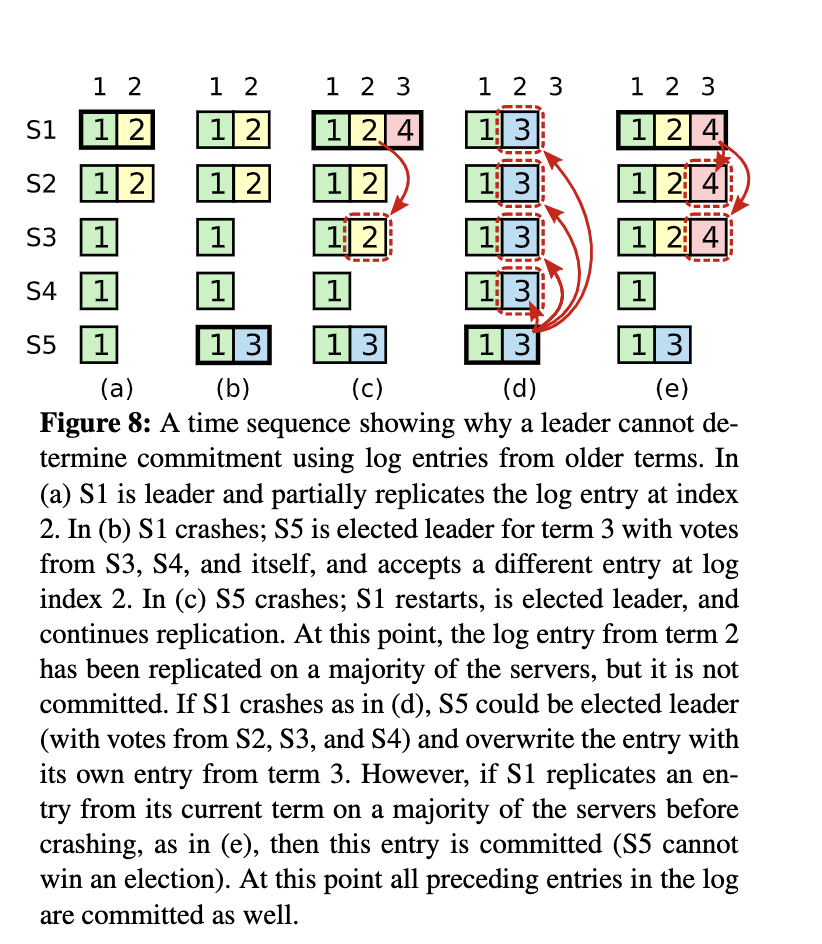
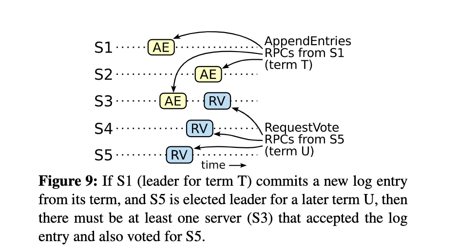

- 5.1 Raft 基础
  ((62bd104e-af37-448e-8893-dbd13ad20426))
  一个 Raft 集群包含若干个服务器节点；通常是 5 个，这样的系统可以容忍 2 个节点的失效。
  raft集群节点类型
  在任何时刻，每一个服务器节点都处于这三个状态之一：leader、follower 或者 candidate 。在正常情况下，集群中只有一个 leader 并且其他的节点全部都是 follower 。
  Follower 都是被动的：他们不会发送任何请求，只是简单的响应来自 leader 和 candidate 的请求。
  Leader 处理所有的客户端请求（如果一个客户端和 follower 通信，follower 会将请求重定向给 leader）。
  第三种状态，candidate ，是用来选举一个新的 leader（章节 5.2）。
  图 4 展示了这些状态和他们之间的转换关系；这些转换关系在接下来会进行讨论。
   
  图4
  Raft 把时间分割成任意长度的任期（term），如图 5 所示。任期用连续的整数标记。每一段任期从一次选举开始，一个或者多个 candidate 尝试成为 leader 。如果一个 candidate 赢得选举，然后他就在该任期剩下的时间里充当 leader 。在某些情况下，一次选举无法选出 leader 。在这种情况下，这一任期会以没有 leader 结束；一个新的任期（包含一次新的选举）会很快重新开始。Raft 保证了在任意一个任期内，最多只有一个 leader 。
  
  
  不同的服务器节点观察到的任期转换的次数可能不同，在某些情况下，一个服务器节点可能没有看到 leader 选举过程或者甚至整个任期全程。任期在 Raft 算法中充当逻辑时钟的作用，这使得服务器节点可以发现一些过期的信息比如过时的 leader 。每一个服务器节点存储一个当前任期号，该编号随着时间单调递增。服务器之间通信的时候会交换当前任期号；如果一个服务器的当前任期号比其他的小，该服务器会将自己的任期号更新为较大的那个值。如果一个 candidate 或者 leader 发现自己的任期号过期了，它会立即回到 follower 状态。如果一个节点接收到一个包含过期的任期号的请求，它会直接拒绝这个请求。
  
  Raft 算法中服务器节点之间使用 RPC 进行通信，并且基本的一致性算法只需要两种类型的 RPC。请求投票（RequestVote） RPC 由 candidate 在选举期间发起（章节 5.2），追加条目（AppendEntries）RPC 由 leader 发起，用来复制日志和提供一种心跳机制（章节 5.3）。第 7 节为了在服务器之间传输快照增加了第三种 RPC。当服务器没有及时的收到 RPC 的响应时，会进行重试， 并且他们能够并行的发起 RPC 来获得最佳的性能。
- 5.2 Leader 选举
  Raft 使用一种心跳机制来触发 leader 选举。当服务器程序启动时，他们都是 follower 。一个服务器节点只要能从 leader 或 candidate 处接收到有效的 RPC 就一直保持 follower 状态。Leader 周期性地向所有 follower 发送心跳（不包含日志条目的 AppendEntries RPC）来维持自己的地位。如果一个 follower 在一段选举超时时间内没有接收到任何消息，它就假设系统中没有可用的 leader ，然后开始进行选举以选出新的leader。
  
  要开始一次选举过程，follower 先增加自己的当前任期号并且转换到 candidate 状态。然后投票给自己并且并行地向集群中的其他服务器节点发送 RequestVote RPC（让其他服务器节点投票给它）。Candidate 会一直保持当前状态直到以下三件事情之一发生：
  (a) 它自己赢得了这次的选举（收到过半的投票），
  (b) 其他的服务器节点成为 leader ，
  (c) 一段时间之后没有任何获胜者。
  这些结果会在下面的章节里分别讨论。
  当一个 candidate 获得集群中过半服务器节点针对同一个任期的投票，它就赢得了这次选举并成为 leader 。对于同一个任期，每个服务器节点只会投给一个 candidate ，按照先来先服务（first-come-first-served）的原则（注意：5.4 节在投票上增加了额外的限制）。要求获得过半投票的规则确保了最多只有一个 candidate 赢得此次选举（图 3 中的选举安全性）。一旦 candidate 赢得选举，就立即成为 leader 。然后它会向其他的服务器节点发送心跳消息来确定自己的地位并阻止新的选举。
  
  在等待投票期间，candidate 可能会收到另一个声称自己是 leader 的服务器节点发来的 AppendEntries RPC 。如果这个 leader 的任期号（包含在RPC中）不小于 candidate 当前的任期号，那么 candidate 会承认该 leader 的合法地位并回到 follower 状态。 如果 RPC 中的任期号比自己的小，那么 candidate 就会拒绝这次的 RPC 并且继续保持 candidate 状态。
  
  第三种可能的结果是 candidate 既没有赢得选举也没有输：如果有多个 follower 同时成为 candidate ，那么选票可能会被瓜分以至于没有 candidate 赢得过半的投票。当这种情况发生时，每一个 Candidate 都会超时，然后通过增加当前任期号来开始一轮新的选举。然而，如果没有其他机制的话，该情况可能会无限重复。
  
  Raft 算法使用随机选举超时时间的方法来确保很少发生选票瓜分的情况，就算发生也能很快地解决。为了阻止选票一开始就被瓜分，选举超时时间是从一个固定的区间（例如 150-300 毫秒）随机选择。这样可以把服务器都分散开以至于在大多数情况下只有一个服务器会选举超时；然后该服务器赢得选举并在其他服务器超时之前发送心跳。同样的机制被用来解决选票被瓜分的情况。每个 candidate 在开始一次选举的时候会重置一个随机的选举超时时间，然后一直等待直到选举超时；这样减小了在新的选举中再次发生选票瓜分情况的可能性。9.3 节展示了该方案能够快速地选出一个 leader 。
  
  选举的例子可以很好地展示可理解性是如何指导我们选择设计方案的。起初我们打算使用一种等级系统（ranking system）：每一个 candidate 都被赋予一个唯一的等级（rank），等级用来在竞争的 candidate 之间进行选择。如果一个 candidate 发现另一个 candidate 拥有更高的等级，它就会回到 follower 状态，这样高等级的 candidate 能够更加容易地赢得下一次选举。但是我们发现这种方法在可用性方面会有一些小问题。我们对该算法进行了多次调整，但是每次调整之后都会有新的小问题。最终我们认为随机重试的方法更加显然且易于理解。
- 5.3 日志复制
  Leader 一旦被选举出来，就开始为客户端请求提供服务。客户端的每一个请求都包含一条将被复制状态机执行的指令。Leader 把该指令作为一个新的条目追加到日志中去，然后并行的发起 AppendEntries RPC 给其他的服务器，让它们复制该条目。当该条目被安全地复制（下面会介绍），leader 会应用该条目到它的状态机中（状态机执行该指令）然后把执行的结果返回给客户端。如果 follower 崩溃或者运行缓慢，或者网络丢包， Leader 会不断地重试 AppendEntries RPC（即使已经回复了客户端）直到所有的 follower 最终都存储了所有的日志条目。
  
  日志以图 6 展示的方式组织。每个日志条目存储一条状态机指令和 leader 收到该指令时的任期号。任期号用来检测多个日志副本之间的不一致情况，同时也用来保证图 3 中的某些性质 ((62bc1041-1006-4ba6-a274-a3e3f620f066)) 。每个日志条目都有一个整数索引值来表明它在日志中的位置。
  
  图6
  Leader 决定什么时候把日志条目应用到状态机中是安全的；这种日志条目被称为已提交的。Raft 算法保证所有已提交的日志条目都是持久化的并且最终会被所有可用的状态机执行。一旦创建该日志条目的 leader 将它复制到过半的服务器上，该日志条目就会被提交（例如在图 6 中的条目 7）。同时，leader 日志中该日志条目之前的所有日志条目也都会被提交，包括由其他 leader 创建的条目。5.4 节讨论在 leader 变更之后应用该规则的一些细节，并且证明了这种提交的规则是安全的。Leader 追踪将会被提交的日志条目的最大索引，未来的所有 AppendEntries RPC 都会包含该索引，这样其他的服务器才能最终知道哪些日志条目需要被提交。Follower 一旦知道某个日志条目已经被提交就会将该日志条目应用到自己的本地状态机中（按照日志的顺序）。
  
  我们设计了 Raft 的日志机制来维持不同服务器之间日志高层次的一致性。这么做不仅简化了系统的行为也使得系统行为更加可预测，同时该机制也是保证安全性的重要组成部分。Raft 维护着以下特性，这些同时也构成了图 3 中的日志匹配特性： ((62bc1041-1006-4ba6-a274-a3e3f620f066))
  1. 如果不同日志中的两个条目拥有相同的索引和任期号，那么他们存储了相同的指令。
  2. 如果不同日志中的两个条目拥有相同的索引和任期号，那么他们之前的所有日志条目也都相同。
  
  Leader 在特定的任期号内的一个日志索引处最多创建一个日志条目，同时日志条目在日志中的位置也从来不会改变。该点保证了上面的第一条特性。第二个特性是由 AppendEntries RPC 执行一个简单的一致性检查所保证的。在发送 AppendEntries RPC 的时候，leader 会将前一个日志条目的索引位置和任期号包含在里面。如果 follower 在它的日志中找不到包含相同索引位置和任期号的条目，那么他就会拒绝该新的日志条目。一致性检查就像一个归纳步骤：一开始空的日志状态肯定是满足 Log Matching Property（日志匹配特性） 的，然后一致性检查保证了日志扩展时的日志匹配特性 ((62bc1041-1006-4ba6-a274-a3e3f620f066)) 。因此，每当 AppendEntries RPC 返回成功时，leader 就知道 follower 的日志一定和自己相同（从第一个日志条目到最新条目）。
  
  正常操作期间，leader 和 follower 的日志保持一致，所以 AppendEntries RPC 的一致性检查从来不会失败。然而，leader 崩溃的情况会使日志处于不一致的状态（老的 leader 可能还没有完全复制它日志里的所有条目）。这种不一致会在一系列的 leader 和 follower 崩溃的情况下加剧。图 7 展示了在什么情况下 follower 的日志可能和新的 leader 的日志不同。Follower 可能缺少一些在新 leader 中有的日志条目，也可能拥有一些新 leader 没有的日志条目，或者同时发生。缺失或多出日志条目的情况可能会涉及到多个任期。
  
  图7
  
  >图 7：当一个 leader 成功当选时（最上面那条日志），follower 可能是（a-f）中的任何情况。每一个盒子表示一个日志条目；里面的数字表示任期号。Follower 可能会缺少一些日志条目（a-b），可能会有一些未被提交的日志条目（c-d），或者两种情况都存在（e-f）。例如，场景 f 可能这样发生，f 对应的服务器在任期 2 的时候是 leader ，追加了一些日志条目到自己的日志中，一条都还没提交（commit）就崩溃了；该服务器很快重启，在任期 3 重新被选为 leader，又追加了一些日志条目到自己的日志中；在这些任期 2 和任期 3 中的日志都还没被提交之前，该服务器又宕机了，并且在接下来的几个任期里一直处于宕机状态。
  
  --->自己关于图7的思考,此时应用到状态机的log index是9，因为log index 9的日志复制成功到4个节点上(数量过半节点)
  
  在 Raft 算法中，leader 通过强制 follower 复制它的日志来解决不一致的问题。这意味着 follower 中跟 leader 冲突的日志条目会被 leader 的日志条目覆盖。5.4 节会证明通过增加一个限制可以保证安全性
  
  要使得 follower 的日志跟自己一致，leader 必须找到两者达成一致的最大的日志条目（索引最大），删除 follower 日志中从那个点之后的所有日志条目，并且将自己从那个点之后的所有日志条目发送给 follower 。所有的这些操作都发生在对 AppendEntries RPCs 中一致性检查的回复中。Leader 针对每一个 follower 都维护了一个 nextIndex ，表示 leader 要发送给 follower 的下一个日志条目的索引。当选出一个新 leader 时，该 leader 将所有 nextIndex 的值都初始化为自己最后一个日志条目的 index 加1（图 7 中的 11）。如果 follower 的日志和 leader 的不一致，那么下一次 AppendEntries RPC 中的一致性检查就会失败。在被 follower 拒绝之后，leader 就会减小 nextIndex 值并重试 AppendEntries RPC 。最终 nextIndex 会在某个位置使得 leader 和 follower 的日志达成一致。此时，AppendEntries RPC 就会成功，将 follower 中跟 leader 冲突的日志条目全部删除然后追加 leader 中的日志条目（如果有需要追加的日志条目的话）。一旦 AppendEntries RPC 成功，follower 的日志就和 leader 一致，并且在该任期接下来的时间里保持一致。
  
  >如果想要的话，该协议可以被优化来减少被拒绝的 AppendEntries RPC 的个数。例如，当拒绝一个 AppendEntries RPC 的请求的时候，follower 可以包含冲突条目的任期号和自己存储的那个任期的第一个 index 。借助这些信息，leader 可以跳过那个任期内所有冲突的日志条目来减小 nextIndex；这样就变成每个有冲突日志条目的任期需要一个 AppendEntries RPC 而不是每个条目一次。在实践中，我们认为这种优化是没有必要的，因为失败不经常发生并且也不可能有很多不一致的日志条目。
  
  通过这种机制，leader 在当权之后就不需要任何特殊的操作来使日志恢复到一致状态。Leader 只需要进行正常的操作，然后日志就能在回复 AppendEntries 一致性检查失败的时候自动趋于一致。Leader 从来不会覆盖或者删除自己的日志条目（图 3 的 Leader Append-Only 属性）。
  
  这样的日志复制机制展示了第 2 节中描述的一致性特性：只要过半的服务器能正常运行，Raft 就能够接受，复制并应用新的日志条目；在正常情况下，新的日志条目可以在一个 RPC 来回中被复制给集群中的过半机器；并且单个运行慢的 follower 不会影响整体的性能。
- 5.4 安全性
  前面的章节里描述了 Raft 算法是如何进行 leader 选举和日志复制的。然而，到目前为止描述的机制并不能充分地保证每一个状态机会按照相同的顺序执行相同的指令。例如，一个 follower 可能会进入不可用状态，在此期间，leader 可能提交了若干的日志条目，然后这个 follower 可能会被选举为 leader 并且用新的日志条目覆盖这些日志条目；结果，不同的状态机可能会执行不同的指令序列。
  
  这节通过对 leader 选举增加一个限制来完善 Raft 算法。这一限制保证了对于给定的任意任期号， leader 都包含了之前各个任期所有被提交的日志条目（图 3 中的 Leader Completeness 性质） ((62bc1041-1006-4ba6-a274-a3e3f620f066)) 。有了这一 leader 选举的限制，我们也使得提交规则更加清晰。最后，我们展示了对于 Leader Completeness 性质的简要证明并且说明该性质是如何领导复制状态机执行正确的行为的。
	- 5.4.1 选举限制
	  id:: 62bd494e-e845-43ae-b225-5c263df38776
	  **在任何基于 leader 的一致性算法中，leader 最终都必须存储所有已经提交的日志条目。**(这一点认识很重要)
	  在某些一致性算法中，例如 Viewstamped Replication[22]，一开始并没有包含所有已经提交的日志条目的服务器也可能被选为 leader 。这种算法包含一些额外的机制来识别丢失的日志条目并将它们传送给新的 leader ，要么是在选举阶段要么在之后很快进行。不幸的是，这种方法会导致相当大的额外的机制和复杂性。**Raft 使用了一种更加简单的方法，它可以保证新 leader 在当选时就包含了之前所有任期号中已经提交的日志条目，不需要再传送这些日志条目给新 leader **。这意味着日志条目的传送是单向的，只从 leader 到 follower，并且 leader 从不会覆盖本地日志中已经存在的条目。
	  
	  Raft 使用投票的方式来阻止 candidate 赢得选举除非该 candidate 包含了所有已经提交的日志条目。 Candidate 为了赢得选举必须与集群中的过半节点通信，这意味着至少其中一个服务器节点包含了所有已提交的日志条目。如果 candidate 的日志至少和过半的服务器节点一样新（接下来会精确地定义“新”），那么他一定包含了所有已经提交的日志条目。
	  RequestVote RPC 执行了这样的限制： RPC 中包含了 candidate 的日志信息，如果投票者自己的日志比 candidate 的还新，它会拒绝掉该投票请求。
	  
	  Raft 通过比较两份日志中最后一条日志条目的索引值和任期号来定义谁的日志比较新。如果两份日志最后条目的任期号不同，那么任期号大的日志更新。如果两份日志最后条目的任期号相同，那么日志较长的那个更新。
	- 5.4.2 提交之前任期内的日志条目
	  如同 5.3 节描述的那样，一旦当前任期内的某个日志条目已经存储到过半的服务器节点上，leader 就知道该日志条目已经被提交了。如果某个 leader 在提交某个日志条目之前崩溃了，以后的 leader 会试图完成该日志条目的复制。然而，如果是之前任期内的某个日志条目已经存储到过半的服务器节点上，leader 也无法立即断定该日志条目已经被提交了。图 8 展示了一种情况，一个已经被存储到过半节点上的老日志条目，仍然有可能会被未来的 leader 覆盖掉。
	  
	  图8
	  >图 8：如图的时间序列展示了为什么 leader 无法判断老的任期号内的日志是否已经被提交。在 (a) 中，S1 是 leader ，部分地复制了索引位置 2 的日志条目。在 (b) 中，S1 崩溃了，然后 S5 在任期 3 中通过 S3、S4 和自己的选票赢得选举，然后从客户端接收了一条不一样的日志条目放在了索引 2 处。然后到 (c)，S5 又崩溃了；S1 重新启动，选举成功，继续复制日志。此时，来自任期 2 的那条日志已经被复制到了集群中的大多数机器上，但是还没有被提交。如果 S1 在 (d) 中又崩溃了，S5 可以重新被选举成功（通过来自 S2，S3 和 S4 的选票），然后覆盖了他们在索引 2 处的日志。但是，在崩溃之前，如果 S1 在自己的任期里复制了日志条目到大多数机器上，如 (e) 中，然后这个条目就会被提交（S5 就不可能选举成功）。 在这种情况下，之前的所有日志也被提交了。
	  
	  为了消除图 8 中描述的问题，Raft 永远不会通过计算副本数目的方式来提交之前任期内的日志条目。只有 leader 当前任期内的日志条目才通过计算副本数目的方式来提交；一旦当前任期的某个日志条目以这种方式被提交，那么由于日志匹配特性 ((62bc1041-1006-4ba6-a274-a3e3f620f066)) ，之前的所有日志条目也都会被间接地提交。在某些情况下， Leader 可以安全地断定一个老的日志条目已经被提交（例如，如果该条目已经存储到所有服务器上），但是 Raft 为了简化问题使用了一种更加保守的方法。
	  
	  Raft 会在提交规则上增加额外的复杂性是因为当 leader 复制之前任期内的日志条目时，这些日志条目都保留原来的任期号。在其他的一致性算法中，如果一个新的 leader 要重新复制之前的任期里的日志时，它必须使用当前新的任期号。Raft 的做法使得更加容易推导出（reason about）日志条目，因为他们自始至终都使用同一个任期号。另外，和其他的算法相比，Raft 中的新 leader 只需要发送更少的日志条目（其他算法中必须在它们被提交之前发送更多的冗余日志条目来给它们重新编号）。
	- 5.4.3 安全性论证
	  在给出了完整的 Raft 算法之后，我们现在可以更加精确的讨论 Leader 完整性原则特性（Leader Completeness Property） ((62bc1041-1006-4ba6-a274-a3e3f620f066)) （这一讨论基于 9.2 节的安全性证明）。
	  --->这儿使用反证法证明Leader完全性原则特性
	  我们假设 Leader 完全性特性是不满足的，然后我们推出矛盾来。假设任期 T 的 leader（leader T）在任期内提交了一个日志条目，但是该日志条目没有被存储到未来某些任期的 leader 中。假设 U 是大于 T 的没有存储该日志条目的最小任期号。
	  
	  图9
	  
	  >图 9：如果 S1 （任期 T 的 leader）在它的任期里提交了一个新的日志条目，然后 S5 在之后的任期 U 里被选举为 leader ，那么肯定至少会有一个节点，如 S3，既接收了来自 S1 的日志条目，也给 S5 投票了。
	  
	  1. U 一定在刚成为 leader 的时候就没有那条被提交的日志条目了（leader 从不会删除或者覆盖任何条目）。
	  2. Leader T 复制该日志条目给集群中的过半节点，同时，leader U 从集群中的过半节点赢得了选票。因此，至少有一个节点（投票者）同时接受了来自 leader T 的日志条目和给 leader U 投票了，如图 9。该投票者是产生矛盾的关键。
	  3. 该投票者必须在给 leader U 投票之前先接受了从 leader T 发来的已经被提交的日志条目；否则它就会拒绝来自 leader T 的 AppendEntries 请求（因为此时它的任期号会比 T 大） ((62bd494e-e845-43ae-b225-5c263df38776)) 。
	  4. 该投票者在给 leader U 投票时依然保有leader T 发来的已经被提交的这该日志条目，因为任何 U 、T 之间的 leader 都包含该日志条目（根据上述的假设），leader 从不会删除条目，并且 follower 只有跟 leader 冲突的时候才会删除条目。
	  5. 该投票者把自己选票投给 leader U 时，leader U 的日志必须至少和投票者的一样新。这就导致了以下两个矛盾之一。
	  6. (leader U情况一)首先，如果该投票者和 leader U 的最后一个日志条目的任期号相同，那么 leader U 的日志至少和该投票者的一样长，所以 leader U 的日志一定包含该投票者日志中的所有日志条目。这是一个矛盾，因为该投票者包含了该已被提交的日志条目，但是在上述的假设里，leader U 是不包含的。
	  7. (leader U情况二)否则，leader U 的最后一个日志条目的任期号就必须比该投票者的大了。此外，该任期号也比 T 大，因为该投票者的最后一个日志条目的任期号至少和 T 一样大（他包含了来自任期 T 的已提交的日志）。创建了 leader U 最后一个日志条目的之前的 leader 一定已经包含了该已被提交的日志条目（根据上述U的最初假设，leader U 是第一个不包含该日志条目的 leader）。所以，根据日志匹配特性 ((62bc1041-1006-4ba6-a274-a3e3f620f066)) ，leader U 一定也包含该已被提交的日志条目，这里产生了矛盾。
	  8. (反证法得出结论)因此，所有比 T 大的任期的 leader 一定都包含了任期 T 中提交的所有日志条目。
	  9. 日志匹配特性保证了未来的 leader 也会包含被间接提交的日志条目，例如图 8 (d) 中的索引 2。
	  
	  
	  通过 Leader Completeness leader完全性原则特性 ((62bc1041-1006-4ba6-a274-a3e3f620f066)) ，我们就能证明图 3 中的状态机安全特性，即如果某个服务器已经将某个给定的索引处的日志条目应用到自己的状态机里了，那么其他的服务器就不会在相同的索引处应用一个不同的日志条目。在一个服务器应用一个日志条目到自己的状态机中时，它的日志和 leader 的日志从开始到该日志条目都相同，并且该日志条目必须被提交。现在考虑如下最小任期号：某服务器在该任期号中某个特定的索引处应用了一个日志条目；日志完整性特性保证拥有更高任期号的 leader 会存储相同的日志条目，所以之后任期里服务器应用该索引处的日志条目也会是相同的值。因此，状态机安全特性是成立的。
	  
	  最后，Raft 要求服务器按照日志索引顺序应用日志条目。再加上状态机安全特性，这就意味着所有的服务器都会按照相同的顺序应用相同的日志条目到自己的状态机中。
	-
- 5.5 Follower 和 candidate 崩溃
  到目前为止，我们只关注了 leader 崩溃的情况。Follower 和 candidate 崩溃后的处理方式比 leader 崩溃要简单的多，并且两者的处理方式是相同的。如果 follower 或者 candidate 崩溃了，那么后续发送给他们的 RequestVote 和 AppendEntries RPCs 都会失败。Raft 通过无限的重试来处理这种失败；如果崩溃的机器重启了，那么这些 RPC 就会成功地完成。如果一个服务器在完成了一个 RPC，但是还没有响应的时候崩溃了，那么在它重启之后就会再次收到同样的请求。
  **Raft 的 RPCs 都是幂等的，所以这样的重试不会造成任何伤害。例如，一个 follower 如果收到 AppendEntries 请求但是它的日志中已经包含了这些日志条目，它就会直接忽略这个新的请求中的这些日志条目。**
- 5.6 定时（timing）和可用性
- 资料