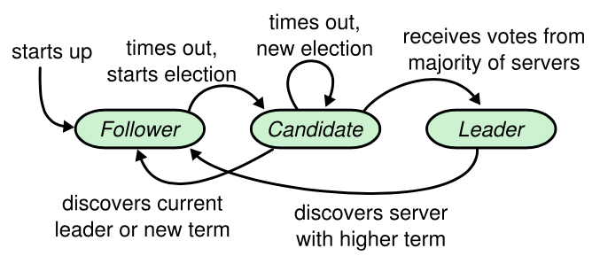

- 5.1 Raft 基础
  一个 Raft 集群包含若干个服务器节点；通常是 5 个，这样的系统可以容忍 2 个节点的失效。
  raft集群节点类型
  在任何时刻，每一个服务器节点都处于这三个状态之一：leader、follower 或者 candidate 。在正常情况下，集群中只有一个 leader 并且其他的节点全部都是 follower 。
  Follower 都是被动的：他们不会发送任何请求，只是简单的响应来自 leader 和 candidate 的请求。
  Leader 处理所有的客户端请求（如果一个客户端和 follower 通信，follower 会将请求重定向给 leader）。
  第三种状态，candidate ，是用来选举一个新的 leader（章节 5.2）。
  图 4 展示了这些状态和他们之间的转换关系；这些转换关系在接下来会进行讨论。
  
  图4
- 5.2 Leader 选举
- 5.3 日志复制
- 5.4 安全性
- 资料