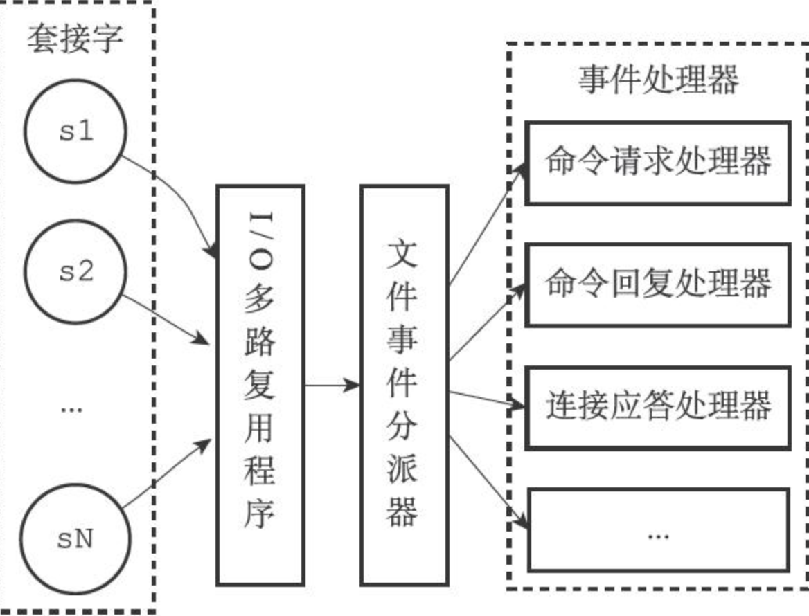

- Redis 就是一个使用 C 语言开发的内存缓存数据库
- 技术选型:Redis 和 Memcached 的区别和共同点
  共同点 ：
  1. 都是基于内存的数据库，一般都用来当做缓存使用。
  2. 都有过期策略。
  3. 两者的性能都非常高。
  区别：
  1. Redis 支持更丰富的数据类型（支持更复杂的应用场景）。Redis 不仅仅支持简单的 k/v 类型的数据，同时还提供 list，set，zset，hash 等数据结构的存储。Memcached 只支持最简单的 k/v 数据类型。
  2. Redis 支持数据的持久化，可以将内存中的数据保持在磁盘中，重启的时候可以再次加载进行使用,而 Memcached 把数据全部存在内存之中。
  3. Redis 有灾难恢复机制。 因为可以把缓存中的数据持久化到磁盘上。
  4. Redis 在服务器内存使用完之后，可以将不用的数据放到磁盘上。但是，Memcached 在服务器内存使用完之后，就会直接报异常。
  5. Memcached 没有原生的集群模式，需要依靠客户端来实现往集群中分片写入数据；但是 Redis 目前是原生支持 cluster 模式的。
  6. Memcached 是多线程，非阻塞 IO 复用的网络模型；Redis 使用单线程的多路 IO 复用模型。 （Redis 6.0 引入了多线程 IO ）
  7. Redis 支持发布订阅模型、Lua 脚本、事务等功能，而 Memcached 不支持。并且，Redis 支持更多的编程语言。
  8. Memcached 过期数据的删除策略只用了惰性删除，而 Redis 同时使用了惰性删除与定期删除。
- [[redis数据类型]]
- redis常见命令
- redis三高分析
  高性能
  高并发
  一般像 MySQL 这类的数据库的 QPS 大概都在 1w 左右（4 核 8g） ，但是使用 Redis 缓存之后很容易达到 10w+，甚至最高能达到 30w+（就单机 redis 的情况，redis 集群的话会更高）。
  高可用
- redis内存管理
- redis持久化机制
  RDB(快照 snapshotting)
  AOF(只追加文件，append only file)
- redis事务
- redis生产问题
  缓存穿透
  缓存雪崩
- redis事件处理模型
  Redis服务器是一个事件驱动程序
  Redis 基于 Reactor 模式来设计开发了自己的一套高效的事件处理模型 （Netty 的线程模型也基于 Reactor 模式，Reactor 模式不愧是高性能 IO 的基石）
  这套事件处理模型对应的是 Redis 中的文件事件处理器（file event handler）。
  由于文件事件处理器（file event handler）是单线程方式运行的，所以我们一般都说 Redis 是单线程模型。
  
	- 文件事件处理器（file event handler）主要是包含 4 个部分：
	  1. 多个 socket（客户端连接）
	  2.高性能网络IO模型: IO 多路复用程序（支持多个客户端连接的关键）
	   [[IO多路复用机制]] 
	  Redis 通过IO 多路复用程序 来监听来自客户端的大量连接（或者说是监听多个 socket），它会将感兴趣的事件及类型（读、写）注册到内核中并监听每个事件是否发生。
	  引入IO多路复用程序好处: 
	  a. 实现了高性能网络IO
	  b. I/O 多路复用技术的使用让 Redis 不需要额外创建多余的线程来监听客户端的大量连接，降低了资源的消耗
	  3. 文件事件分派器（将 socket 关联到相应的事件处理器）
	  4. 事件处理器（连接应答处理器、命令请求处理器、命令回复处理器,复制处理器等等）
	- 事件类型
	  文件事件(file event):Redis服务器通过套接字与客户端（或者其他Redis服务器）进行连接，而文件事件就是服务器对套接字操作的抽象。服务器与客户端（或者其他服务器）的通信会产生相应的文件事件，而服务器则通过监听并处理这些事件来完成一系列网络通信操作。
	  时间事件(time event):Redis服务器中的一些操作（比如serverCron函数）需要在给定的时间点执行，而时间事件就是服务器对这类定时操作的抽象。
- redis单线程和多线程
  redis为什么采用单线程？
  1. 官方类似回复:**使用Redis时，几乎不存在CPU成为瓶颈的情况， Redis主要受限于内存和网络。**
   例如在一个普通的Linux系统上，Redis通过使用pipelining每秒可以处理100万个请求，所以如果应用程序主要使用O(N)或O(log(N))的命令，它几乎不会占用太多CPU。
  2. 代码可维护性高，实现复杂度降低.单线程机制使得 Redis 内部实现的复杂度大大降低，Hash 的惰性 Rehash、Lpush 等等 “线程不安全” 的命令都可以无锁进行。
  多线程模型虽然在某些方面表现优异，但是它却引入了程序执行顺序的不确定性，带来了并发读写的一系列问题，增加了系统复杂度、同时可能存在线程切换、甚至加锁解锁、死锁造成的性能损耗。
  为什么redis6引入了多线程？
  命令处理器还是单线程，对IO处理引入了多线程，
  TODO:cj
- redis集群
- redis性能优化
- 用途
  1. 最主要方向:分布式缓存
  2. 分布式锁:
  通过 Redis 来做分布式锁是一种比较常见的方式。通常情况下，我们都是基于 Redisson 来实现分布式锁。
  3. 消息队列：
  Redis 自带的 list 数据结构可以作为一个简单的队列使用。Redis 5.0 中增加的 Stream 类型的数据结构更加适合用来做消息队列。它比较类似于 Kafka，有主题和消费组的概念，支持消息持久化以及 ACK 机制。
  不过，和专业的消息队列相比，还是有很多欠缺的地方比如消息丢失和堆积问题不好解决。因此，我们通常建议是不使用 Redis 来做消息队列的。
  4. 复杂业务场景 ：
  通过 Redis 以及 Redis 扩展（比如 Redisson）提供的数据结构，我们可以很方便地完成很多复杂的业务场景比如通过 bitmap 统计活跃用户、通过 sorted set 维护排行榜。
- [[redis命令]]
- [[redisson]]
- [[redis分布式锁]]
- 资料
  网站
  [redis 官网提供的在线 redis 环境](https://try.redis.io/)
  博客
  [分布式锁中的王者方案 - Redisson](https://mp.weixin.qq.com/s/CbnPRfvq4m1sqo2uKI6qQw)