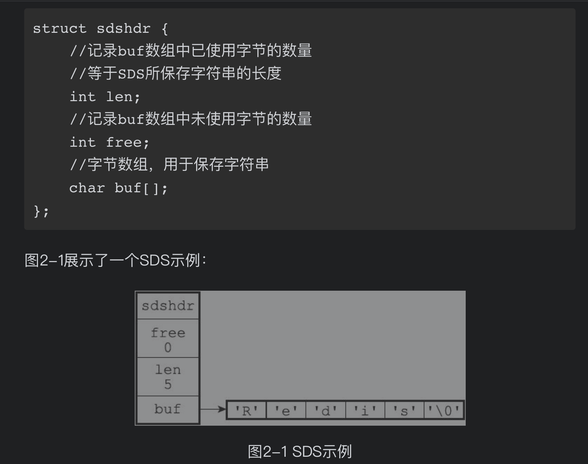
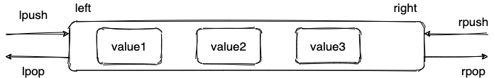

- Redis 就是一个使用 C 语言开发的内存缓存数据库
- 技术选型:Redis 和 Memcached 的区别和共同点
  共同点 ：
  1. 都是基于内存的数据库，一般都用来当做缓存使用。
  2. 都有过期策略。
  3. 两者的性能都非常高。
  区别：
  1. Redis 支持更丰富的数据类型（支持更复杂的应用场景）。Redis 不仅仅支持简单的 k/v 类型的数据，同时还提供 list，set，zset，hash 等数据结构的存储。Memcached 只支持最简单的 k/v 数据类型。
  2. Redis 支持数据的持久化，可以将内存中的数据保持在磁盘中，重启的时候可以再次加载进行使用,而 Memcached 把数据全部存在内存之中。
  3. Redis 有灾难恢复机制。 因为可以把缓存中的数据持久化到磁盘上。
  4. Redis 在服务器内存使用完之后，可以将不用的数据放到磁盘上。但是，Memcached 在服务器内存使用完之后，就会直接报异常。
  5. Memcached 没有原生的集群模式，需要依靠客户端来实现往集群中分片写入数据；但是 Redis 目前是原生支持 cluster 模式的。
  6. Memcached 是多线程，非阻塞 IO 复用的网络模型；Redis 使用单线程的多路 IO 复用模型。 （Redis 6.0 引入了多线程 IO ）
  7. Redis 支持发布订阅模型、Lua 脚本、事务等功能，而 Memcached 不支持。并且，Redis 支持更多的编程语言。
  8. Memcached 过期数据的删除策略只用了惰性删除，而 Redis 同时使用了惰性删除与定期删除。
- 支持的数据类型
  对各种数据结构的极致优化
	- String
	  String数据结构
	  并没有使用C语言的字符串表示，而是自己实现了一种 简单动态字符串（simple dynamic string，SDS）
	   
	  优势：
	  1. 相比于 C 的原生字符串，Redis 的 SDS 不光可以保存文本数据还可以保存二进制数据，并且获取字符串长度复杂度为 O(1)（C 字符串为 O(N))
	  2. 除此之外，Redis 的 SDS API 是安全的，不会造成缓冲区溢出。
	  常用命令： set,get,strlen,exists,decr,incr,setex 等等。
	- List
	  数据结构
	  C 语言并没有实现链表，所以 Redis 实现了自己的链表数据结构。Redis 的 list 的实现为一个 双向链表，即可以支持反向查找和遍历，更方便操作，不过带来了部分额外的内存开销。
	  
	  常用命令: rpush,lpop,lpush,rpop,lrange,llen 等。
	- Hash
	  hash 类似于 JDK1.8 前的 HashMap
	  数据结构:跳跃表(数组 + 链表)。
	  常用命令： hset,hmset,hexists,hget,hgetall,hkeys,hvals 等。
	  应用场景: 系统中对象数据的存储。
	  Hash命令简单使用
	  ```
	  127.0.0.1:6379> hmset userInfoKey name "guide" description "dev" age "24"
	  OK
	  127.0.0.1:6379> hexists userInfoKey name # 查看 key 对应的 value中指定的字段是否存在。
	  (integer) 1
	  127.0.0.1:6379> hget userInfoKey name # 获取存储在哈希表中指定字段的值。
	  "guide"
	  127.0.0.1:6379> hget userInfoKey age
	  "24"
	  127.0.0.1:6379> hgetall userInfoKey # 获取在哈希表中指定 key 的所有字段和值
	  1) "name"
	  2) "guide"
	  3) "description"
	  4) "dev"
	  5) "age"
	  6) "24"
	  127.0.0.1:6379> hkeys userInfoKey # 获取 key 列表
	  1) "name"
	  2) "description"
	  3) "age"
	  127.0.0.1:6379> hvals userInfoKey # 获取 value 列表
	  1) "guide"
	  2) "dev"
	  3) "24"
	  127.0.0.1:6379> hset userInfoKey name "GuideGeGe" # 修改某个字段对应的值
	  127.0.0.1:6379> hget userInfoKey name
	  "GuideGeGe"
	  127.0.0.1:6379>hset userInfoKey name "GuideGeGe" age "100"
	  127.0.0.1:6379> HGETALL userInfoKey
	  1) "name"
	  2) "GuideGeGe"
	  3) "description"
	  4) "dev"
	  5) "age"
	  6) "100"
	  ```
	- Set
	  set 类似于 Java 中的 HashSet.可以基于 set 轻易实现交集、并集、差集的操作。
	  常用命令： sadd,spop,smembers,sismember,scard,sinterstore,sunion 等。
	  应用场景: 需要存放的数据不能重复以及需要获取多个数据源交集和并集等场景.例如你可以将一个用户所有的关注人存在一个集合中，将其所有粉丝存在一个集合。Redis 可以非常方便的实现如共同关注、共同粉丝、共同喜好等功能.
	- Sorted Set
	- bitmap
	- Stream(redis5.0新增数据类型)
- redis常见命令
- redis三高分析
  高性能
  高并发
  一般像 MySQL 这类的数据库的 QPS 大概都在 1w 左右（4 核 8g） ，但是使用 Redis 缓存之后很容易达到 10w+，甚至最高能达到 30w+（就单机 redis 的情况，redis 集群的话会更高）。
  高可用
- redis内存管理
- redis持久化机制
  RDB(快照 snapshotting)
  AOF(只追加文件，append only file)
- redis事务
- redis生产问题
  缓存穿透
  缓存雪崩
- redis集群
- redis性能优化
- 用途
  1. 最主要方向:分布式缓存
  2. 分布式锁:
  通过 Redis 来做分布式锁是一种比较常见的方式。通常情况下，我们都是基于 Redisson 来实现分布式锁。
  3. 消息队列：
  Redis 自带的 list 数据结构可以作为一个简单的队列使用。Redis 5.0 中增加的 Stream 类型的数据结构更加适合用来做消息队列。它比较类似于 Kafka，有主题和消费组的概念，支持消息持久化以及 ACK 机制。
  不过，和专业的消息队列相比，还是有很多欠缺的地方比如消息丢失和堆积问题不好解决。因此，我们通常建议是不使用 Redis 来做消息队列的。
  4. 复杂业务场景 ：
  通过 Redis 以及 Redis 扩展（比如 Redisson）提供的数据结构，我们可以很方便地完成很多复杂的业务场景比如通过 bitmap 统计活跃用户、通过 sorted set 维护排行榜。
-
- 资料
  网站
  [redis 官网提供的在线 redis 环境](https://try.redis.io/)
  博客
  [分布式锁中的王者方案 - Redisson](https://mp.weixin.qq.com/s/CbnPRfvq4m1sqo2uKI6qQw)