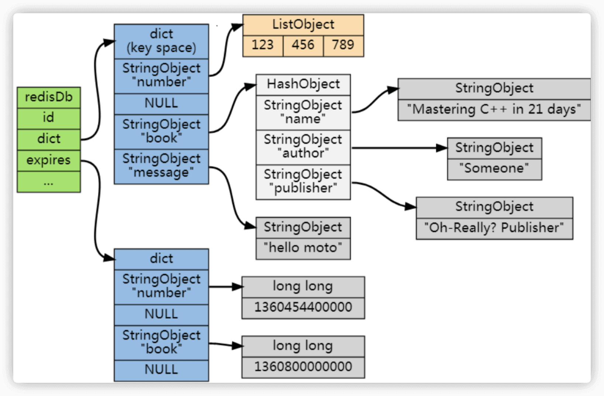

- Redis 就是一个使用 C 语言开发的内存缓存数据库
- 技术选型:Redis 和 Memcached 的区别和共同点
  共同点 ：
  1. 都是基于内存的数据库，一般都用来当做缓存使用。
  2. 都有过期策略。
  3. 两者的性能都非常高。
  区别：
  1. Redis 支持更丰富的数据类型（支持更复杂的应用场景）。Redis 不仅仅支持简单的 k/v 类型的数据，同时还提供 list，set，zset，hash 等数据结构的存储。Memcached 只支持最简单的 k/v 数据类型。
  2. Redis 支持数据的持久化，可以将内存中的数据保持在磁盘中，重启的时候可以再次加载进行使用,而 Memcached 把数据全部存在内存之中。
  3. Redis 有灾难恢复机制。 因为可以把缓存中的数据持久化到磁盘上。
  4. Redis 在服务器内存使用完之后，可以将不用的数据放到磁盘上。但是，Memcached 在服务器内存使用完之后，就会直接报异常。
  5. Memcached 没有原生的集群模式，需要依靠客户端来实现往集群中分片写入数据；但是 Redis 目前是原生支持 cluster 模式的。
  6. Memcached 是多线程，非阻塞 IO 复用的网络模型；Redis 使用单线程的多路 IO 复用模型。 （Redis 6.0 引入了多线程 IO ）
  7. Redis 支持发布订阅模型、Lua 脚本、事务等功能，而 Memcached 不支持。并且，Redis 支持更多的编程语言。
  8. Memcached 过期数据的删除策略只用了惰性删除，而 Redis 同时使用了惰性删除与定期删除。
- [[redis数据类型]]
- redis三高分析
  高性能
  高并发
  一般像 MySQL 这类的数据库的 QPS 大概都在 1w 左右（4 核 8g） ，但是使用 Redis 缓存之后很容易达到 10w+，甚至最高能达到 30w+（就单机 redis 的情况，redis 集群的话会更高）。
  高可用
- redis内存管理
	- 设置键的生存时间或过期时间
	  通过EXPIRE命令或者PEXPIRE命令，EXPIREAT，客户端可以以秒或者毫秒精度为数据库中的某个键设置生存时间（Time To Live，TTL）。
	  实际上EXPIRE、PEXPIRE、EXPIREAT三个命令都是使用PEXPIREAT命令来实现的(方法重载)
	   
	  SETEX命令可以在设置一个字符串键的同时为键设置过期时间，因为这个命令是一个类型限定的命令（只能用于字符串键）。
	- 移除过期时间
	  PERSIST命令可以移除一个键的过期时间
	  PERSIST命令就是PEXPIREAT命令的反操作：PERSIST命令在过期字典中查找给定的键，并解除键和值（过期时间）在过期字典中的关联。
	- 计算并返回剩余生存时间
	  TTL命令以秒为单位返回键的剩余生存时间，而PTTL命令则以毫秒为单位返回键的剩余生存时间：
	- redis键过期实现
	  Redis 通过一个叫做过期字典（可以看作是 hash 表）来保存数据过期的时间。过期字典的键指向 Redis 数据库中的某个 key(键)，过期字典的值是一个 long long 类型的整数，这个整数保存了 key 所指向的数据库键的过期时间（毫秒精度的 UNIX 时间戳）。
	  ```
	  typedef struct redisDb {
	      ...
	  
	      dict *dict;     //数据库键空间,保存着数据库中所有键值对
	      dict *expires   // 过期字典,保存着键的过期时间
	      ...
	  } redisDb;
	  ```
	  
	- redis键过期删除策略
	  id:: 62b18694-2605-4dfe-a272-d244ace60894
	  ~~1. 定时删除：在设置键的过期时间的同时，创建一个定时器（timer），让定时器在键的过期时间来临时，立即执行对键的删除操作。(redis没有采用这种方式)~~
	  对CPU时间最不友好，对内存最友好
	  redis不采用定时删除策略原因
	  a。在过期键比较多的情况下，删除过期键这一行为可能会占用相当一部分CPU时间，在内存不紧张但是CPU时间非常紧张的情况下，将CPU时间用在删除和当前任务无关的过期键上，无疑会对服务器的响应时间和吞吐量造成影响。
	  b。创建一个定时器需要用到Redis服务器中的时间事件，而redis当前时间事件的实现方式——无序链表，查找一个事件的时间复杂度为O（N）——并不能高效地处理大量时间事件。
	  2. 惰性删除 ：只会在取出 key 的时候才对数据进行过期检查，如果过期的话就删除键。
	  这样对 CPU时间最友好，对内存最不友好,可能会造成太多过期 key 没有被删除。
	  惰性删除策略的问题
	  存在内存泄漏风险：在使用惰性删除策略时，如果数据库中有非常多的过期键，而这些过期键又恰好没有被访问到的话，那么它们也许永远也不会被删除（除非用户手动执行FLUSHDB）。
	  导致无用的垃圾数据占用了大量的内存。
	  3. 定期删除 ： 每隔一段时间抽取一批 key 执行删除过期 key 操作。至于要删除多少过期键，以及要检查多少个数据库，则由算法决定。
	  定期删除策略是前两种策略的一种整合和折中：
	  a。定期删除策略每隔一段时间执行一次删除过期键操作，并通过限制删除操作执行的时长和频率来减少删除操作对CPU时间的影响。
	  b。除此之外，通过定期删除过期键，定期删除策略有效地减少了因为过期键而带来的内存浪费。
	  定期删除策略的难点是确定删除操作执行的时长和频率
	  a。如果删除操作执行得太频繁，或者执行的时间太长，定期删除策略就会退化成定时删除策略，以至于将CPU时间过多地消耗在删除过期键上面。
	  b。如果删除操作执行得太少，或者执行的时间太短，定期删除策略又会和惰性删除策略一样，出现浪费内存的情况。
	  redis主要采用惰性删除策略和定期删除策略结合方式。
	- redis内存淘汰机制
	  1. volatile-lru（least recently used）：从已设置过期时间的数据集（server.db[i].expires）中挑选最近最少使用的数据淘汰
	  2. volatile-ttl：从已设置过期时间的数据集（server.db[i].expires）中挑选将要过期的数据淘汰
	  3. volatile-random：从已设置过期时间的数据集（server.db[i].expires）中任意选择数据淘汰
	  4. allkeys-lru（least recently used）：当内存不足以容纳新写入数据时，在键空间中，移除最近最少使用的 key（这个是最常用的）
	  5. allkeys-random：当内存不足以容纳新写入数据时，从数据集（server.db[i].dict）中任意选择数据淘汰
	  6. no-eviction：禁止驱逐数据，也就是说当内存不足以容纳新写入数据时，新写入操作会报错。这个应该没人使用吧！
	  4.0 版本后增加以下两种：
	  7. volatile-lfu（least frequently used）：从已设置过期时间的数据集（server.db[i].expires）中挑选最不经常使用的数据淘汰。
	  它的核心思想是根据key的最近被访问的频率进行淘汰，很少被访问的优先被淘汰，被访问的多的则被留下来。
	  8. allkeys-lfu（least frequently used）：当内存不足以容纳新写入数据时，在键空间中，移除最不经常使用的 key
	- redis大key删除
	  redis4之后异步线程删除，不影响主线程的执行
- [[redis持久化机制]]
- [[redis事务]]
- redis事件处理模型
  Redis服务器是一个事件驱动程序
  Redis 基于 Reactor 模式来设计开发了自己的一套高效的事件处理模型 （Netty 的线程模型也基于 Reactor 模式，Reactor 模式不愧是高性能 IO 的基石）
  这套事件处理模型对应的是 Redis 中的文件事件处理器（file event handler）。
  由于文件事件处理器（file event handler）是单线程方式运行的，所以我们一般都说 Redis 是单线程模型。
  
	- 文件事件处理器（file event handler）主要是包含 4 个部分：
	  客户端：普通客户端或者其他redis服务器
	  1. 多个 socket（客户端连接）
	  2.高性能网络IO模型: IO 多路复用程序（支持多个客户端连接的关键）
	   [[IO多路复用机制]] 
	  Redis 通过IO 多路复用程序 来监听来自客户端的大量连接（或者说是监听多个 socket），它会将感兴趣的事件及类型（读、写）注册到内核中并监听每个事件是否发生。
	  
	  引入IO多路复用程序好处: 
	  a. 实现了高性能网络IO模型
	  b. I/O 多路复用技术的使用让 Redis 不需要额外创建多余的线程来监听客户端的大量连接，降低了资源的消耗
	  
	  如何保证IO多路复用程序收到的多个并发客户端事件有序交给redis处理？
	  I/O多路复用程序总是会将所有产生事件的套接字都放到一个队列里面，然后通过这个队列，以有序（sequentially）、同步（synchronously）、每次一个套接字的方式向文件事件分派器传送套接字，当上一个套接字产生的事件被处理完毕之后（该套接字为事件所关联的事件处理器执行完毕），I/O多路复用程序才会继续向文件事件分派器传送下一个套接字。
	   
	  3. 文件事件分派器（将 socket不同类型事件 关联到相应的事件处理器）
	  4. 事件处理器（连接应答处理器、命令请求处理器、命令回复处理器,复制处理器等等）
	  连接应答处理器：为了对连接服务器的各个客户端进行应答，服务器要为监听套接字关联连接应答处理器，(处理AE_READABLE事件)
	  命令请求处理器：为了接收客户端传来的命令请求，服务器要为客户端套接字关联命令请求处理器。(处理AE_READABLE事件)
	  命令回复处理器：为了向客户端返回命令的执行结果，服务器要为客户端套接字关联命令回复处理器。(处理AE_WRITABLE事件)
	  复制处理器：当主服务器和从服务器进行复制操作时，主从服务器都需要关联特别为复制功能编写的复制处理器。
	- 事件类型
	  文件事件(file event):Redis服务器通过套接字与客户端（或者其他Redis服务器）进行连接，而文件事件就是服务器对套接字操作的抽象。服务器与客户端（或者其他服务器）的通信会产生相应的文件事件，而服务器则通过监听并处理这些事件来完成一系列网络通信操作。
	  每当一个套接字准备好执行连接应答（accept）、写入、读取、关闭等操作时，就会产生一个文件事件。
	  时间事件(time event):Redis服务器中的一些操作（比如serverCron函数）需要在给定的时间点执行，而时间事件就是服务器对这类定时操作的抽象。
	- 文件事件类型
	  AE_READABLE事件:当套接字变得可读时（客户端对套接字执行write操作，或者执行close操作），或者有新的可应答（acceptable）套接字出现时（客户端对服务器的监听套接字执行connect操作），套接字产生AE_READABLE事件。
	  AE_WRITABLE事件:当套接字变得可写时（客户端对套接字执行read操作），套接字产生AE_WRITABLE事件。
	  两种文件事件处理顺序：如果一个套接字又可读又可写的话，那么服务器将先读套接字，后写套接字。--->套接字先读后写其实也符合正常程序处理流程。
	  
	- 套接字的事件与事件处理器关联/取消关联
	  实现：
	  1. 套接字指定事件类型监听与事件处理器关联函数
	  ae.c/aeCreateFileEvent函数接受一个套接字描述符、一个事件类型，以及一个事件处理器作为参数，将给定套接字的给定事件加入到I/O多路复用程序的监听范围之内，并对事件和事件处理器进行关联。
	  2. 套接字指定事件类型监听与事件处理器取消关联函数
	  ae.c/aeDeleteFileEvent函数接受一个套接字描述符和一个监听事件类型作为参数，让I/O多路复用程序取消对给定套接字的给定事件的监听，并取消事件和事件处理器之间的关联。
	  3. 查询套接字正在被监听的事件函数
	  ae.c/aeGetFileEvents函数接受一个套接字描述符，返回该套接字正在被监听的事件类型：
	  a。如果套接字没有任何事件被监听，那么函数返回AE_NONE。
	  b。如果套接字的读事件正在被监听，那么函数返回AE_READABLE。
	  c。如果套接字的写事件正在被监听，那么函数返回AE_WRITABLE。
	  d。如果套接字的读事件和写事件正在被监听，那么函数返回AE_READABLE|AE_WRITABLE。
	- 一次完整的客户端与服务器连接事件示例
	  
	-
- redis单线程和多线程
  redis为什么采用单线程？
  1. (最主要原因)官方类似回复:**使用Redis时，几乎不存在CPU成为瓶颈的情况， Redis主要受限于内存和网络。**
   例如在一个普通的Linux系统上，Redis通过使用pipelining每秒可以处理100万个请求，所以如果应用程序主要使用O(N)或O(log(N))的命令，它几乎不会占用太多CPU。
  2. 代码可维护性高，实现复杂度降低.单线程机制使得 Redis 内部实现的复杂度大大降低，Hash 的惰性 Rehash、Lpush 等等 “线程不安全” 的命令都可以无锁进行。
  3. 多线程模型入了程序执行顺序的不确定性，带来了并发读写的一系列问题，增加了系统复杂度、同时可能存在线程切换、甚至加锁解锁、死锁造成的性能损耗。
  为什么redis6引入了多线程？
  实际上，Redis 在 4.0 之后的版本中就已经加入了对多线程的支持。
  主要是针对一些大键值对的删除操作的命令，使用这些命令就会使用主处理线程之外的其他线程来“异步处理”。
  
  Redis6.0 引入多线程主要是为了提高网络 IO 读写性能，因为这个算是 Redis 中的一个性能瓶颈（Redis 的瓶颈主要受限于内存和网络）。
  命令处理部分仍然还是单线程
  Redis6.0 的多线程默认是禁用的，只使用主线程。如需开启需要修改 redis 配置文件 redis.conf ：
  ```
  io-threads-do-reads yes
  ```
  开启多线程后，还需要设置线程数，否则是不生效的。同样需要修改 redis 配置文件 redis.conf :
  ```
  io-threads 4 #官网建议4核的机器建议设置为2或3个线程，8核的建议设置为6个线程
  ```
  redis6多线程实现机制
   
  流程简述如下：
  1、主线程负责接收建立连接请求，获取 socket 放入全局等待读处理队列
  2、主线程处理完读事件之后，通过 RR(Round Robin) 将这些连接分配给这些 IO 线程组
  3、主线程阻塞等待 IO 线程组读取 socket 完毕
  4、主线程通过单线程的方式执行请求命令，请求数据读取并解析完成，但并不执行
  5、主线程阻塞等待 IO 线程组将数据回写 socket 完毕
  6、解除绑定，清空等待队列
  该设计有如下特点：
  1、IO 线程要么同时在读 socket，要么同时在写，不会同时读或写
  2、IO 线程只负责读写 socket 解析命令，不负责命令处理
- redis集群
- redis生产问题
	- 缓存穿透
	  缓存穿透说简单点就是大量请求的 key 根本不存在于缓存中，导致请求直接到了数据库上，根本没有经过缓存这一层。
	  举个例子：某个黑客故意制造我们缓存中不存在的 key 发起大量请求，导致大量请求落到数据库。
	  如下图所示，用户的请求最终都要跑到数据库中查询一遍。
	   
	  解决方案:
	  a. 最基本的就是首先做好参数校验，一些不合法的参数请求直接抛出异常信息返回给客户端。比如查询的数据库 id 不能小于 0、传入的邮箱格式不对的时候直接返回错误消息给客户端等等。
	  b. 缓存无效key
	  如果缓存和数据库都查不到某个 key 的数据就写一个到 Redis 中去并设置过期时间，具体命令如下： SET key value EX 10086 。这种方式可以解决请求的 key 变化不频繁的情况，如果黑客恶意攻击，每次构建不同的请求 key，会导致 Redis 中缓存大量无效的 key 。
	  很明显，这种方案并不能从根本上解决此问题。
	  如果非要用这种方式来解决穿透问题的话，尽量将无效的 key 的过期时间设置短一点比如 1 分钟。
	  另外，这里多说一嘴，一般情况下我们是这样设计 key 的： 表名:列名:主键名:主键值 。
	  c. ((62b2ba62-6c43-4f6f-9c82-6280e71005b8))
	- 缓存雪崩
	  解决方案:
	- 布隆过滤器
	  id:: 62b2ba62-6c43-4f6f-9c82-6280e71005b8
	  布隆过滤器是一个非常神奇的数据结构，通过它我们可以非常方便地判断一个给定数据是否存在于海量数据中。
	  布隆过滤器实现：把所有可能存在的请求的值都存放在布隆过滤器中，当用户请求过来，先判断用户发来的请求的值是否存在于布隆过滤器中。不存在的话，直接返回请求参数错误信息给客户端，存在的话才会走下面的流程。
	  规则:允许一定程度的误判,比如不存在的key通过校验，但是绝对不允许存在的key不通过校验。
	-
- redis性能优化
	- Redis bigkey
		- 什么是bigkey
		  简单来说，如果一个 key 对应的 value 所占用的内存比较大，那这个 key 就可以看作是 bigkey。
		  具体多大才算大呢？
		  有一个不是特别精确的参考标准：
		  string 类型的 value 超过 10 kb，
		  复合类型的 value 包含的元素超过 5000 个（对于复合类型的 value 来说，不一定包含的元素越多，占用的内存就越多）
		- bigkey 有什么危害？
		  1. 消耗更多的内存空间
		  2. bigkey 对性能也会有比较大的影响,因为redis是单线程，执行效率慢的话，就会阻塞其他请求命令
		- 如何发现 bigkey？
		  1、使用 Redis 自带的 --bigkeys 参数来查找。
		  ```
		  redis-cli -p 6379 --bigkeys
		  
		  # Scanning the entire keyspace to find biggest keys as well as
		  # average sizes per key type.  You can use -i 0.1 to sleep 0.1 sec
		  # per 100 SCAN commands (not usually needed).
		  
		  [00.00%] Biggest string found so far 'hello' with 5 bytes
		  [00.00%] Biggest set    found so far 'mySet' with 2 members
		  [00.00%] Biggest hash   found so far 'userInfoKey' with 3 fields
		  [00.00%] Biggest string found so far 'key2' with 6 bytes
		  [00.00%] Biggest zset   found so far 'myZset' with 3 members
		  
		  -------- summary -------
		  
		  Sampled 8 keys in the keyspace!
		  Total key length in bytes is 46 (avg len 5.75)
		  
		  Biggest   hash found 'userInfoKey' has 3 fields
		  Biggest string found 'key2' has 6 bytes
		  Biggest    set found 'mySet' has 2 members
		  Biggest   zset found 'myZset' has 3 members
		  
		  0 lists with 0 items (00.00% of keys, avg size 0.00)
		  1 hashs with 3 fields (12.50% of keys, avg size 3.00)
		  3 strings with 12 bytes (37.50% of keys, avg size 4.00)
		  0 streams with 0 entries (00.00% of keys, avg size 0.00)
		  3 sets with 5 members (37.50% of keys, avg size 1.67)
		  1 zsets with 3 members (12.50% of keys, avg size 3.00)
		  ```
		  这个命令会扫描(Scan) Redis 中的所有 key ，会对 Redis 的性能有一点影响。(线上环境禁用)
		  并且，这种方式只能找出每种数据结构 top 1 bigkey（占用内存最大的 string 数据类型，包含元素最多的复合数据类型）。
		  2、分析 RDB 文件
		  通过分析 RDB 文件来找出 big key。这种方案的前提是你的 Redis 采用的是 RDB 持久化。
		  网上有现成的代码/工具可以直接拿来使用：
		   [redis-rdb-tools](https://github.com/sripathikrishnan/redis-rdb-tools) ：Python 语言写的用来分析 Redis 的 RDB 快照文件用的工具
		  [rdb_bigkeys](https://github.com/weiyanwei412/rdb_bigkeys) : Go 语言写的用来分析 Redis 的 RDB 快照文件用的工具，性能更好。
	- 大量 key 集中过期问题
	  对于过期 key，Redis 采用的是 定期删除+惰性删除 策略。 ((62b18694-2605-4dfe-a272-d244ace60894)) 
	  定期删除执行过程中，如果突然遇到大量过期 key 的话，客户端请求必须等待定期清理过期 key 任务线程执行完成，因为这个这个定期任务线程是在 Redis 主线程中执行的。这就导致客户端请求没办法被及时处理，响应速度会比较慢。
	  解决方案
	  1. 给 key 设置随机过期时间。
	  2. 开启 lazy-free（惰性删除/延迟释放） 。lazy-free 特性是 Redis 4.0 开始引入的，指的是让 Redis 采用异步方式延迟释放 key 使用的内存，将该操作交给单独的子线程处理，避免阻塞主线程。
	  个人建议不管是否开启 lazy-free，我们都尽量给 key 设置随机过期时间。
- 用途
  1. 最主要方向:分布式缓存
  2. 分布式锁:
  通过 Redis 来做分布式锁是一种比较常见的方式。通常情况下，我们都是基于 Redisson 来实现分布式锁。
  3. 消息队列：
  Redis 自带的 list 数据结构可以作为一个简单的队列使用。Redis 5.0 中增加的 Stream 类型的数据结构更加适合用来做消息队列。它比较类似于 Kafka，有主题和消费组的概念，支持消息持久化以及 ACK 机制。
  不过，和专业的消息队列相比，还是有很多欠缺的地方比如消息丢失和堆积问题不好解决。因此，我们通常建议是不使用 Redis 来做消息队列的。
  4. 复杂业务场景 ：
  通过 Redis 以及 Redis 扩展（比如 Redisson）提供的数据结构，我们可以很方便地完成很多复杂的业务场景比如通过 bitmap 统计活跃用户、通过 sorted set 维护排行榜。
- [[redis命令]]
- [[redisson]]
- [[redis分布式锁]]
- 资料
  网站
  [redis 官网提供的在线 redis 环境](https://try.redis.io/)
  博客
  [分布式锁中的王者方案 - Redisson](https://mp.weixin.qq.com/s/CbnPRfvq4m1sqo2uKI6qQw)