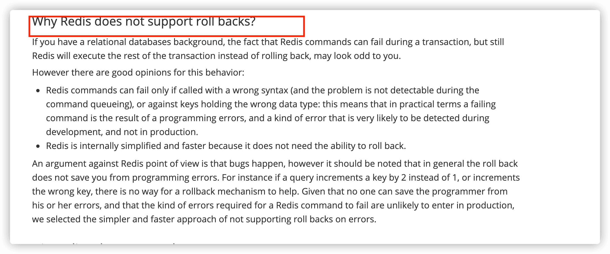

- 使用 Redis 事务
  你可以将 Redis 中的事务就理解为 ：Redis 事务提供了一种将多个命令请求打包的功能。然后，再按顺序执行打包的所有命令，并且不会被中途打断。
  Redis 可以通过 MULTI，EXEC，DISCARD 和 WATCH 等命令来实现事务(transaction)功能。
  ```
  > MULTI
  OK
  > SET USER "Guide哥"
  QUEUED
  > GET USER
  QUEUED
  > EXEC
  1) OK
  2) "Guide哥"
  ```
  使用 MULTI 命令后可以输入多个命令。Redis 不会立即执行这些命令，而是将它们放到队列，当调用了 EXEC 命令将执行所有命令。
  过程入下：
  1. 开始事务（MULTI）。
  2. 命令入队(批量操作 Redis 的命令，先进先出（FIFO）的顺序执行)。
  3. 执行事务(EXEC)。
  
  你也可以通过 DISCARD 命令取消一个事务，它会清空事务队列中保存的所有命令。
  ```
  > MULTI
  OK
  > SET USER "Guide哥"
  QUEUED
  > GET USER
  QUEUED
  > DISCARD
  OK
  ```
  WATCH 命令用于监听指定的键，当调用 EXEC 命令执行事务时，如果一个被 WATCH 命令监视的键被修改的话，整个事务都不会执行，直接返回失败。
  ```
  > WATCH USER
  OK
  > MULTI
  > SET USER "Guide哥"
  OK
  > GET USER
  Guide哥
  > EXEC
  ERR EXEC without MULTI
  ```
- redis事务与数据库事务比较
  数据库事务支持ACID四大特性 ((62a6f8f4-7476-4657-98a0-da5603c8b194))
  redis不支持原子性，不支持回滚操作，在运行错误的情况下，除了执行过程中出现错误的命令外，其他命令都能正常执行。
  redis也不满足持久性特性
  事务中的每条命令都会与 Redis 服务器进行网络交互，这是比较浪费资源的行为。明明一次批量执行多个命令就可以了，这种操作实在是看不懂。
  因此，Redis 事务是不建议在日常开发中使用的。
- 为什么redis开发者不支持完备的事务
  Redis 官网也解释了自己为啥不支持回滚。简单来说就是 Redis 开发者们觉得没必要支持回滚，这样更简单便捷并且性能更好。Redis 开发者觉得即使命令执行错误也应该在开发过程中就被发现而不是生产过程中。
  
- 如何解决redis事务问题
  Redis 从 2.6 版本开始支持执行 Lua 脚本，它的功能和事务非常类似。我们可以利用 Lua 脚本来批量执行多条 Redis 命令，这些 Redis 命令会被提交到 Redis 服务器一次性执行完成，大幅减小了网络开销。
  一段 Lua 脚本可以视作一条命令执行，一段 Lua 脚本执行过程中不会有其他脚本或 Redis 命令同时执行，保证了操作不会被其他指令插入或打扰。
  如果 Lua 脚本运行时出错并中途结束，出错之后的命令是不会被执行的.但是，Lua脚本**出错之前执行的命令是无法被撤销的。**
  因此，严格来说，通过 Lua 脚本来批量执行 Redis 命令也是不满足原子性的。