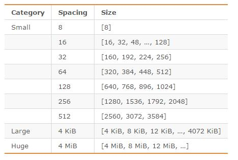
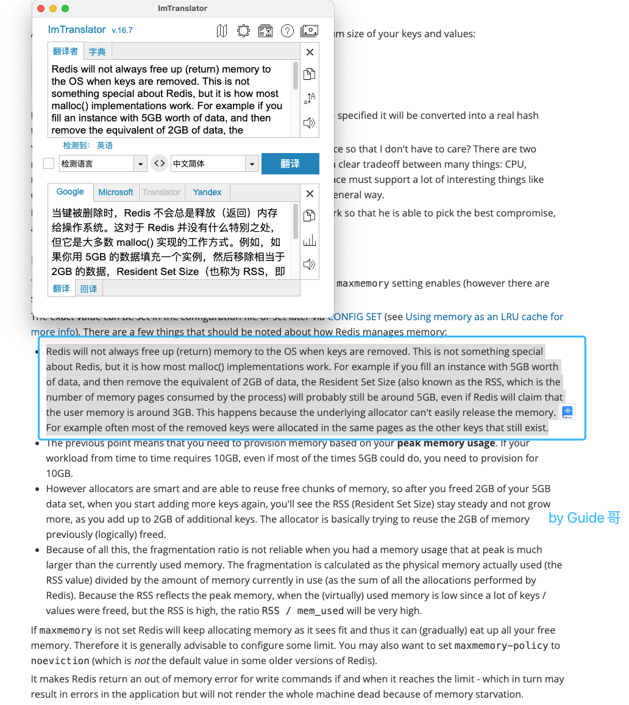

- ## 什么是内存碎片
  你可以将内存碎片简单地理解为那些不可用的空闲内存。
  举个例子：操作系统为你分配了 32 字节的连续内存空间，而你存储数据实际只需要使用 24 字节内存空间，那这多余出来的 8 字节内存空间如果后续没办法再被分配存储其他数据的话，就可以被称为内存碎片。
  Redis 内存碎片虽然不会影响 Redis 性能，但是会增加内存消耗。
- ## 为什么会有 Redis 内存碎片?
  Redis 内存碎片产生比较常见的 2 个原因：
	- 1. **Redis 存储存储数据的时候向操作系统申请的内存空间可能会大于数据实际需要的存储空间。**
	  以下是这段 Redis 官方的原话：
	  
	  >To store user keys, Redis allocates at most as much memory as the `maxmemory` setting enables (however there are small extra allocations possible).
	  
	  Redis 使用 `zmalloc` 方法(Redis 自己实现的内存分配方法)进行内存分配的时候，除了要分配 `size` 大小的内存之外，还会多分配 `PREFIX_SIZE` 大小的内存。
	  [`zmalloc` 方法源码如下](https://github.com/antirez/redis-tools/blob/master/zmalloc.c):
	  ```
	  void *zmalloc(size_t size) {
	     // 分配指定大小的内存
	     void *ptr = malloc(size+PREFIX_SIZE);
	     if (!ptr) zmalloc_oom_handler(size);
	  #ifdef HAVE_MALLOC_SIZE
	     update_zmalloc_stat_alloc(zmalloc_size(ptr));
	     return ptr;
	  #else
	     *((size_t*)ptr) = size;
	     update_zmalloc_stat_alloc(size+PREFIX_SIZE);
	     return (char*)ptr+PREFIX_SIZE;
	  #endif
	  }
	  ```
	  另外，Redis 可以使用多种内存分配器来分配内存（ libc、jemalloc、tcmalloc），默认使用[jemallocopen in new window](https://github.com/jemalloc/jemalloc)，而 jemalloc 按照一系列固定的大小（8 字节、16 字节、32 字节......）来分配内存的。jemalloc 划分的内存单元如下图所示：
	  
	  当程序申请的内存最接近某个固定值时，jemalloc 会给它分配相应大小的空间，就比如说程序需要申请 17 字节的内存，jemalloc 会直接给它分配 32 字节的内存，这样会导致有 15 字节内存的浪费。不过，jemalloc 专门针对内存碎片问题做了优化，一般不会存在过度碎片化的问题。
	- 2、频繁修改 Redis 中的数据也会产生内存碎片。
	  当 Redis 中的某个数据删除时，Redis 通常不会轻易释放内存给操作系统。
	  这个在 Redis 官方文档中也有对应的原话:
	  
	  [相关文档redis官网地址](https://redis.io/topics/memory-optimization)。
- ## 如何查看 Redis 内存碎片的信息？
  使用 `info memory` 命令即可查看 Redis 内存相关的信息。下图中每个参数具体的含义
## 如何清理 Redis 内存碎片？
- ## 参考
  [Redis 官方文档 内存优化](https://redis.io/topics/memory-optimization)