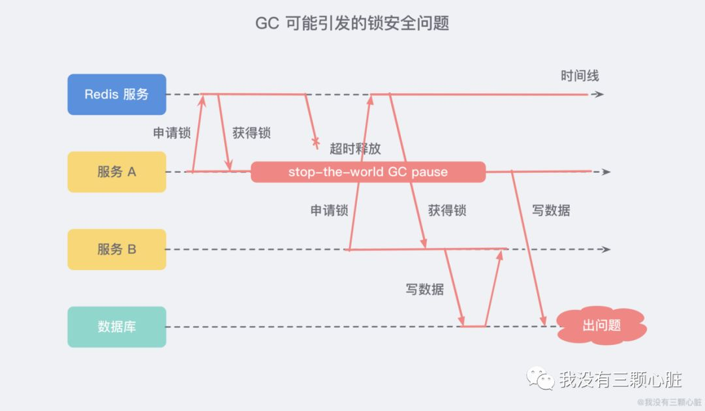

- 需要考虑的问题
  排他性:保证同一个时刻只能有一个线程获取到分布式锁(排他性)
  原子性:Lua脚本保证多个redis指令执行的原子性。
  时效性:分布式锁需要有过期机制
  锁释放身份验证:
  集群问题:
  
  
  分布式集群
  1. 原子性:Lua脚本，或者扩展的SET NX EX命令
  
  2. 分布式锁获取失败，无需立刻返回获取锁异常--->重试一段时间也许可以获取到
  
  3. 服务挂了导致锁无法释放问题--->引入锁超时机制
  
  4. 引入锁超时机制，又引入另一个问题:在加锁和释放锁之间的逻辑执行得太长，以至于超出了锁的超时限制(A,B两个线程就有可能同时获取锁了)
  解决这个办法：
  a. Redis分布式锁不要用于较长时间的任务，分布式锁时长设置尽量长一点。
  b. WatchDog锁续期机制
  
  锁释放：
  5. 问题A线程上锁,但是被其他线程释放
  场景A线程上锁超期了,redis超期释放锁了，B线程此时可以获取锁了，(此时A,B同时获取到锁了)然后A线程此时来释放锁了。
  --->线程释放锁时先验证锁是否该线程所有
  
  6. GC 可能引发的安全问题(其实可以和5类似)
  Martin Kleppmann 曾与 Redis 之父 Antirez 就 Redis 实现分布式锁的安全性问题进行过深入的讨论，其中有一个问题就涉及到 GC。
  
  服务 A 和服务 B 同时获取到了锁，分布式锁就不安全了。
  10. 分布式集群下的问题
  如果采用主从模式部署，我们想象一个这样的场景：服务 A 申请到一把锁之后，如果作为主机的 Redis 宕机了，那么 服务 B 在申请锁的时候就会从从机那里获取到这把锁
  
  一种解决方案:为了解决这个问题，Redis 作者提出了一种 RedLock 红锁 的算法 (Redission 同 Jedis)：
  ```
  // 三个 Redis 集群
  RLock lock1 = redissionInstance1.getLock("lock1");
  RLock lock2 = redissionInstance2.getLock("lock2");
  RLock lock3 = redissionInstance3.getLock("lock3");
  
  RedissionRedLock lock = new RedissionLock(lock1, lock2, lock2);
  lock.lock();
  // do something....
  lock.unlock();
  ```
-
- redisson分布式锁解决方案
  基于Hash数据结构实现
- 资料
  [Distributed Locks with Redis 官方资料](https://redis.io/docs/reference/patterns/distributed-locks/)
  
  三太子敖丙博客
  [Redis—分布式锁深入探究](https://mp.weixin.qq.com/s/49hgH3COla3wU0rgyiUVgg)
  [Redis分布式锁到底安全吗？](https://mp.weixin.qq.com/s/RnSokJxYxYDeenOP_JE3fQ)
  [姗姗来迟的Redis分布式锁](https://mp.weixin.qq.com/s/Z_xriP-jc2Bnmdcm0l5xzg)