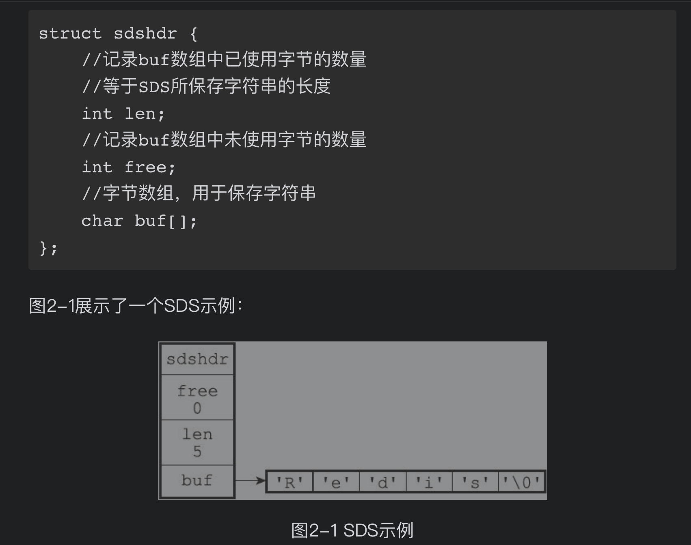

- 对各种数据结构的极致优化
- String
  String数据结构
  并没有使用C语言的字符串表示，而是自己实现了一种 简单动态字符串（simple dynamic string，SDS）
   
  优势：
  1. 相比于 C 的原生字符串，Redis 的 SDS 不光可以保存文本数据还可以保存二进制数据，并且获取字符串长度复杂度为 O(1)（C 字符串为 O(N))
  2. 除此之外，Redis 的 SDS API 是安全的，不会造成缓冲区溢出。
  常用命令： set,get,strlen,exists,decr,incr,setex 等等。
-
- List
  数据结构
  C 语言并没有实现链表，所以 Redis 实现了自己的链表数据结构。Redis 的 list 的实现为一个 双向链表，即可以支持反向查找和遍历，更方便操作，不过带来了部分额外的内存开销。
  
  常用命令: rpush,lpop,lpush,rpop,lrange,llen 等。
  ```
  27.0.0.1:6379> rpush myList value1 # 向 list 的头部（右边）添加元素
  (integer) 1
  127.0.0.1:6379> rpush myList value2 value3 # 向list的头部（最右边）添加多个元素
  (integer) 3
  127.0.0.1:6379> lpop myList # 将 list的尾部(最左边)元素取出
  "value1"
  127.0.0.1:6379> lrange myList 0 1 # 查看对应下标的list列表， 0 为 start,1为 end
  1) "value2"
  2) "value3"
  127.0.0.1:6379> lrange myList 0 -1 # 查看列表中的所有元素，-1表示倒数第一
  1) "value2"
  2) "value3"
  - 127.0.0.1:6379> rpush myList2 value1 value2 value3
  (integer) 3
  127.0.0.1:6379> rpop myList2 # 将 list的头部(最右边)元素取出
  "value3"
  - 127.0.0.1:6379> rpush myList3 value1 value2 value3
  (integer) 3
  127.0.0.1:6379> lrange myList3 0 1 # 查看对应下标的list列表， 0 为 start,1为 end
  1) "value1"
  2) "value2"
  127.0.0.1:6379> lrange myList3 0 -1 # 查看列表中的所有元素，-1表示倒数第一
  1) "value1"
  2) "value2"
  3) "value3"
  ```
- Hash
  hash 类似于 JDK1.8 前的 HashMap
  数据结构:跳跃表(数组 + 链表)。
  常用命令： hset,hmset,hexists,hget,hgetall,hkeys,hvals 等。
  应用场景: 系统中对象数据的存储。
  Hash命令简单使用
  ```
  127.0.0.1:6379> hmset userInfoKey name "guide" description "dev" age "24"
  OK
  127.0.0.1:6379> hexists userInfoKey name # 查看 key 对应的 value中指定的字段是否存在。
  (integer) 1
  127.0.0.1:6379> hget userInfoKey name # 获取存储在哈希表中指定字段的值。
  "guide"
  127.0.0.1:6379> hget userInfoKey age
  "24"
  127.0.0.1:6379> hgetall userInfoKey # 获取在哈希表中指定 key 的所有字段和值
  1) "name"
  2) "guide"
  3) "description"
  4) "dev"
  5) "age"
  6) "24"
  127.0.0.1:6379> hkeys userInfoKey # 获取 key 列表
  1) "name"
  2) "description"
  3) "age"
  127.0.0.1:6379> hvals userInfoKey # 获取 value 列表
  1) "guide"
  2) "dev"
  3) "24"
  127.0.0.1:6379> hset userInfoKey name "GuideGeGe" # 修改某个字段对应的值
  127.0.0.1:6379> hget userInfoKey name
  "GuideGeGe"
  127.0.0.1:6379>hset userInfoKey name "GuideGeGe" age "100"
  127.0.0.1:6379> HGETALL userInfoKey
  1) "name"
  2) "GuideGeGe"
  3) "description"
  4) "dev"
  5) "age"
  6) "100"
  ```
- Set
  set 类似于 Java 中的 HashSet.可以基于 set 轻易实现交集、并集、差集的操作。
  常用命令： sadd,spop,smembers,sismember,scard,sinterstore,sunion 等。
  应用场景: 需要存放的数据不能重复以及需要获取多个数据源交集和并集等场景.例如你可以将一个用户所有的关注人存在一个集合中，将其所有粉丝存在一个集合。Redis 可以非常方便的实现如共同关注、共同粉丝、共同喜好等功能.
  ```
  127.0.0.1:6379> sadd mySet value1 value2 # 添加元素进去
  (integer) 2
  127.0.0.1:6379> sadd mySet value1 # 不允许有重复元素
  (integer) 0
  127.0.0.1:6379> smembers mySet # 查看 set 中所有的元素
  1) "value1"
  2) "value2"
  127.0.0.1:6379> scard mySet # 查看 set 的长度
  (integer) 2
  127.0.0.1:6379> sismember mySet value1 # 检查某个元素是否存在set 中，只能接收单个元素
  (integer) 1
  127.0.0.1:6379> sadd mySet2 value2 value3
  (integer) 2
  127.0.0.1:6379> sinterstore mySet3 mySet mySet2 # 获取 mySet 和 mySet2 的交集并存放在 mySet3 中
  (integer) 1
  127.0.0.1:6379> smembers mySet3
  1) "value2"
  ```
- Sorted Set
  和 set 相比，sorted set 增加了一个权重参数 score，使得集合中的元素能够按 score 进行有序排列，还可以通过 score 的范围来获取元素的列表。
  常用命令： zadd,zcard,zscore,zrange,zrevrange,zrem 等。
  应用场景： 需要对数据根据某个权重进行排序的场景。比如在直播系统中，实时排行信息包含直播间在线用户列表，各种礼物排行榜，弹幕消息（可以理解为按消息维度的消息排行榜）等信息。
  ```
  127.0.0.1:6379> zadd myZset 3.0 value1 # 添加元素到 sorted set 中 3.0 为权重
  (integer) 1
  127.0.0.1:6379> zadd myZset 2.0 value2 1.0 value3 # 一次添加多个元素
  (integer) 2
  127.0.0.1:6379> zcard myZset # 查看 sorted set 中的元素数量
  (integer) 3
  127.0.0.1:6379> zscore myZset value1 # 查看某个 value 的权重
  "3"
  127.0.0.1:6379> zrange  myZset 0 -1 # 顺序输出某个范围区间的元素，0 -1 表示输出所有元素
  1) "value3"
  2) "value2"
  3) "value1"
  127.0.0.1:6379> zrange  myZset 0 1 # 顺序输出某个范围区间的元素，0 为 start  1 为 stop
  1) "value3"
  2) "value2"
  127.0.0.1:6379> zrevrange  myZset 0 1 # 逆序输出某个范围区间的元素，0 为 start  1 为 stop
  1) "value1"
  2) "value2"
  ```
-
- bitmap
  bitmap 存储的是连续的二进制数字（0 和 1），通过 bitmap, 只需要一个 bit 位来表示某个元素对应的值或者状态，key 就是对应元素本身 。我们知道 8 个 bit 可以组成一个 byte，所以 bitmap 本身会极大的节省储存空间。
  常用命令： setbit 、getbit 、bitcount、bitop
  数据结构：
  Bitmap 的底层数据结构用的是 String 类型的 SDS 数据结构来保存位数组，Redis 把每个字节数组的 8 个 bit 位利用起来，每个 bit 位 表示一个元素的二值状态（不是 0 就是 1）。
  可以将 Bitmap 看成是一个 bit 为单位的数组，数组的每个单元只能存储 0 或者 1，数组的下标在 Bitmap 中叫做 offset 偏移量。
   
  应用场景： 适合需要保存状态信息（比如是否签到、是否登录...）并需要进一步对这些信息进行分析的场景。比如用户签到情况、活跃用户情况、用户行为统计（比如是否点赞过某个视频）。
  显示用户某个月的签到次数和首次签到时间；
  两亿用户最近 7 天的签到情况，统计 7 天内连续签到的用户总数；
  大概的空间占用计算公式是：($offset/8/1024/1024) MB
  一亿个用户也只占用 一亿 个 bit 位内存 ≈ （100000000 / 8/ 1024/1024）12 MB。
  4种统计类型:
  a.二值状态统计；也就是集合中的元素的值只有 0 和 1 两种.
  b.聚合统计；
  c.排序统计；
  d.基数统计。
  ```
  # SETBIT 会返回之前位的值（默认是 0）这里会生成 7 个位
  127.0.0.1:6379> setbit mykey 7 1
  (integer) 0
  127.0.0.1:6379> setbit mykey 7 0
  (integer) 1
  127.0.0.1:6379> getbit mykey 7
  (integer) 0
  127.0.0.1:6379> setbit mykey 6 1
  (integer) 0
  127.0.0.1:6379> setbit mykey 8 1
  (integer) 0
  # 通过 bitcount 统计被被设置为 1 的位的数量。
  127.0.0.1:6379> bitcount mykey
  (integer) 2
  ```
  使用场景一：用户行为分析 很多网站为了分析你的喜好，需要研究你点赞过的内容。
  ```
  # 记录你喜欢过 001 号小姐姐
  127.0.0.1:6379> setbit beauty_girl_001 uid 1
  ```
  使用场景二：统计活跃用户
  使用时间作为 key，然后用户 ID 为 offset，如果当日活跃过就设置为 1
  那么我该如何计算某几天/月/年的活跃用户呢(暂且约定，统计时间内只要有一天在线就称为活跃)，有请下一个 redis 的命令
  ```
  # 对一个或多个保存二进制位的字符串 key 进行位元操作，并将结果保存到 destkey 上。
  # BITOP 命令支持 AND 、 OR 、 NOT 、 XOR 这四种操作中的任意一种参数
  BITOP operation destkey key [key ...]
  ```
  初始化数据：
  ```
  127.0.0.1:6379> setbit 20210308 1 1
  (integer) 0
  127.0.0.1:6379> setbit 20210308 2 1
  (integer) 0
  127.0.0.1:6379> setbit 20210309 1 1
  (integer) 0
  ```
  统计 20210308~20210309 总活跃用户数: 1
  ```
  127.0.0.1:6379> bitop and desk1 20210308 20210309
  (integer) 1
  127.0.0.1:6379> bitcount desk1
  (integer) 1
  ```
  统计 20210308~20210309 在线活跃用户数: 2
  ```
  127.0.0.1:6379> bitop or desk2 20210308 20210309
  (integer) 1
  127.0.0.1:6379> bitcount desk2
  (integer) 2
  ```
  使用场景三：用户在线状态
  对于获取或者统计用户在线状态，使用 bitmap 是一个节约空间且效率又高的一种方法。
  只需要一个 key，然后用户 ID 为 offset，如果在线就设置为 1，不在线就设置为 0。
- Stream(redis5.0新增数据类型)
-