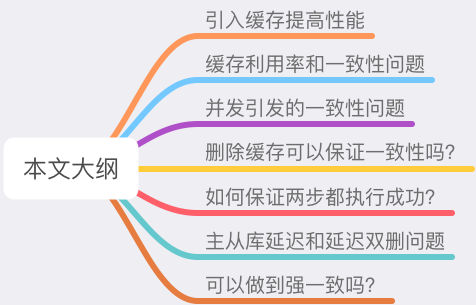
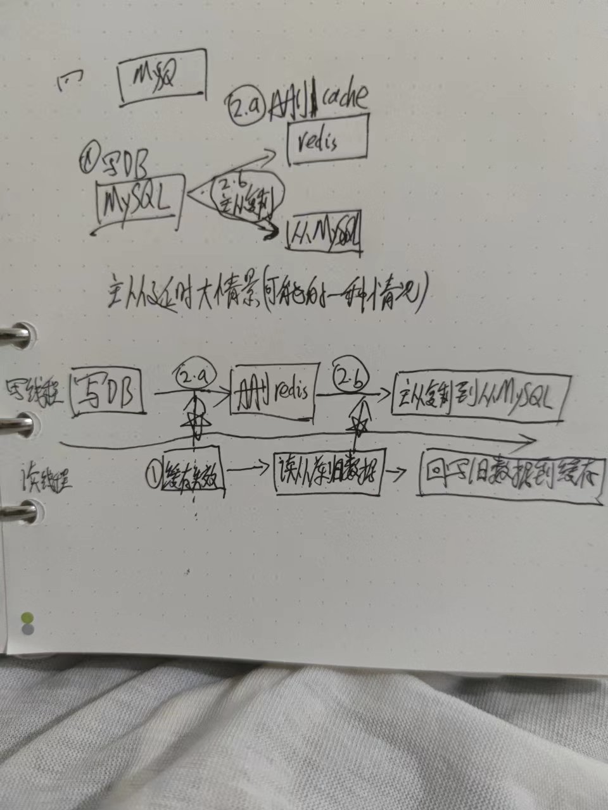
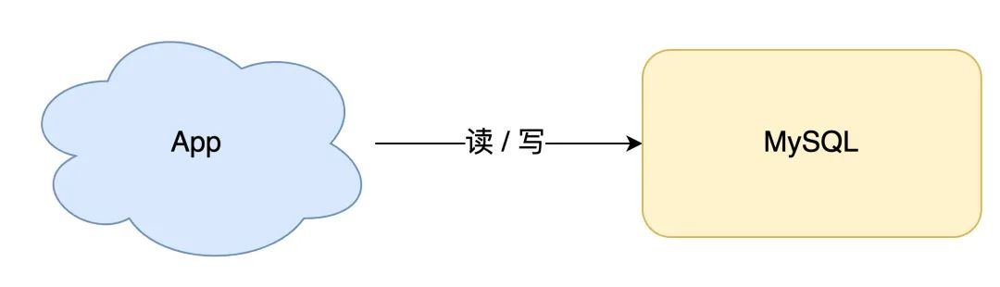
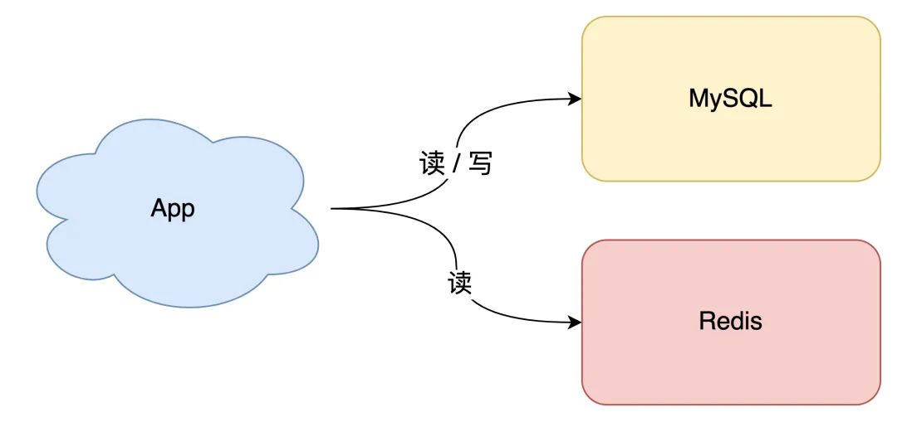
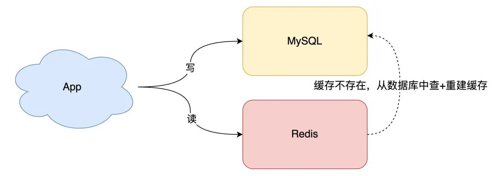
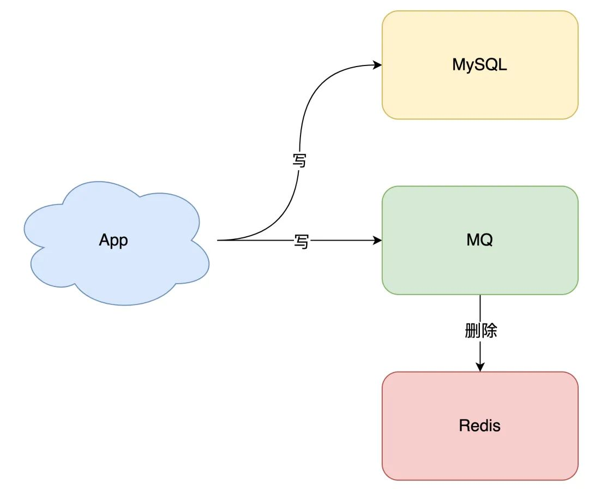

- 讨论问题的思路梳理
  
  引入缓存的根本目的:提高性能
  
  缓存方案
  1. 缓存怎么存怎么读
  2. 缓存利用率如何提高
  
  2. 缓存方案:
  a. 先更新cache再更新DB
  b. 先更新DB再更新cache
  c. 先删除cache再更新DB
  d. 先删除DB再删除cache
  
  3. 缓存问题:
  0. 根本性问题:数据不一致性问题
  a. 原子性问题:缓存方案中的第一步操作成功，但是第二步操作失败，有什么问题?
  b. 读写并发会有什么问题?
  c. 数据库主从复制延迟有什么问题
  
  缓存解决方案
  a. 为什么要引入消息队列保证一致性？
  b. 延迟双删会有什么问题？到底要不要用？
  
-
- 几种缓存方案大梳理总结
  id:: 62b6bf55-120c-4aa9-9ac6-d0bab6f73b9b
  简称
  DB:数据库
  cache:缓存
  LastQ:表示数据不一致性问题
  
  根本问题:数据不一致问题
  
  分析思路:控制唯一变量分析法,在分析原子性问题,读写并发问题时假设其他问题不存在.
  
  关于描述多个线程并发顺序的方法说明：
  
  >写线程时间线:(1)更新缓存(2)再更新DB(3),读线程时间线:(1)位置缓存失效,读DB旧数据,(2)位置之后回写旧数据到缓存
  
  (1),(2),(3)表示操作时间线位置
  
  一般实际业务过程中，并发问题中,读读并发没有LastQ问题,而写写并发都是需要加上分布式锁互斥的。所以只需要考虑读写并发问题.
  
  |比较方面|方案一:先更新缓存再更新DB|方案二:先更新DB再更新缓存|方案三:先删除cache再更新DB|方案四:**先更新DB再删除cache**|方案五:全量数据刷到缓存|
  |---|---|---|---|---|---|
  |整体评价|待评价|待评价|待评价|相对最好的方案|最特别的一种方案,只用于特别业务场景下吧|
  |读思路|先读cache,cache存在则直接返回;cache不存在再读DB,最后回写到cache|同方案1|同方案1|同方案1|只读缓存,缓存不存在则返回|
  |缓存和DB写思路|先更新缓存再更新DB|先更新DB再更新缓存|先删除cache再更新DB|先更新DB再删除cache|只写DB,定时任务异步更新缓存|
  |缓存是否失效|会|会|会|会|永不失效|
  |缓存利用率|不高(可能存在不必要的更新)|不高(可能存在不必要的更新)|高|高|很低，因为永不失效|
  |原子性问题(第一步成功,第二步失败)|存在数据不一致性问题|存在数据不一致性问题|不影响|存在数据不一致性问题|不存在|
  |读写并发问题|写线程时间线:(1)更新缓存(2)再更新DB(3);读线程时间线:(1)位置缓存失效,读到DB旧数据,(2)位置或者之后(均可)回写旧数据到缓存;--->存在LastQ,高并发下出现概率挺大|写线程时间线:(1)更新DB(2)再更新缓存(3);读线程时间线:(1)位置缓存失效,读到DB旧数据,(3)位置才回写到旧数据到缓存；--->存在LastQ,但是出现概率很小|写线程时间线:(1)删除缓存(2)再更新DB(3);读线程时间线:(2)位置缓存失效，读到DB旧数据,然后回写旧数据到缓存；--->存在LastQ,高并发下出现概率挺大|写线程时间线:(1)更新DB(2)再删除cache(3);读线程时间线:(1)位置缓存失效,读到DB旧数据,(3)位置才回写旧数据到缓存;--->存在LastQ,但是出现概率很小|数据不一致问题很严重|
  |读DB从库+DB主从复制延迟下的读写并发问题|写线程时间线:(1)更新缓存(2)再更新DB(3)主库同步到从库(4);读线程时间线:(1)位置缓存失效，读到从库DB旧数据,(2)位置或者之后(均可)回写旧数据到缓存；--->存在LastQ,高并发下出现概率挺大|写线程时间线:(1)更新DB(2.a)再更新缓存(3) (2.b)主库同步到从库(4)(更新缓存和主库同步到从库同时发生，无法精确确认两者先后顺序);读线程时间线:(2.a)位置或者之前(均可)缓存失效,(2.b)位置或者之前(均可)读到从库DB旧数据,(3)位置或者之后(均可)才回写到旧数据到缓存;--->存在LastQ,出现概率相比读写并发问题大一些|写线程时间线:(1)删除缓存(2)再更新DB(3)主库同步到从库(4);读线程时间线:(1)位置缓存失效，读到从库DB旧数据,(2)位置或者之后(均可)回写旧数据到缓存；--->存在LastQ,高并发下出现概率挺大|写线程时间线:(1)更新DB(2.a)再删除缓存(3) (2.b)主库同步到从库(4)(删除缓存和主库同步到从库同时发生，无法精确确认两者先后顺序);读线程时间线:(2.a)位置或者之前(均可)缓存失效,(2.b)位置或者之前(均可)读到从库DB旧数据,(3)位置或者之后(均可)才回写到旧数据到缓存;--->存在LastQ,出现概率相比读写并发问题大一些|数据不一致问题很严重|
  |超长GC问题|存在LastQ|存在LastQ|存在LastQ|存在LastQ|存在LastQ|
  |优化手段||||针对原子性问题,采用延时双删策略,二次删除引入延时消息队列保证重试,虽然无法完全避免LastQ,但可以大大减少异常情况下LastQ的时长|暂无|
  |数据不一致性问题|||||数据不一致问题很严重|
  
  针对上面读写并发问题那一栏提到的出现概率很小的解释
  方案二:出现LastQ的条件:读线程读到DB旧数据时间点 到 回写旧数据到缓存时间点之间的时间差 >写线程更新DB操作时间+DB提交事务+更新缓存时间之和,这种情况通常几乎不会发生。
  方案四:出现LastQ的条件:读线程读到DB旧数据时间点 到 回写旧数据到缓存时间点之间的时间差>写线程更新DB操作时间+DB提交事务+删除缓存时间之和，这种情况通常几乎不会发生。
  
  针对上面“读DB从库+DB主从复制延迟下的读写并发问题”出现概率相比读写并发问题大一些的解释
  方案四:出现LastQ的条件的一种情况分析:删除缓存的时间点比DB主从复制时间点快不少的情况下，如下图
   
  
  
  关于强一致性认识
  上述各个方案都不能解决强一致性问题，仍然存在数据不一致性问题,只是持续时间长短,出现概率大小不同而已。
  
  至于为什么很难达到强一致性问题,因为这本质上是一个分布式一致性问题,需要考虑的分布式场景下的各种极端情况(NPC例如时钟漂移,进程暂停常见GC问题，网络延迟)很多。就跟分布式锁思考类似。
- 从业务场景发展角度分析
  **如果上面的总结梳理部分没有看懂，则可以看看这儿具体分析,否则可以跳过节约时间**
	- 0. 最简单的场景开始讲起。
	  如果你的业务处于起步阶段，流量非常小，那无论是读请求还是写请求，直接操作数据库即可，这时你的架构模型是这样的：
	  
	- 10. 但随着业务量的增长，你的项目请求量越来越大，这时如果每次都从数据库中读数据，那肯定会有性能问题。
	  这个阶段通常的做法是，引入「缓存」来提高读性能，架构模型就变成了这样：
	  
	- 20. 引入缓存之后，你就会面临一个问题：之前数据只存在数据库中，现在要放到缓存中读取，具体要怎么存呢？
	  最特别方案:最简单直接的方案是「全量数据刷到缓存中」：
	  a。数据库的数据，全量刷入缓存（不设置失效时间）
	  b。写请求只更新数据库，不更新缓存
	  c。启动一个定时任务，定时把数据库的数据，更新到缓存中
	  !image.pg](../assets/image_1655899052145_0.png)
	  这个方案的优点是，所有读请求都可以直接「命中」缓存，不需要再查数据库，性能非常高。
	  但缺点也很明显，有 2 个问题：
	  a。缓存利用率低：不经常访问的数据，还一直留在缓存中
	  b。数据不一致问题：因为是「定时」刷新缓存，缓存和数据库存在不一致（取决于定时任务的执行频率）
	  所以，这种方案一般更适合业务「体量小」，且对数据一致性要求不高的业务场景。
	- 先来看第一个问题，如何提高缓存利用率？
	  想要缓存利用率「最大化」，我们很容易想到的方案是，缓存中只保留最近访问的「热数据」。但具体要怎么做呢？
	  a。写请求依旧只写数据库
	  b。读请求先读缓存，如果缓存不存在，则从数据库读取，并重建缓存
	  c。同时，写入缓存中的数据，都设置失效时间
	  
	  这样一来，缓存中不经常访问的数据，随着时间的推移，都会逐渐「过期」淘汰掉，最终缓存中保留的，都是经常被访问的「热数据」，缓存利用率得以最大化。
	- 再来看数据一致性问题。
	  要想保证缓存和数据库「实时」一致，那就不能再用定时任务刷新缓存了。
	  所以，当数据发生更新时，我们不仅要操作数据库，还要一并操作缓存。具体操作就是，修改一条数据时，不仅要更新数据库，也要连带缓存一起更新。
	  (引入4种缓存方案 a. 先更新cache再更新DB b. 先更新DB再更新cache c. 先删除cache再更新DB d. 先删除DB再删除cache)
	- 先看DB和cache都更新两种方案，又存在先后问题
	  方案一. 先更新缓存，后更新数据库
	  方案二. 先更新数据库，后更新缓存
	  先不考虑并发问题，正常情况下，无论谁先谁后，都可以让两者保持一致，但现在我们需要重点考虑「异常」情况。
	  因为操作分为两步，那么就很有可能存在「第一步成功、第二步失败」的情况发生。
	  方案一: 先更新缓存，后更新数据库
	  数据不一致性场景分析:如果缓存更新成功了，但数据库更新失败，那么此时缓存中是最新值，但数据库中是「旧值」。
	  虽然此时读请求可以命中缓存，拿到正确的值，但是，一旦缓存「失效」，就会从数据库中读取到「旧值」，重建缓存也是这个旧值。
	  这时用户会发现自己之前修改的数据又「变回去」了，对业务造成影响。
	  方案二:先更新数据库，后更新缓存
	  数据不一致性场景分析:如果数据库更新成功了，但缓存更新失败，那么此时数据库中是最新值，缓存中是「旧值」。
	  之后的读请求读到的都是旧数据，只有当缓存「失效」后，才能从数据库中得到正确的值。
	  这时用户会发现，自己刚刚修改了数据，但却看不到变更，一段时间过后，数据才变更过来，对业务也会有影响。
	  可见，无论谁先谁后，但凡后者发生异常，就会对业务造成影响。那怎么解决这个问题呢？
	  别急，后面我会详细给出对应的解决方案。
	  我们继续分析，除了操作失败问题，还有什么场景会影响数据一致性？
	  读写并发问题
	  假设我们采用「先更新数据库，再更新缓存」的方案，并且两步都可以「成功执行」的前提下(不存在原子性问题)，如果存在并发，情况会是怎样的呢？
	  见 ((62b6bf55-120c-4aa9-9ac6-d0bab6f73b9b)) 中的读写并发问题一栏
	  同样地，采用「先更新缓存，再更新数据库」的方案，也会有类似问题，这里不再详述。
	  见 ((62b6bf55-120c-4aa9-9ac6-d0bab6f73b9b)) 中的读写并发问题一栏
	  除此之外，我们从「缓存利用率」的角度来评估这个方案，也是不太推荐的。
	  这是因为每次数据发生变更，都「无脑」更新缓存，但是缓存中的数据不一定会被「马上读取」，这就会导致缓存中可能存放了很多不常访问的数据，浪费缓存资源。
	  而且很多情况下，写到缓存中的值，并不是与数据库中的值一一对应的，很有可能是先查询数据库，再经过一系列「计算」得出一个值，才把这个值才写到缓存中。
	  由此可见，这种「更新数据库 + 更新缓存」的方案，不仅缓存利用率不高，还会造成机器性能的浪费。
	- 所以此时我们需要考虑另外一种方案：删除缓存。
	  删除缓存对应的方案也有 2 种：
	  方案三:先删除缓存，后更新数据库
	  方案四:先更新数据库，后删除缓存
	  经过前面的分析我们已经得知 ((62b6bf55-120c-4aa9-9ac6-d0bab6f73b9b))，但凡「第二步」操作失败，都会导致数据不一致。
	  这里我不再详述具体场景，你可以按照前面的思路推演一下，就可以看到依旧存在数据不一致的情况。
	  这里我们重点来看「并发」问题。
	  方案三:先删除缓存，后更新数据库
	  见 ((62b6bf55-120c-4aa9-9ac6-d0bab6f73b9b)) 中的读写并发问题一栏，还是存在数据不一致的情况。
	  方案四: 先更新数据库，后删除缓存
	  见 ((62b6bf55-120c-4aa9-9ac6-d0bab6f73b9b)) 中的读写并发问题一栏
	  依旧是 2 个线程并发「读写」数据：
	  1. 缓存中 X 不存在（数据库 X = 1）
	  2. 线程 A 读取数据库，得到旧值（X = 1）
	  3. 线程 B 更新数据库（X = 2)
	  4. 线程 B 删除缓存
	  5. 线程 A 将旧值写入缓存（X = 1）
	  最终 X 的值在缓存中是 1（旧值），在数据库中是 2（新值），也发生不一致。
	  这种情况「理论」来说是可能发生的，但实际真的有可能发生吗？
	  其实概率「很低」，这是因为它必须满足 3 个条件：
	  1. 缓存刚好已失效
	  2. 读请求 + 写请求并发
	  3. **更新数据库 + 删除缓存的时间（步骤 3-4），要比读数据库 + 写缓存时间短（步骤 2 和 5）**
	  仔细想一下，条件 3 发生的概率其实是非常低的。
	  因为写数据库一般会先「加锁」，所以写数据库，通常是要比读数据库的时间更长的。
	  这么来看，「先更新数据库 + 再删除缓存」的方案，相对可以保证数据一致性。
	  所以，我们应该采用这种方案，来操作数据库和缓存。
	  
	  我们继续来看前面遗留的，第二步执行「失败」导致数据不一致的问题。
	- 如何保证两步都执行成功？
	  前面我们分析到，无论是更新缓存还是删除缓存，只要第二步发生失败，那么就会导致数据库和缓存不一致。
	  **保证第二步成功执行，就是解决问题的关键。**
	  想一下，程序在执行过程中发生异常，最简单的解决办法是什么？
	  答案是：重试。
	  是的，其实这里我们也可以这样做。
	  无论是先操作缓存，还是先操作数据库，但凡后者执行失败了，我们就可以发起重试，尽可能地去做「补偿」。
	  那这是不是意味着，只要执行失败，我们「无脑重试」就可以了呢？
	  答案是否定的。现实情况往往没有想的这么简单，失败后立即重试的问题在于：
	  a.立即重试很大概率「还会失败」
	  b.「重试次数」设置多少才合理？
	  c.重试会一直「占用」这个线程资源，无法服务其它客户端请求
	  看到了么，虽然我们想通过重试的方式解决问题，但这种「同步」重试的方案依旧不严谨。
	  那更好的方案应该怎么做？
	  答案是：异步重试。什么是异步重试？
	  其实就是把重试请求写到「消息队列」中，然后由专门的消费者来重试，直到成功。
	  或者更直接的做法，为了避免第二步执行失败，我们可以把操作缓存这一步，直接放到消息队列中，由消费者来操作缓存。
	  到这里你可能会问，写消息队列也有可能会失败啊？而且，引入消息队列，这又增加了更多的维护成本，这样做值得吗？
	  这个问题很好，但我们思考这样一个问题：如果在执行失败的线程中一直重试，还没等执行成功，此时如果项目「重启」了，那这次重试请求也就「丢失」了，那这条数据就一直不一致了。
	  所以，这里我们必须把重试或第二步操作放到另一个「服务」中，这个服务用「消息队列」最为合适。这是因为消息队列的特性，正好符合我们的需求：
	  a. 消息队列保证可靠性：写到队列中的消息，成功消费之前不会丢失（重启项目也不担心）
	  b. 消息队列保证消息成功投递：下游从队列拉取消息，成功消费后才会删除消息，否则还会继续投递消息给消费者（符合我们重试的场景）
	  至于写队列失败和消息队列的维护成本问题：
	  a. 写队列失败：操作缓存和写消息队列，「同时失败」的概率其实是很小的
	  b. 维护成本：我们项目中一般都会用到消息队列，维护成本并没有新增很多
	  所以，引入消息队列来解决这个问题，是比较合适的。这时架构模型就变成了这样：
	  
-
- 资料
  这篇强烈推荐
  [缓存和数据库一致性问题，看这篇就够了-水滴与银弹 ，作者Magic Kaito](https://mp.weixin.qq.com/s/D4Ik6lTA_ySBOyD3waNj1w)