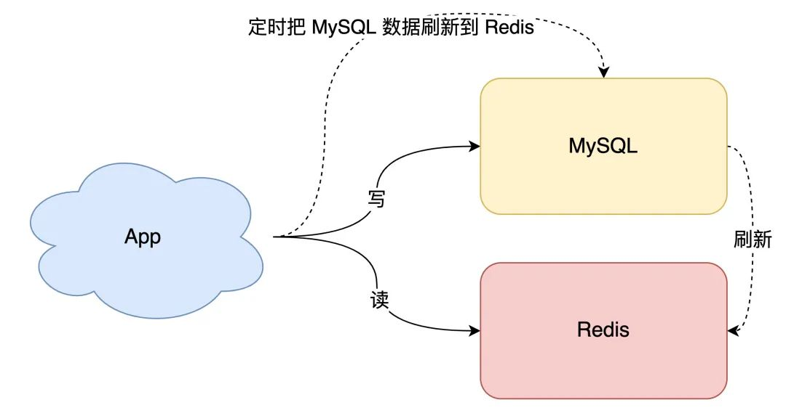

- 讨论问题的思路梳理
  
  引入缓存的根本目的:提高性能
  
  缓存方案
  1. 缓存怎么存怎么读
  2. 缓存利用率如何提高
  
  2. 缓存方案:
  a. 先更新cache再更新DB
  b. 先更新DB再更新cache
  c. 先删除cache再更新DB
  d. 先删除DB再删除cache
  
  3. 缓存问题:
  0. 根本性问题:数据不一致性问题
  a. 原子性问题:缓存方案中的第一步操作成功，但是第二步操作失败，有什么问题?
  b. 读写并发会有什么问题?
  c. 数据库主从复制延迟有什么问题
  
  缓存解决方案
  a. 为什么要引入消息队列保证一致性？
  b. 延迟双删会有什么问题？到底要不要用？
  
- 根据业务场景发展分析
  0. 最简单的场景开始讲起。
  如果你的业务处于起步阶段，流量非常小，那无论是读请求还是写请求，直接操作数据库即可，这时你的架构模型是这样的：
  
  10. 但随着业务量的增长，你的项目请求量越来越大，这时如果每次都从数据库中读数据，那肯定会有性能问题。
  这个阶段通常的做法是，引入「缓存」来提高读性能，架构模型就变成了这样：
  
  20. 引入缓存之后，你就会面临一个问题：之前数据只存在数据库中，现在要放到缓存中读取，具体要怎么存呢？
  方案一:最简单直接的方案是「全量数据刷到缓存中」：
  a。数据库的数据，全量刷入缓存（不设置失效时间）
  b。写请求只更新数据库，不更新缓存
  c。启动一个定时任务，定时把数据库的数据，更新到缓存中
  
  
  这个方案的优点是，所有读请求都可以直接「命中」缓存，不需要再查数据库，性能非常高。
  但缺点也很明显，有 2 个问题：
  a。缓存利用率低：不经常访问的数据，还一直留在缓存中
  b。数据不一致问题：因为是「定时」刷新缓存，缓存和数据库存在不一致（取决于定时任务的执行频率）
  所以，这种方案一般更适合业务「体量小」，且对数据一致性要求不高的业务场景。
  
  先来看第一个问题，如何提高缓存利用率？
  想要缓存利用率「最大化」，我们很容易想到的方案是，缓存中只保留最近访问的「热数据」。但具体要怎么做呢？
  a。写请求依旧只写数据库
  b。读请求先读缓存，如果缓存不存在，则从数据库读取，并重建缓存
  c。同时，写入缓存中的数据，都设置失效时间
  
  这样一来，缓存中不经常访问的数据，随着时间的推移，都会逐渐「过期」淘汰掉，最终缓存中保留的，都是经常被访问的「热数据」，缓存利用率得以最大化。
  
  再来看数据一致性问题。
  要想保证缓存和数据库「实时」一致，那就不能再用定时任务刷新缓存了。
  所以，当数据发生更新时，我们不仅要操作数据库，还要一并操作缓存。具体操作就是，修改一条数据时，不仅要更新数据库，也要连带缓存一起更新。
  (引入4种缓存方案 a. 先更新cache再更新DB b. 先更新DB再更新cache c. 先删除cache再更新DB d. 先删除DB再删除cache)
  先看DB和cache都更新两种方案，又存在先后问题
- 梳理总结
  DB:数据库
  cache:缓存
  根本问题:数据不一致问题
  |缓存方案|缓存读思路|缓存写思路|缓存利用率|原子性问题|读写并发问题|DB主从复制延迟问题|
  |---|---|---|---|---|---|---|
  |先删除cache再删除DB|
  |x
- 过程
  读写MySQL--->引入缓存提高性能--->引入问题:缓存怎么存怎么读
- 资料
  这篇强烈推荐
  [缓存和数据库一致性问题，看这篇就够了-水滴与银弹 ，作者Magic Kaito](https://mp.weixin.qq.com/s/D4Ik6lTA_ySBOyD3waNj1w)