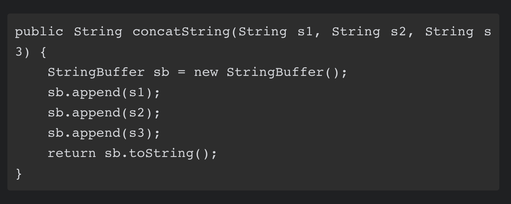
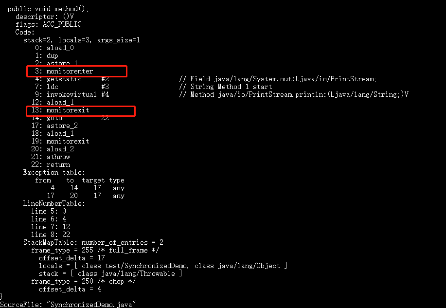
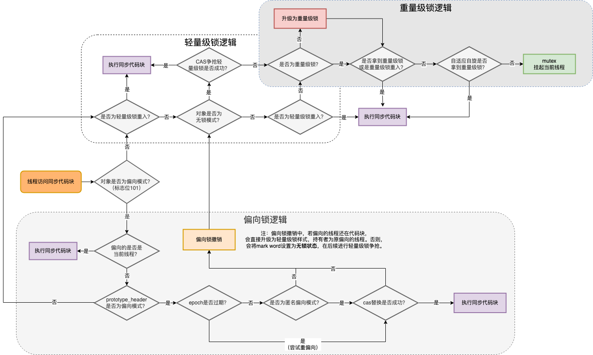

- 目的：解决多个线程访问资源的同步性问题。
- 作用:保证同一个时刻synchronized修饰的方法或者方法块只有一个线程能执行。(互斥锁)
  可以修饰静态方法，实例方法，方法块
- jvm不同版本对synchronized锁的优化
  id:: f6152514-a942-4aa1-8e61-de1116a30b3c
  早期: 就是个重量级锁,效率很低。
  jdk6之后: jvm对synchronized锁进行了一系列优化，自旋锁、适应性自旋锁、锁消除、锁粗化、偏向锁、轻量级锁等。
	- 自旋锁:CAS机制，注意自旋等待时间，时间太长反而影响CPU执行效率。jvm可以设置是否开启自旋和自旋次数 ((6298a212-7591-4a6d-92e8-743494bfe3f4))
	- 自适应自旋锁:对自旋锁的优化,核心思路：自旋时间不再固定，而是根据同一个锁的上次自旋时间和锁的拥有者的状态动态决定的。
	  随着程序运行时间的增长及性能监控信息的不断完善，虚拟机对程序锁的自旋时间预测就会越来越精准。
	- 锁消除
	  id:: 6298a5bf-d69e-468c-816f-036e2d687654
	  jvm即时编译器如果发现一些代码片段需要同步，但是不可能存在数据共享竞争的情况下，这些同步锁就被消除。
	  
	  主要依据：逃逸分析技术，例如如果判断到一段代码,在堆上的所有数据都不会逃逸出去被其他线程访问,那就可以把他们当做栈上数据对待，认为他们是线程私有的，那么就不需要同步加锁了。
	  
	  锁消除存在的合理性在于有时一段代码加了锁，而程序员自己可能都没有意识到同步加锁了。源码底层同步加锁了你可能没有意识到而已。
	  ```
	  public String contractString(String s1,String s2,String s3){
	  	return s1+s2+s3;
	  }
	  ```
	  
	  在jdk5之前jvm编译器就会转为StringBuffer.append方法拼接，而StringBuffer.append()方法中就有同步块的存在。
	  
	- 锁粗化
	  定义:如果虚拟机探测到有这样一串零碎的操作都对同一个对象加锁解锁，将会把加锁同步的范围扩展（粗化）到整个操作序列的外部.
	  这样一串零碎的操作甚至可能出现在循环中，这种情况想想就很恐怖了，反复加锁解锁
	  
	  举例：比如上面锁消除的例子中的StringBuffer.append同步加锁，
	  扩展到第一个append()操作之前直至最后一个append()操作之后，这样只需要加锁一次就可以了
	- 偏向锁
	  背景知识:
	  对象头中的MarkWord ((6298b8fd-0098-4554-84ec-5b5150f560a5))
	  
	  目的:消除数据在无竞争情况下的同步原语，进一步提高程序的运行性能
	  
	  如果说轻量级锁是在无竞争的情况下使用CAS操作去消除同步使用的互斥量，那偏向锁就是在无竞争的情况下把整个同步都消除掉，连CAS操作都不去做了。
	  
	  ((6298a212-7591-4a6d-92e8-743494bfe3f4))
	  jdk6默认开启,jdk15默认禁用偏向锁了
	  
	  废弃原因:
	  0. 在过去，Java 应用通常使用的都是 HashTable、Vector 等比较老的集合库，这类集合库大量使用了 synchronized 来保证线程安全。
	  1. 随着时代的变化，新的 Java 应用基本都已经使用了无锁的集合库，比如 HashMap、ArrayList 等,
	  在多线程场景下，Java 也提供了 ConcurrentHashMap、CopyOnWriteArrayList 等性能更好的线程安全的集合库。
	  对于使用了新类库的 Java 应用来说，偏向锁带来的收益已不如过去那么明显，而且在当下多线程应用越来越普遍的情况下，偏向锁带来的锁升级操作反而会影响应用的性能。
	  2. 时代变了，维护成本却还在增加
	  偏向锁为整个「同步子系统」引入了大量的复杂度，并且这些复杂度也入侵到了 HotSpot 的其它组件。
	  这导致了系统代码难以理解，难以进行大的设计变更，降低了子系统的演进能力.
	  
	  >Biased locking introduced a lot of complex code into the synchronization subsystem and is invasive to other HotSpot components as well.
	  
	  [Deprecate and Disable Biased Locking](https://openjdk.java.net/jeps/374)
	-
	- 轻量级锁
	  
	  轻量级锁便通过CAS操作避免使用互斥量的开销
	  轻量级锁能提升程序同步性能的依据是“对于绝大部分的锁，在整个同步周期内都是不存在竞争的”这一经验法则。
	  ((6298791f-12c9-4fb8-b68a-60855d19aefa))
	- 你会发现目前的话，不论是各种开源框架还是 JDK 源码都大量使用了 synchronized 关键字。
	  --->jdk8的ConcurrentHashMap源码线程安全就是CAS+synchronized了(相比jdk7)。
	-
- synchronized的底层原理
  id:: 629875cb-0dcd-4aff-a6f6-520d1fbfcb63
	- 0.背景知识
	  Class文件格式，对象头MarkWord
	- 1.jvm层理解synchronized
	  实例synchronized修饰同步块
	  ```
	  public class SynchronizedDemo {
	      public void method() {
	          synchronized (this) {
	              System.out.println("synchronized 代码块");
	          }
	      }
	  }
	  ```
	  执行反编译
	  ```shell
	  javap -c -s -v -l SynchronizedDemo.class
	  ```
	   
	  
	  核心jvm指令monitorenter , monitorexit
	  
	  当执行 monitorenter 指令时，线程试图获取锁也就是获取 对象监视器 monitor 的持有权。
	  对象监视器 monitor同一时刻只允许有一个拥有者。
	  
	  下面同时解释了synchronized为何是**可重入锁**
	  monitorenter:
	  1. 如果对象监视器monitor的锁计数器为0,则线程允许进入代码块,锁计数器+1。这个线程就拥有了这个锁
	  2. 如果该线程本身已经拥有了这个锁，那么锁计数器+1.
	  3. 如果其他线程已经拥有了这个锁，那个该线程则阻塞直到锁计数器为0才再次尝试
	  monitorexit:
	  1.对象监视器monitor的锁计数器-1,如果锁计数器为0，则说明该线程不再拥有该锁，其他因锁阻塞的线程可以开始抢占锁了。如果不为0,则该线程仍持有该锁。
	  
	  [jvm8-monitorenter官方文档](https://docs.oracle.com/javase/specs/jvms/se8/html/jvms-6.html#jvms-6.5.monitorenter)
	  
	  注意：
	  同步代码块是通过 monitorenter 和 monitorexit 来实现的，
	  同步方法是加了一个 ACC_SYNCHRONIZED 修饰来实现的，
	  不过两者底层本质还是对象监视器 monitor 。
	  
	  更底层就是看jdk用C++源码怎么实现的了
	  Monitor 是基于 C++实现的，由ObjectMonitor实现的。每个对象中都内置了一个 ObjectMonitor对象。
	-
	- 2. 锁的四种状态
	  无锁状态--->偏向锁状态--->轻量级锁状态--->重量级锁状态
	  锁可以升级，但不能降级。
	- 3.锁的升级化过程
	  id:: 6298791f-12c9-4fb8-b68a-60855d19aefa
	  
	  [从jdkC++源码级别分析总结了锁的升级化过程,有图很详细-有赞技术团队](https://tech.youzan.com/javasuo-yu-xian-cheng-de-na-xie-shi/)
	  {:height 482, :width 790}
	  图问题:为什么上述偏向锁逻辑没有判断无锁状态的锁对象（001）？
	  只有匿名偏向的对象才能进入偏向锁模式。
	  而处于无锁状态的锁对象，只能进入到轻量级锁状态。
- 典型场景应用
  2. 双重锁检测方式实现单例模式
  2. 双重锁检测方式实现
   ``` java
   public class Singleton {
- private volatile static Singleton uniqueInstance;
- private Singleton() {
   }
- public  static Singleton getUniqueInstance() {
   //先判断对象是否已经实例过，没有实例化过才进入加锁代码
   if (uniqueInstance == null) {
   //类对象加锁
   synchronized (Singleton.class) {
   if (uniqueInstance == null) {
   uniqueInstance = new Singleton();
   }
   }
   }
   return uniqueInstance;
   }
   }
   ```
- 资料
  [Java锁的升级化过程分析，有图很详细-有赞技术团队](https://tech.youzan.com/javasuo-yu-xian-cheng-de-na-xie-shi/)