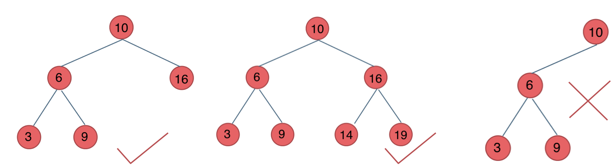
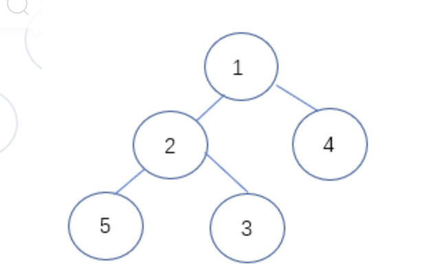

- 二叉树种类
  满二叉树:如果一棵二叉树只有度为0的结点和度为2的结点，并且度为0的结点在同一层上，则这棵二叉树为满二叉树。
  {:height 632, :width 789} 
  这棵二叉树为满二叉树，也可以说深度为k，有2^k-1个节点的二叉树。
  
  完全二叉树:在完全二叉树中，除了最底层节点可能没填满外，其余每层节点数都达到最大值，并且最下面一层的节点都集中在该层最左边的若干位置。若最底层为第 h 层，则该层包含 1~ 2^(h-1)  个节点。
   
  二叉搜索树:
  若它的左子树不空，则左子树上所有结点的值均小于它的根结点的值；
  若它的右子树不空，则右子树上所有结点的值均大于它的根结点的值；
  它的左、右子树也分别为二叉排序树。
  前面两种树都没有数值的，而二叉搜索树是有数值的了，二叉搜索树是一个有序树
   
  平衡二叉搜索树:又被称为AVL（Adelson-Velsky and Landis）树
  它是一棵空树或它的左右两个子树的高度差的绝对值不超过1，并且左右两个子树都是一棵平衡二叉树。
  
-
-
- 二叉树的遍历方式
  二叉树的前序遍历,中序遍历，后续遍历都是针对领头的根节点而言.
   
   * 根节点最先遍历:中左右:前序遍历 (1 2 4 5 3)
   * 根节点中间遍历：左中右：中序遍历 (5 2 3 1 4)
   * 根节点最后遍历：左右中：后序遍历 (5 3 2 4 1)
  1. 每个都有递归算法
  2. 和各自不同的迭代算法(非递归方式，写法不统一),
  3. 也有统一格式的迭代算法(风格统一，但效率不高)
  [二叉树的统一迭代法](https://programmercarl.com/%E4%BA%8C%E5%8F%89%E6%A0%91%E7%9A%84%E7%BB%9F%E4%B8%80%E8%BF%AD%E4%BB%A3%E6%B3%95.html#%E4%BA%8C%E5%8F%89%E6%A0%91%E7%9A%84%E7%BB%9F%E4%B8%80%E8%BF%AD%E4%BB%A3%E6%B3%95)
  
  4. 终极效率算法:*Morris 遍历*(时间复杂度O(n),空间复杂度O(1)),一篇论文中提到的算法
  可以在线性时间内，只占用常数空间来实现前序遍历。这种方法由 J. H. Morris 在 1979 年的论文「Traversing Binary Trees Simply and Cheaply」中首次提出，因此被称为 Morris 遍历。
  
  上面三种都属于深度遍历，还有广度遍历
  5.
-